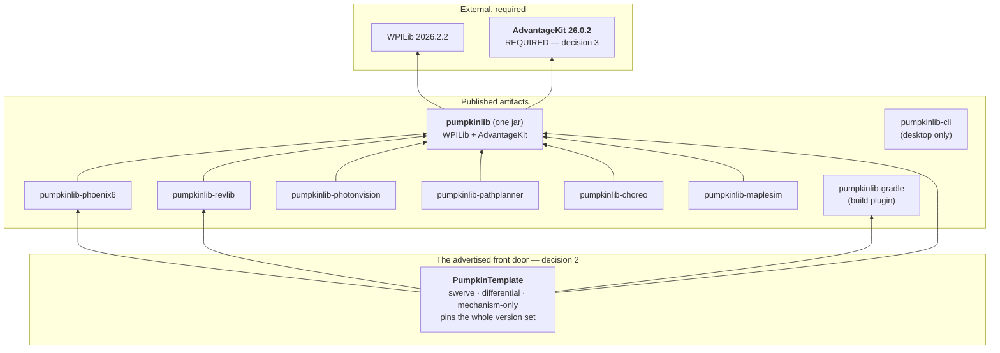
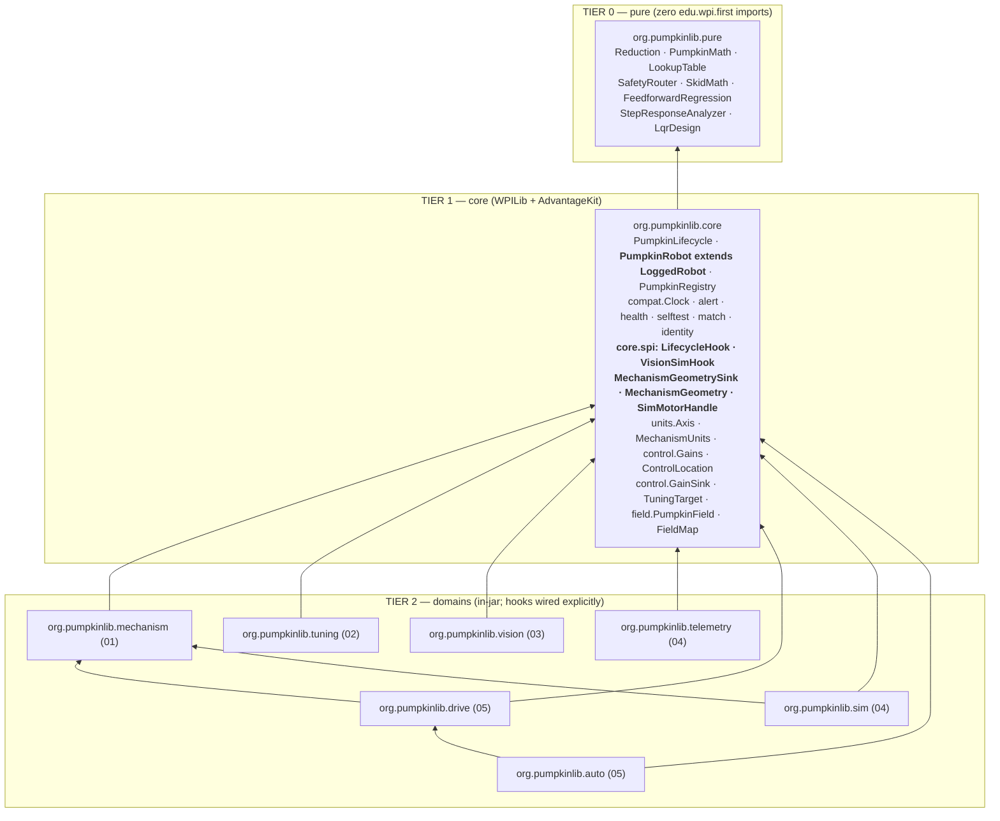

# PumpkinLib — Master Design

**Status:** Design stage, **revision 4** (post adversarial review, post four binding maintainer decisions, post six-lens independent expert review). **No implementation code exists yet.**
**Date:** 2026-08-08 (offseason; 2027 kickoff is 2027-01-09, 22 weeks out). Revision 3 was 2026-08-07.
**Build line:** WPILib 2026.2.2, Java 17, GradleRIO 2026.2.1, Commands v2, **AdvantageKit 26.0.2 (required)**
**Shipping line:** WPILib 2027 (`org.wpilib.*`, Java 25, SystemCore), planned from day one
**Scope:** **one release, v0.1, containing every domain.** No domain is deferred. Net **68.5 – 79.5 pw** (midpoint **74.0**). At solo pace that is a **2030** release — see [`ROADMAP.md`](ROADMAP.md).
**Front door:** `PumpkinTemplate` (a forkable robot project). The library is the substance underneath, consumed as a versioned artifact.
**License:** **BSD-3-Clause**, matching WPILib. Text in [`LICENSE`](LICENSE); `Copyright (c) 2026 PumpkinLib contributors`.
**Domain designs:** [`design/01-core-mechanisms.md`](design/01-core-mechanisms.md) · [`design/02-tuning.md`](design/02-tuning.md) · [`design/03-vision.md`](design/03-vision.md) · [`design/04-telemetry-replay-viz.md`](design/04-telemetry-replay-viz.md) · [`design/05-drivetrain-auto.md`](design/05-drivetrain-auto.md) · [`design/06-platform-compday.md`](design/06-platform-compday.md)
**Companion docs:** [`README.md`](README.md) · [`DECISIONS.md`](DECISIONS.md) · [`ROADMAP.md`](ROADMAP.md)

### Revision 3 changelog — the four binding maintainer decisions (2026-08)

These four decisions are **final and are not relitigated anywhere in this document.** Where a decision makes something worse, this document says it is worse.

| # | Decision | What it changed here |
|---|---|---|
| **1** | **SCOPE: everything ships in v0.1. No domain is deferred.** The maintainer accepted that v0.1 lands *after* the 2027 kickoff and that 8793/9143 get no *tagged* PumpkinLib for the 2027 season. | Every `[v0.2]` / `[v0.3]` / `[v0.4]` marker in §2, §7, §9, §10, §11c, §13 and §14 is **removed**; the capability is v0.1 and carries a **milestone** annotation (M1–M24) instead. §12 is replaced by a pointer to `ROADMAP.md` plus a condensed milestone table. The v0.1/v0.2/v0.3 split survives only as internal build order. |
| **2** | **DELIVERY: a library AND a template repo, with `PumpkinTemplate` as the primary front door.** | §11's first session now starts from the template. §8 gains the template as a shipped artefact with its own CI matrix and its own recurring cost. §11c's adoption matrix gains the template rows. |
| **3** | **AdvantageKit is a REQUIRED dependency**, not one backend among four. | D9, D13, D24 and D26 rewritten (§5.2, §5.4, §5.5). `LogBackend`, the NT4/Epilogue/DogLog backends, `PumpkinInputs`/`PumpkinLogTable`, the `mode=REPLAY` refusal path and the `PumpkinRobot`/`PumpkinLoggedRobot` split are **deleted**. Core depends on AdvantageKit; `pumpkinlib-advantagekit` and `pumpkinlib-doglog` are gone (§6, §8). Deterministic replay becomes a **guarantee**. **The kickoff-morning install property is lost, and R18 rises to High-and-ACCEPTED.** |
| **4** | **LICENSE: BSD-3-Clause**, matching WPILib. | Every "License: TBD" reference is superseded. `LICENSE` is written. This is also half of R21's mitigation: anyone may fork and continue the project if it stalls. |

**Net effect on effort:** 68–79 pw (revision 2, §12.1) **−1.25** (decision 3 deletes the backend SPI and the robot-class split) **+1.50** (decision 2's template authoring, lock manifest, update/doctor commands and 9-job release CI matrix) = **68.5 – 79.5 pw, midpoint 74.0.** Arithmetic in [`ROADMAP.md` §1](ROADMAP.md).

### Revision 4 changelog — what the six-lens expert review changed in this document

Revision 4 changes **no architecture and no decision.** It fixes things that were wrong, and it corrects one claim this document made about its own process. In brief:

| # | What changed | § |
|---|---|---|
| 1 | **§16's claim that the 2026-08-07 sweep covered "all ten documents" was false** — `design/02-tuning.md` was never swept, and item 4's own doc list named only five domain docs. Corrected, the gap recorded, and **every §16 row now carries a mechanically checkable condition** so a future sweep can be verified instead of declared. | §16 |
| 2 | **§16 item 1's `34.126` checklist omitted four of the nine surviving instances** and pointed at the wrong section for two more. Replaced with the full enumeration **and** a repo-wide grep gate, because an enumeration is exactly what failed. | §16 item 1 |
| 3 | **The flagship §10B example did not compile against its own DSL in six ways** and could not be extraction-tested at all. Split into four context-labelled blocks; every referenced type verified against the doc that declares it. Appendix A's `var`-on-a-field / `private final`-in-a-method-body block fixed. | §10B, App. A |
| 4 | **`robotInit()` was banned by rule 5 and used by the library's own front door.** Resolved in favour of the ban: constructor initialization, `PumpkinLifecycle.init()`, and rule 5 scoped to library code. | principle 10, rule 5, D13a, D29, §10A.4, §11b |
| 5 | **`PumpkinRobot`/`PumpkinLifecycle`/`LogConfig` were spelled three incompatible ways** across three documents, leaving "who calls `Logger.start()`" ambiguous. One specification, in **D13a** and **D29**. | §5.2, §5.5, §10A.4, §11b |
| 6 | **The alert budget was 3 here and 5 in the document that owns the test.** Adopted design/06's argued **5**; the driver-mirror cap stays **3**; the two are now distinguished wherever they appear. | D10, §9.6 |
| 7 | **The R18 tier numbers were inverted across four documents** and this one contradicted itself. One scheme, in execution order: **contribute → fork → wait.** And the `[UNVERIFIED]` licence that gated the fork is **closed: AdvantageKit is BSD-3-Clause, verified 2026-08-08.** | §5.6 item 8, §13.1, §13 R18 |
| 8 | **The critical path omitted M5 and M6** while quoting their pw; **`D28` said "five vendor adapters" and listed six**; **§12.4 cited ArchUnit "rules 11/12"** for a job rules 2 and 12 do. | §12.1a, D28, §12.4 |
| 9 | **The template pinned both motor-vendor adapters unconditionally** — the exact forced-vendor failure §8 criticises in YAGSL, on the advertised path. `pumpkin init --vendor` pruning is now canonical, with its lock-manifest interaction specified. | §8 |
| 10 | **The M12 completion rule was arithmetically unsatisfiable** below ~1.0 pw/wk. Deleted and replaced with the consequence. **§12.2's net rates now print their exact products**, and the 3.34 pw/wk → "6–8 engineers" conversion is shown. | §12.2, §12.4 |
| 11 | **Four cross-document corrections that were ordered and never applied** are now tracked as §16 items 6–8: the gyro→field-offset contract and D17 into `design/05`; `MatchImpact` at every alert site in docs 01–05; and the network/radio-saturation failure mode, which had no alert anywhere. | §16 |

### Revision 2 changelog — what the adversarial review changed in this document

> **Read this table as history, not as current state.** It records what revision 2 changed relative to revision 1, and its right-hand column therefore still uses the **v0.1 / v0.2 / v0.3 release vocabulary that maintainer decision 1 deleted** (rows 13, 14, 16). Wherever it says "v0.2" or "v0.3", the current answer is: **there is one release, and the split survives only as build order** — see the revision 3 changelog above and §12. The *honesty* corrections in rows 1–12 are unchanged and still binding; in particular row 1 (no "elite team's code" claim), row 2 (**seven** monitor types / **eight** slices, never "ten health checks"), and the withdrawn line-count ratios in §10.7.

| # | Was | Now | § |
|---|---|---|---|
| 1 | "makes a small team's robot code look like an elite team's robot code" | closes the **software** gap only; §4.1 states the ceiling | §1, §4.1 |
| 2 | "ten competition-day health checks" (stated 4×) | **seven monitor types / eight registered health sources**, named, with `BuiltinMonitorCountTest` | §1, §9.6, §10.7 |
| 3 | Arm `ofTeeth(58,10).then(58,18).then(42,12)` annotated `34.126:1` (actual product 65.411) with `rotorPerSensor = 34.126` | annotation and `rotorPerSensor` both **65.411**, plus a Tier-1 `Validation` rule that makes the class of error unrepresentable | §5.1 D2b, §10A |
| 4 | `TunerConstants.kFrontLeftLocation` (does not exist); 3-arg `CtreSwerveBackend` | `PumpkinDrive.fromTunerX(...)` in the flagship; explicit form uses `kFrontLeftXPos`/`kFrontLeftYPos`/`kWheelRadius`/`kSpeedAt12Volts` and the 4-arg constructor | §10B, App. A |
| 5 | Core called telemetry and tuning directly (uncompilable cycle) | `org.pumpkinlib.core.spi` + `ServiceLoader`; **every dependency arrow points into core**; ArchUnit rule 9 | §5.6 D26, §6, §8 |
| 6 | D21: superstructure command "requires only the Superstructure" | union requirement declared on the returned command; mechanisms stay scheduler-registered | §5.4 D21 |
| 7 | "the gain is pushed on the next loop" | **100–150 ms**; `NetworkTableListenerPoller` queue drain, one JNI call per loop | §5.4 D11a, §11 |
| 8 | Quickstart pasted 8793's real gains as literals | `Gains.UNTUNED` everywhere; real hardware **refuses closed loop** until tuned | §5.1 D2c, §10A |
| 9 | Four parallel registration lists | one `PumpkinRegistry.addAll(...)` with `instanceof` routing and a boot summary | §5.6 D27, §10A |
| 10 | Eleven separately published core artifacts | **one `pumpkinlib` jar** + vendor adapters + `pumpkinlib-gradle`; package boundaries unchanged | §5.6 D28, §8 |
| 11 | "The First 30 Minutes" starting from an empty folder, Timed Skeleton template | "The First Session — plan two hours", `pumpkin init`, `WPILibNewCommands.json` in `requires[]` | §11 |
| 12 | No path to adopt one piece onto an existing robot | public `PumpkinLifecycle`, §11b, an adoption matrix, `IncrementalAdoptionTest` | §5.6 D29, §11b |
| 13 | Tuning wizard scheduled entirely into v0.2 | **Wizard Lite is in v0.1**; drive/vision/auto move to v0.2 | §12 |
| 14 | `SelfTest` and `HealthMonitor` in v0.2 | both in **v0.1 P0** — the highest match-record leverage in the library | §12 |
| 15 | R15 = "Maven Central mirroring" | stated support policy, `pumpkin doctor --bundle`, runtime kill switch, rip-out guide, second committer as a gate | §13 R15 |
| 16 | §10 flagship written against a library that exists in v0.3 | split into **§10A (v0.1-buildable)** and **§10B (full, version-annotated)** | §10 |
| 17 | `tuned.json` | `gains.json` (schema `pumpkinlib.gains/1`), everywhere | §11 |
| 18 | Decision 19 "zero custom structs" vs §5.5 "vision structs ship as designed" | reconciled: two fixed-size vision structs, pre-warmed at boot; `VisionFrame` is not one | §14 #19 |

---

## 1. What PumpkinLib Is, In One Paragraph

PumpkinLib is a Java library for FRC that gives a small team the **software substrate** elite teams build for themselves — pre-wiring the tools they already use into one coherent seam instead of reimplementing any of them. **It closes the software gap. It does not close the practice, manufacturing, or strategy gap; see §4.1.** A team **clones `PumpkinTemplate`** and has a working, simulated robot project before writing a line; from there it declares its mechanisms as data — a gearbox, a drum radius, soft limits, current limits, named setpoints — and gets, with no further code: a Phoenix 6 or REVLib backend with the closed loop running where it belongs, physics simulation that runs before the robot is built, homing, gravity compensation, interlocked superstructure transitions with collision avoidance, live gain tuning over NetworkTables with a guided on-robot wizard that tells a student which knob to turn next and why, **guaranteed** deterministic AdvantageKit replay, 3D match replay in AdvantageScope, a one-button pit self-test, seven built-in competition-day health monitors that name their own failures in English, Limelight + PhotonVision + custom-coprocessor pose estimation with a named reason for every rejected frame, one actuation funnel for teleop and auto, and PathPlanner/Choreo autos that raise the elevator while driving. **All of that is v0.1** (maintainer decision 1) — which is why v0.1 is a 2030 release at solo pace, and why [`ROADMAP.md`](ROADMAP.md) is the honest half of this document. It is deliberately not a framework: every mechanism is a plain WPILib `Subsystem`, every abstraction hands back the raw `TalonFX` on page one of the docs, and §11b demonstrates — with a CI fixture, not a promise — adopting exactly one piece onto a robot project that already exists. It **requires AdvantageKit** (maintainer decision 3): a team on DogLog or plain Epilogue cannot adopt it without switching loggers, and that is stated here rather than discovered at install time.

---

## 2. The Defensible Core

**Be honest first:** almost every individual capability in this document exists somewhere. AdvantageKit does replay. AdvantageScope does 3D. PathPlanner does paths. PhotonVision does vision and camera simulation. YAGSL does swerve-from-JSON. SysId does characterization. DogLog does ergonomic logging. 254, 6328, 3061 and 4738 have all published excellent mechanism abstractions. Nothing below is a research result.

**The product is the pre-wired whole, and that is worth building because the wiring is where small teams actually die.** The evidence is in the user's own repositories:

- `0000-XXXX-Robot-Template` contains a well-documented `LoggedTunableNumber` with **zero call sites**, because no IO class exposes `setGains`. The primitive existed; the contract that would consume it did not. (`design/02-tuning.md` §2.4)
- `8793-2026-Robot` has a genuinely sophisticated shoot-on-the-move solver and **14 `SmartDashboard.put*` calls with zero `getNumber`** — a competition team that cannot change a number at the field.
- `reefscape2025` (4738) built a full tunable stack and then **commented out 30+ declarations by hand** rather than ship it to a competition.
- Three of the user's repos have `deploy/pathplanner/settings.json` disagreeing with the Java constants (`9143-B`: `maxDriveSpeed 5.364` in JSON vs `5.96` in Java).
- `9143-2025-A-Updated/Constants.java` documents a CAN ID of **64 that crashed robot code on boot**, because Phoenix IDs stop at 62.

None of those is a missing algorithm. Every one is a missing seam.

### The 20% that delivers 80% of the value

| # | The defensible piece | Why it is defensible |
|---|---|---|
| **1** | **The goal-level hardware seam.** `MotorIO.setPositionGoal(outputRotations, rps, arbFfVolts)` — never `setVoltage`. Motion Magic, FOC, `SensorToMechanismRatio`, fused CANcoders, setpoint latching, and REVLib 2026's on-controller `FeedForwardConfig` all survive the abstraction. | Every prior attempt at vendor neutrality put the seam at voltage and threw away everything a Kraken is worth. The public critique of monolithic motor wrappers is answered *structurally*: `ControlLocation` is an explicit, logged, alert-checked field, and a downgrade announces itself in plain English. |
| **2** | **One `Reduction`, one `Axis`, one `MechanismUnits`.** The gearbox is applied exactly once, inside the vendor config. The geometry is applied exactly once, in `MechanismUnits`. Nothing in team Java ever multiplies by a ratio. | This single decision deletes 41 inline `/360.0` conversions, the `TURRET_ROTATOR_GEAR_RATIO = -20/200.0` sign-cancellation family, and the double-applied-ratio seeding bug — all live in the user's repos today. Changing one number updates gains scaling, soft limits, profile constraints, sim gearing, telemetry units, homing seeds and tolerances. |
| **3** | **One `Gains` type, volts-per-SI, converted once at a `GainSink`.** | The same steer motor's kP is ~7 on the RIO, ~100 in Phoenix, ~0.01 in REVLib. A 10,000× spread makes gains untransferable and makes teaching impossible. Canonicalizing is the load-bearing precondition for everything in the tuning domain. |
| **4** | **The guided tuning wizard.** Not a slider panel — a state machine that runs SysId motion on-robot, fits kS/kV/kA/kG with streaming least squares, derives kP/kD from LQR, asks the student to *predict* before it moves, and writes plain-language coaching. | This is the genuinely unoccupied niche and it is the user's explicit request. Every other FRC tuning system shows a student *where the knobs are*. The only FRC repo advertising an auto-tuner has a README and no `src` directory. **It is built early — M7 of 24 — but "early" is relative: at solo pace M7 completes 2027-04-24, one week after the 2027 season ends. At +2 committers it completes 2026-12-15, before kickoff. That gap is the strongest argument in either document for adding committers** (`ROADMAP.md` §5.1). |
| **5** | **Config-is-data, behavior-is-Java, with three tiers of failure and no dead robot.** Records + builders + `with*()` copies. Validation **collects** errors as values; `PumpkinRegistry` prints all of them and enters `SAFE_MODE`. Nothing ever throws from a static initializer. Plus `describe()` and a config snapshot in every log. | "Zero-mystery debugging" is only real if the failure names itself *and the robot still boots*. A CAN ID of 64 becomes a sentence, not an `ExceptionInInitializerError` at 11 p.m. |
| **6** | **Sim-first, with no second code path.** Declaring mass/MOI is the *only* thing a team writes to get physics. Phoenix and REV simulate through their own vendor sim state, so simulation exercises the real `SensorToMechanismRatio` path. | A unit-conversion mistake shows up in `simulateJava`, not on the field. The NEO path in the user's template has *no simulation at all*, so "switch one constant to NEO" ships untested code today. **Vendor parity in sim is M3's gate condition, and it is no longer cuttable** — the milestone does not complete until both vendors pass (R6). |
| **7** | **The pre-match self-test and the health monitors — built first, in M1.** One button in the queue line: every mechanism moves, every sensor reports, every CAN device answers, every controller is in the right slot — PASS/FAIL per subsystem in Elastic. | Elite teams lose almost no matches to "the robot didn't move"; small teams lose several per event. A two-minute pit fix instead of an unwinnable match is the single largest *match-record* delta in this library, and **no FRC library we surveyed packages it.** The nearest neighbours are *pit-checklist* tools, not robot-code libraries — Team 135's **Squire** (named in §4's non-goals as the tool that proves the concept) and web checklist apps such as FRC PRECHECK; none of them runs the check *on the robot* against the robot's own declared config. (The absolute form — *"nothing in the ecosystem packages this"* — is withdrawn under the hedging rule in `DECISIONS.md`: we can report a survey, not a proof of non-existence.) **This is deliberately the first milestone**: it bolts onto an existing robot with no other adoption, so 8793 and 9143 get the highest-leverage item in October 2026 even at solo pace. |
| **8** | **Replay safety as an enforced, *guaranteed* property.** `Clock.now()` only, IO-layer discipline, no user threads, no raw NT reads — checked by ArchUnit today and a build-time javac lint on **team** code in M20. | AdvantageKit's replay fails *silently* today; enforcement is left entirely to team discipline. **Maintainer decision 3 makes this unconditional**: with AdvantageKit required there is no backend on which replay silently does not exist, so "PumpkinLib code is replay-safe" is a true sentence rather than a true-if-you-configured-it-right one. The M20 lint is also only *deliverable* because `PumpkinTemplate` (decision 2) can add the `annotationProcessor` line that a vendordep cannot. |
| **9** | **One filter chain with a named reason for every rejected vision frame.** 19 `RejectReason` values, per-camera counters, a dominant-reason summary. *(M10.)* | Turns "vision is broken" into "camera 2 rejected 340 frames for `GYRO_DISAGREEMENT` in match 14." No FRC library we surveyed exposes a per-frame, per-camera, named rejection taxonomy. |
| **10** | **One actuation funnel + one alliance-flip answer.** *(M9.)* Every driver input, trajectory follower, align command and auto passes through `PumpkinDrive.driveRobotRelative`; pose origin, operator perspective, and field transform are three separate, separately-named concepts. | Discretization correctness and NaN safety apply to teleop and auto identically from the day the funnel ships; slip limiting and wheel-force feedforward join the same funnel in **M15** with **no user code change** — which is the point of having the funnel first. The alliance trap is the highest-frequency competition-day failure and it is solved by naming, not by documentation. |
| **11** | ~~**The whole thing installs as one vendordep with zero *vendor* `requires`.**~~ **WITHDRAWN by maintainer decision 3.** What survives: *the whole thing installs as one vendordep (plus AdvantageKit) and boots into a working simulated robot in one sitting.* | The kickoff-morning install property is **gone**, and kickoff-week vendor lag remains a hard constraint (AdvantageKit's 2026 swerve templates shipped weeks late waiting on vendors). This row is no longer a differentiator; against a WPILib-only library it is now a *disadvantage*, taken deliberately to make deterministic replay (row 8) a guarantee instead of an option. See [`ROADMAP.md` §4.2](ROADMAP.md). |
| **12** | ***(new, maintainer decision 2)*** **The front door is a repository, not a URL.** A team clones `PumpkinTemplate` and has a building, simulating, CI-checked robot project — vendordeps pinned as one coherent set, one worked mechanism, a `MANUAL` control mode, a superstructure with interlocks — before installing anything. The library underneath is a versioned artifact, so an in-season fix is `pumpkin update --library 2026.0.3`, a 60-second dependency bump, not a merge. | This is the onboarding experience the design has always promised and a vendordep URL has never delivered. It is also what makes decision 3 survivable in one specific way: the template pins **AdvantageKit and PumpkinLib as a matched set**, so the failure mode "installed PumpkinLib, forgot AdvantageKit, got a wall of unresolved symbols" cannot happen on the advertised path. **Honest cost:** the template must be regenerated and run through a 9-job CI matrix on **every** library release and every vendor bump — +1.5 pw one-time and ~0.5 pw per season, forever (`ROADMAP.md` §3.4). |

Items 1–3, 5 and 7 are the irreducible spine. Without 1–3 and 5, items 4 and 6–10 cannot be built coherently — which is exactly why they exist in the ecosystem only as disconnected parts.

---

## 3. Vision & Design Principles

Numbered, in precedence order. When two conflict, the lower number wins.

1. **We integrate best-in-class tools. We never reimplement them.**
   PathPlanner, Choreo, PhotonVision, LimelightHelpers, AdvantageKit, AdvantageScope, Elastic, Phoenix 6, REVLib, WPILib odometry, WPILib `SysIdRoutine`, WPILib physics sims, maple-sim. PumpkinLib supplies the *thin coherent seam* that makes them work together with almost no config. §4 names the owner of every thing we do not build.
   *Rationale:* a small team's problem is never that PathPlanner is bad. It is that wiring PathPlanner to a superstructure to a pose estimator to a log correctly takes 2,000 lines they do not have time to write.

2. **Never hide WPILib. Every abstraction has a typed escape hatch on page one, and we publish what a student does *not* learn.**
   `elevator.io().as(TalonFXMotorIO.class).ifPresent(io -> io.talonFX().setControl(...))` appears in the *first* documented example, not an appendix. §10.8 and `docs/graduation.md` state the curriculum gap explicitly and give the hand-rolled plain-WPILib equivalent of every core concept. **M24's release gate** includes a **CSA test**: a mentor who has never used PumpkinLib diagnoses three seeded faults from the driver station and the log alone, in under 10 minutes. It is on the "NEVER REDUCE" list at every capacity level.
   *Rationale:* the FRC community publicly and loudly punished a competing library for hiding control loops behind wrappers. A library a student cannot see through is a library a CSA cannot help with — and that claim has to be *falsifiable*, which it was not in revision 1.

3. **Zero-mystery debugging: when something fails, the failure names itself — and the robot still boots.**
   Every error message names the mechanism, the field, the value, the expected range, and the fix. Validation errors are **values**, collected and printed together, followed by `SAFE_MODE`; nothing throws from a static initializer. Every rejected vision frame carries a reason. Every downgraded control location announces itself. `describe()` prints the derived physical model at boot.
   *Rationale:* the acceptance test for a library at 11 p.m. before a competition is whether a tired student can tell *which* knob is misconfigured — with the robot powered on.

4. **Sim-first. Everything works with no robot present.**
   Physics, homing, superstructure routing, and the tuning wizard all run in `./gradlew simulateJava`. The tuning wizard *refuses to arm hardware* until the recipe has completed in simulation for the same config hash.
   *Rationale:* small teams get the robot late. The offseason build window and the first three weeks of build season are keyboard time, not robot time. This is the one practice deficit software can partially substitute for — see §4.1.

5. **No *motor* or *camera* vendor lock-in, in either direction — with exactly one named exception, and the exception is the logger.**
   Phoenix 6, REVLib and generic/WPILib hardware are first-class. Limelight, PhotonVision and custom NT coprocessors are first-class. Every one of those vendors lives in a separate artifact behind a separate vendordep JSON, and no PumpkinLib adapter forces an unrelated vendor on you.
   **The exception, stated plainly: AdvantageKit is required** (maintainer decision 3). The `pumpkinlib` artifact depends on **WPILib + AdvantageKit**. There is no `LogBackend` SPI, no NT4-only mode, no Epilogue backend and no DogLog backend. A team already committed to DogLog or plain Epilogue **cannot adopt PumpkinLib without switching loggers.**
   *Rationale:* the user's own stack spans Phoenix-6-only (8793) and AdvantageKit + REVLib (template, 9143), so neither *motor* vendor can be assumed. The logger is different: deterministic replay is item 8 of the defensible core, and a replay guarantee that evaporates on three of four backends is not a guarantee, it is a footnote. We chose the guarantee.
   *What it costs, honestly:* the kickoff-morning install property (a hard vendor `requires` means we cannot ship before AdvantageKit does), reach (the addressable population shrinks to AdvantageKit teams plus greenfield teams, and shrinks further every year Epilogue improves), and R18, which is now **High and ACCEPTED** rather than Medium and mitigated. This principle is ranked 5th precisely because principles 1–4 outrank it; before decision 3 it outranked nothing and cost nothing, which is a sign it was never really tested.

6. **Config is data; behavior is plain Java.**
   Immutable records, fluent builders, `with*()` copies, validation that returns `List<ConfigError>`. No JSON-driven behavior, no reflection magic, no annotation processor that a consumer's build is required to install.
   *Rationale:* YAGSL's own docs say configuring a module "requires a lot of patience and you will likely never get it working on the first try." Deploy JSON is invisible to code review and does not round-trip into replay. And a vendordep *cannot* add an `annotationProcessor` line to a consumer's `build.gradle` — which is why `@AutoLog` is banned library-wide (D24, unchanged by decision 3; see §5.4). **`PumpkinTemplate`'s `build.gradle` is ours to write, so the template ships that line pre-wired for *team* code** — a template feature, not a library feature, and that distinction is the whole of D24.

7. **The location of every control loop is explicit, defaulted-with-provenance, logged, and alert-checked.**
   `ControlLocation` has four values. It defaults from the leader's `MotorSpec` so a rookie is not asked an expert question on line 5, and `describe()` prints the value **and whether it was `EXPLICIT` or `DEFAULTED`**. A backend that cannot honor the request downgrades *loudly*.
   *Rationale:* this is the specific mistake the community rejected — "papering over fundamental differences in capability with identical APIs, where a small change in config metadata can precipitate a massive change in mechanism behavior."

8. **We serve both house styles: command-based and state-based.**
   `Mechanism implements Subsystem` (the *interface*), never `SubsystemBase` (the class). Command-based teams call `registerWithScheduler()`; state-based teams call `periodic()` themselves. Commands are always *returned from factories*, never subclassed by users.
   *Rationale:* the user's repos contain both styles, and returning-not-subclassing is what makes the Commands v3 coroutine port an internal swap rather than a user rewrite.

9. **Incremental adoption is a structural property, not a promise — even though the *advertised* path is now the template.**
   `PumpkinLifecycle` is **public**. `PumpkinRobot` — **one class, `extends LoggedRobot`** (D13, collapsed by decision 3) — is a 20-line delegating shim over it, and the manual-wiring path is documented **first** in §11b. **Five** CI fixture projects (`tunables-only`, `one-mechanism-only`, `health-only`, `tuning-standalone`, `full`) compile on every PR; only the last may reference `PumpkinRobot`, and `tuning-standalone` may not reference `PumpkinLifecycle` either *(the fifth was added in revision 8 — D29, §11c.1, §16 item 10)*. §11b converts exactly one mechanism from 8793's real repo, and `mechanism-only` is one of the three shipped `PumpkinTemplate` variants, which makes the incremental path a first-class product rather than an escape hatch.
   *Rationale:* revision 1 claimed a team "can delete PumpkinLib from one subsystem mid-season" and never demonstrated it once, while making the only object that would allow partial adoption package-private. A promise with no fixture is marketing. **Decision 2 does not weaken this:** the template being the front door is a statement about the *default*, not about the *only*. The two are held together by CI — every adoption-matrix row in §11c compiles, and the template variants clean-install on three OSes, both as M24 release gates.

10. **The 2027 break is planned for from the first commit, not retrofitted — and, having shipped late, we port *once* rather than maintaining two lines.**
    All year-volatile WPILib API is confined to `org.pumpkinlib.core.compat` and `org.pumpkinlib.field`, fenced by an ArchUnit suite. Nothing removed in 2027 is used: no Relay, AnalogOutput, SPI, DMA, Counter, Ultrasonic, AnalogTrigger, interrupts, Servo, `MutableMeasure`, NT3, Shuffleboard, SmartDashboard. **`robotInit()` is on the same list, with a scope that revision 3 got wrong and this revision fixes:** PumpkinLib code never *overrides* `IterativeRobotBase.robotInit()` and exposes no public method spelled `robotInit`; all initialization happens in constructors, which is WPILib's recommended shape and the reason `robotInit()` was deprecated in the first place. A **team's** `Robot` may still override it — rule 5 is a rule about library code, not about team code, and §11b's fixture is written accordingly. *(Whether WPILib 2027 removes `robotInit()` outright is **[UNVERIFIED]**; the ban does not depend on it, because constructor initialization is the recommended shape either way.)* No Java preview features, ever — a preview feature makes "the port is an import rewrite" false.
    **Revision 3 reverses the two-line plan.** M12 (the 2027 port, 8.0 pw, the only date-triggered milestone) generates the 2027 source variant and runs dual-compile CI **only during the transition window**, and both are **deleted at the end of M12**. After M12 the project is single-line. The reason is a genuine benefit of shipping late: there are **no external users on the 2026 line to protect**, and 8793/9143 move with the port. Maintaining two source lines for two more years would be a permanent 20–30% tax on every subsequent milestone, paid to protect nobody.
    *Rationale:* WPILib 2027 renames every package, moves to Java 25 and SystemCore, and drops NT3. Any design that does not plan for this dies in January 2027. Over a 3–4 year build window **two** major WPILib lines land inside the project (2027 in M12, then ordinary 2028/2029 releases at 1.5–2.5 pw each as carrying cost outside the 74.0) — see R22 and [`ROADMAP.md` §7](ROADMAP.md).

11. **Every performance claim is measured in *milliseconds*, and observability is never the thing that gets deleted under pressure.**
    Tiered telemetry (CRITICAL/STANDARD/DEBUG), a per-cycle byte-budget governor, FMS-aware gating, a CI allocation test asserting zero bytes allocated in `periodic()` after warmup, **one health slice per loop, round-robin, cycle-counted** (never a 4 Hz burst, never a wall clock), and a per-domain time budget table (§12.6) whose measured p95 on a real roboRIO 2 is **M5's gate condition**.
    *Rationale:* 2026 teams reported 80–600 ms loops with stock AdvantageKit vision+swerve templates, and the documented team response was to *delete their telemetry entirely*. Team 135 measured full fault checking at ~10 ms/loop. Bytes are not the constraint; JNI, serialization and odometry replay are.

12. **Documentation correctness is a release blocker.**
    Every fenced Java snippet in every doc — **including its import block** — is extracted from a compiled, executed test. Every numeric claim in a lesson is asserted against the code that produces it. Every filename literal in this document must appear in at least one domain doc (CI-checked).
    *Rationale:* one AI-written `sin`/`cos` error destroyed a competing library's credibility in a single forum post. Revision 1 of this document shipped a 1.92× gear-ratio error in its own headline example.

13. **Degrade, never crash.**
    A missing optional domain is a no-op, not an exception. A missing vendor is a named `Alert`, not a `NoClassDefFoundError`. maple-sim absent means a kinematic sim world. PathPlanner absent means `TractionMode` degrades to `NONE` with an alert. And `PumpkinLib.disable("Elevator")` (readable from `src/main/deploy/pumpkin/disabled.txt`) drops one named component to neutral and unregisters it from every registry **without a code change**, so a stuck team can keep driving at an event.
    *Rationale:* bus factor and abandonment are the risks teams cite first about any community library. PumpkinLib must be rippable mid-season, per subsystem, and that only holds if the fallbacks are exercised in CI (`RipOutTest`).

---

## 4. Non-Goals

Explicit, with the tool that already does each thing. If it is on this list, we will not build it, and a pull request adding it will be closed with a link to this section.

| We do not build | Already done, well, by | What we do instead |
|---|---|---|
| A log file format | **WPILOG v1.0** | Write it |
| A log viewer, graphing tool, or 3D renderer | **AdvantageScope 26.0.2** (ships with the WPILib installer) | Generate its `config.json` from our `ArticulationSpec` and ship three layouts |
| A deterministic replay engine | **AdvantageKit 26.0.2** — the only one in FRC Java | Wrap it and add the determinism *guard* it lacks. **It is a required dependency, not an option** (decision 3): `PumpkinRobot extends LoggedRobot`, `PumpkinLog` writes to `Logger` directly, and there is no logger-shaped choice for a team to make. |
| An annotation-logging framework | **WPILib Epilogue** (in-tree, compile-time) | ~~Offer it as a `LogBackend`~~ — **not possible after maintainer decision 3.** AdvantageKit is required; there is no `LogBackend` SPI. An Epilogue team must switch loggers to adopt PumpkinLib. Stated in the README and the adoption matrix, not discovered. |
| An ergonomic logging API | **DogLog 2026.5.0** | ~~Adopt its fault semantics; offer it as a `LogBackend`~~ — **the fault semantics are still adopted; the backend is not possible.** Same exclusion as Epilogue. |
| A driver dashboard | **Elastic 2026.1.2** | Vendor `ElasticLib`, generate four layouts, serve them on port 5800 |
| A live-debug UI | **Glass** | Nothing — it reads the same NT4 keys |
| A pit-display desktop app | Team 135's Squire proves the concept | Report self-test results into Elastic, which teams already have open |
| A pose estimator or Kalman filter | **WPILib `SwerveDrivePoseEstimator`**; CTRE's built-in | Feed it correctly, guard the buffer, log accepted *and* rejected |
| An AprilTag detector or any on-RIO CV | **PhotonVision 2026.3.4**, **Limelight OS** | Consume results only |
| A camera simulator or renderer | **PhotonVision `VisionSystemSim`** | Wrap it, add 2026 sensor presets, and re-encode its output into the Limelight wire format |
| A camera calibration tool | **PhotonVision's calibration UI**, **mrcal** | Ship a checklist and a health check that reads the resulting `config.json` |
| A field-tag calibration tool | **WPIcal** (ships with WPILib 2026) | `FieldLayouts.fromWpical(Path)` + a deploy convention + `TagResidualMonitor` |
| A Limelight NT wrapper | **`LimelightHelpers.java`** (LimelightLib-WPIJava 1.14) | Vendor it verbatim so teams stop copy-pasting 1,900 lines; use raw NT `readQueue()` on the hot path |
| A neural-network trainer | **Limelight's trainer**, **PhotonVision's Colab notebook** | Unify the *output* into one `DetectedObject` and say plainly that models are not portable |
| Trajectory generation | **Choreo 2026.0.3** (TrajoptLib/Sleipnir), **PathPlanner 2026.1.2** | One trigger vocabulary over both |
| Pathfinding | **PathPlanner AD\*/`LocalADStar`** over `navgrid.json` | A façade, `LocalADStarAK` for replay determinism, and warmup |
| A path-following controller | **`PPHolonomicDriveController`**, **`PPLTVController`**, WPILib `LTVUnicycleController` | Wire them once, with the correct overload for the drivetrain type |
| A slip/setpoint generator | **PathPlannerLib `SwerveSetpointGenerator`** (254-derived, maintained) | Insert it in the funnel so *teleop* gets it too |
| A swerve library | **CTRE Tuner-X `SwerveDrivetrain`**, **AdvantageKit templates**, **YAGSL**, WPILib kinematics | `DriveBackend` adapters, ~120 lines each |
| A high-frequency odometry thread | Phoenix 6's native thread; AdvantageKit's `PhoenixOdometryThread` | Select and verify the mode; warn loudly when degraded |
| Motion profiling math | WPILib `TrapezoidProfile`/`ExponentialProfile`, Phoenix **Motion Magic**, REV **MAXMotion** | Pick which one runs and *where*; never re-derive one |
| PID or feedforward math | WPILib controllers; Phoenix `Slot0Configs`; REVLib `FeedForwardConfig` | Compute the numbers that go in them |
| An LQR solver or a least-squares decomposition | WPILib `LinearQuadraticRegulator`, `Matrix.solveFullPivHouseholderQr` | Construct them; twelve lines each |
| The characterization *motion* | WPILib `SysIdRoutine` + `SysIdRoutineLog` | Generate the callbacks and a derived safe config, then run WPILib's own commands |
| The SysId analysis GUI | **WPILib SysId** | Fully supported as an escape hatch; we write a clean single-routine WPILOG so it works first try |
| Physics models | WPILib `ElevatorSim`/`SingleJointedArmSim`/`FlywheelSim`/`DCMotorSim`/`BatterySim` | Build them from `SimConfig` + `Axis` |
| Field physics, game pieces, projectiles | **maple-sim** (dyn4j) | An optional `ServiceLoader` adapter that is never load-bearing |
| A declarative whole-robot state machine | **WPILib 2027 Commands v3 ships one** | `Superstructure` is a strictly narrower *mechanism coordinator* with interlocks and collision avoidance |
| Command-group / sequencing utilities | Commands v3's `coroutine.await()` obsoletes most of them | Return commands from factories |
| A tunable-number *storage* system independent of WPILib | **WPILib 2027 is adding a first-party `Tunable` API** (PR #7773) | Design `TunableTransport` to *adopt* it, promptly, and say so publicly |
| A vendor configuration tool | **Phoenix Tuner X**, **REV Hardware Client** | Never touch firmware, device IDs, or CAN configuration |
| Swerve module bring-up (inverts, offsets) | **Tuner X Swerve Generator**, YAGSL | *Check* that bring-up was done and refuse to tune a wrong-signed mechanism |
| A relay (Åström–Hägglund) or Ziegler–Nichols autotuner | Nobody in FRC ships it, and it requires driving a geared arm to sustained oscillation | **Permanently rejected**, not deferred, on safety and pedagogy grounds |
| Automatic regeneration of `Constants.java` | — | Generate a paste-ready block and a committed `gains.json`; a program rewriting its own source fights the formatter and destroys reviewability |
| Backlash compensation in software | — | *Detect and report* backlash and tell the student to fix it mechanically |
| A scouting app, TBA or Statbotics client in robot code | **Lookout**, **Arcbotics**, **Pre-ScoutingApp** | An offline deploy-file schedule reader only |
| C++ or Python bindings | — | **Permanently out of scope.** ~90% of FRC is Java; a port doubles the 2027 migration cost for <10% reach |
| Anything on Shuffleboard, SmartDashboard, PathWeaver, RobotBuilder, or NT3 | — | All deleted in 2027. Raw NT4 typed topics only |
| **Monologue** support | Dead: last commit 2024-06-21, no 2025/2026/2027 vendordep | Migrating teams are pointed at Epilogue or DogLog **and told plainly that PumpkinLib is not an option for them without switching to AdvantageKit** |

### 4.0 One non-goal was retired, and it made the list worse

Revision 2 carried a non-goal reading, in substance, ***"we do not require a particular logger — AdvantageKit, Epilogue, DogLog and raw NT4 are all backends."*** **That is no longer true and it has been deleted, not softened.** Maintainer decision 3 makes AdvantageKit a required dependency. Concretely:

- `PumpkinLib.json` declares **two** `requires[]` entries — `WPILibNewCommands.json` (ships offline with the WPILib installer) and `AdvantageKit.json` (**does not**; a third-party vendordep that must be published for the season before PumpkinLib is installable at all).
- There is no `LogBackend` SPI to implement, so "bring your own logger" is not a supported configuration and never will be on this line.
- **A team on DogLog or plain Epilogue is excluded**, not degraded. §11c's adoption matrix carries this as a row rather than leaving it to be discovered.

We list this here, in the *non-goals* section, because a reader scanning for "what will this not do to me" deserves to find it in the first place they look — not in a risk table twelve sections later.

### 4.1 What PumpkinLib cannot do for you

> **PumpkinLib removes software prerequisites. It removes none of the others.**
>
> It will not make an unreliable intake reliable, will not substitute for driver practice hours, will not choose a good strategy, will not scout, and will not improve your build quality or your CAD pipeline.
>
> Published analysis of the widening EPA gap attributes the elite advantage primarily to **funding, in-house manufacturing capability, CAD maturity, supplier knowledge, driver repetitions, and a chain of five to ten subsystems that must all work** — "if you screw up one you are done." Software is the marginal differentiator on top of those, not a substitute for them.
>
> If your robot is mechanically unreliable, fix that first — this library will only help you log the failure more precisely.
>
> The one practice deficit PumpkinLib can partially substitute for is **robot-hours**, via simulation: a mechanism that homes, profiles and holds correctly in `simulateJava` is a mechanism you did not burn a Saturday debugging. It cannot substitute for driver reps at all.
>
> Concretely, here is the honest ceiling. A small team that adopts all of PumpkinLib should expect: fewer matches lost to "the robot didn't move" (the self-test), fewer matches lost to a mis-scaled or unhomed mechanism (units + `describe()` + boot dump), a faster tuning loop (hours to minutes), and autos that do more than one thing at a time. It should **not** expect to out-cycle a team with a better intake, better drivers, and 40 more practice hours.

This section is referenced from the README's first screen: it appears **immediately below the status banner and above every capability description in that document**, including the "What it is" orientation section. *(Revision 3 claimed "above any capability list", which was not true of the README as it then stood — the "What it is" paragraph enumerated the wizard, replay, self-test and health monitors before the reader reached the ceiling. The README was reordered rather than this sentence being softened.)*

---

## 5. Integration Decisions — conflicts reconciled

The six domain designs were written independently. Twenty-nine of them collide. Each is resolved below with a single owner. **These decisions are binding; no domain may re-litigate one in code.**

### 5.1 Duplicated types — one owner, one name

| # | Conflict | Decision | Rationale |
|---|---|---|---|
| **D1** | `Gains`: `org.pumpkinlib.config.Gains` (doc 01, 7 doubles) vs `org.pumpkinlib.control.Gains` (doc 02, rich record) | **One `org.pumpkinlib.control.Gains`, shipped in the `pumpkinlib` jar** so mechanisms depend on it without depending on the tuning package. Doc 01's version is deleted; `Gains.realOrSim(real, sim)` is kept as a static. | Two divergent gain types destroy the single-unit-system argument, which is load-bearing for the entire tuning domain. |
| **D1a** | *(new)* What is actually **in** `Gains`? Revision 1 said "gravity, profile, tolerance, iZone/iMax"; doc 01 revision 2 ships a 7-double record. | **`Gains` is exactly seven doubles: `(kP, kI, kD, kS, kV, kA, kG)`, all volts-per-SI.** Construction is `Gains.pid(kP,kI,kD).withKs(..).withKv(..).withKa(..).withKg(..)` — **named fields only, no multi-double constructor.** `GravityMode`, `MotionConstraints`, tolerance, neutral mode and manual-control parameters all live on **`ControlConfig`**, which is where a mechanism's *policy* belongs. Integral windup is `ControlConfig.integral(kI, iZone, iMaxVolts)` — deliberately awkward, no `withI()`. | A tuner writes gains; it does not write policy. Keeping `Gains` a flat tuple of seven measurable physical quantities is what lets `TunedValueStore`, `ValueExporter`, the NT schema and the wizard all treat it as one object. `reefscape2025/util/custom/GainConstants.java` has a **live positional-overload bug** where `(P,I,D,FF,minOut,maxOut)` silently binds to `(P,I,D,S,V,G)`; named-field-only construction makes that unrepresentable. |
| **D1b** | *(new)* `Gains.toleranceSi` vs `ControlConfig.tolerance` — duplicate state with no owner | **`ControlConfig` is the sole owner of tolerance.** `Gains` has no tolerance field. `ControlConfig.Builder.tolerance(Measure<?> position, double velocityUserUnits, double debounceSeconds)` accepts user units and converts through `MechanismUnits` at build time. | Revision 1's §10 example set both, which does not compile and would not have agreed if it did. |
| **D2** | `MotionConstraints` (doc 01, **user units** — deg/s) vs `Gains.ProfileConstraints` (doc 02, **SI**) | **One stored representation, always SI, on `ControlConfig`.** `MotionConstraints.of(180.0, 540.0)` still *accepts* deg/s and converts through `MechanismUnits` at build time; it survives as an authoring-time value type and is never stored. | Keeps doc 01's ergonomics (nobody types rad/s for an arm) with zero duplicate state. |
| **D2a** | *(new)* `GravityType` (doc 02) vs `GravityMode` (doc 01) vs "on `Gains`" (revision 1 D6) | **`org.pumpkinlib.control.GravityMode {NONE, CONSTANT, COSINE}` is canonical, derived from the `Axis`, overridable on `ControlConfig.gravity()`.** `Gains.GravityType` is deleted. There is no `withGravity(kG, mode)` — kG is `Gains.withKg(double)`; the *mode* is a property of the mechanism's geometry, not of its gains. | A team should never type a gravity mode for an elevator. Revision 1's §10 example called `.withGravity(0.32, GravityMode.CONSTANT)` against a `Gains` record that declared a different nested enum, and did not compile. |
| **D2b** | *(new, blocking)* The flagship arm annotated `ofTeeth(58,10).then(58,18).then(42,12)` as `34.126:1` while the product is **65.411:1**, and then set `FusedCancoder.rotorPerSensor = 34.126` | **The annotation and `rotorPerSensor` are both `65.411`.** And the class of error is made unrepresentable by a hard **Tier-1 `Validation`** rule: for `FeedbackSpec.FusedCancoder` and `FeedbackSpec.RemoteCancoder`, `rotorPerSensor × sensorPerOutput` **must** equal `reduction.rotorPerOutput()` within 1%, or `Validation` emits a `FATAL` `ConfigError` naming both numbers, both fields, and the identity. | Phoenix requires `RotorToSensorRatio × SensorToMechanismRatio == rotor-per-output`. Revision 1 mis-scaled the fused arm by 1.92× **in the example used to demonstrate "change the gear ratio in exactly one place,"** and nothing caught it. A validated identity is worth more than a corrected literal. **Cross-doc action:** `design/01` §5.5 and §9.1 still print `34.126` and must be updated (§16). |
| **D2c** | *(new, blocking)* Quickstarts pasted 8793's real, non-zero gains as literals and told a rookie to "edit four numbers" | **`Gains.UNTUNED` is a real sentinel (`kP = NaN`) and it is what every quickstart and README block uses.** Resolution: in **simulation**, `UNTUNED` resolves at mechanism construction to a physics-derived first guess from `PlantPrior` (kV/kA from `LinearSystemId.createElevatorSystem`, kG from mass·g·r / (G·kT), kP from `FeedbackDesigner`), the mechanism moves, and the boot dump prints *"these gains were derived from your declared mass, not measured — run the tuning wizard."* On **real hardware**, a mechanism constructed with `UNTUNED` **refuses closed-loop control**: `goTo()` raises a `kError` alert (*"Elevator has never been tuned. Run the tuning wizard, or set gains explicitly in RobotConfig."*) and holds neutral. Manual control and homing still work. | A rookie pasting another team's elevator gains onto their Kraken at `ON_MOTOR_PROFILED` and full authority is the single most likely way this library breaks a first mechanism. Tier-3 placeholder detection only fires on sentinels, and revision 1's block deliberately avoided them. Numeric literals now live in a separate, labelled *"a tuned elevator, for reference — these are 8793's numbers for 8793's hardware"* section. |
| **D3** | `MechanismUnits`: converter class (doc 01) vs enum (doc 02) | **CORE keeps `MechanismUnits` (the converter).** Doc 02's enum is renamed **`SiDomain {LINEAR_METERS, ROTATIONAL_RADIANS}`** and is *derived* — `MechanismUnits.siDomain()`. Teams never type it. | A converter and an enum cannot share a name in one library. |
| **D4** | Three `Axis` types | CORE keeps `org.pumpkinlib.units.Axis` (sealed geometry). Viz's is renamed **`org.pumpkinlib.viz.JointAxis`**. | Same reason. A drivetrain constants file may legitimately import both. |
| **D5** | `ControlLocation` (4 values) vs `LoopLocation` (2 values) | **`ControlLocation` is canonical.** `LoopLocation` is deleted; tuning calls `ControlLocation.runsOnMotor()`. It is **defaulted from the leader's `MotorSpec`**, not required, and `describe()` prints `EXPLICIT` or `DEFAULTED`. | Four values carry strictly more information, and `RIO_PROFILE_MOTOR_LOOP` genuinely differs from both of doc 02's. Requiring it made a rookie answer an expert question on line 5. |
| **D6** | *(superseded by D2a)* | See D2a. | |
| **D7** | `Reduction` vs `Gearing` vs `PlantPrior.gearingReduction` (a raw double) | **`Reduction` is canonical**, positive-only, self-describing, living in the HAL-free `org.pumpkinlib.pure` package. `Gearing` is deleted. `PlantPrior` takes a `Reduction`. **`TuningRegistry.register(target)` asserts `PlantPrior.reduction().rotorPerOutput() == config.reduction().rotorPerOutput()`** and refuses the registration with a named error if they disagree. | Positive-only with direction on an invert flag makes `-20/200.0` unrepresentable. The wizard sanity-bounds every fitted gain against the prior; if the prior disagrees with the mechanism's real reduction, the wizard confidently rejects correct fits. |
| **D8** | `TuningTarget` in `org.pumpkinlib.tuning` — inverts the mechanism→tuning dependency | **Moves to `org.pumpkinlib.control.TuningTarget`,** together with `MechanismArchetype`, `TravelLimits`, `PlantPrior`, `GainSink`, `Controllers`, `SafetyEnvelope` and `TuningSupervisor`. | A team with hand-rolled subsystems implements `TuningTarget` in ~30 lines without adopting either the mechanism layer *or* the wizard. This is the single most important incremental-adoption seam in the library and `docs/graduation.md` leads with it. |

### 5.2 Facades — five domains each proposed one

| # | Conflict | Decision |
|---|---|---|
| **D9** | **Logging.** Five competing facades | **REVISED by maintainer decision 3 (2026-08).** **Domain 04 still owns telemetry outright**, and `org.pumpkinlib.telemetry.PumpkinLog` is still the single static facade every domain calls (`critical()/log()/debug()/processInputs()/timestamp()/isReplay()`) — the *tiering*, the byte governor, the `Pumpkin/**` schema and the `/Pumpkin/Driver` mirror are the reason the facade exists and none of that changes. **What is deleted:** the `LogBackend` SPI and its five implementations (`Nt4LogBackend`, `AdvantageKitLogBackend`, `EpilogueLogBackend`, `DogLogLogBackend`, `NoOpLogBackend`), the `Backend` enum, and the `PumpkinInputs` / `PumpkinLogTable` mirror types. `PumpkinLog` writes to AdvantageKit's `Logger` **directly**, and IO layers implement `LoggableInputs` **directly** — one fewer indirection between a `MotorInputs` field and the log, and one fewer place for the two type systems to drift. **`TelemetrySink` and `TelemetrySource.sample()` are DELETED** *(revision 5, contract-reconciliation pass, resolving review finding B10)*. `TelemetrySource` is a **registration-and-declaration** contract — `telemetryName()` + `describe(TelemetryDescriptor)`, both consumed exactly once at registration and never again — and every domain **PUSHES** its schema block through the `PumpkinLog` statics from its own `periodic()`. See [`design/04` §1.1.0](design/04-telemetry-replay-viz.md). *(Revision 4 of this row said "`TelemetrySink` keeps doc 04's meaning unchanged (the per-cycle push target handed to `TelemetrySource.sample`); it was never a backend." That clause contradicted this same row's operative sentence — "the single static facade **every domain calls**" — and shipping both a pull path and a push path publishes every key twice and makes the byte governor attribute the same bytes to two owners. The operative clause wins; the parenthetical is struck. **Push, decided once, here.** The `org.pumpkinlib.core.nt.TelemetrySink` pluggable-backend SPI named in `design/06` §1 was already a different, separately-deleted type; it stays deleted too, so after this edit **no type named `TelemetrySink` exists anywhere in PumpkinLib**.)* **What this buys:** `isReplay()` and `mode = REPLAY` are always meaningful, so the "refuse replay with an actionable message on a backend that cannot do it" path is deleted rather than implemented. **What it costs:** −1.25 pw of work not done, and every team that wanted a different logger. *(Original: five pluggable backends behind `LogBackend`, with full deterministic replay available only on the AdvantageKit one.)* |
| **D10** | **Alerts.** Five competing facades | **Platform (06) owns alerts** at `org.pumpkinlib.core.alert`: `Alerts.error/warning/info(group, text, MatchImpact)` returning a `PumpkinAlert` handle, plus `AlertRegistry`, `Severity`, `MatchImpact`. Doc 04's `PumpkinFaults` is folded in — a sticky fault is `PumpkinAlert.sticky(true)`. Doc 04 keeps `PumpkinTracer`. **`MatchImpact {BLOCKS_MATCH, PIT_ONLY}` is required at every call site with no default and no single-argument overload**; the `/Pumpkin/Driver` mirror shows at most three `BLOCKS_MATCH` alerts and `Ready` rolls up blocking alerts only.<br/>**Narrowed by D32 (revision 8): that requirement binds `error` and `warning`. `info` takes two arguments** — `Alerts.info(String group, String text)` — **because `INFO` is `PIT_ONLY` by construction.** The facade is therefore `Alerts.error(group, text, impact)` / `Alerts.warning(group, text, impact)` / `Alerts.info(group, text)`, and the three-argument spelling of `info` in the line above is superseded. See D32 for why this narrows rather than weakens the rule, and for the prohibition on a two-argument `error`/`warning`.<br/>**Two different numbers, and revision 3 conflated them.** The **driver-mirror display cap is 3** — the most rows a driver can usefully scan in the queue line, and it is 3 in every document. The **CI alert budget is 5**: `AlertBudgetTest` (owned by [`design/06` §8.2.2](design/06-platform-compday.md)) boots the example robot headless with **all hardware absent** and fails if more than **five** `BLOCKS_MATCH` alerts are live after 250 ticks. Five, not three and not zero, because a robot with no hardware attached genuinely cannot play a match and *should* say so; five is design/06's argued number ("the number of distinct root causes a student can hold in their head") and it is the one that governs. Revision 3 stated 3 here and in §9.6, which is a *different CI gate* from the one design/06 specifies — a robot raising four blocking alerts passed there and failed here. **Corrected to 5 in both places; the mirror cap stays 3.** |
| **D11** | **Tunables.** Five competing types | **Tuning owns the type and the NT plumbing.** Every domain calls `TuningRegistry.tunable(namespace, key, default, unit)`. Publication is `/Tuning/<namespace>/<key>` and nowhere else. `TuningRegistry` consults `FmsPolicy.tunablesLocked()` and push-registers every tunable with `ConfigRegistry`. **Registration is an explicit allowlist per mechanism — never reflection over field names.** Geometry, CAN IDs and sim parameters are deliberately *not* tunable.<br/>**One named geometric exception, and exactly one: `CameraMount.pitchFudgeDegrees`** (`design/03` §11.1, contract C9). Camera pitch is the one geometry value that is realistically re-trimmed at an event without re-measuring the robot — mounting is never as-CADded, 6328 run one camera at −4.5° against its CAD value, and the correction is *measured on the assembled robot*, not authored. It is published at `/Tuning/Vision/<camera>/pitchFudgeDeg` and persisted through `TunedValueStore` exactly like a gain. Without this exception the field procedure is "edit and redeploy," which is the thing this library exists to stop. **No other geometric quantity may claim the exception**; a second one is a design change, not a config change. |
| **D11a** | *(new, blocking)* Revision 1 claimed a slider change reaches the controller "on the next loop," and specified per-tunable polling | **Both corrected.** (a) The honest number is **100–150 ms**: AdvantageScope and Elastic are NT *clients*, the robot is the server, and a client publisher's default update period is 100 ms unless it sets `PubSubOption.periodic` or explicitly flushes. Intermediate slider values are coalesced away. Every doc says this. (b) `TuningRegistry` holds **one `NetworkTableListenerPoller`** subscribed to the `/Tuning` prefix with `EventFlags.kValueAll`; `periodic()` calls `readQueue()` **once** and dispatches by topic name — one JNI call per loop regardless of tunable count, and no lost intermediate values. Revision 1's model was ~250 `DoubleSubscriber.get()` JNI calls per loop on the §10 robot. (c) `GainSink` publishes an **echo topic** `/Tuning/<ns>/<key>/applied` after a successful apply, so the round trip is visible and a rejected config is diagnosable. |
| **D12** | **Global entry point.** `org.pumpkinlib.Pumpkin` god-object | **Deleted.** `dt()` → `Clock.dt()`; `telemetry()` → `PumpkinLog` statics; `alerts()` → `Alerts` statics; `TUNING_MODE` → `TuningRegistry.isTuningEnabled()`; `registry()` → `org.pumpkinlib.core.PumpkinRegistry`. |
| **D13** | **`PumpkinRobot` vs `LoggedRobot`** | **SUPERSEDED by maintainer decision 3 (2026-08). The split COLLAPSES into one class.**<br/>**Now:** `public class org.pumpkinlib.core.PumpkinRobot extends org.littletonrobotics.junction.LoggedRobot` — one class, shipped in the single `pumpkinlib` jar, still a ~20-line delegating shim over the **public** `PumpkinLifecycle` (D29 survives intact, and the manual-wiring path in §11b is still documented first). `PumpkinLoggedRobot` does not exist.<br/>**D13a *(new, revision 4, blocking)* — the one spelling of that class.** Revision 3 shipped `PumpkinRobot` three incompatible ways: a `Consumer<LogConfig>` constructor here in §10A.4, no constructor at all and package `org.pumpkinlib` in `design/01` §1.1a, and `super()` with the comment "No arguments" in `design/06` §13. **This is the canonical declaration and the other two are wrong:**<br/>`package org.pumpkinlib.core;` — the package **D13 and §7's tree already name**, not `org.pumpkinlib`.<br/>`protected PumpkinRobot()` and `protected PumpkinRobot(LogConfig config)` — both exist. `PumpkinRobot()` delegates to `this(LogConfig.defaults())`.<br/>The config argument is an **immutable `LogConfig` value built with `with*()` copies**, not a `Consumer<LogConfig>`. *(The review proposed the consumer form. A consumer implies a mutable config object, which principle 6 and D1a forbid everywhere else in the library; `LogConfig.defaults().withWpilogFolder(..).withCtreSignalLogger(true)` gives the same ergonomics as a value.)*<br/>**`robotInit()` appears nowhere.** `PumpkinRobot` overrides `robotPeriodic()`, `disabledInit()` and `close()` only; all initialization is constructor work. See D29 for `PumpkinLifecycle.init()`, which replaces the method revision 3 called `robotInit()`. The `pumpkinlib-advantagekit` artifact does not exist — its contents are core. `org.littletonrobotics.*` is therefore a **legal import inside core**, which is a deliberate, named exception to ArchUnit rule 1 (§8) rather than an oversight.<br/>**Why the original split existed:** to keep core free of any vendor dependency so PumpkinLib was installable before any vendor published. That property is gone (see §2 row 11), so the machinery that protected it has no job left and is deleted rather than maintained.<br/>**What it buys:** deterministic replay is a *guarantee*. Two `Robot` base classes, two artifacts, two sets of docs, two adoption-matrix rows and the whole `LogBackend` SPI (D9) disappear. **−1.25 pw.**<br/>**What it costs:** PumpkinLib cannot be installed until AdvantageKit publishes for the season, and if AdvantageKit never publishes for WPILib 2027, **PumpkinLib does not ship** — R18, now High and ACCEPTED, with the three-tier contingency in [`ROADMAP.md` §4.2](ROADMAP.md).<br/>*(Original: `PumpkinRobot extends TimedRobot` in core; `PumpkinLoggedRobot extends LoggedRobot` in a separate AdvantageKit adapter artifact; core must not depend on AdvantageKit.)* |
| **D32** | *(new, revision 8, 2026-08-08 — adjudicates `design/03` §2.7 contract **C13**, and discharges the one sentence §16 item 7 recorded as owed)* **`Alerts.info` was declared with two arguments in `design/01`, `design/03` and `design/06` and with three in `design/05`, while D10's blanket sentence — *"`MatchImpact` is required at every call site with no default and no single-argument overload"* — reads as though it binds all three methods.** Four documents therefore could not all be right, and the one place D10 is the whole point is the place they disagreed. | **The two-argument form wins: `Alerts.info(String group, String text)`.** `Severity.INFO` is **`MatchImpact.PIT_ONLY` by construction** — an informational alert cannot mean *do not take the field*, so a `MatchImpact` parameter on `info` is not a safety question a caller answers, it is a parameter with one legal value. A parameter with one legal value is noise that trains callers to stop reading the argument, which is the opposite of what D10 exists to buy.<br/>**D10 is narrowed, not weakened, and the narrowing is exact:** D10's *"required at every call site, no default, no single-argument overload"* **binds `error` and `warning`** — the two that can mean *do not take the field* — and both keep the third argument everywhere, with no default and no two-argument overload. **`info` is exempt because its impact is constant, and `Alerts` may not add a two-argument `error` or `warning` on the same argument; the exemption is `info`'s alone and does not generalise.**<br/>**Cost of being wrong, stated so it is not discovered later:** if a future `Severity` is added whose impact is *not* constant, it takes the three-argument form; this exemption does not extend to it.<br/>**Zero call sites are affected — verified rather than assumed.** `grep -rn 'Alerts\.info(' design/ DESIGN.md README.md ROADMAP.md` finds **no statement-shaped call anywhere in the design set** (the surviving hits are prose that quotes the signature). The three documents that already declared two arguments need no edit; `design/05` §1.4 corrected its own three-argument mirror on 2026-08-08 and now needs only to drop the sentence saying this adjudication is still owed. |

### 5.3 The field, the drive seam, and simulation

| # | Conflict | Decision |
|---|---|---|
| **D14** | **`PumpkinField` means three different things** | **One `org.pumpkinlib.field.PumpkinField`, owned by Drive/Auto,** which absorbs the 2027 field-origin move and joins the ArchUnit-fenced compat tier. Doc 04's ghost contract is renamed **`org.pumpkinlib.viz.FieldGhosts`**. Doc 06's `core.compat.PumpkinField` is deleted. |
| **D15** | **Field constants.** `FieldMap` vs `FieldLayouts` | **`FieldMap` owns the *choice*** (`year()`, `lengthMeters()`, `widthMeters()`, `symmetry()`, `autoPeriodSeconds()`, `tagLayout()`); **`FieldLayouts` owns the *mechanics*** (deploy-override resolution, WPIcal ingestion, fingerprinting, delta logging). **The auto period is a `FieldMap` constant, never a hardcoded `15.0`,** and `PumpkinAutoRoutine.build()` *rejects* a `skipToAfter` argument outside `(0, FieldMap.autoPeriodSeconds())` — structurally enforced, not aspirational. |
| **D16** | **Drive-facing interfaces** | **Drive owns all four**, in `org.pumpkinlib.drive`. `PumpkinDrive` implements `PoseProvider`, `AlignableDrive` and `DriveTelemetry`, and accepts a `VisionConsumer`. **`PoseProvider.getGyroFieldHeading()`** (renamed from `getGyroRotation()`) returns the gyro yaw **plus the gyro→field offset**, which has exactly two named writers: `resetPose` and the disabled multi-tag seed. `DriveBackend.getRawGyro()` exposes the unreferenced yaw separately. |
| **D16a** | *(new, blocking)* Nobody owned the gyro→field offset, so MegaTag2 received a wrong orientation and produced plausible garbage | **Resolved in `design/03` §2.2.** A raw IMU yaw is referenced to wherever the gyro was zeroed at power-on. `robot_orientation_set` requires blue-origin heading. The offset is a first-class, logged, drive-owned quantity; the disabled multi-tag seed is the *only* path by which vision may write it, it is gated on `!isEnabled()`, and it **refuses gyro-fused sources** (seeding a gyro offset from a gyro-fused solve is circular). `VisionDiagnostics.GYRO_OFFSET_UNSEEDED` fires if a gyro-fused camera is configured and the offset was never seeded, and `Vision/GyroFieldHeadingDeg` is logged next to `Vision/FusedHeadingDeg` so "these two curves are identical" is a one-glance diagnosis. |
| **D17** | **`VisionObservation` exists twice** | **Both records deleted.** `VisionFrame` is the one vision value type. Vision pushes into the drive through `VisionConsumer.accept(Pose2d bluePose, double fpgaTimestampSeconds, Matrix<N3,N1> stdDevs)` — byte-identical to AdvantageKit's signature, so an AdvantageKit template port is import-only. |
| **D18** | **Physics plants built twice** | **CORE declares; Sim owns.** `PositionConfig` + `Axis` produce a `MechanismGeometry` value object **which lives in `org.pumpkinlib.core.spi`** (D26). `MotorIO` gains `default Optional<SimMotorHandle> simHandle() { return Optional.empty(); }`; `TalonFXMotorIO` (in the Phoenix adapter) implements it by constructing a `TalonFXSimHandle` — **the CTRE import stays inside the adapter, which is legal.** `PumpkinSim` consumes `MotorIO.simHandle()` and never names a vendor type. `Mechanism.simulationPeriodic()` is deleted outright, along with the `simulatedMotorVoltage()` / `updateSimulatedSensors()` methods that appeared at call sites but never in the `MotorIO` interface. |
| **D19** | **`PumpkinVisionSim` exists twice** | **Vision owns it** at `org.pumpkinlib.vision.sim.PumpkinVisionSim`. It is discovered through the **`VisionSimHook` SPI in core** (D26), not by `PumpkinSim` naming the vision package. |
| **D20** | **maple-sim referenced by three domains** | Exactly one adapter artifact, `ServiceLoader`-discovered. `PumpkinAutoTest` consumes `PumpkinSim.field(year)` and never maple-sim directly. A degraded kinematic (no-slip, no-collision) world is a first-class option, not a failure. |
| **D34** | *(new, revision 9, 2026-08-08 — the house-convention ruling §16 item 6 said was owed, and it is a ruling rather than an edit)* **May a document restate a type another document declares?** The four **D16** drive-facing interfaces — `PoseProvider`, `AlignableDrive`, `VisionConsumer`, `DriveTelemetry` — occur **eight** times in `design/` as `public interface X {`: four canonical declarations in `design/05` §3.3.2, and four restatements in the documents that *consume* them. Item 6 left this open because an M24 *"declared exactly once repo-wide"* gate would fire on four correct blocks, and a gate that fires on correct work gets disabled. | **Labelled mirrors ARE legal.** A restatement of a type another document declares is legal **if and only if** it carries the established banner literal — **`consumed-surface mirror — <owner doc> §<section> wins`** — on the declaration line or within the **five lines immediately above it** (in practice, in the javadoc directly above the declaration, which is where all four already carry it). **The gate counts canonical declarations plus banner-carrying mirrors, and fails only on an unbannered duplicate.**<br/>**Why legal rather than banned.** A consumer document that cannot show the six lines it consumes is a document a reader has to hold two files open to read, and the alternative — restating the surface as prose — is *worse*, because prose drifts silently while a fenced block drifts visibly and greps. **The banner is what makes the difference mechanical:** it is a literal string, not a paraphrase, so the M24 gate never has to judge whether a block "looks like" a mirror.<br/>**Verified 2026-08-08, and the gate was run before it was written down.** Over all six `design/` documents, matching `public interface (PoseProvider\|AlignableDrive\|VisionConsumer\|DriveTelemetry)` and testing the six-line window above each: **4 canonical** (`design/05` lines 608, 632, 662, 667), **4 bannered mirrors** (`design/03` 173, 198, 2662; `design/04` 143), **0 unbannered**. **8 = 4 + 4 + 0 is the whole gate in one line.**<br/>**Two limits, so this does not become a licence to fork a type.** (1) **A mirror is not an authority.** Where a mirror and its owner disagree, the owner wins by definition, and the mirror is the bug — which is exactly how `design/05` §1.4's three-argument `Alerts.info` was found and fixed (D32). (2) **The banner names one owner.** A mirror of a mirror, or a banner naming a document that does not declare the type, is an unbannered duplicate as far as the gate is concerned. |

### 5.4 Requirements, coordination, and health

| # | Conflict | Decision |
|---|---|---|
| **D21** | **`GoalBus` vs `Superstructure`.** Auto cannot work without a requirement-owning goal target. Revision 1 said, in consecutive sentences, that the superstructure "declares their union requirement exactly once" *and* that `request(g)` "returns a command requiring only the `Superstructure`." | **The returned command declares the union requirement.** `Superstructure.request(G goal)` returns `Commands.run(() -> m_planner.step(goal), requirementsArray())` where `requirementsArray()` is `{this, ELEVATOR, ARM, SHOOTER, ROLLER}` — every coordinated mechanism, every time. `ELEVATOR.goTo("L4")` therefore *correctly interrupts* the superstructure command and vice versa, which is the desired semantics and is exactly what WPILib requirements are for. **The coordinated mechanisms stay registered with the scheduler** so their `periodic()` still runs; requirement conflicts and periodic registration are independent in WPILib. The "do not self-register" clause and the "log a named warning" fallback are **deleted** — revision 1 turned an actuator-ownership violation into a log line, with two writers racing to set the same goal and the last registration order winning nondeterministically. `GoalBus.ofCommands(Map<G, Command>)` ships regardless as the on-ramp for hand-rolled superstructures. |
| **D22** | **Health checks vs transport** | 06 owns `HealthSource` / `HealthMonitor` / `RobotHealth` / `SelfTest` and the checks; 04 owns the transport, the schema, and the `/Pumpkin/Driver` mirror including the `Ready` rollup. |
| **D23** | **`MechanicalHealthCheck` — tuning or health?** | **Stays in Tuning.** It commands raw voltage and must go through `TuningSupervisor`. `TuningHealth` (the passive "is this still tuned?" check) is registered as a `HealthSource` and *is* consumed by 06. |
| **D24** | **`@AutoLog` / `@AutoLogOutput`** | **UNCHANGED by decision 3 — deliberately re-examined and KEPT.** **PumpkinLib uses neither, anywhere.** All logging is explicit `PumpkinLog` calls; `MotorInputs` and `VisionCameraIOInputs` hand-write `toLog`/`fromLog` against AdvantageKit's `LoggableInputs` directly (D9).<br/>**Why it was re-examined:** D24 had two stated reasons. Reason (a) — *a vendordep cannot add an `annotationProcessor` line to a consumer's `build.gradle`* — was a **packaging** argument, and decision 2 partly dissolves it: `PumpkinTemplate`'s `build.gradle` **is** ours to write. Reason (b) was a **package-scope** argument: `@AutoLog` generates `XxxInputsAutoLogged` **into the same package as the annotated type**, so a library-owned annotated inputs class generates into `org.pumpkinlib.*`, where a team can neither extend nor substitute it, and where it would silently become public API.<br/>**Verification result: reason (b) is NOT resolved.** Making AdvantageKit required changes the *availability* of the processor, not where it emits code. Therefore **D24 stands for all library code.** What changes is only this: the **template** ships the `annotationProcessor` line pre-wired so a team can annotate **their own** IO layers on day one. That is a template feature, not a library feature, and the distinction is the whole point. See [`ROADMAP.md` §4.3](ROADMAP.md). |
| **D25** | **`MechanismSpec`** reads like a mechanism config | Renamed **`org.pumpkinlib.viz.ArticulationSpec`**. |

### 5.5 Scheduling, ownership and packaging (new in revision 2)

| # | Conflict | Decision |
|---|---|---|
| **D26** | *(new, blocking)* **The runtime loop and the artifact graph contradicted each other.** `PumpkinRobot` (core) called `PumpkinLog.beforeUserPeriodic()` (telemetry) and `TuningRegistry.periodic()` (tuning), while the dependency graph had telemetry and tuning depending on core. As drawn it does not compile. The same cycle appeared for `PumpkinRegistry → PumpkinSim`, and for `PumpkinSim → PumpkinVisionSim` where the shared type had no home. | **Add one package to core: `org.pumpkinlib.core.spi`.** It contains, and only contains, the types that cross a layer boundary downward:<br/>`public interface LifecycleHook { default void beforeUserPeriodic() {} default void afterUserPeriodic() {} default void simulationTick(double dt) {} int priority(); }`<br/>`public interface VisionSimHook { void update(Pose2d groundTruth); }`<br/>`public interface MechanismGeometrySink { void declare(String name, MechanismGeometry g); }`<br/>plus the value types `MechanismGeometry` and `SimMotorHandle`.<br/>**EXTENDED by D31 (revision 8, 2026-08-08): `LogConfig` joins `MechanismGeometry` and `SimMotorHandle` in this package.** It is the same shape as both — a pure immutable value with no behaviour that a core signature has to name — and it was the one such type still living outside, in `org.pumpkinlib.telemetry`. See D31 for the rule-9 derivation. **The membership rule for `core.spi` is unchanged and is what admits it:** *the types that cross a layer boundary downward*, and nothing else.<br/>**Every dependency arrow points into core**, and ArchUnit rule 9 enforces it.<br/>**SIMPLIFIED by maintainer decision 3 (2026-08).** The five interfaces and two value types **all survive**, and rule 9 is unchanged — the layering is the point and it is not negotiable. What changes is the *dispatch mechanism*. Revision 2 loaded **every** hook through `ServiceLoader.load(LifecycleHook.class)` with a `META-INF/services` entry per package. But D28 already put telemetry, tuning, sim, vision, mechanism and drive in **one jar**, so the compile cycle D26 exists to break is already broken by package structure alone; the `ServiceLoader` indirection was buying nothing for in-jar hooks and cost a service file, a sort, and a class-loading question at every boot. **Now:** `PumpkinLifecycle.create()` builds the priority-ordered hook list **explicitly, in code** — which is also readable at a glance and testable without a classpath fixture. `ServiceLoader` survives **only** where it is load-bearing: genuinely out-of-jar adapters (`phoenix6`, `revlib`, `photonvision`, `pathplanner`, `choreo`, `maplesim`), where the whole point is that core must not name them. `VisionSimHook` remains `ServiceLoader`-discovered for the same reason. **Saving is small and is counted inside decision 3's −1.25 pw.** The honest note: this trades a uniform mechanism for two mechanisms, so the rule "which one applies?" must be written down — *out-of-jar means `ServiceLoader`; in-jar means the explicit list* — and it is, here. |
| **D27** | *(new, blocking)* **Four parallel registration lists** over the same objects (`PumpkinRegistry.addAll`, `SelfTest.registerAll`, `TuningRegistry.registerAll`, `HealthMonitor.watch`), with different membership for non-obvious reasons — in the example that advertises "ONE list." | **Collapse to one call.** `PumpkinRegistry.addAll(Object... components)` inspects each argument once and routes it: `instanceof TelemetrySource` → telemetry; `instanceof HealthSource` → `HealthMonitor`; `instanceof SelfTestable` → `SelfTest`; `instanceof TuningTarget` → `TuningRegistry`; `instanceof Subsystem` → optional scheduler registration. `SelfTest.registerAll`, `TuningRegistry.registerAll` and `HealthMonitor.watch` are **removed from the public API** and replaced with opt-**out** filters on the mechanism config: `.excludeFrom(Registry.TUNING)`. The default is "everything, everywhere"; the exception is explicit and visible in `describe()`. `PumpkinRegistry` prints a one-line boot summary — `Registered 8 components: 8 telemetry, 6 health, 6 selftest, 3 tuning` — so a missing registration is a diff in the boot dump. |
| **D28** | *(new)* **Eleven separately published core artifacts** all shipped behind one `PumpkinLib.json` and therefore always installed together — zero consumer-visible benefit, eleven POMs and eleven chances for a botched publish on every release, several of them mid-season. | **Ship one core code artifact, six vendor adapters, a build plugin and a desktop CLI** (updated by decision 3; the count is **six**, matching §8's header — revision 3 wrote "five" here and then listed six on the same line): `pumpkinlib` (one jar, depending on **WPILib + AdvantageKit**, containing everything the eleven contained *plus* what used to be `pumpkinlib-advantagekit`), `pumpkinlib-phoenix6`, `pumpkinlib-revlib`, `pumpkinlib-photonvision`, `pumpkinlib-pathplanner`, `pumpkinlib-choreo`, `pumpkinlib-maplesim`, plus `pumpkinlib-gradle` (the Gradle plugin, which revision 1 depended on in §7.4 and listed nowhere) and `pumpkinlib-cli`. Those vendor adapters remain separate because they each carry a *motor/camera/path* vendor dependency that not every team has. **`pumpkinlib-doglog` is deleted and `pumpkinlib-advantagekit` is folded into core** (decision 3). **Keep the package and source-set boundaries exactly as designed and keep all twelve ArchUnit rules enforcing them at the package level**, so the multi-artifact split remains available later at zero cost — publish it only if a consumer actually asks to install a subset. Precedent, stated honestly: WPILib itself ships as one vendordep-visible unit and splits internally. Saves ~0.5 pw of build work and ~2 hours of release toil on every in-season patch. **Note the interaction with decision 2:** the artifact count is now also the *template pinning* surface — `pumpkin update --library` rewrites the version in **every** `vendordeps/PumpkinLib*.json` as one atomic set, because mismatched adapter versions is the single most likely self-inflicted breakage, and fewer artifacts is fewer ways to get that wrong. |
| **D29** | *(new, blocking)* **No path to adopt PumpkinLib incrementally.** Every example started from an empty folder; `PumpkinLifecycle` was package-private, so a team with an existing `Robot extends TimedRobot` (8793) or `LoggedRobot` (9143) could not get the platform layer without changing their base class. | **`PumpkinLifecycle` is public**, in the `pumpkinlib` jar, with **exactly this surface — one factory, five instance methods, and no method named `robotInit`** *(revision 4; revision 3 called the second method `robotInit()`, which ArchUnit rule 5 bans and which README spelled as a no-argument `create()`)*:<br/>`public static PumpkinLifecycle create(LogConfig cfg)` — **the only factory. There is no no-argument `create()`.** A team that wants the defaults writes `create(LogConfig.defaults())`; a team whose own code has **already called `Logger.start()`** writes `create(LogConfig.adoptExistingLogger())`, which is what tells `PumpkinLifecycle` not to start the Logger a second time. That choice is not optional and it is not defaulted: **a double `Logger.start()` is a crash, and the two `LogConfig` factories are how the design makes "who starts the Logger" an answered question rather than an assumption.** `design/01` §1.1a, §11b and the README all use `adoptExistingLogger()` for the existing-`LoggedRobot` case.<br/>`void init()` — **renamed from `robotInit()`.** Idempotent. Call it at the **end of your constructor**, after your subsystems exist and after `PumpkinRegistry.addAll(...)`, so the boot dump reflects what you registered. If you never call it, the first `beforeUserPeriodic()` calls it for you — which is how `PumpkinRobot` (whose constructor runs *before* the subclass body) gets it done without overriding `robotInit()`.<br/>`void beforeUserPeriodic()`, `void afterUserPeriodic()`, `void disabledInit()`, `void close()`.<br/>**`PumpkinRobot` — now the single class, `extends LoggedRobot` (D13/D13a) — is the delegating shim.** **The docs show the manual-wiring path first.** §11b converts one mechanism from 8793's real repo with `CommandSwerveDrivetrain` untouched, §11c is the adoption matrix, and CI job `IncrementalAdoptionTest` compiles **five** fixture projects — `tunables-only`, `one-mechanism-only`, `health-only`, **`tuning-standalone`** and `full` — each asserting no reference to `PumpkinRobot` except the last. *(**Four until revision 8.** The fifth, `tuning-standalone`, is added by §16 item 10: `design/02` §14.2 documents an adoption shape in which the team calls `TuningRegistry.drainPoller()`, `TuningRegistry.slice()` and `wizard.periodic()` by hand and constructs **no `PumpkinLifecycle` at all**, and §11c's whole claim is that every documented adoption shape is a compiled fixture rather than a written technique. It is therefore the one fixture that asserts no reference to `PumpkinLifecycle` either, which is exactly what makes it worth compiling: it is the only shape that can break without any other fixture noticing.)* **Decision 3 narrows this in two specific, honest ways.** (a) A team on `TimedRobot` who wires `PumpkinLifecycle` by hand still gets alerts, health, self-test, `MatchContext` and identity **without changing their base class** — but they still take the AdvantageKit *dependency*, because it is a hard `requires`. Incremental adoption is about **code**, not about the dependency graph, and revision 3 does not pretend otherwise. (b) **A plain `TimedRobot` does not get deterministic replay**, because AdvantageKit's replay driver requires `LoggedRobot` to own the loop and feed it from the log. PumpkinLib's *own* code stays replay-safe regardless (that is enforced on the library, not on the team's base class), but the team cannot exercise it. So the honest ranking is `PumpkinRobot` → the team's own `LoggedRobot` → `TimedRobot` with replay given up, and **all five `IncrementalAdoptionTest` fixtures are written as `extends LoggedRobot`** so the CI matrix reflects the recommended shape rather than the degraded one *(five since revision 8; `tuning-standalone` is `extends LoggedRobot` too — it drops `PumpkinLifecycle`, not the base class)*. `design/01` §1.1a and §10A.4's note state the same thing. **Decision 2 additionally makes `mechanism-only` a shipped template variant**, so the incremental path is a product with a CI matrix behind it rather than a documented technique. |
| **D30** | *(new)* **`ControlMap` had no mode concept and no manual fallback,** while every automated action in the flagship binding aborts to nothing. | **Modal control ships in M1** (+0.2 pw — it is a `Trigger.and()` wrapper): `public ControlMap mode(String name, Consumer<ControlMap> bindings)`, `public Trigger inMode(String name)`, `public ControlMap modeSelector(Trigger next)`. Every binding registered inside a `mode` block is automatically ANDed with `inMode(name)`. **At least one mode must be named `MANUAL`**; `publish()` raises a persistent `Alert` if a `ControlMap` declares modes and none is `MANUAL`. The active mode name is published to `/Pumpkin/Driver/Mode`. Rationale, from the dossier: *"Automation without a manual mode loses matches. A single-button macro that depends on vision will fail when a tag is occluded by a defender, and if there is no fallback the robot is dead for the match."* |
| **D31** | *(new, revision 8, 2026-08-08, blocking — closes `design/01` §13 **OQ18**)* **`LogConfig` was in `org.pumpkinlib.telemetry` while `PumpkinLifecycle` is in `org.pumpkinlib.core`, and `create(LogConfig)` is its only factory (D29). That puts a telemetry type in a public *core* signature — a compile-time arrow pointing **out of** core, which ArchUnit rule 9 (§8) forbids.** `design/01` §1.1a named the exposure at the site rather than importing past it and filed it as OQ18; it owns neither the type nor the rule, so it moved nothing. | **`LogConfig` moves to `org.pumpkinlib.core.spi`.** That is the package **D26** created for exactly this — *"the types that cross a layer boundary downward"* — and `LogConfig` is the same shape as the two value types already there, `MechanismGeometry` and `SimMotorHandle`: a pure immutable value with no behaviour. **Telemetry still OWNS the type.** `design/04` §2.2.1 remains the sole definition site, every field and every default keeps its current semantics, and the field set is telemetry's to change. **Only the package moves.**<br/>**Why not the two rejected options, both of which `design/01` §1.1a wrote out.** *(a) Allowlist `LogConfig` in rule 9, the way §8 rule 1c allowlists `LogTable`/`LoggableInputs` into `..io..` packages.* Cheapest to write and rejected: rule 9's value is that it has **no** named exceptions, and the first one is the one that makes the second one arguable. *(b) Leave it and accept rule 9 red on `PumpkinLifecycle` from day one.* Rejected on `design/06` §8.1's own ground — *"a rule that is red on day one gets `@Disabled` in week two and the seam becomes decorative."* **A type in a public core signature is the same violation as a direct call, and D28's one-jar packaging hides it rather than fixing it** — it is precisely what would break first if the artifact split D28 preserves as a zero-cost option were ever re-published.<br/>**One residual is NOT closed by this decision and is named rather than assumed away.** `core.spi.LogConfig` still declares `RobotMode mode()` and `Tier minimumTier()`, and `RobotMode` and `Tier` are `org.pumpkinlib.telemetry` types — so **two telemetry types are still named in a public core signature and rule 9 is still red on that class.** This decision does not resolve it, because the same reasoning has two defensible endings (move `Tier`/`RobotMode` into `core.spi` alongside `LogConfig`, telemetry still owning their semantics; or give rule 9 one narrow, named value-type allowlist and stop moving types). **It is §16 item 11, OPEN, owned jointly by `design/04` (the types) and §8 (the rule).** Recording it is the point: this decision makes rule 9 *satisfiable*, and it does not by itself make it *green*.<br/>**RESOLVED by D33 (revision 9, 2026-08-08). The paragraph above is kept verbatim as the record of what D31 knowingly left open — it is not cleaned up, because "D31 named its own residue and the next pass closed it" is the mechanism working, and deleting the naming would delete the evidence.** D33 takes the first of the two endings: `Tier` and `RobotMode` move into `org.pumpkinlib.core.spi` alongside `LogConfig`, with telemetry keeping semantic ownership. §16 item 11 is CLOSED. |
| **D33** | *(new, revision 9, 2026-08-08, blocking — closes §16 item 11, the residue **D31** named)* **`LogConfig` moved to `org.pumpkinlib.core.spi` under D31, and rule 9 was still red on the same class one type down.** `core.spi.LogConfig` declared **`RobotMode mode()`**, **`LogConfig withMode(RobotMode)`**, **`Tier minimumTier()`** and **`LogConfig withMinimumTier(Tier)`**, and `RobotMode` and `Tier` were `org.pumpkinlib.telemetry` types — so an `org.pumpkinlib.core..` class still named telemetry types in four public signatures. **This was not new debt: it is the *same* violation D31 was written to remove, on the next type down.** | **`enum Tier` and `enum RobotMode` move to `org.pumpkinlib.core.spi`.** That is the shape **D26** already established and **D31** confirmed for downward-crossing, behaviourless value types — the package now holds `MechanismGeometry`, `SimMotorHandle`, `LogConfig`, `Tier` and `RobotMode`. Both are enums with no methods and no dependencies; they are exactly the shape the package exists for. **Telemetry retains OWNERSHIP of their semantics and remains the sole place their meaning is defined:** `design/04` §2.2 is the definition site, the value sets (`REAL/SIM/REPLAY`, `CRITICAL/STANDARD/DEBUG`), the FMS tier-gate rule and every default stay telemetry's to change, and a change to what `STANDARD` *means* is a `design/04` edit and nobody else's. **Only the package moved.**<br/>**`Demotable` does NOT move.** It is orthogonal to `Tier`, it is never named in a `core` or `core.spi` signature, and rule 9 therefore does not reach it. Moving it "for symmetry" would enlarge `core.spi` for no rule-9 reason, and `core.spi` earns its narrowness by containing only what has to be there.<br/>**Rejected: a narrow, named rule-9 allowlist for immutable value types.** It is cheaper to write — one line, no cross-document rename — and it is rejected on the same ground D31 rejected it for `LogConfig`, now with a second data point: **an allowlist that grows once grows again.** D31 refused the first exception; this decision would have been the second, and the argument for the third (*"`VisionFrame` is a value type too"*) is already written by the first two. **The whole value of rule 9 is that it is mechanically checkable with no judgement calls** — an ArchUnit rule with an exception list requires a human to decide whether a new type qualifies, which is the decision that gets made wrong at 11 pm in week 4 of build season. A rule with zero exceptions is either green or it is a bug report.<br/>**Cost, stated rather than discovered:** `Tier` is named far more widely than `LogConfig` — every `TelemetryDescriptor.extra(...)` declaration in `design/01`, every §3.1 schema row in `design/04` — so this is an import rewrite across five documents, not a rename. **It has landed:** `grep -rn 'import .*\bTier;' design/` returns **4 lines, all `org.pumpkinlib.core.spi.Tier`** (`design/01` ×1, `design/04` ×3), and `grep -rn 'org\.pumpkinlib\.telemetry\.\(Tier\|RobotMode\)' design/` returns **2, both labelled amendment prose in `design/01`** recording that the move happened. Verified 2026-08-08.<br/>**Rule 9 governs SIGNATURES, not bytecode — and that is decided here rather than left to whoever writes the ArchUnit test.** See §8 rule **9b** for the statement and for the one known body-level crossing (`PumpkinRegistry.addAll`'s D27 `instanceof TelemetrySource` route), which this decision does **not** silently fix. |

### 5.6 Open questions closed by integration

| Question | Decision |
|---|---|
| Should `Setpoint` values be per-robot tunable and persisted? | **Yes.** Setpoints register under `/Tuning/<Mechanism>/Setpoints/<NAME>` and persist through `TunedValueStore`, keyed by `RobotId` so a practice-bot value can be promoted to the comp bot. |
| Should `Reduction` carry a `calibrationScale` for belt stretch? | **No. Rejected.** It is a place to hide a wrong ratio, and the failure it would mask is exactly the one `describe()` exists to expose. |
| Default follower-disagreement threshold? | **2% of total travel, enabled-only, overridable per mechanism.** |
| `MotorIO` vs `MotorPort` vs `MotorLink`? | **`MotorIO`.** 600+ AdvantageKit teams already know the vocabulary — and under decision 3 that is no longer a coincidence we borrow from, it is our own audience. The argument got *stronger*, and correspondingly narrower: it is now vocabulary a PumpkinLib user is required to learn, not vocabulary they happen to share. |
| Is 2-axis collision avoidance enough for a 3-DOF arm? | **The router is 2-axis (elevator × arm); the third axis is an `Interlock`, not a router axis. It ships in M14, in v0.1 like everything else.** The router tests the **axis-aligned bounding box** of the two configurations — the true reachable set of two unsynchronized profiles — not the straight line between them. Validate against 9143-A's real CorAl geometry before the API freezes at M24 (R11). |
| Does CORE ship a code generator? | **The CLI ships `pumpkin init`, `pumpkin update --library/--template`, `pumpkin doctor --template/--bundle` and `pumpkin stats` in M8** (`doctor --bundle` is specified in §13 R15; the template commands in [`ROADMAP.md` §3](ROADMAP.md)). **`pumpkin gen mechanism` lands in M23** and emits PumpkinLib config records, not raw WPILib source. Both are v0.1 — only the build order differs. `pumpkin gen mechanism` is also depth lever **L2 (−1.0 pw)**, the second thing fired if capacity does not materialise. |
| Package root and Maven group? | **Packages `org.pumpkinlib.*`; Maven group `dev.pumpkinlib`** (DNS-verified on `pumpkinlib.dev`), falling back to `io.github.<org>` for the *group only* if the domain is unavailable. The package root never changes. |
| Can `PumpkinLogTable` round-trip a variable-length array of fixed-size structs? | **Yes for the mechanism**, but see §14 #19 — **`VisionFrame` is not `StructSerializable` and cannot be**, because `Optional<Pose3d>`, `int[] tagIds` and `List<TargetObservation>` have no fixed `getSize()`. Exactly two vision structs exist, both provably fixed-size (`VisionFrameHeader`, `TargetObservation`), both **registered and written once during `PumpkinLifecycle.init()`** — not `robotInit()`, which ArchUnit rule 5 bans for library code (principle 10) — so AdvantageKit's documented >100 ms first-log cost lands at boot and never at match start. |
| Should `VisionFilters.ignoreEarlyAuto(2.0)` default on? | **Default on, automatically disabled when the selected auto declares `resetOdom == false`.** |
| Does REVLib have a horizontal-offset analogue to Phoenix's `GravityArmPositionOffset`? | **No — verified.** REVLib has `kCos`, which relates encoder position to *absolute mechanism position* with no offset field. Therefore a new **Tier-1 `Validation` rule**: for `MotorSpec.SparkSpec` with `GravityMode.COSINE` and `axis.horizontalReference() != 0`, emit a `FATAL` `ConfigError` reading *"REVLib has no arm-position offset for kCos. Re-zero the SPARK absolute encoder so it reads 0 with the arm horizontal, or move this mechanism to `ControlLocation.RIO_FULL`."* This is the one place where D2a's single `GravityMode` genuinely does not map across both vendors, and the design must say so rather than claim it does. Note Phoenix's own ±0.25 rot clamp already pushes teams toward zero-at-horizontal, so the paths converge in practice. |
| REVLib `setSetpoint` arbitrary-feedforward overload? | **Exists — verified.** `SparkClosedLoopController.setSetpoint(double setpoint, ControlType, ClosedLoopSlot, double arbFeedforward, ArbFFUnits)`. |
| REVLib `SparkBase` fault query names? | **Verified:** `hasActiveFault()`, `hasStickyFault()`, `hasActiveWarning()`, `hasStickyWarning()`, plus `getFaults()`/`getWarnings()` returning `Faults`/`Warnings` objects. |
| Is `setReference` removed? | **Deprecated, not removed.** A migration warning is appropriate; a hard break is not. |
| `pumpkin-pure` vs a `pumpkin-solvers` source set | **One package, `org.pumpkinlib.pure`,** inside the single `pumpkinlib` jar (D28), with the zero-`edu.wpi.first`-import rule enforced by bytecode scan at the *package* level. |

**Still genuinely open** — carried into §12 and blocking specific code, not the architecture:

1. TalonFXS `ExternalFeedbackConfigs` field names *(defers `TalonFXSMotorIO` to **M12**, where it is built against the 2027 line rather than guessed at against the 2026 one)*.
2. Whether `DutyCycleEncoder` survives the 2027 `Counter` removal.
3. `SparkSim.iterate` velocity units *(gated on a pinning test that must pass before the REV sim adapter ships)*.
4. The real `edu.wpi.first.*` → `org.wpilib.*` subpackage map *(only `math` → `org.wpilib.math` and `hal` → `org.wpilib.hardware.hal` are confirmed)*.
5. Whether `StructGenerator.genRecord` supports `Measure`-typed components *(mitigated: `MechanismConfigSnapshot` is flattened to primitives)*.
6. Phoenix `getClosedLoopOutput()` / `getClosedLoopFeedForward()` **units** — the signals exist and the overloads are verified, but the javadoc states no units. `design/02` OQ#12 carries a ten-minute bench procedure. Until it passes, the residual-volts path returns `Optional.empty()` for non-voltage requests rather than fabricating a number that feeds the kS/kG update rules.
7. Whether AdvantageKit ships for WPILib 2027 at all *(see R18)*. **This is no longer a compatibility question, it is an existence question:** under decision 3, if the answer is "no" and the fork contingency is unavailable, PumpkinLib's 2027 line does not ship. It cannot be resolved today; the contingency is armed at the WPILib 2027 **beta** (~Dec 2027), not discovered at kickoff.
8. ***(new — now CLOSED, and the answer is favourable)*** **The AdvantageKit license**, which gates R18 **tier 2** (the `pumpkinlib-akit-compat` fork; see §13.1 for the corrected tier numbering — revision 3 called the fork "tier 1" here and "Tier 2" in §13.1, inside the same file). **Verified 2026-08-08** against `LICENSE` at <https://github.com/Mechanical-Advantage/AdvantageKit> (raw: <https://raw.githubusercontent.com/Mechanical-Advantage/AdvantageKit/main/LICENSE>): **AdvantageKit is BSD-3-Clause**, `Copyright (c) 2021-2026 Littleton Robotics. All rights reserved.` Redistribution and use in source and binary forms, **with or without modification**, are permitted provided the copyright notice, the condition list and the disclaimer are retained. **Tier 2 is therefore legally permitted with attribution.** Two operational consequences, both cheap: **(a)** the fork must reproduce the upstream copyright notice and disclaimer verbatim in source and in the published jar; **(b)** the third clause is a **non-endorsement** clause naming Littleton Robotics and, explicitly, the marks *Mechanical Advantage* and *AdvantageKit* — so the fork may not use those names to endorse or promote itself without written permission. That is why the artifact is `dev.pumpkinlib:pumpkinlib-akit-compat` (no upstream mark in the coordinates), why upstream is credited in prose rather than in the name, and why the README wording is *"a fork of AdvantageKit's logging surface"* rather than anything that reads as an endorsement. **Residual, and it is a real one:** a licence verified on `main` in 2026 is not a licence verified on the 2027 branch in 2027. Re-reading `LICENSE` is an explicit item in the §13.1 trigger check, not an assumption carried forward.

---

## 6. Architecture Overview

Six domains, three tiers, **one direction of dependency: everything points into core.** Nothing above knows about a *motor or camera* vendor; nothing below knows a mechanism exists. **Core does know about AdvantageKit** — that is the one deliberate exception, introduced by maintainer decision 3, and it is drawn rather than hidden.

Arrows read **"depends on."**



**Three things changed in this graph in revision 3, all from maintainer decision 3:**

- **`pumpkinlib-advantagekit` is gone**, folded into `pumpkinlib`. There is nothing left for it to hold: `PumpkinRobot extends LoggedRobot` lives in core, `PumpkinLog` writes to `Logger` in core, and IO layers implement `LoggableInputs` in core.
- **`pumpkinlib-doglog` is gone**, deleted outright. With no `LogBackend` SPI there is nothing for it to implement. DogLog's *fault semantics* are still adopted (they informed `PumpkinAlert.sticky`), but DogLog itself is not integrated and a DogLog team is not a PumpkinLib team.
- **`pumpkinlib` no longer says "WPILib only."** It says WPILib **+ AdvantageKit**, and `AdvantageKit.json` is a `requires[]` entry on `PumpkinLib.json`. That is the whole cost of decision 3, drawn in one arrow.

`PumpkinTemplate` is a **repository**, not a Maven artifact — it consumes the artifacts and pins them as a coherent set. It is drawn here because after decision 2 it is the first thing a team touches, and a dependency graph that omits the front door is a graph of the wrong system.

Inside the one jar, the package graph is unchanged from revision 1 **except that every arrow now points into core**, which is what makes it compilable:



`org.pumpkinlib.core` depends on **nothing above it** (ArchUnit rule 9). It depends on exactly two things outside PumpkinLib: **WPILib and AdvantageKit.**

`PumpkinLifecycle` reaches telemetry, tuning, sim and vision through an **explicit, priority-ordered `LifecycleHook` list built in code** — those packages are in the same jar, so the layering is enforced by rule 9 and by the `core.spi` interfaces, not by a service file (D26, simplified by decision 3). `ServiceLoader` survives where it is genuinely load-bearing: the **out-of-jar vendor adapters** (`phoenix6`, `revlib`, `photonvision`, `pathplanner`, `choreo`, `maplesim`) and `VisionSimHook`, where core must not be able to name the implementation.

### How the six domains actually fit together, at runtime

```
                     ┌──────────────────────────────────────────────────────────┐
 robotPeriodic() ──► │ PumpkinLifecycle.beforeUserPeriodic()                    │
                     │   for hook in the explicit LifecycleHook list, by        │
                     │   priority() (ServiceLoader only for out-of-jar adapters):│
                     │     10  TelemetryHook     -> PumpkinLog.beforeUser()      │ 04
                     │     20  SignalRefreshHook -> ONE BaseStatusSignal         │ adapters
                     │            .refreshAll() per CAN bus, all devices         │
                     │     30  TuningHook        -> poller.readQueue()  x1       │ 02
                     │     40  SliceHook         -> ONE health slice this cycle  │ 06
                     │                                                          │
                     │ USER CODE / CommandScheduler.run()                       │
                     │   ├─ PumpkinDrive.periodic()                             │ 05
                     │   ├─ PumpkinVision.periodic() ────► VisionConsumer        │ 03
                     │   ├─ Mechanism.periodic() x N                            │ 01
                     │   └─ Superstructure command (UNION requirement, D21)      │ 01
                     │                                                          │
                     │ PumpkinLifecycle.afterUserPeriodic()                     │
                     │     50  PublishHook   -> PumpkinTelemetry.publishAll()    │ 04
                     │     60  VizHook       -> MechanismVisualizer · FieldGhosts │ 04
                     │     70  SimHook       -> PumpkinSim.tick(dt)              │ sim
                     │            └─ ServiceLoader<VisionSimHook>.update(pose)   │ 03
                     │     80  TelemetryHook -> PumpkinLog.afterUser()           │ 04
                     └──────────────────────────────────────────────────────────┘
```

Two things in that diagram are new in revision 2 and load-bearing:

- **Priority 20, the global signal-refresh phase.** Revision 1 had every `MotorIO.updateInputs` call `BaseStatusSignal.refreshAll` independently — ~10 separate refresh calls per loop and **no time-aligned sample set across devices**, which matters for the odometry/vision fusion the whole drive domain depends on. One hook per bus batches every subscribed signal before any `periodic()` runs.
- **Priority 40, one health slice.** Not 4 Hz, not 50 Hz. See §12.6.

**The seven load-bearing cross-domain contracts**, and nothing else crosses:

| Contract | Producer | Consumer | Shape |
|---|---|---|---|
| `MotorIO` | vendor adapters | mechanism (01) | goals in output-shaft rotations; `Optional<SimMotorHandle> simHandle()` |
| `TuningTarget` | every mechanism (01), or ~30 lines of team code | tuning (02) | raw volts in, SI state out, `Gains` in/out, `FeedbackSpec` declared |
| `TelemetrySource` | mechanism (01), drive (05), vision (03) | telemetry (04) | **RESOLVED (revision 5, B10).** `telemetryName()` + `describe(TelemetryDescriptor)`, both consumed **exactly once at registration**. There is **no per-cycle callback and no `TelemetrySink`** — the per-cycle half is **push**: each domain calls the `org.pumpkinlib.telemetry.PumpkinLog` statics from its own `periodic()`. `design/04` §2.3 is the sole definition site of that static surface (fifteen value shapes × `critical`/`log` × a trailing-`Demotable` twin, plus nine supplier-shaped `debug` forms, plus `processInputs`/`timestamp`/`isReplay`/`debugEnabled`); **there is no `PumpkinLog.put(...)`**. `design/01` §1.1, `design/03` §2.1 and `design/05` §1.1 are reference restatements of it and say so |
| `VisionConsumer` | vision (03) | drive (05) | `(bluePose, fpgaTimeSeconds, stdDevs)` — byte-identical to AdvantageKit |
| `GoalBus<G>` | superstructure (01) | auto (05) | async goal request; the returned command owns the **union** requirement |
| `HealthSource` / `SelfTestable` | every subsystem | platform (06) | faults with device, description, `Severity`, `MatchImpact` |
| `LifecycleHook` / `VisionSimHook` / `MechanismGeometrySink` | telemetry, tuning, sim, vision (in-jar); vendor adapters (out-of-jar) | core (`PumpkinLifecycle`) | the only downward edge, and it is an interface *in core*. **In-jar hooks are wired in an explicit priority-ordered list; out-of-jar adapters and `VisionSimHook` are `ServiceLoader`-discovered** (D26, simplified by decision 3) |

Seven interfaces. That is the entire coupling surface of the library.

**An eighth external surface now exists, and it is not an interface.** `PumpkinRobot extends LoggedRobot`, `PumpkinLog` writes to `Logger`, and IO inputs implement `LoggableInputs` — so **AdvantageKit is a compile-time dependency of core with no seam in front of it.** That is the deliberate consequence of decision 3, and pretending it is "just another one of the seven" would be exactly the kind of overclaiming the adversarial review removed. The blast radius is bounded and named: `PumpkinRobot`, `PumpkinLifecycle`, `PumpkinLog`, and the `*Inputs` types. If R18's fork contingency ever fires, those four are the surface that must be re-pointed at `pumpkinlib-akit-compat`.

---

## 7. Full Package Tree

One line of purpose each. All of this lives in the single `pumpkinlib` jar except lines marked `*`, which live in a vendor adapter artifact.

**Every package below is v0.1** (maintainer decision 1). The old `[v0.2]` / `[v0.3]` markers are **deleted** — nothing here is deferred to a later release, because there is no later release before v0.1. What survives is **build order**: `[M<n>]` names the milestone in which the package is built (`ROADMAP.md` §5). A milestone is a capability gate, not a date; the date it lands depends entirely on capacity, and `ROADMAP.md` §5.1 gives it at four staffing levels. Packages with no marker are built in M1–M8, the 18.6 pw critical path.

```
org.pumpkinlib.pure                   ── ZERO edu.wpi.first imports, verified by bytecode scan
├── math/                             clamp, deadband2d, expo, epsilonEquals, Interval, LookupTable, Rolling
├── units/                            Reduction — the ONE gearbox type; positive-only, self-describing
└── solvers/                          SafetyRouter, SkidMath, FeedforwardRegression, LqrDesign,
                                      StepResponseAnalyzer core, trajectory-trigger timing — all HAL-free

org.pumpkinlib.core                   ── WPILib + AdvantageKit ONLY, zero *vendor* deps
├── (root)                            PumpkinLifecycle (PUBLIC), PumpkinRobot (extends LoggedRobot),
│                                     PumpkinRegistry (the ONE registration call),
│                                     PumpkinLib (version + disable(String)), PumpkinException, SafeMode
├── spi/                              LifecycleHook, VisionSimHook, MechanismGeometrySink,
│                                     MechanismGeometry, SimMotorHandle, LogConfig,
│                                     RobotMode, Tier
│                                     — THE only downward edge. LogConfig joined by D31;
│                                       RobotMode and Tier joined by D33 (ArchUnit rule 9,
│                                       revision 9). Telemetry still OWNS all three types'
│                                       fields, values and semantics — only the package
│                                       moved, and design/04 §2.2/§2.2b remain the sole
│                                       definition sites. Demotable did NOT move: it is
│                                       never named in a core or core.spi signature, so
│                                       rule 9 does not reach it (D33).
├── compat/                           THE 2027 SEAM (ArchUnit-fenced): Clock, Platform, MathX, PoseX
├── identity/                         RobotId, RobotIdentity, Overlay<T> — per-robot config without copy-paste
├── match/                            MatchContext, MatchInfo, FmsPolicy, MatchPhase
│                                     THE ONLY package allowed to read DriverStation
├── alert/                            Alerts, PumpkinAlert, AlertRegistry, Severity, MatchImpact, AlertBridge
├── health/                           HealthSource, Fault, FaultCollector, HealthMonitor, RobotHealth, Checks,
│                                     SliceScheduler — the ONE round-robin
├── health/builtin/                   CanBusMonitor, BatteryMonitor, RailMonitor, BrownoutMonitor,
│                                     DeployMonitor, LoopTimeMonitor, DsMonitor — SEVEN types, on by default
├── selftest/                         SelfTestable, SelfTestRoutine, SelfTestStep, SelfTestResult, SelfTest, Expect
├── diag/                             PumpkinTracer — per-domain loop-time budgets (§12.6)
├── power/                            PowerMonitor, PowerChannel, PowerBudget, EnergyTracker            [M22]
├── pneumatics/                       Pneumatic, CompressorPolicy — deliberately NOT a Mechanism        [M22]
├── led/                              LedController, LedBackend, LedState, LedRegion                    [M22]
├── hid/                              ControlMap (+ modes, mandatory MANUAL), ControlBinding,
│                                     Rumble, RumblePattern, RumbleScheduler
├── config/                           DeployInfo, ConfigRegistry, ConfigSnapshot, PersistentStore, CanIdRegistry
├── dashboard/                        PumpkinDashboard, Notify — raw NT4 + the port-5800 layout server
└── util/                             EdgeDetector, Debouncer2, Cached<T>, Rate, PeriodicRunner

org.pumpkinlib.units                  Axis (sealed: LinearAxis | RotaryAxis), MechanismUnits (THE converter),
                                      SiDomain, Range — geometry, gravity reference, one unit conversion

org.pumpkinlib.control                THE canonical control vocabulary
                                      Gains (7 doubles, volts-per-SI), GainId, GravityMode,
                                      ControlLocation, ControlLocationSource, GainSink, Controllers,
                                      TuningTarget, MechanismArchetype, TravelLimits, PlantPrior,
                                      SafetyEnvelope, TuningSupervisor (the ONLY raw-voltage choke point)

org.pumpkinlib.field                  compat tier; the 2027 origin move lives HERE
                                      PumpkinField, FieldMap, AlliancePerspective, AllianceValue, FieldSymmetry

org.pumpkinlib.telemetry              writes to AdvantageKit's Logger DIRECTLY — no backend SPI (D9)
├── (root)                            PumpkinLog (THE static facade), Demotable, AutoInputs,
│                                     TelemetrySource, TelemetryDescriptor, PumpkinBudget
│                                     (NO TelemetrySink — D9 revision 5 deleted it along with
│                                     TelemetrySource.sample(); this line read
│                                     "TelemetrySource/Descriptor/Sink" until revision 8.)
│                                     LogConfig MOVED OUT by D31, and RobotMode + Tier by
│                                     D33 -> org.pumpkinlib.core.spi. This line listed
│                                     "RobotMode, Tier" here until revision 9.
│                                     Telemetry still owns all three types' fields, values
│                                     and semantics; the definition sites are still
│                                     design/04 §2.2 (RobotMode, Tier) and §2.2b (LogConfig).
│                                     Demotable STAYS here — never named in a core
│                                     signature, so rule 9 does not reach it (D33).
│                                     DELETED by decision 3: LogBackend, Backend, Nt4/Epilogue/DogLog/
│                                     AdvantageKit/NoOp backends, PumpkinInputs, PumpkinLogTable.
│                                     IO layers implement org.littletonrobotics LoggableInputs directly.
├── replay/                           PumpkinReplay (runtime tripwire), ReplayExempt, IoImplementation
└── logs/                             PumpkinLogSession, MatchManifest, PumpkinReplayVerify,
                                      CycleStats — desktop-side match analytics                         [M23]

org.pumpkinlib.viz                    ArticulationSpec (kinematic chain), JointAxis, MechanismVisualizer,
                                      LoggedMechanism2dHandle, FieldGhosts, AssetExporter               [M19]

org.pumpkinlib.hardware
├── (root)                            MotorIO (THE seam), MotorInputs, SignalSet, MotorCapabilities,
│                                     MotorIOFactory, AbsoluteEncoderIO, GyroIO, DigitalSensorIO
├── phoenix/ *                        TalonFXMotorIO, CancoderIO, Pigeon2GyroIO, CanRangeIO,
│                                     PhoenixUtil.applyVerified / applyFast — the ONLY Phoenix config path
├── rev/ *                            SparkMotorIO, SparkAbsoluteEncoderIO, RevUtil.applyVerified
├── generic/                          GenericMotorIO (any WPILib MotorController, forced RIO_FULL), DioSensorIO
└── sim/                              SimMotorIO, SimGyroIO, SimDigitalSensorIO — for teams with no vendor libs

org.pumpkinlib.config                 MotorSpec (sealed), MotorGroup, FeedbackSpec (sealed), SensorSpec,
                                      CurrentLimits, PositionLimits, ControlConfig, MotionConstraints,
                                      SimConfig, Setpoint, HardStop, Follower, Registry (opt-OUT enum),
                                      PositionConfig / VelocityConfig / SimpleConfig (+Builders, +with*()),
                                      Validation, ConfigError, MechanismConfigSnapshot

org.pumpkinlib.mechanism              Mechanism (implements Subsystem, TelemetrySource, HealthSource,
                                      SelfTestable, TuningTarget), PositionMechanism, VelocityMechanism,
                                      SimpleMechanism, MechanismMode, HomingStrategy (sealed), ManualControl,
                                      ContinuousUnwrap, GoalBus

org.pumpkinlib.superstructure         Superstructure (implements GoalBus), SuperState, AxisGoal (sealed),
                                      Interlock, SafetyModel, TransitionPlanner, SuperstructureReport

org.pumpkinlib.tuning
├── (root)                            TuningRegistry (ONE NetworkTableListenerPoller), TunableDouble,
│                                     TunableBoolean, TunableGains, TunableTransport
├── sysid/                            SysIdSweep, FeedforwardFit, SampleBuffer
├── wizard/                           TuningWizard, TuningRecipe (+ Mode: TEACHING | EXPRESS), TuningStep,
│                                     StepContext, StepResult, Recipes, Lessons, Coach, PredictStep
├── diagnostics/                      ResponseVerdict, ResponseClass, TuningHealth, MechanicalHealthCheck
├── persist/                          TunedValueStore (4-tier precedence), ValueExporter
└── ui/                               TunerPublisher (the NT schema), ElasticLayoutGenerator

org.pumpkinlib.vision                                                                             [M10, M16]
├── (root)                            PumpkinVision (builder), VisionFrame, VisionFrameHeader,
│                                     TargetObservation, PoseSource, CameraMount                         [M10]
├── io/                               VisionCameraIO, VisionCameraIOInputs, ReplayCameraIO               [M10]
├── limelight/ *                      LimelightHelpers (vendored verbatim), LimelightCameraIO            [M10]
├── photon/ *                         PhotonCameraIO, PhotonStrategy, CameraArbiter                      [M16]
├── custom/                           CustomNTCameraIO, VisionWireSchema, NorthstarSchema,
│                                     PumpkinV1Schema                                                    [M17]
├── filter/                           VisionFilter, VisionFilters (18), RejectReason (19), FilterResult  [M10]
├── stddev/                           StdDevModel, StdDevModels — gyro-fused sigmaTheta forced to infinity
├── field/                            FieldLayouts, LayoutFingerprint, TagResidualMonitor                [M10]
├── objects/                          DetectedObject, ObjectProjection, ObjectTracker                    [M16]
├── commands/                         VisionCommands (alignToTag [M10]), AlignGains, VisionFreshness,
│                                     MovingTargetSolver                                                 [M18]
├── sim/ *                            PumpkinVisionSim, PumpkinCameraProps, SimulatedLimelight           [M17]
└── diag/                             VisionDiagnostics, Finding — TWENTY named checks with English
                                      remedies; NETWORK_TRANSIT_HIGH is the twentieth (§16 item 8).
                                      (This line read "14 named checks … a required 15th" until
                                      revision 8. Both numbers were THIS document's, not
                                      design/03's — see §16 item 8, which records the same error.)

org.pumpkinlib.drive                                                                               [M9, M15]
├── (root)                            PumpkinDrive (final; the ONE actuation funnel), PumpkinDriveConfig,
│                                     DriveGeometry, DriveLimits, WheelForces, ModuleOrder,
│                                     DiscretizationPolicy, TractionMode, OdometryMode,
│                                     DriveSelfCheck, OdometryTrust, GyroHealth,
│                                     PoseProvider, VisionConsumer, AlignableDrive, DriveTelemetry        [M9]
├── backend/                          DriveBackend (SPI), CtreSwerveBackend * [M9],
│                                     AdvantageKitSwerveBackend, YagslBackend *,
│                                     HandRolledSwerveBackend, DifferentialBackend                       [M15]
├── traction/                         TractionLayer *, SkidDetector, SkidReport                          [M15]
└── input/                            DriveInputStream, HeadingController — the driver-feel DSL           [M9]

org.pumpkinlib.characterization       PumpkinCharacterization, DriveCharacterization,
                                      OdometryReport, CharacterizationSafety                             [M9]

org.pumpkinlib.auto                                                                                     [M11]
├── (root)                            PumpkinAuto, PumpkinTrajectory, PumpkinAutoRoutine, AutoStep,
│                                     PumpkinAutoMode, PumpkinAutoSelector, AutoQuestion, AutoResponses,
│                                     NamedCommandRegistry (rejects duplicate names)
├── source/                           TrajectoryHandle (SPI), PathPlannerSource *, ChoreoSource *
└── test/                             PumpkinAutoTest, AutoTestResult — headless, faster than real time  [M21]

org.pumpkinlib.nav                    PumpkinDriveToPose [M9], PumpkinNav [M15], PumpkinConstraints

org.pumpkinlib.sim                    PumpkinSim, MechanismSim, SimMotors, SwerveSim, FieldSim,
                                      PumpkinFieldSim (ServiceLoader), HeadlessClock

org.pumpkinlib.test                   PumpkinTest — JUnit 5 extension owning HAL init, DS enable,
                                      vendor settle delays, and the periodic→scheduler→sim→stepTiming order

── NOT packages in the pumpkinlib jar, but v0.1 deliverables ─────────────────────────────
PumpkinTemplate (repo)                three variants: swerve / differential / mechanism-only.
                                      Pins the whole vendordep set; carries .pumpkin/template.lock
                                      (SHA-256 manifest) and docs/UPDATING.md.          [M8]
pumpkinlib-lint (javac processor)     build-time replay-safety check on TEAM code. Deliverable ONLY
                                      because the template can add the annotationProcessor line
                                      that a vendordep cannot.                          [M20]
pumpkinlib-cli (desktop)              pumpkin init / update --library / update --template /
                                      doctor --template / doctor --bundle / stats /
                                      gen mechanism [M23]                               [M8]
```

---

## 8. Module / Jar Split and Dependency Graph

**One core artifact requiring WPILib + AdvantageKit; six vendor adapter artifacts behind their own JSONs; one Gradle plugin; one desktop CLI; and — new in revision 3 — one template repository that is the advertised front door.**

**Maintainer decision 3 (2026-08): AdvantageKit is a required dependency, not one backend among four.** `PumpkinRobot extends LoggedRobot`; the `LogBackend` SPI and the NT4/Epilogue/DogLog backends do not exist; deterministic replay is a guarantee rather than a configuration. **The cost is that the kickoff-morning install property is lost** — *kickoff-week vendor lag is a hard constraint* (AdvantageKit's 2026 swerve templates shipped weeks late because they depended on vendors who had not published), and PumpkinLib is now on the wrong side of it. This trade is argued in full, with its adoption consequences and the R18 contingency, in [`ROADMAP.md` §4](ROADMAP.md).

**Two artifacts folded or deleted by that decision:** `pumpkinlib-advantagekit` **no longer exists** — its entire contents (`PumpkinLoggedRobot`, `AdvantageKitLogBackend`, the `LoggableInputs` bridge) are now core or deleted. `pumpkinlib-doglog` **no longer exists** — with no `LogBackend` SPI there is nothing for it to implement, and a DogLog team is now an excluded team rather than a supported one.

The `requires[]`-as-install-failure-multiplier argument still holds and still governs the *adapters* — YAGSL's vendordep forces a REV-only team to install Phoenix 5, and no PumpkinLib adapter does anything like that. **It no longer governs core**, and that is the point of the loss.

### Published artifacts (`dev.pumpkinlib:<artifactId>:<version>`)

| Artifact | Depends on | Vendordep |
|---|---|---|
| **`pumpkinlib`** | WPILib, **AdvantageKit 26.0.2** | `PumpkinLib.json` — `requires`: **`WPILibNewCommands.json` and `AdvantageKit.json`** |
| `pumpkinlib-phoenix6` | pumpkinlib, **Phoenix 6 26.x** | `PumpkinLib-Phoenix6.json` |
| `pumpkinlib-revlib` | pumpkinlib, **REVLib 2026.0.x** | `PumpkinLib-REVLib.json` |
| `pumpkinlib-photonvision` | pumpkinlib, **photonlib 2026.3.4** | `PumpkinLib-PhotonVision.json` |
| `pumpkinlib-pathplanner` | pumpkinlib, **PathplannerLib 2026.1.2** | `PumpkinLib-PathPlanner.json` |
| `pumpkinlib-choreo` | pumpkinlib, **ChoreoLib 2026.0.3** | `PumpkinLib-Choreo.json` |
| `pumpkinlib-maplesim` | pumpkinlib, **maple-sim 0.4.0-beta** | `PumpkinLib-MapleSim.json` |
| **`pumpkinlib-gradle`** | — | Gradle Plugin Portal id `dev.pumpkinlib.gradle`; provides `pumpkinCheckDeploy`, `pumpkinAssets`, `generate2027Sources` *(the last is deleted at the end of M12 — see principle 10)* |
| `pumpkinlib-cli` | *desktop only, never deployed* | not a vendordep — `pumpkin init`, `pumpkin update --library`, `pumpkin update --template`, `pumpkin doctor --template`, `pumpkin doctor --bundle`, `pumpkin stats`, `pumpkin gen mechanism`, `pumpkin pull-config` |
| ~~`pumpkinlib-advantagekit`~~ | — | **DELETED by decision 3.** Folded into `pumpkinlib`. |
| ~~`pumpkinlib-doglog`~~ | — | **DELETED by decision 3.** Nothing left to implement. |

### The template repository (`PumpkinTemplate`) — maintainer decision 2

Not a Maven artifact. A **GitHub template repository** a team forks or clones, and the **advertised onboarding path**: §11's first session starts here, and the vendordep URL path is documented second, for teams adding PumpkinLib to a project they already have.

| Path | Contents |
|---|---|
| `build.gradle`, `settings.gradle`, `gradlew*`, `.wpilib/` | GradleRIO 2026.2.1, Java 17 toolchain, `dev.pumpkinlib.gradle` applied, `pumpkinCheckDeploy` wired into `deploy`, and the `annotationProcessor` line for `@AutoLog` **on team code** (D24) |
| `vendordeps/` | `WPILibNewCommands.json`, **`AdvantageKit.json`**, `PumpkinLib.json`, and **the adapter JSONs for the vendors you selected** — **all pinned to one coherent version set.** The template *source* carries the full set (`PumpkinLib-Phoenix6.json`, `PumpkinLib-REVLib.json`, `PumpkinLib-PhotonVision.json`, `PumpkinLib-PathPlanner.json`); **`pumpkin init --vendor <phoenix6\|revlib\|both>` deletes the sets you did not pick**, which is `design/06` §6.2's model and is now canonical here (see the note below). |
| `src/main/java/frc/robot/` | `Robot.java` (`extends PumpkinRobot`), `RobotContainer.java`, `Constants.java`, one worked `PositionConfig` elevator, one `SimpleConfig` intake, a `ControlMap` with a `MANUAL` mode, a `Superstructure` with two interlocks |
| `src/main/deploy/pumpkin/` | `disabled.txt` (empty — the R15 runtime kill switch), `gains.json` (empty, schema-stamped `pumpkinlib.gains/1`), the generated Elastic layout |
| `.github/workflows/build.yml` | `./gradlew build`, `./gradlew simulateJava --headless` smoke, `pumpkinCheckDeploy` |
| `.pumpkin/template.lock` | Template version, library version, vendor version matrix, and a **SHA-256 manifest of every file the template owns.** This file is what makes drift detection possible at all. |
| `docs/UPDATING.md` | Both update procedures below, written out, **in the fork, offline** — because the moment a team needs them is week 4 of build season |

**Three variants**, chosen by `pumpkin init --template`: `swerve` (CTRE swerve + two mechanisms), `differential` (differential drive + two mechanisms), `mechanism-only` (no drivetrain; §11b's incremental path, made first-class).

> **The `differential` variant is *documented-absent* until M15, and that is a shipped behaviour, not a gap.** `DifferentialBackend` lands in M15; before it does, `pumpkin init --template differential` **fails with a named message and the milestone it is waiting on**, rather than generating a project that builds and does not drive ([`design/06` §6.3](design/06-platform-compday.md), [`design/05`](design/05-drivetrain-auto.md)). **This is what the M8 gate actually tests for that row** — see §12.1a's M8 entry and [`ROADMAP.md` §5](ROADMAP.md). A front door that generates a broken project is worse than one with three doors and a sign on the third.

**How `--vendor` interacts with the lock manifest, because pruning must never read as drift.** `.pumpkin/template.lock`'s SHA-256 manifest is written by `pumpkin init` **after** pruning, and records the selected vendor set in a `vendors` field. A vendordep JSON that `init` deleted is therefore **not in the manifest at all** and `pumpkin doctor --template` cannot classify it `MISSING`; a team that later adds REVLib by hand gets `ADDED`, which is correct and harmless. `pumpkin update --library` rewrites the version in every `vendordeps/PumpkinLib*.json` **that is present**, which is what keeps the atomic-set property true for a pruned fork.

**Why pruning rather than pinning both.** §8's opening paragraph says *"no PumpkinLib adapter forces an unrelated vendor on you"* and criticises YAGSL's vendordep for installing Phoenix 5 on a REV-only team. Shipping every fork with both `PumpkinLib-Phoenix6.json` and `PumpkinLib-REVLib.json` — which is what revision 3's table did — would have made that sentence false on the **advertised** path, which is the one path where it matters most. *(The counter-argument, which is real: pinning both makes "switch this mechanism to a NEO" a config change instead of a vendordep install. `pumpkin init --vendor both` is exactly that option, and it is one flag.)*

**How the template pins a library version, and how a fork takes a patch release.** The fork's `vendordeps/PumpkinLib*.json` files carry the version. `pumpkin update --library 2026.0.3` rewrites **every** one of them as **one atomic set** — mismatched adapter versions is the single most likely self-inflicted breakage — updates `.pumpkin/template.lock`, re-resolves, runs `pumpkinCheckDeploy`, and prints the changelog delta. **It never touches a file under `src/`.** That is a 60-second operation, it is the *only* supported in-season upgrade path, and it is what R15's support policy tells a stuck team to do first. This is the entire reason the library still ships as a versioned artifact rather than as template source: **an in-season fix must arrive as a dependency bump, not as a merge.** A team asked to merge an upstream commit into a diverged fork during week 4 will not do it.

**How template drift is managed.** The fork diverges the moment a team edits `RobotContainer.java` — day one, by design. Drift is therefore **classified, not prevented**. `pumpkin doctor --template` compares the fork against the pinned template version using the `.pumpkin/template.lock` manifest and classifies every template-owned file as `UNCHANGED`, `MODIFIED-BY-TEAM`, `MISSING` or `ADDED`, as a table, not a diff dump. `pumpkin update --template 2026.0.3` three-way merges **only** the `UNCHANGED` files; for every `MODIFIED-BY-TEAM` file it writes the upstream patch to `docs/template-drift/<file>.patch` with a one-line explanation of what the change does, and asks the team to apply it by hand. **Template updates are opt-in and never automatic, and `pumpkin doctor --template` is a report, never a gate** — a team must be able to ignore it forever and keep working. `pumpkin doctor --bundle` embeds the drift table, so an R15 bug report says which template-owned files were modified with zero back-and-forth.

**The extra maintenance cost, stated rather than buried.** The template is not free and the cost **recurs, forever**:

- **Every library release regenerates the template** and re-pins the version set. This cannot be skipped: a template pinned to a version that no longer exists is worse than no template at all.
- **Every library release runs the template CI matrix before it is tagged** — 3 OS (Windows / macOS / Linux) × 3 variants = **nine jobs, gating the release.** This is an M24 release gate. **What each job asserts depends on the variant, and before M15 they are not all the same assertion:** the `swerve` and `mechanism-only` rows run `./gradlew build` **and** `./gradlew simulateJava --headless`; the `differential` row asserts that `pumpkin init --template differential` **fails with the named documented-absent message** until `DifferentialBackend` lands in M15, at which point that row becomes a build + headless-sim job like the other two. **The job count is nine throughout** — it is 3 OS × 3 variants either way, which is why the figure quoted in `ROADMAP.md` §3.4, `DECISIONS.md` MD2 and the README does not move at M15.
- **The matrix runs each variant at the default `--vendor phoenix6` selection.** The `revlib` and `both` selections are covered by `pumpkin init` unit tests (correct files pruned, correct manifest written) and by **M3's vendor-parity gate**, not by the release matrix. That is a stated gap, not a hidden one: a REVLib-only *template fork* is not built end-to-end on three operating systems before every release, and if that turns out to matter the matrix goes to eighteen jobs and the release cost roughly doubles.
- **Every vendor bump** (Phoenix 6, REVLib, AdvantageKit, WPILib, GradleRIO) forces a regeneration and a matrix run **whether or not the library changed.**
- Budgeted: **+1.5 pw one-time** (inside the 74.0) plus **~0.1 pw per release** ongoing. At the in-season cadence R15's support policy implies — a patch every two to three weeks between January and April — that is **~0.5 pw per season of pure template tax**, a real fraction of a solo season's capacity, counted in the 2–4 pw/year carrying cost that sits *outside* the 74.0.

**Two notes stated in the README rather than discovered at runtime:**

1. **There are exactly two `requires` entries, and one of them is a third-party vendor.** `WPILibNewCommands.json` is unavoidable — `Mechanism implements Subsystem`, every `Command` factory, every `Trigger` and `SysIdRoutine` need it, and revision 1's own quickstart started from the *Timed Skeleton* template, which does not install it, producing a wall of unresolved symbols with nothing pointing at the cause. It ships **offline with the WPILib installer**. `AdvantageKit.json` does **not**: it is a third-party vendordep that must be published for the season before PumpkinLib can be installed at all. The old **"zero *vendor* `requires`"** rule is **withdrawn**, and with it the kickoff-morning install claim. This is a deliberate trade for guaranteed deterministic replay, and it is a real loss — see [`ROADMAP.md` §4.2](ROADMAP.md).
2. **`SimulatedLimelight` lives in `pumpkinlib-photonvision`**, not in the Limelight path, because it needs `PhotonCameraSim`. A Limelight-only team that wants simulation installs the PhotonVision vendordep; one that does not, installs nothing extra.

**Why not eleven artifacts.** Revision 1 published eleven core jars behind a single vendordep, so no consumer could ever install a subset — zero consumer-visible benefit, against eleven POMs, eleven version bumps, eleven inter-artifact constraints and eleven chances for a botched publish on every release, several of which go out during build season. We keep the **package and source-set boundaries exactly as designed** and keep all twelve ArchUnit rules enforcing them at the *package* level, so the split remains available at zero cost. Publish it only if a consumer actually asks. Precedent, stated honestly: WPILib itself ships as one vendordep-visible unit and splits internally. **Decision 2 adds a second reason not to split:** every artifact is a version the template must pin and `pumpkin update --library` must rewrite atomically, so artifact count is now also *template* surface.

### Hard rules enforced by ArchUnit in CI

**Twelve numbered rules, plus the lettered sub-rules 1b and 1c that decision 3 forced, 9a that D31 forced and 9b that D33 forced.** "Twelve ArchUnit rules" is the count used everywhere else in this document set and in `ROADMAP.md` M1; it counts the *numbered* rules. **1b, 1c, 9a and 9b are clauses of rules 1 and 9, not additional rules** — they are tested in the same `ArchitectureTest` class, and **the count of twelve is unchanged in every document that quotes it**, which is why they are lettered rather than numbered. *(9a is new in revision 8. It says what "depend on" means, which rule 9 had left to the reader and the library's own front door had got wrong. 9b is new in revision 9: it says what "depend on" is **measured over** — signatures, not bytecode — which is the question 9a's answer raised and did not close.)*

1. **No `com.ctre`, `com.revrobotics`, `org.photonvision`, `com.pathplanner`, `choreo`, or `swervelib` import outside its adapter artifact.** Adapters are discovered by `ServiceLoader`, never by `Class.forName` on a string literal.
   ***Revised by decision 3:*** **`org.littletonrobotics` is REMOVED from this rule** — AdvantageKit is a required core dependency, not an adapter, so an *artifact* fence around it is meaningless. **`dev.doglog` is REMOVED** because no PumpkinLib artifact may import it at all; the rule that replaces it is rule 1b. This is a real weakening of the vendor fence, and it is named here rather than quietly dropped: the fence now has a hole in it exactly the size of one library, and that hole is the whole of R18. Rule 1c below is what is left of the fence.
   **1b.** ***(new)*** **No `dev.doglog` and no `edu.wpi.first.epilogue` import anywhere in any PumpkinLib artifact.** There is no backend to write; a stray import would be a half-built alternative path that nobody tests. DogLog's *fault semantics* are adopted as design influence only.
   **1c.** ***(new — the AdvantageKit allowlist, and it is a package rule, not an artifact rule)*** The rule has **two clauses**, because AdvantageKit enters the library at two different depths and one allowlist cannot cover both:
   - **(i) The driver types** — `Logger`, `LoggedRobot`, `LoggedNetworkNumber`, `LoggedMechanism2d`, `LogFileUtil`, `WPILOGWriter`/`Reader`, `NT4Publisher` — may be imported **only** from `org.pumpkinlib.telemetry` (the `PumpkinLog` facade), `org.pumpkinlib.core` (the `PumpkinRobot` / `PumpkinLifecycle` root), `org.pumpkinlib.tuning` (the `LoggedNetworkNumber` backing of `TunableDouble`) and `org.pumpkinlib.viz` (`LoggedMechanism2d`). **Every other package publishes through `PumpkinLog` and never touches `Logger`.**
   - **(ii) The two schema types** — `org.littletonrobotics.junction.LogTable` and `org.littletonrobotics.junction.inputs.LoggableInputs` — are additionally legal in **any `..io..` package**, because every `*Inputs` class in the library implements `LoggableInputs` and hand-writes `toLog(LogTable)`/`fromLog(LogTable)` under D24. That covers `org.pumpkinlib.hardware` (`MotorInputs`, `GyroInputs`, `DigitalSensorInputs`, `AbsoluteEncoderInputs`), `org.pumpkinlib.vision.io` (`VisionCameraIOInputs`) and the drive IO layer. **This clause is not optional and it is not a loophole** — without it, decision 3's own `MotorInputs implements LoggableInputs` is a rule violation on day one.

   Stated plainly: a package allowlist inside one jar is **weaker enforcement than the compile-classpath boundary it replaces** — accidental AdvantageKit leakage is now a rule violation rather than a compile error — and it is the smallest fence that is still true. It is also what bounds the blast radius of R18's fork contingency: four packages for clause (i), two type names for clause (ii). Specified identically in [`design/04` §2.2](design/04-telemetry-replay-viz.md) and [`design/06` §3.3](design/06-platform-compday.md); if those ever disagree, this row wins.
2. **No year-volatile WPILib API outside `org.pumpkinlib.core.compat` and `org.pumpkinlib.field`.**
3. **No `Timer.getFPGATimestamp()` and no `new Timer()` anywhere.** `Clock.now()` only. (Spelled `target(name("getFPGATimestamp"))` — ArchUnit has no `nameIs`.)
4. **No `SmartDashboard`, `Shuffleboard`, `ShuffleboardTab`, or NT3** in any signature or body.
5. **No 2027-removed HAL:** Relay, AnalogOutput, AnalogGyro, SPI, DMA, Counter, Ultrasonic, AnalogTrigger, interrupts, Servo, digital glitch filter, any `edu.wpi.first.units.measure.Mut*` type.
   **Plus the `robotInit` clause, scoped** *(revision 4 — revision 3 wrote it unscoped, and the library's own front door violated it on day one)*: **no PumpkinLib type may override `edu.wpi.first.wpilibj.IterativeRobotBase.robotInit()`, and no PumpkinLib public API may declare a method named `robotInit`.** `PumpkinRobot` initializes in its constructor (D13a) and `PumpkinLifecycle`'s method is `init()` (D29). The rule is checked against PumpkinLib packages only — a **team's** `Robot` overriding `robotInit()` is legal, unaffected, and appears in §11b's CI fixture, which is why the rule must be scoped rather than blanket.
6. **No `TuningTarget.setVoltage` call outside `TuningSupervisor`.** This is the safety property that keeps a 14-year-old from commanding an arm directly.
7. **No user-extendable abstract class in a public API** except `Mechanism` and `PumpkinAutoMode` — commands are returned from factories, never subclassed, which is what makes the Commands v3 port an internal swap.
8. **`org.pumpkinlib.pure` imports nothing from `edu.wpi.first`.** Verified by bytecode scan, not by convention.
9. ***(new)*** **`org.pumpkinlib.core..` may not depend on `telemetry..`, `tuning..`, `sim..`, `vision..`, `drive..`, `auto..`, `mechanism..` or `superstructure..`.** This is D26 made mechanical.
   **9a.** ***(new, revision 8 — the clause that makes rule 9 satisfiable rather than aspirational, and it is D31.)* "Depend on" includes *naming a type in a signature*, not only calling a method.** ArchUnit measures dependencies on bytecode, so a parameter type, a return type or a field type crosses the boundary exactly as loudly as an invocation does. The library's own front door violated this from day one: `PumpkinLifecycle` is in `org.pumpkinlib.core`, its only factory is `create(LogConfig)` (D29), and `LogConfig` was in `org.pumpkinlib.telemetry`. **D28's one-jar packaging hides that from the compiler and does not fix it in the rule** — it is what would break first if the artifact split D28 preserves as a zero-cost option were ever re-published. **D31 moves `LogConfig` to `org.pumpkinlib.core.spi`**, the package D26 already designates for downward-crossing value types (`MechanismGeometry`, `SimMotorHandle`), which is a resolution rule 9 can be *green* on rather than an exception rule 9 has to carry. **Rule 9 still has no named exceptions, and adding one is the option D31 rejected.**
   **9a's residue, and its resolution — the paragraph is replaced rather than deleted, because the record of a knowingly-red rule is worth more than a clean-looking rule list.** *(Revision 8 read here: **"Still red, and named here rather than left for CI to discover:** `core.spi.LogConfig` declares `RobotMode mode()` and `Tier minimumTier()`, and both types are still in `org.pumpkinlib.telemetry`. **Rule 9 does not go green on the first CI run until that is resolved** — §16 item 11 carries it, owned jointly by `design/04` (which owns the types) and this section (which owns the rule). Recording it is deliberate: a rule that is *known* red with a named residue is manageable, and a rule discovered red on the first CI run is a rule someone `@Disabled`s." That was true when written, and it is the reason the residue was findable at all.)*

   **Resolved by D33 (revision 9, 2026-08-08): `enum Tier` and `enum RobotMode` move to `org.pumpkinlib.core.spi`**, alongside `LogConfig`, `MechanismGeometry` and `SimMotorHandle`, with **telemetry keeping semantic ownership** and `design/04` §2.2 remaining the sole definition site. All four crossing signatures — `mode()`, `withMode(RobotMode)`, `minimumTier()`, `withMinimumTier(Tier)` — now name `core.spi` types. **`Demotable` does not move: it is never named in a core signature.** **Rule 9 still has zero named exceptions**, and the allowlist D31 rejected once and D33 rejected again is still not in it. **Verified 2026-08-08 by running the scan, not by report:** all **52** fenced blocks in the six domain documents whose `package` line is `org.pumpkinlib.core` or `org.pumpkinlib.core.*` (**1460 lines**, `//` comments stripped, javadoc lines skipped) were scanned for any type owned by `telemetry`, `tuning`, `sim`, `vision`, `drive`, `auto`, `mechanism` or `superstructure`, by fully-qualified package and by simple name over a 50-name list. **Result: zero.** Rule 9 is **green on the design set** in signature terms.

   **9b.** ***(new, revision 9 — D33. What "depend on" is measured over, decided here so the ArchUnit test is not ambiguous when someone writes it at M1.)* Rule 9 governs SIGNATURES, not bytecode.** The rule asserts that no `org.pumpkinlib.core..` type **declares** a field, parameter, return type, type parameter, `implements`/`extends` clause or thrown type in a forbidden package — the *public shape* of core, which is what a re-published artifact split would break on and what a reader of core's API sees. It does **not** assert that no core method body ever touches a forbidden type. **Why signatures and not bytecode, stated as a trade rather than as an obvious choice:** the bytecode form is strictly stronger and it is also **unsatisfiable today** — see the crossing below — so a bytecode rule 9 would be red on day one, and §8's own standing argument (`design/06` §8.1: *"a rule that is red on day one gets `@Disabled` in week two and the seam becomes decorative"*) applies to it exactly as it applied to `LogConfig`. **A narrower rule that is green and enforced beats a wider rule that is disabled.** In ArchUnit terms rule 9 is written over `members().that().areDeclaredInClassesThat().resideInAPackage("org.pumpkinlib.core..")` checking declared types, **not** `classes().should().onlyDependOnClassesThat()`, which is the bytecode form and would fail.

   **The one known body-level crossing, named here rather than discovered in a red build.** **`PumpkinRegistry.addAll(Object...)` does not cross in its signature and DOES cross in its bytecode.** D27 specifies that it routes registrants by `instanceof TelemetrySource` → telemetry, `instanceof HealthSource` → `HealthMonitor`, and so on. The declared parameter is `Object...`, so nothing crosses in the declaration; the `instanceof` check and the routing call are `telemetry`, `tuning` and `mechanism` dependencies in the compiled method body. **Under 9b as written, rule 9 does not fire on it.** Verified 2026-08-08: all three occurrences of `instanceof TelemetrySource` in the design set (`design/01` §6.1's javadoc, `design/02` §14.x, `design/06` §11) are **comments describing the routing**, so no fenced core block exhibits it and there is nothing to scan for yet — **the crossing is in the specified behaviour, not in any written block.** **D33 does not fix it and does not pretend to.** If a future pass wants the bytecode form of rule 9, the fix is structural and is named now: invert the route so telemetry registers *itself* against a core-owned `core.spi` hook, the way `LifecycleHook` and `VisionSimHook` already work. That is a real design change with a real cost and it is not made here.
10. ***(new)*** **Only `org.pumpkinlib.core.match..` may name `edu.wpi.first.wpilibj.DriverStation`.** Everything else goes through `MatchContext`. Revision 1 had `DsMonitor` and the LED state table reading it directly, which made "the single DriverStation reader" false as written.
11. ***(new)*** **No explicit `throw` statement** in `org.pumpkinlib.mechanism..` or `org.pumpkinlib.hardware..` outside constructors, static factories and `Validation`, plus a bytecode test asserting the `try/catch(Throwable)` wrapper in `Mechanism.periodic()`. *(A blanket "nothing reachable from `periodic()` may throw" rule was proposed and rejected as unenforceable — see DECISIONS.md.)*
12. ***(new)*** **Java 17, no preview features, on the 2026 line.** §10 promises the 2027 port is an import rewrite; a preview feature makes that false. Pattern-matching `switch` is preview in 17, so sealed-interface dispatch uses `instanceof` patterns (final since 16).

---

## 9. Domain Summaries

> **How to read the pw figures in this section.** Each domain heading gives that domain's **raw** person-week estimate — the number it contributed to the 71–82 pw raw sum in [`ROADMAP.md` §1](ROADMAP.md) — followed by the milestones it is built across, with **`ROADMAP.md`'s** figure for each. **These two do not add up to each other, and they are not supposed to.** The milestone figures are the post-roll-up allocation, after −6.25 pw of integration savings, +3.50 pw of adversarial-review additions, −1.25 pw from decision 3 and +1.50 pw from decision 2 were redistributed across all six domains; the raw figures are the pre-roll-up inputs. Only the milestone column sums to the authoritative **74.0 pw**. **Where a domain document and `ROADMAP.md` disagree on a number or a date, `ROADMAP.md` wins.**

### 9.1 CORE — hardware, units, config, mechanisms, superstructure
**[`design/01-core-mechanisms.md`](design/01-core-mechanisms.md)** · **9–12 pw**, all of it v0.1 · built across **M2, M3, M4, M14**

Puts the hardware seam at **goals, never at voltage**: `MotorIO.setPositionGoal(outputRotations, rps, arbFfVolts[, constraintOverride])` lets Motion Magic, FOC, on-motor gains, fused CANcoders and setpoint latching all survive, while REVLib 2026's on-controller `FeedForwardConfig` (kG/kCos) maps onto the identical `GravityMode` — **with the one documented exception in §5.6: REV has no `kCos` position offset, and a `COSINE` SPARK arm whose encoder zero is not horizontal is a Tier-1 config error with a named fix.** Where the loop runs is a `ControlLocation` that *defaults from the leader's `MotorSpec`* so a rookie is not asked an expert question on line 5, and `describe()` prints the value with `EXPLICIT`/`DEFAULTED` provenance; a downgrade announces itself in English. Units are a strict four-layer contract — USER ↔ SI ↔ OUTPUT ROTATIONS ↔ ROTOR — with `Reduction` applied once inside the vendor config and `Axis` geometry applied once in `MechanismUnits`, which deletes the 41 inline `/360.0` conversions, the negative-gear-ratio sign hacks, and the double-applied-ratio seeding bug found in the user's repos. **Gains stay SI; `MotionConstraints` stay user units; `RIO_FULL` runs entirely in SI** (revision 1's `RIO_FULL` path was 57.3× wrong for a rotary axis in exactly the way the tuning domain exists to prevent). **Nothing throws from a static initializer** — validation errors are collected as values, `PumpkinRegistry` prints them all at once and enters `SAFE_MODE`, and the robot boots. `PositionMechanism` / `VelocityMechanism` / `SimpleMechanism` implement the `Subsystem` *interface*. Gravity comp, profiling, dual soft+hard limits, four homing strategies (voltage clamped to 3.0 V, stator limit temporarily reduced to 1.5× the trigger threshold, abort on device reset / follower disagreement / opposite limit switch), continuous-turret unwrapping, SysId and physics simulation all come from the same config. A `hasResetOccurred()` re-arm plus a 10 Hz setpoint heartbeat means a mid-match Phoenix device reset no longer silently drops the mechanism. The `Superstructure` is an enum goal machine with orthogonal `AxisGoal`s, interlocks evaluated before planning, a router that tests the **axis-aligned bounding box** of two configurations — the true reachable set of two unsynchronized profiles, not the straight line between them — measured-state gates instead of timeouts, and a **default-output inversion** that makes "forgot to stop the roller" structurally impossible.

**Changed by integration:** `Gains` is 7 doubles; gravity mode, constraints, tolerance and manual parameters live on `ControlConfig` (D1a, D1b, D2, D2a); does not build physics plants and has no `simulationPeriodic()` (D18); `Pumpkin` god-object deleted (D12); `TuningTarget` implemented, not defined (D8); `GoalBus` implemented by `Superstructure`, and the returned command owns the **union** requirement (D21).

### 9.2 TUNING — tunables, on-robot SysId, the wizard, diagnostics, persistence
**[`design/02-tuning.md`](design/02-tuning.md)** · **11–14 pw**, all of it v0.1 · built across **M6 (tunables, 1.1), M7 (wizard core + ELEVATOR/FLYWHEEL, 3.0), M13 (ARM/TURRET/STEER/DRIVE_VELOCITY + `MechanicalHealthCheck` + step-response refinement, 3.5)**

Owns everything between "the mechanism moves" and "the mechanism moves correctly." All gains are canonicalized as **volts-per-SI** and converted exactly once at a `GainSink` — the only code in the library permitted to touch `Slot0Configs` — killing the 10,000× kP spread between a SPARK MAX and a TalonFX. Tunables are plain NT4 doubles at `/Tuning/<Mechanism>/<gain>` with **one queue drain per loop**, FMS default-deny, a constant-time disabled path, and an `applied` echo topic. Gains are written with `applyFast` (0 s timeout) at 10 Hz, never with the blocking `applyVerified` — `getConfigurator().apply()` is a CAN transaction with a 50 ms default timeout and revision 1 called it five times per loop. On-robot system identification reuses WPILib's `SysIdRoutine` for the motion but replaces the laptop round trip with a streaming OLS fit (XtX is 3×3 or 4×4 regardless of sample count, solved with `Matrix.solveFullPivHouseholderQr`), with ramp rate, step voltage and timeout derived from measured travel rather than WPILib's unsafe defaults. kP/kD come from LQR on `LinearSystemId.identifyPositionSystem(kV, kA)` with two physically meaningful sliders and a panel that shows the resulting **ωn and ζ** — so the one gain a student most needs to understand is not handed over by an oracle. The kG bisection runs **ten** iterations inside a physics-bracketed interval seeded from `PlantPrior`, converging to ±0.0018 V in about five seconds, and it **holds at `kGbest`, never at zero**. Relay/Åström–Hägglund and Ziegler–Nichols are **permanently rejected** — both require driving a geared arm into sustained oscillation.

Safety is structural: a **12-condition** `TuningSupervisor` (revision 2 adds `OVERTEMP` at 80 °C stator, a >11.5 V battery precondition at `arm()`, and `CONFIG_REJECTED` when a `GainSink.apply()` returns false mid-refinement) is the sole voltage choke point; `arm()` **throws outside Test mode**, which is the actual safety argument rather than an FMS check; the enable is a held physical trigger on a dedicated controller port with an explicit, logged `acknowledgeSharedController()` escape hatch; a mechanical health check must pass first; and a sim-first promotion gate keyed on a config hash blocks hardware until the recipe has completed in simulation. **`PredictStep` asks the student to commit to an outcome before the mechanism moves, and the answer key is computed from ζ rather than authored** — the only formative assessment in the library, at 0.3 pw. `TuningRecipe.Mode.EXPRESS` drops the teaching for a returning student's fourth mechanism but **never drops an interlock** (pinned by a test asserting both modes share the same `PreflightStep` instance).

### 9.3 VISION — Limelight, PhotonVision, custom coprocessors, simulation
**[`design/03-vision.md`](design/03-vision.md)** · **12.2 pw**, all of it v0.1 · built across **M10 (Limelight core + filter chain + `alignToTag`, 4.0), M16 (PhotonVision + `CameraArbiter` + object detection, 4.5), M17 (`SimulatedLimelight` + custom coprocessors, 3.5), M18 (shoot-on-the-move, 1.5)**

One vendor-neutral seam over Limelight MegaTag1/MegaTag2, PhotonVision's 2026 explicit-strategy API, custom NT coprocessors, and simulation. `VisionFrame` is a strict superset of AdvantageKit's `PoseObservation`. Every IO **drains every frame** (`readQueue()` / `getAllUnreadResults()`), because a 120 fps LL4 on a 50 Hz loop otherwise discards 60% of its data — and `getLatestResults()` parses JSON on the RIO. The full Limelight botpose index map is pinned (11 header entries, 7-wide per-tag blocks, total latency at index 6), as is `ts = sampleMicros*1e-6 - value[6]*1e-3` and the mandatory `robot_orientation_set` write→`flush()`→read ordering with a runtime counter that raises `MEGATAG2_NO_ORIENTATION`.

**The gyro→field offset now has exactly two named writers** (D16a). Revision 1 declared `getGyroRotation() // RAW GYRO ONLY` and separately required the value written to `robot_orientation_set` to be blue-origin — two contradictory statements, and nobody owned the difference, so MegaTag2 received a wrong orientation and produced confidently wrong translation with nothing noticing.

The headline feature is a **pluggable filter chain where every rejection carries a named `RejectReason` plus a human-readable detail**, counted per camera — turning "vision is broken" into "camera 2 rejected 340 frames for `GYRO_DISAGREEMENT` in match 14." `PumpkinVision` structurally forces `sigmaTheta = POSITIVE_INFINITY` for every gyro-fused source so the MegaTag2 heading feedback loop cannot be created by accident. **`alignToTag` — the tag-relative terminal controller — ships with the vision package rather than a version later**, because fused-pose alignment is bounded below by the vision standard deviation (~4.5 cm at 3 m on two-tag MegaTag2) and a team that sets the 2 cm tolerance their mechanism actually needs would otherwise get a timeout alert on every alignment. `SimulatedLimelight` (M17) stands up a hidden `PhotonCameraSim`, reconstructs MegaTag1/MegaTag2 and re-encodes into the real Limelight NT wire format: **we are not aware of another Limelight wire-format simulator; treat it as unvalidated until R7's real-hardware comparison passes.**

### 9.4 TELEMETRY — logging, replay, 3D viz, dashboards, sim, test
**[`design/04-telemetry-replay-viz.md`](design/04-telemetry-replay-viz.md)** · **14–19 pw** raw, all of it v0.1. **This domain's share of decision 3's library-wide −1.25 pw is −1.00** (the remaining −0.25 is doc 06's D13 collapse and D26 plumbing); it is offset inside the domain by +1.00 for un-deferring `CycleStats` and +0.20 for decision 2's template layouts and CI, so the domain total does not move — its *composition* changed. Built across **M5 (facade + schema + `PumpkinSim` + `PumpkinTest`, 2.2), M19 (3D viz, 2.0), M20 (replay-safety lint + `PumpkinReplayVerify`, 2.5), M21 (headless auto validation + maple-sim, 2.5), M23 (`CycleStats`, part of 1.8)**

Owns everything between "a number exists inside the robot" and "a human understands what the robot did." **Revised by maintainer decision 3:** `PumpkinLog` presents one tiered API (CRITICAL/STANDARD/DEBUG) and writes to AdvantageKit's `Logger` **directly**. There are **no backends**. The `LogBackend` SPI, the NT4/Epilogue/DogLog/NoOp implementations, the `Backend` enum, the `PumpkinInputs`/`PumpkinLogTable` mirror types and the `mode = REPLAY` refusal path are all **deleted** — the refusal path in particular has nothing left to refuse, because **full deterministic replay is now unconditional.** IO layers implement `LoggableInputs` directly. Ten explicit replay-safety rules are enforced by ArchUnit today, and by a javac annotation processor on **team** code plus a runtime tripwire in **M20**. Every mechanism, vision source and drivetrain emits an identical documented key schema under `Pumpkin/**` with zero user code, using flat unit-tagged scalars plus WPILib's native geometry structs. A declared kinematic chain (`ArticulationSpec`) generates **both sides** of the AdvantageScope contract from one source — the per-cycle `Pose3d[]` and the `config.json` — with a build task that fails if they drift.

`Mechanism2d` generation is now **unconditional**, which is a small, real simplification worth naming: WPILib's `edu.wpi.first.wpilibj.smartdashboard.Mechanism2d` is 2027-removed and referenced nowhere in this library, and with AdvantageKit required there is no longer a backend on which `LoggedMechanism2dHandle` must return `Optional.empty()` and raise an INFO alert. That degraded path and its alert are **deleted**.

The **byte-budget governor is orthogonal to tier**: `Demotable {NO, YES}` is a separate trailing parameter, the demotable set is closed at five keys, **nothing under `Pumpkin/Driver/` is ever demotable** (build-failing lint), and a governor generation change is published as `Pumpkin/Log/SchemaGeneration` alongside `Governor/Demoted`, `LastChangeSec` and `Reason` — so a trace gap is an *expected discontinuity a student can look up*, not a mystery. `PumpkinSim` makes simulation on by default with automatic battery sag and brownout, and **prints the peak simulated stall current at boot** so a `HomingStrategy.currentSpike()` threshold can be chosen for the simulated plant rather than guessed. `PumpkinTest` owns the undocumented HAL preamble and the unobvious periodic→scheduler→sim→`stepTiming` ordering, and gains `schemaGenerations()` plus a `doesNotTripTheByteBudgetGovernor()` assertion so a fat log call on a hot path fails in CI rather than showing up as trace gaps at an event.

### 9.5 DRIVETRAIN + AUTO — the funnel, alliance, paths, mechanism coordination
**[`design/05-drivetrain-auto.md`](design/05-drivetrain-auto.md)** · **12 pw**, all of it v0.1 · built across **M9 (funnel + CTRE backend + field/alliance + `OdometryReport`, 5.0), M11 (auto DSL, PathPlanner **and** Choreo, 3.5), M15 (backends 2–5, traction, nav, 4.5)**

A single vendor-neutral façade, `PumpkinDrive`, built around **exactly one actuation funnel** (`driveRobotRelative`) that every driver input, trajectory follower, align command and auto passes through. `PumpkinDrive` is a **final class, not a Subsystem**, because 8793's `CommandSwerveDrivetrain` already is one and registering a second subsystem for the same hardware would corrupt every requirement calculation; `requirement()` returns the backend's existing subsystem. `DiscretizationPolicy` makes exactly one party responsible for `ChassisSpeeds.discretize`, killing both "arcs sideways while rotating" and its double-discretization mirror. The alliance trap is solved by separating **pose origin** (always blue, never flips), **operator perspective** (the only thing bindable to a driver button), and **field geometry transform** — with every blue-origin parameter named `bluePose`/`blueTarget` and a `verifyAlliance()` routine that logs blue and red start poses for every auto. `PumpkinTrajectory` gives one trigger vocabulary implemented by **one PumpkinLib trigger engine** over a small `TrajectoryHandle` SPI, so `atTimeBeforeEnd(0.30)` means the same thing on PathPlanner and Choreo. Mechanism coordination is the `AutoStep` DSL: `.follow(traj).goal(L4_PREP).before(0.30, intake).successWhen(hasPiece).deadline(t+1.0).orElse(retrySweep)`, with `skipToAfter` taking **seconds remaining** and `build()` rejecting any value outside `(0, FieldMap.autoPeriodSeconds())`.

**Two honesty corrections.** (1) `PumpkinDriveConfig.competition()` sets `TractionMode.SETPOINT_GENERATOR` and `skidDetection = true`, and `TractionLayer`/`SkidDetector` land in **M15** while the funnel lands in **M9** — so between M9 and M15 the examples use **`PumpkinDriveConfig.v01Competition()`** (`TractionMode.NONE`, skid detection off, `NATIVE_250HZ` odometry) and `competition()` raises a persistent `Alert` naming the missing capability rather than silently downgrading. **This gap is now internal, not shipped:** under decision 1 both milestones are inside v0.1, so no released version of PumpkinLib ever has a `competition()` that lies — only the maintainer's own teams, on internal snapshots between M9 and M15, see the alert. The name `v01Competition()` is retained deliberately as the *interim* factory and is scheduled for removal at M15; if it survives to M24 it is a bug. The domain's headline argument is restated as: *discretization correctness and NaN safety apply to teleop and auto identically from the day the funnel ships; slip limiting and wheel-force feedforward join the same funnel at M15 with no user code change — which is the point of having the funnel first.* (2) **`OdometryReport.outAndBack` / `.squareTest` ship in the same milestone as the drive layer (M9), not later** (R8). Odometry accuracy gates alignment and every score-on-the-move capability; shipping wheel-radius characterization with no instrument to tell a team whether it worked makes the gating rule fire unconditionally and therefore be ignored. When no report exists, `PumpkinDriveToPose` still runs and publishes `Pumpkin/Align/OdometryUnverified = true` plus the one-line command to run — **once per boot, not once per alignment.**

Five characterization routines exist, three of which deliberately drive hardware to its limit (`slipCurrent` is a stalled-rotor ramp against a wall; `wheelCof` accelerates the robot down 8 m of carpet and does not self-stop). `CharacterizationSafety.armed(drive, Routine)` gates all of them on tuning mode, FMS-not-attached, a per-boot operator acknowledgement whose prompt text names the required physical setup, motor connection and temperature, and an odometry-verdict precondition for the pose-dependent routines — with a live `Envelope` of abort conditions including a **displacement abort that proves the robot was actually restrained**, ascending-risk ordering, re-arming before each routine, a 90 s cool-down between stall ramps, universal driver-stick abort, stop-first-report-second on every end path, and a refusal to auto-write results.

### 9.6 PLATFORM + COMPETITION DAY — structure, distribution, 2027, health
**[`design/06-platform-compday.md`](design/06-platform-compday.md)** · **13.0 pw** raw → **15.4 pw** after the decisions (+1.5 decision 2's template, −0.3 decision 3's collapses, −0.3 reconciling P5 to M22, +1.5 because P6 grows from building a 2027 seam to executing the port); of that 15.4, **3.0 pw is this domain's share of M12's globally budgeted 8.0 pw and is inside it, not additional to it** — see [`design/06` §16](design/06-platform-compday.md). All of it v0.1. Built across **M1 (platform spine, 3.5), M8 (`PumpkinTemplate` + distribution + docs, 2.8), M12 (the 2027 port, 8.0), M22, M24**

A Gradle multi-project publishing pure-Java Maven artifacts under group `dev.pumpkinlib`, distributed as **one core vendordep** plus optional per-vendor JSONs, **and — decision 2 — fronted by the `PumpkinTemplate` repository, which is what a team is actually told to use.** Maven hosting is a GitHub-Pages static repo mirrored to Maven Central — Central is the concrete, technical form of the succession plan, because artifacts stay resolvable if the org disappears. **Under decision 4 the licence is BSD-3-Clause**, which is the other half of that plan: a team may vendor one file with no legal question, and anyone may fork and continue the project if it stalls (R21).

The 2027 migration is handled by a four-part seam: an ArchUnit suite banning every 2027-removed API and confining volatile WPILib types to a six-class `compat` package; a reviewed, checked-in substitution map that generates the 2027 source tree at build time — **configuration-time load, longest-key-first `TreeMap` with a comparator that never returns 0 for unequal keys, `withReader` so the handle closes, import and package lines only so string literals cannot be corrupted, and a `doLast` verification pass** (revision 1's generator was O(lines × filesize) over an unordered map with an unclosed reader and whole-line substitution); dual-compile CI on every PR with both JDK 17 and JDK 25 toolchains; and **deletion of the generator and the dual-compile CI at the end of M12** — not maintenance of a 2026 line. Shipping late is what makes that possible: there are no external users on the 2026 line to protect, and the maintainer's two teams port with the library. **The template is regenerated onto the 2027 line inside M12**; a template pinning a version set that no longer resolves is worse than no template.

Robot identity resolves via an on-robot persistent file first — the only mechanism guaranteed to survive on SystemCore — then roboRIO comments, then serial, with typed per-robot overlays and a **graded** `pumpkinCheckDeploy` gate: a dirty tree warns and deploys from the shop, and hard-fails only under `-PstrictDeploy` or when the robot has ever seen FMS and `allowDirtyDeploy` is not set. A SIM-identity fallback always hard-fails. The git-dirty *alert* is unconditional `WARNING`/`PIT_ONLY`; only the Elastic notification is gated on the FMS-attach edge.

Competition day is an open `HealthSource` SPI feeding a WPILib-Alert-backed registry with **seven built-in monitor types** — CAN bus utilization and error deltas, battery sag, rail faults, latched brownout, deploy/git-dirty, per-domain loop time, DS joystick slots — registering **eight health slices**, because `RailMonitor` registers three (5 V, 3.3 V, 6 V). `BuiltinMonitorCountTest` asserts `HealthMonitor.builtinTypeCount() == 7` and `builtinSliceCount() == 8` so the number and the prose cannot drift again. **`SliceScheduler` runs exactly one slice per loop, round-robin, cycle-counted** (`Clock.periodCycles`, never a wall clock) — a full sweep every **220 ms** on the §10A robot, with a flat tail and deterministic replay, instead of a 10 ms spike every twelfth loop. *(The derivation, because "220 ms" is otherwise a magic number: eight built-in slices + three mechanism `HealthSource`s on the §10A robot = **eleven slices**; eleven slices × one slice per 20 ms loop = **220 ms** per sweep.)* `LoopTimeMonitor` is not a slice; it measures loops, so it runs every loop, at ~30 µs in its own budget. An 18-slice robot degrades to a 360 ms sweep, which is the correct thing to degrade. **`MatchContext` is the only class in the library permitted to read `DriverStation`** (ArchUnit rule 10) and it latches alliance on the DS-connect edge, feeding PathPlanner's flip supplier, match-aware WPILOG naming, tunable FMS lockout and telemetry tiering.

**Alert discipline.** `MatchImpact {BLOCKS_MATCH, PIT_ONLY}` is required at every `Alerts.*` call site — no default, no single-argument overload — so no alert site in the library dodges the question "does this mean do not take the field." The `/Pumpkin/Driver` mirror shows at most **three** `BLOCKS_MATCH` alerts and `Ready` rolls up blocking alerts only. **`AlertBudgetTest` is a different number and a different gate: it fails CI if the example robot, booted headless with all hardware absent, can raise more than *five* `BLOCKS_MATCH` alerts simultaneously** ([`design/06` §8.2.2](design/06-platform-compday.md), which owns the test and argues the five). **Mirror cap 3; CI budget 5.** Revision 3 printed 3 for both, which specified a CI gate design/06 does not implement. Without either, a half-built robot in week 3 raises ~60 alerts and students learn to ignore the colour red.

**One competition-day failure mode has no built-in monitor, and it is named here rather than left to be discovered.** None of the seven types watches **network transit time or NT bandwidth** — which is precisely the failure that looks fine in the pit on wired Ethernet and appears only on a saturated field radio, silently inflating vision timestamps ([`design/03` §5.2](design/03-vision.md): *"~1–3 ms on a wired network, far worse on a saturated radio"*). The quantity is already measured and already logged per camera as `Vision/Camera<i>/NetworkTransitEstimateSecs`; what is missing is something that *alerts* on it. **§16 item 8** specifies the fix and assigns it to `VisionDiagnostics` — the domain that already owns the number — rather than to an eighth monitor type.

---

## 10. The Example Robot

Revision 1 presented one flagship example and a 12× line-count claim, both written against a library that did not exist yet, and neither said so. Revision 2 split it by *release*. **Revision 3 keeps the split but re-labels it, because under maintainer decision 1 there is only one release and everything below is v0.1.** What the split now means is *build order* — which internal milestone makes each block compile:

- **§10A — compiles once M1–M8 are done.** Two Phoenix mechanisms, a superstructure with interlocks, modal controls, live tuning, the wizard, physics simulation, the self-test, and **the team's existing CTRE Tuner-X drivetrain left completely untouched.** This is the first internally distributable snapshot, `2026.0.0-SNAPSHOT-M8`, and it is what 8793 and 9143 actually run. At solo pace M8 completes **June 2027**; at +2 committers, **January 2027**.
- **§10B — compiles once M9–M11 are done, and fully once M15–M19 are.** Vision, the drive funnel, the auto DSL, 3D viz, drive-to-pose. Every line carries an inline `// M<n>` marker naming the milestone that makes it real. At solo pace M11 completes **January 2028**.

**Neither is a separate release.** Both are v0.1. The markers exist so a reader can tell which parts of the flagship example the maintainer's own teams could run in a given season, which is the only sense in which "when" still has an answer — see [`ROADMAP.md` §8.2](ROADMAP.md).

The line-count comparison in §10.7 is computed against **§10A only**, because that is the block whose denominator was measured against real repositories.

### 10A.1 `RobotConfig.java` — the physical robot, as data

```java
package frc.robot;

import static edu.wpi.first.units.Units.*;

import org.pumpkinlib.config.*;
import org.pumpkinlib.control.Gains;
import org.pumpkinlib.mechanism.HomingStrategy;
import org.pumpkinlib.pure.units.Reduction;
import org.pumpkinlib.superstructure.SafetyModel;
import org.pumpkinlib.units.LinearAxis;
import org.pumpkinlib.units.Range;
import org.pumpkinlib.units.RotaryAxis;

/** Every number that describes this robot's mechanisms. Nothing else. */
public final class RobotConfig {
  private RobotConfig() {}

  // ---- Elevator: 2x Kraken, 12:1, 22-tooth #25 sprocket, 2-stage cascade, 55 in travel ----
  public static final PositionConfig ELEVATOR = PositionConfig.linear("Elevator")
      .motors(MotorGroup.leader(MotorSpec.talonFX(20, "rio").foc(true))
                        .follower(MotorSpec.talonFX(21, "rio"), Follower.OPPOSED))
      .reduction(Reduction.ofStages(3.0, 4.0))            // 12:1 -> 2.251 m/s free at the carriage
      .axis(LinearAxis.sprocket(Inches.of(0.25), 22, /* cascade stages */ 2))
      .feedback(new FeedbackSpec.RotorOnly())
      .softLimits(Inches.of(0.0), Inches.of(55.0))
      .currentLimits(CurrentLimits.of(Amps.of(70), Amps.of(40)))
      // ControlLocation is omitted on purpose: it DEFAULTS to ON_MOTOR_PROFILED because the
      // leader is a TalonFX, and describe() prints that, with provenance DEFAULTED.
      .gains(Gains.UNTUNED)                                // <-- run the wizard. See §10A.6.
      .constraints(MotionConstraints.of(/* m/s */ 1.6, /* m/s^2 */ 6.0))
      .tolerance(Inches.of(0.5), /* m/s */ 0.05, /* debounce s */ 0.06)
      .manualControl(/* deadband */ 0.10, /* scale */ 0.30)
      .homing(HomingStrategy.currentSpike()
          .direction(HomingStrategy.Direction.REVERSE).voltage(Volts.of(-1.5))
          .currentThreshold(Amps.of(30)).debounce(Seconds.of(0.15))
          .timeout(Seconds.of(4.0)).backoff(Inches.of(0.5)).seedTo(Inches.of(0.0)))
      .setpoint("STOW", Inches.of(0.0)).setpoint("L2", Inches.of(20.5))
      .setpoint("L3", Inches.of(37.5)).setpoint("L4", Inches.of(52.5))
      .sim(Pounds.of(24.0), /* start */ Inches.of(0.0))    // the ONLY sim code written
      .build();

  // ---- Arm: 1x Kraken, fused CANcoder on the joint, cosine gravity, 0 deg = horizontal ----
  public static final PositionConfig ARM = PositionConfig.rotary("Arm")
      .motors(MotorGroup.leader(MotorSpec.talonFX(22, "rio").inverted(true)))
      // (58:10) x (58:18) x (42:12) = 65.411:1, written as the tooth counts on the real gears.
      .reduction(Reduction.ofTeeth(58, 10).then(58, 18).then(42, 12))
      .axis(RotaryAxis.arm(/* the arm is horizontal at */ Degrees.of(0.0)))
      // rotorPerSensor * sensorPerOutput MUST equal reduction.rotorPerOutput(). Validation
      // checks this identity to 1% and names both numbers if it fails. (D2b)
      .feedback(new FeedbackSpec.FusedCancoder(
          /* id */ 23, /* bus */ "rio", /* magnetOffset */ Rotations.of(-0.1387),
          /* rotorPerSensor */ 65.411, /* sensorPerOutput */ 1.0))
      .softLimits(Degrees.of(-15.0), Degrees.of(105.0))
      .hardStop(HardStop.REVERSE, SensorSpec.motorLimit(SensorSpec.Limit.REVERSE))
      .currentLimits(CurrentLimits.of(Amps.of(60), Amps.of(35)))
      .gains(Gains.UNTUNED)
      .constraints(MotionConstraints.of(/* deg/s */ 180.0, /* deg/s^2 */ 540.0))
      .tolerance(Degrees.of(1.5), /* deg/s */ 5.0, /* debounce s */ 0.06)
      .manualControl(0.10, 0.20)
      .homing(HomingStrategy.absoluteSeed())               // fused: a documented no-op
      .setpoint("STOW", Degrees.of(95)).setpoint("INTAKE", Degrees.of(-10))
      .setpoint("SCORE", Degrees.of(35))
      .sim(SimConfig.arm(/* length */ Inches.of(21.0), /* mass */ Pounds.of(9.5),
                         /* start */ Degrees.of(95.0)))
      .build();

  // Typed setpoint handles. THIS is the documented default for superstructure goals:
  // AxisGoal.of(ELEVATOR_L4) is compiler-checked. AxisGoal.named("L4") is the escape hatch.
  public static final Setpoint ELEVATOR_STOW = ELEVATOR.setpoint("STOW");
  public static final Setpoint ELEVATOR_L4   = ELEVATOR.setpoint("L4");
  public static final Setpoint ARM_STOW      = ARM.setpoint("STOW");
  public static final Setpoint ARM_SCORE     = ARM.setpoint("SCORE");
  public static final Setpoint ARM_INTAKE    = ARM.setpoint("INTAKE");

  // ---- Interlocks ship with the superstructure in M4. The collision-avoidance ROUTER
  //      (SafetyModel's 2-axis bounding-box router) is M14. Both are v0.1. ----
  public static final SafetyModel SAFETY = SafetyModel.over(ELEVATOR, ARM)
      .forbid("arm-through-chassis",
              Range.of(Inches.of(0), Inches.of(9)),
              Range.of(Degrees.of(-15), Degrees.of(40)),
              "the arm hits the chassis crossbar below 9 in")
      .build();
}
```

**`Gains.UNTUNED` is not a placeholder you are expected to leave in.** It is a sentinel with defined behaviour (D2c):

- **In simulation**, it resolves at construction to a physics-derived first guess from your declared mass and geometry, so the demo moves, and the boot dump prints *"Elevator gains were derived from your declared mass, not measured — run the tuning wizard."*
- **On real hardware**, `goTo()` refuses closed-loop control, raises a `kError` alert (*"Elevator has never been tuned. Run the tuning wizard, or set gains explicitly in RobotConfig."*) and holds neutral. Homing and manual control still work.

> **A tuned elevator, for reference — these are 8793's numbers for 8793's hardware.** Do not paste them onto your robot. They are here so you can see what a converged result looks like and check the units.
>
> ```java
> // volts-per-SI: kP V/m, kD V/(m/s), kV V/(m/s), kA V/(m/s^2), kS and kG volts.
> .gains(Gains.realOrSim(
>     /* real */ Gains.pid(80.0, 0.0, 2.0).withKs(0.22).withKv(5.00).withKa(0.06).withKg(0.33),
>     /* sim  */ Gains.pid(150.0, 0.0, 0.0).withKv(5.00).withKa(0.06).withKg(0.33)))
> ```
>
> **`kG` is 0.33 V, and revision 4's `0.15 V` was wrong by a factor of two — review finding B6.** The derivation dropped the cascade `×2`. This block is now byte-consistent with [`design/01` §5.4](design/01-core-mechanisms.md)'s table and derivation, which is the owning site; recomputed independently here before writing:
>
> ```
>   carriage mass       24 lb x 0.45359237            =  10.8862 kg
>   weight              10.8862 kg x 9.80665 m/s^2    = 106.756 N
>   effective radius    0.279400 m / (2*pi)           =   0.0444679 m
>                       (this ALREADY includes the 2x cascade -- "effective" is what that means)
>
>   torque at the drum  106.756 N x 0.0444679 m       =   4.74731 N.m
>   / 12:1 gearbox                                    =   0.395609 N.m at the rotor group
>   / 2 motors                                        =   0.197805 N.m per rotor
>   / kT 0.0194 N.m/A                                 =  10.1961 A per motor
>   x R  0.0328 ohm                                   =   0.334433 V
>
>                                                     ->  kG = 0.33 V
> ```
>
> Using the **bare** pitch radius 0.0222339 m instead of the effective 0.0444679 m halves the torque and yields 0.167 V, which becomes 0.15 V once a free-speed-derived radius is also used — **exactly the bug class `LinearAxis` exists to prevent, printed in the example written to demonstrate that it prevents it.** `design/01` §5.4 carries the two honest caveats that go with the number and they apply here unchanged: 0.33 V is an **upper bound** (with `.foc(true)` and `DCMotor.getKrakenX60Foc()`'s R = 0.0248 Ω the same hold needs ≈ 0.25 V), and neither figure includes gearbox friction or chain drag. **kG is a measured quantity** — the wizard's bisection (§10A.6) produces the number a robot actually runs; this derivation exists so a student knows 0.41 V is plausible and 3.0 V is not.
>
> `describe()` prints the derivation of every one of those: kinematic drum radius **0.0222339 m**, travel per drum rotation `22 × 0.250 in × 2 stages` = **0.279400 m**, free speed 5800 rpm ÷ 60 ÷ 12 × 0.279400 = **2.251 m/s** (so the 1.6 m/s cruise is 71.1 % of free and does not trip the library's own alert), `Slot0.kP = 80 V/m × 0.279400 m/rot = 22.35 V/rot`, `Slot0.kD = 2.0 × 0.279400 = 0.5588`. *(Revision 4 printed 0.022310 m / 0.280293 m / 2.26 m/s / 22.42 V/rot here — the **pitch-circle circumference** rather than the chain advance. Chain advance is exactly `teeth × pitch`; `design/01` changelog row 34 corrected it and this block now agrees. `DescribeSnapshotTest` string-matches `0.279400 m`, `5.0000 drum rot` and `kG 0.33` verbatim, and is the test that would have caught both defects.)*

### 10A.2 `SuperState.java` — the state machine

```java
package frc.robot;

import java.util.Map;
import java.util.function.BooleanSupplier;
import org.pumpkinlib.mechanism.Mechanism;
import org.pumpkinlib.superstructure.AxisGoal;

import static frc.robot.RobotConfig.*;
import static frc.robot.RobotContainer.ARM;
import static frc.robot.RobotContainer.ELEVATOR;

public enum SuperState implements org.pumpkinlib.superstructure.SuperState {

  IDLE   (Map.of()),                                  // everything falls back to its declared default
  INTAKE (Map.of(ELEVATOR, AxisGoal.of(ELEVATOR_STOW),
                 ARM,      AxisGoal.of(ARM_INTAKE))),
  L4     (Map.of(ELEVATOR, AxisGoal.of(ELEVATOR_L4),
                 ARM,      AxisGoal.of(ARM_SCORE)));

  private final Map<Mechanism, AxisGoal> m_goals;
  private final Map<Mechanism, BooleanSupplier> m_early;

  SuperState(Map<Mechanism, AxisGoal> goals) { this(goals, Map.of()); }
  SuperState(Map<Mechanism, AxisGoal> goals, Map<Mechanism, BooleanSupplier> early) {
    m_goals = goals; m_early = early;
  }

  @Override public Map<Mechanism, AxisGoal> goals() { return m_goals; }
  @Override public Map<Mechanism, BooleanSupplier> earlyRelease() { return m_early; }
}
```

### 10A.3 `RobotContainer.java` — construction and bindings

```java
package frc.robot;

import edu.wpi.first.wpilibj2.command.button.CommandXboxController;

import org.pumpkinlib.core.PumpkinRegistry;
import org.pumpkinlib.core.hid.ControlMap;
import org.pumpkinlib.core.selftest.SelfTest;
import org.pumpkinlib.hardware.phoenix.TalonFXMotorIO;
import org.pumpkinlib.mechanism.PositionMechanism;
import org.pumpkinlib.superstructure.AxisGoal;
import org.pumpkinlib.superstructure.Superstructure;
import org.pumpkinlib.tuning.wizard.TuningWizard;

public class RobotContainer {

  // ---- 1. Mechanisms. A mechanism IS the subsystem; there is no base class to extend. ----
  public static final PositionMechanism ELEVATOR = new PositionMechanism(RobotConfig.ELEVATOR);
  public static final PositionMechanism ARM      = new PositionMechanism(RobotConfig.ARM);

  // ---- 2. The drivetrain you already have. PumpkinLib does not touch it in v0.1. ----
  private final CommandSwerveDrivetrain m_drive = TunerConstants.createDrivetrain();

  // ---- 3. Superstructure: interlocks + default-output inversion ----
  private final Superstructure<SuperState> m_super =
      Superstructure.builder(SuperState.class, SuperState.IDLE)
          .mechanisms(ELEVATOR, ARM)
          .safety(RobotConfig.SAFETY)
          .defaultFor(ELEVATOR, AxisGoal.of(RobotConfig.ELEVATOR_STOW))
          .defaultFor(ARM,      AxisGoal.of(RobotConfig.ARM_STOW))
          .interlock("no-score-until-homed",
                     from -> true, to -> to != SuperState.IDLE,
                     () -> ELEVATOR.isHomed() && ARM.isHomed(),
                     "the elevator has not homed yet; press Start to home")
          .build();

  private final CommandXboxController m_driver = new CommandXboxController(0);
  // The wizard gets its OWN port. It refuses to share port 0 without an explicit,
  // logged acknowledgeSharedController() call.
  private final TuningWizard m_tuner = TuningWizard.using(new CommandXboxController(2));

  public RobotContainer() {
    // ONE call. It routes each component by what it implements and prints a boot summary:
    //   Registered 3 components: 3 telemetry, 2 health, 2 selftest, 2 tuning
    PumpkinRegistry.addAll(ELEVATOR, ARM, m_super);

    configureBindings();

    // Escape hatch, on page 1: anything PumpkinLib does not model, do on the real device.
    ELEVATOR.io().as(TalonFXMotorIO.class)
        .ifPresent(io -> io.applyRaw(cfg -> cfg.Audio.BeepOnBoot = false));
  }

  private void configureBindings() {
    // Every automated action has a manual twin on the same physical button.
    // publish() raises a persistent Alert if a ControlMap declares modes and none is MANUAL.
    ControlMap.of("Driver", m_driver)
        .modeSelector(m_driver.back())                  // Back cycles AUTO <-> MANUAL
        .mode("AUTO", c -> c
            .onTrue   ("Score L4", x -> x.y(),         m_super.request(SuperState.L4))
            .whileTrue("Intake",   x -> x.leftBumper(), m_super.request(SuperState.INTAKE))
            .onTrue   ("Stow",     x -> x.x(),         m_super.request(SuperState.IDLE)))
        .mode("MANUAL", c -> c
            .onTrue   ("Elevator L4", x -> x.y(),      ELEVATOR.goTo(RobotConfig.ELEVATOR_L4))
            .onTrue   ("Arm score",   x -> x.b(),      ARM.goTo(RobotConfig.ARM_SCORE))
            .whileTrue("Elevator stick", x -> x.leftStick(),
                       ELEVATOR.manual(m_driver::getLeftY)))
        .onTrue   ("Home",      c -> c.start(),    ELEVATOR.homeCommand())
        .onTrue   ("Self test", c -> c.povDown(),  SelfTest.runAll())
        .publish();                                  // emits CONTROLS.md + /Pumpkin/Driver/Mode
  }
}
```

Three things to notice, because they are the answers to specific review findings:

- **One registration call**, not four. `PumpkinRegistry.addAll` routes by `instanceof` and prints what it routed. Adding a fifth mechanism and forgetting a list is no longer possible (D27).
- **`m_super.request(SuperState.L4)` and `ELEVATOR.goTo(...)` share requirements**, so binding both is safe: whichever the driver presses last interrupts the other. That is the point (D21).
- **`ControlMap` has modes and one of them must be `MANUAL`** (D30). A vision-dependent macro that fails with a defender on the tag returns the driver to something, not nothing.

### 10A.4 `Robot.java` — the shim, and what it is a shim over

```java
package frc.robot;

import org.pumpkinlib.core.PumpkinRobot;
import org.pumpkinlib.core.spi.LogConfig;   // core.spi, NOT telemetry (D31, ArchUnit rule 9)

// PumpkinRobot extends org.littletonrobotics.junction.LoggedRobot. There is exactly ONE
// robot base class (D13, collapsed by maintainer decision 3). There is no PumpkinLoggedRobot,
// and there is no backend to choose: AdvantageKit is required and replay always works.
public class Robot extends PumpkinRobot {
  private final RobotContainer m_container;

  public Robot() {
    // PumpkinRobot is a 20-line delegating shim over the PUBLIC PumpkinLifecycle. It wires:
    // identity resolution, deploy metadata, alert registry, seven health monitors,
    // match context, the Elastic layout server on port 5800, PumpkinSim.tick(),
    // the tuning poller, and PumpkinRegistry fan-out. All of it. Nothing else.
    //
    // LogConfig is an immutable value with with*() copies, like every other config record in
    // the library (principle 6, D1a). There is no mutable config consumer to hand around.
    super(LogConfig.defaults()
              .withWpilogFolder("/U/logs")
              .withCtreSignalLogger(true));   // .hoot sidecar for CAN forensics

    m_container = new RobotContainer();       // registers components via PumpkinRegistry.addAll

    // Optional but recommended: run the lifecycle's init AFTER your components exist, so the
    // boot dump reflects what you actually registered. If you omit it, the first
    // beforeUserPeriodic() runs it for you -- init() is idempotent (D29).
    lifecycle().init();
  }
}
```

**There is no `robotInit()` anywhere in that file, and that is deliberate.** ArchUnit rule 5 bans PumpkinLib code from overriding `IterativeRobotBase.robotInit()` and from exposing a method of that name; `PumpkinRobot` initializes in its constructor and `PumpkinLifecycle`'s method is `init()`. Revision 3 shipped a `Consumer<LogConfig>` constructor here, a constructor-less `PumpkinRobot` in `design/01` §1.1a, and `super()` in `design/06` §13 — three incompatible spellings of the one shipped base class, with `robotInit()` in two of them and banned by rule 5 in the same document. **D13a and D29 are the single spelling; §16 item 5(e) tracks the propagation.**

**What is NOT in that config block, and why.** Revision 2 had `cfg.backend = Backend.NT4; // or ADVANTAGEKIT, or AUTO`. That line is **deleted**. There is no backend field, no `Backend` enum, and no logger choice — `PumpkinLog` writes to AdvantageKit's `Logger` directly (D9). The upside is that `mode = REPLAY` is always available and `PumpkinReplayVerify` is always meaningful. The downside is that a team who wanted NT4-only, DogLog or Epilogue has nothing to set here; they are not a PumpkinLib team. §11c says so as a matrix row.

If you do not want to change your base class — which is the normal case on an existing robot — do not. See §11b:

```java
public class Robot extends LoggedRobot {                // or TimedRobot -- see the note below.
  private final PumpkinLifecycle m_pumpkin;
  private final RobotContainer m_container;

  public Robot() {
    // adoptExistingLogger(), NOT defaults(): your own code already called Logger.start().
    // defaults() would start it a second time, which is a crash, not a warning. (D29)
    m_pumpkin = PumpkinLifecycle.create(LogConfig.adoptExistingLogger());
    m_container = new RobotContainer();                 // ...your existing construction...
    m_pumpkin.init();                                   // last: after everything is registered
  }

  @Override public void robotPeriodic() {
    m_pumpkin.beforeUserPeriodic();
    CommandScheduler.getInstance().run();
    m_pumpkin.afterUserPeriodic();
  }
  @Override public void disabledInit()  { m_pumpkin.disabledInit(); }
}
```

> **`defaults()` vs `adoptExistingLogger()` is the one decision this snippet asks you to make, and it is not defaulted on purpose.** `LogConfig.defaults()` means *"PumpkinLifecycle owns AdvantageKit's `Logger` — configure it and start it."* `LogConfig.adoptExistingLogger()` means *"`Logger.start()` has already run in my code; attach to it and do not start it again."* Starting the Logger twice is a hard failure at boot, so the library refuses to guess. If you are adding `PumpkinLifecycle` to a `LoggedRobot` you already had, you want `adoptExistingLogger()`.

> **What `extends TimedRobot` costs you under decision 3, stated exactly — because two other documents state it more bluntly and this is the reconciliation.** Keeping your base class works for **alerts, the seven health monitors, `SelfTest`, `MatchContext`, `RobotIdentity`, `CanIdRegistry` and `ControlMap`** — the whole M1 value line. It does **not** get you deterministic replay: AdvantageKit's replay driver works by having `LoggedRobot` own the loop and feed it from the log, so a plain `TimedRobot` can call `Logger.start()` and get *logging*, but a WPILOG from that robot will not replay. **PumpkinLib's own code stays replay-safe either way** (`design/04` §2.5A is enforced on the library, not on your base class) — what you lose is the ability to *exercise* it. And you take the AdvantageKit dependency regardless, because it is a hard `requires` on `PumpkinLib.json`. So: **incremental adoption is about your code, not about your dependency graph** (D29), and the honest ranking is `PumpkinRobot` → your own `LoggedRobot` → `TimedRobot` with replay given up. `design/01` §1.1a writes every adoption fixture as `extends LoggedRobot` for exactly this reason.

`LogConfig.defaults()` replaces revision 2's `LogConfig.nt4()`. `LogConfig` still carries the WPILOG folder, the CTRE signal-logger toggle, tier defaults and the byte budget — it no longer carries a backend selector, because there is nothing to select.

> **`LogConfig` lives in `org.pumpkinlib.core.spi`, not `org.pumpkinlib.telemetry` — new in revision 8 (D31), and the import line above is the visible half of it.** `PumpkinLifecycle` is in `org.pumpkinlib.core` and `create(LogConfig)` is its only factory, so a `LogConfig` in `telemetry` put a telemetry type in a public **core** signature — an arrow out of core, which ArchUnit rule 9 forbids. **Telemetry still owns the type**: `design/04` §2.2.1 remains the sole definition site and every field's semantics are unchanged. Only the package moved. Nothing in the snippets above changes except which package the import names.

### 10A.5 What the team did not write

No `ElevatorIO`/`ElevatorIOTalonFX`/`ElevatorIOSim`, and the same ×2 for the arm (8 files). No `TalonFXConfiguration` blocks. No `StatusSignal` caching, no `refreshAll`, no `optimizeBusUtilization`. No unit conversions. No soft-limit derivation. No `simulationPeriodic()`, no `ElevatorSim`/`SingleJointedArmSim` construction. No `Logger.recordOutput` calls. No `Alert` declarations. No tunable plumbing. No `SysIdRoutine` wrapper. No `disabledInit()` stop list. No manual-control deadband code. No homing routine. No `atGoal` implementation. No Elastic layout. No `CONTROLS.md`.

And it runs, with physics, in `./gradlew simulateJava` before the robot exists — **including the current-spike homing routine, provided `HomingStrategy.currentSpike()`'s threshold is set for the simulated plant.** `PumpkinSim` prints the peak simulated stall current at boot so the value can be chosen rather than guessed. Validating that a sim-tuned threshold transfers to hardware is an **M3 gate item**, not an assumption.

### 10A.6 The tuning session

Hold RT on the wizard controller in Test mode. The wizard:

1. Refuses to arm unless the recipe has completed in simulation for this config hash, the battery is above 11.5 V, no motor is above 80 °C, the mechanical health check passed, and you are in Test mode.
2. Asks you to **predict** what happens when it raises kG, before it moves anything.
3. Runs a `BreakawayRampStep` to find kS, a `SysIdSweep` to fit kV/kA by streaming least squares, and a physics-bracketed 10-iteration `HoldBisectionStep` for kG (±0.0018 V, ~5 s).
4. Suggests kP/kD from LQR, and shows you the resulting ωn and ζ so the number is not an oracle's.
5. Writes `src/main/deploy/pumpkin/gains.json` (schema `pumpkinlib.gains/1`) and prints a paste-ready Java block.

`git diff src/main/deploy/pumpkin/gains.json` is the artifact. An afternoon of tuning becomes a reviewable diff.

### 10B. The full vision — every line milestone-annotated

The §10A robot, plus everything else. **All of this is v0.1** (maintainer decision 1) — the annotations name the *milestone* that makes each line compile, not a later release. The last of them is M19. It is here because it is the destination, and because a reader is entitled to know how far away it is: at solo pace the last line in this block compiles in **May 2029**, at +2 committers in **December 2027**.

> **Read the four blocks below as four different files/contexts, not as one paste.** Revision 3 printed them as a single fence that mixed field declarations, a bare class-level statement and a bare `return` — which cannot compile in any one context and therefore could never be extracted into a test, which principle 12 makes a release blocker. Each block below states its context and is independently extractable. **Revision 3 also called six members that did not exist**: a two-argument `alignAtEnd` (`design/05` declares 4-arg and 3-arg forms), a two-argument `fromTunerX` (declared 1-arg), `SuperState.SPINUP` and `SuperState.EJECT` (§10A.2's enum has `IDLE`/`INTAKE`/`L4`), `ROLLER` (never constructed), and `PumpkinMath.deadbanded` (`PumpkinMath` ships `clamp`/`deadband2d`/`expo`/`epsilonEquals` and nothing else). Every one is now either declared below or written against the surface `design/05` actually defines. §16 item 9 records the fix.

**Block 0 — what §10B adds to §10A's `RobotConfig` and `SuperState`.** §10A's robot has two mechanisms and three states; the auto below needs a roller and two more states. These are *additional* declarations, not replacements, and they are deliberately **outside** §10.7's line-count denominator, which is measured against §10A only.

```java
// --- appended to frc/robot/RobotConfig.java ------------------------------------------ // M4
// A roller is a SimpleConfig: no position control, no profile, one held-piece sensor.
// Same shape as design/01 §9.1's ROLLER, on a TalonFX because §10A's robot is Phoenix.
public static final SimpleConfig ROLLER = SimpleConfig.of("Roller")
    .motors(MotorGroup.leader(MotorSpec.talonFX(24, "rio")))
    .reduction(Reduction.of(4.0))
    .currentLimits(CurrentLimits.of(Amps.of(40), Amps.of(25)))
    .heldSensor(SensorSpec.canRange(25, "rio", Meters.of(0.06)))     // becomes ROLLER.holding()
    .sim(KilogramSquareMeters.of(0.001))
    .build();
```

```java
// --- frc/robot/SuperState.java, extended --------------------------------------------- // M4
// Same enum as §10A.2, with two states the auto needs. SPINUP pre-spins the roller before
// arrival; EJECT reverses it. Both are ROLLER-only, so ELEVATOR and ARM fall back to their
// declared defaults -- which is exactly what default-output inversion is for.
public enum SuperState implements org.pumpkinlib.superstructure.SuperState {

  IDLE   (Map.of()),
  INTAKE (Map.of(ELEVATOR, AxisGoal.of(ELEVATOR_STOW),
                 ARM,      AxisGoal.of(ARM_INTAKE),
                 ROLLER,   AxisGoal.percent(0.8))),
  L4     (Map.of(ELEVATOR, AxisGoal.of(ELEVATOR_L4),
                 ARM,      AxisGoal.of(ARM_SCORE))),
  SPINUP (Map.of(ROLLER,   AxisGoal.percent(0.6))),
  EJECT  (Map.of(ROLLER,   AxisGoal.percent(-1.0)));

  // ...constructors and accessors exactly as in SS10A.2...
}
```

**Block 1 — fields on `RobotContainer`.** All four are field initializers in the same class as §10A.3's `ELEVATOR`, `ARM`, `m_super` and `m_driver`.

```java
// ---- The roller, so the superstructure has something to coordinate ---------------- // M4
public static final SimpleMechanism ROLLER = new SimpleMechanism(RobotConfig.ROLLER);

// ---- Drivetrain: adapt the CTRE Tuner-X project we already have ------------------- // M9
// The documented one-liner. It reads kFrontLeftXPos/kFrontLeftYPos (and the other three),
// kWheelRadius, and kSpeedAt12Volts off the generated TunerConstants, and passes the
// drivetrain itself as the Subsystem requirement (CommandSwerveDrivetrain already is one).
//
// fromTunerX takes ONE argument (design/05 §3.3). It defaults to PumpkinDriveConfig
// .v01Competition() -- TractionMode.NONE, skid detection off, NATIVE_250HZ odometry -- which
// is the correct default between M9 and M15 and is why there is nothing to pass here.
// competition() would raise a persistent PIT_ONLY Alert naming TractionLayer/SkidDetector as
// not yet built (§9.5). Revision 3 wrote a two-argument call that does not exist.
private final PumpkinDrive m_drive =
    PumpkinDrive.fromTunerX(TunerConstants.createDrivetrain());

// ---- Vision: one Limelight, one PhotonVision camera ------------------------------ // M10
// Camera indices are declaration order. Naming the one that owns reef alignment here,
// once, is what keeps alignToTagAtEnd(kReefCamera, ...) readable in the auto below.
private static final int kReefCamera = 0;                            // limelight-front

private final PumpkinVision m_vision = PumpkinVision.builder()
    .layout(FieldLayouts.resolve(AprilTagFields.k2026RebuiltWelded))
    .poseProvider(m_drive)                        // getGyroFieldHeading(); offset owned by drive
    .camera(LimelightCameraIO.megaTag2("limelight-front", TF_LL).withImuMode(4))
    .camera(PhotonCameraIO.coprocMultiTag("front-right", TF_PV))     // M16
    .filter(VisionFilters.standard())
    .stdDevs(StdDevModels.pumpkinDefault())
    .consumer(m_drive)                            // PumpkinDrive implements VisionConsumer
    .build();

// ---- 3D visualization: component ids == mechanism names, so it binds itself ------ // M19
private static final ArticulationSpec SPEC = ArticulationSpec.named("Pumpkin")
    .prismatic("Elevator", "ROBOT", new Transform3d(0, 0, 0.10, Rotation3d.kZero),
               JointAxis.Z, Meters.of(0.0), Meters.of(1.40))
    .revolute("Arm", "Elevator", new Transform3d(0.15, 0, 0.05, Rotation3d.kZero),
              JointAxis.Y, Degrees.of(-15.0), Degrees.of(105.0))
    .camera("Limelight", TF_LL, 1280, 800, 82.0)
    .build();
private final MechanismVisualizer m_viz = MechanismVisualizer.of(SPEC).autoBind();

// ---- Auto: both trajectory vendors, plus the tag-relative align factory ---------- // M11
// withVision(...) is the one line that makes alignToTagAtEnd() below reach 2 cm instead of
// 5. It is a FACTORY, so org.pumpkinlib.auto imports nothing from org.pumpkinlib.vision;
// omit it and every alignToTagAtEnd step still runs, at the fused-pose tolerance, logged
// once as AlignPath = "fused-fallback". (design/05 §5.1, §6.4.)
private final PumpkinAuto m_auto = PumpkinAuto.of(m_drive)
    .withPathPlanner()
    .withChoreo()
    .withGoals(m_super)                                        // Superstructure implements GoalBus
    .withVision((cam, ids, goal) ->
        VisionCommands.alignToTag(m_drive, m_vision, cam, ids, goal, AlignGains.tagRelative()));
```

**Block 2 — inside `configureBindings()`,** the same method §10A.3 declares.

```java
// ---- Drive-to-pose with a driver override ---------------------------------------- // M9
// Suppliers are in DRIVER-PERSPECTIVE units (forward-positive, left-positive), so the
// CommandXboxController sign inversion happens HERE, once, visibly. The builder applies
// PumpkinMath.deadband2d(0.10) internally and rotates by AlliancePerspective.forward()
// when allianceRelative is true. (The 4-argument driverNudge is the corrected signature
// §16 item 2(b) ordered; design/05 §9 now declares it.)
m_driver.leftTrigger().whileTrue(
    PumpkinDriveToPose.builder(m_drive)
        .target(() -> FieldPoses.nearestScoringPose(m_drive.getPose()))
        // 5 cm / 2 deg, NOT the 2 cm / 1.5 deg revision 3 wrote. This is a FUSED-POSE
        // controller and it cannot hold tighter than the vision sigma at scoring range
        // (~4.5 cm at 3 m on two-tag MegaTag2). design/03 §13.2 owns the number and
        // design/05 §9 declares the number ONCE, as PumpkinDriveToPose.kDefaultTolerance
        // (Distance) and .kDefaultAngularTolerance (Angle); §6.5's alignToTagAtEnd fused
        // fallback reads the same two constants, and design/05 §9 documents them as equal
        // to AlignGains.defaults(). This example names the constants rather than re-typing
        // 0.05 / 2.0, so the tolerance has one source of truth and this line cannot drift
        // out of agreement with design/05 the way the literal could. A 2 cm request here
        // buys a timeout alert on every alignment; 2 cm needs the tag-relative path --
        // see the note under block 3.
        .tolerance(PumpkinDriveToPose.kDefaultTolerance,
                   PumpkinDriveToPose.kDefaultAngularTolerance)
        .timeout(2.5)
        .driverNudge(() -> -m_driver.getLeftY(), () -> -m_driver.getLeftX(),
                     /* scale */ 0.25, /* allianceRelative */ true)
        // The driver always wins. PumpkinMath ships clamp/deadband2d/expo/epsilonEquals and
        // nothing shaped like this, so it is a lambda rather than an invented helper.
        .abortWhen(() -> Math.abs(m_driver.getLeftY()) > 0.5)
        .build().asCommand()
        .alongWith(m_super.request(SuperState.L4)));
```

**Block 3 — a `buildAuto` method body** on `RobotContainer`. `side` picks the reef branch; `bail` is the selector's "get out early" answer. The three trajectories are resolved once, in the same method, through `PumpkinAuto.traj(String)` — which reads from either vendor.

```java
// ---- Autonomous: raise the elevator while driving, score on arrival -------------- // M11
private Command buildAuto(String side, boolean bail) {
  PumpkinTrajectory toReef   = m_auto.traj("toReef-" + side);
  PumpkinTrajectory toPiece2 = m_auto.traj("toPiece2-" + side);
  PumpkinTrajectory retry2   = m_auto.traj("retry2-" + side);

  return m_auto.routine("3pc " + side)
      .startAt(toReef)
      .step("score preload", s -> s
          .follow(toReef)
          .goal(SuperState.L4)                                  // raises the elevator WHILE DRIVING
          .before(0.30, m_super.request(SuperState.SPINUP))     // before() requires follow(): it does
          .budget(toReef.totalTimeSeconds())
          .deadline(toReef.totalTimeSeconds() + 1.6)            // +0.6 align, +1.0 slack
          // TAG-RELATIVE align. This is the one path that holds 2 cm; alignAtEnd closes on the
          // FUSED pose and is bounded below by the vision sigma (~4.5 cm at 3 m on two-tag
          // MegaTag2), which is why design/05 §9's fused default is 0.05 m / 2.0 deg and why
          // revision 3's `.alignAtEnd(pose, Meters.of(0.03))` was both the wrong signature and
          // an unreachable number. Pass the whole scoring face, not one tag.
          .alignToTagAtEnd(kReefCamera, FieldPoses.reefTagIds(side),
                           FieldPoses.kReefL4TagRelative, /* timeout s */ 0.6)
          .then(m_super.request(SuperState.EJECT).withTimeout(0.5)))
      .step("get piece 2", s -> s
          .follow(toPiece2).goal(SuperState.INTAKE)
          .successWhen(ROLLER.holding()::getAsBoolean)          // Trigger -> BooleanSupplier
          .deadline(toPiece2.totalTimeSeconds() + 1.0)
          .orElse(f -> f.follow(retry2).goal(SuperState.INTAKE)
                        .successWhen(ROLLER.holding()::getAsBoolean).deadline(2.5)))
      // skipToAfter takes SECONDS REMAINING, and build() rejects anything outside
      // (0, FieldMap.autoPeriodSeconds()). There is no hardcoded 15.0 anywhere. (D15)
      .skipToAfter(bail ? 3.0 : 0.5, "park")
      .step("park", s -> s.driveTo(() -> FieldPoses.kBluePark).deadline(2.0))
      .onEnd(m_super.request(SuperState.IDLE))
      .build();
}
```

> **The 2 cm claim, and where it is actually reachable.** `alignAtEnd` appends a **`PumpkinDriveToPose`**, which closes the loop on the *fused* pose. Its floor is the vision standard deviation at scoring range — about **4.5 cm at 3 m on two-tag MegaTag2** — so revision 3's `Meters.of(0.03)` was not reachable through that path and would have produced a timeout alert on every alignment, which is exactly the failure [`design/03` §13.3](design/03-vision.md) predicts. **2 cm is reachable, but only tag-relative**, because the error term `robotToCamera ∘ cameraToTag ∘ tagRelativeGoal` is measured entirely in the tag's own frame in one instant, so odometry drift, gyro-offset error, layout error and alliance-flip mistakes are common to measurement and goal and cancel. `design/05` now exposes that as **`AutoStep.alignToTagAtEnd(int cameraIndex, int[] acceptableTagIds, Transform3d tagRelativeGoal, double timeoutSeconds)`**, wired through `PumpkinAuto.withVision(...)`, with a **structural fallback** to `alignAtEnd` at 5 cm when no vision factory was registered — so an unplugged camera degrades the tolerance rather than failing the build. That resolves `REVIEW.md` §10 open question 1 in favour of adding the step, and it is why `// M10: vision handoff` (revision 3's comment, which was aspirational) is gone.

The explicit (non-`fromTunerX`) drive construction, with the correct generated field names, is in **Appendix A**.

### 10.7 Line-count comparison — with the accounting shown

Measured against the user's actual repositories, **against §10A (v0.1) only.**

| Subsystem area | Hand-written today | Source | PumpkinLib v0.1 |
|---|---|---|---|
| 2 mechanisms × (IO iface + TalonFX IO + sim IO + subsystem) | **~700 lines / 8 files** | `0000-XXXX-Robot-Template` has 10 near-identical `*IOTalonFX` config+signal+sim blocks totalling ~900 lines, plus 5 verbatim copies of `enum ControlMode`/`setManual`/`holdCurrentX`/`isAtTarget` (~250) | **~70 lines / 1 file** (`RobotConfig.java`) |
| Superstructure + interlocks | **~220 lines / 1 file** | `9143-2025-A-Updated/Superstructure.java` is 449 lines total; the interlock + default-output half is roughly half of it | **~22 lines** (`SuperState.java`) + 6 lines of `SafetyModel` |
| Telemetry + dashboard glue | **~350 lines / 2 files** | `0000-XXXX/Dashboard.java` is 311 lines; per-mechanism sim/log glue ~40 lines × 2 | **0 lines** — the schema is automatic |
| Health, alerts, self-test, identity | **~0–150 lines** | Mostly absent from all three repos; 8793 has a hand-rolled `LEDSubsystem` health ladder | **1 line** (`PumpkinRegistry.addAll`) |
| Tuning plumbing + SysId | **~200 lines, then commented out** | `reefscape2025` has 30+ `LoggedTunableNumber` declarations commented out for competition; the template's has zero call sites | **1 line** (`TuningWizard.using(...)`) |
| Controls map + docs | **~60 lines** | Hand-maintained button comments in all three repos, out of date in two | **~18 lines** (`ControlMap` with modes) |
| Robot.java + logger wiring | **~90 lines** | `0000-XXXX/Robot.java` | **~14 lines** |
| **Total** | **≈ 1,620 lines across ≈ 14 files** | | **≈ 132 lines across 4 files** |

**Excluded from *both* columns**, because they are vendor-generated or game-specific and unchanged by PumpkinLib: `TunerConstants.java` (~250 lines, Tuner-X generated, still owned and maintained by the team), `FieldPoses.java`, `RobotIds.java`, PathPlanner `.path` files, `Main.java`.

**So: ~12× less code, ~3.5× fewer files, on the §10A scope — the M1–M8 build.** The measurement command is in `docs/measuring.md` so a reader can reproduce it. The revision-1 figures — "~330 lines vs ~3,990" and "roughly 40× against 4738" — are **withdrawn**: the first was computed against a library that did not exist, and the second was never apples-to-apples, which §10.7 itself conceded, which makes quoting it a liability.

The number that matters more than the ratio: **the four files are all things a student can reason about.** There is no file in the PumpkinLib version whose job is "convert a number into a different number."

### 10.8 What students learn, and what they don't

Principle 2 promises transferable WPILib skills. That promise is only honest if we publish the other column.

| Learned by default | **Not** learned by default |
|---|---|
| Control-theory vocabulary: kS, kV, kA, kG, kP, kD, and what each physically *is* | How to write a PID loop from scratch (`PIDController`, `calculate()`, integral windup) |
| Feedforward before feedback, and why | How to write an IO layer and why AdvantageKit teams have one |
| Units discipline, and that gains have units | Vendor config APIs (`TalonFXConfiguration`, `SparkBaseConfig`, `Slot0Configs`) |
| Gear reductions, and reading a derivation | Manual unit conversion and the `SensorToMechanismRatio` arithmetic |
| Why a motion profile exists and what a constraint does | `SysIdRoutine` binding and the SysId desktop workflow |
| Reading a step response: overshoot, settling, steady-state error | WPILib command composition internals (`SequentialCommandGroup` et al.) |
| Log-driven debugging, and that a rejected frame has a reason | `AutoBuilder.configure` and its eight arguments |
| That a superstructure has interlocks, and why measured-state gates beat timeouts | Writing a `periodic()` and owning the loop yourself |

Three concrete things close the gap. All three are v0.1; `graduation.md` and `vendorConfigDump` land in **M8**, the CSA test is an **M24** release gate:

1. **`docs/graduation.md`** — for each of the eight core PumpkinLib concepts, the plain-WPILib equivalent side by side with a working hand-rolled version. The pattern already exists exactly once, in `design/02` §14.4's 30-line `TuningTarget` adapter, and it is the strongest onboarding page in the whole design set; this generalises it.
2. **`MechanismConfigSnapshot.vendorConfigDump`** — a string containing the actual derived `TalonFXConfiguration` / `SparkBaseConfig` field values, published to `/Pumpkin/Config/<name>/VendorDump`. A Phoenix-literate mentor who has never seen PumpkinLib can read the robot's real configuration in their own vocabulary.
3. **The CSA test, as an M24 release gate.** A mentor who has never used PumpkinLib must diagnose three seeded faults — a wrong reduction, swapped soft limits, a disconnected CANcoder — from the driver station and the log alone, in under 10 minutes. Principle 2 was unfalsifiable in revision 1; this makes it pass/fail.

---

## 11. The First Session — start from the template, plan two hours

Revision 1 called this "The First 30 Minutes." It was wrong by 3–5×, and it did not work: it started from the *Timed Skeleton* template (which does not install `WPILibNewCommands`, so every PumpkinLib type fails to resolve with nothing naming the cause), its config block did not compile against its own import list, it claimed the compiler enforces a constraint a fluent builder cannot enforce in Java, and it budgeted 3 minutes for a cold GradleRIO build that takes 8–20 on a school laptop.

**Revision 3 changes where the session begins.** Under maintainer decision 2 the advertised onboarding path is **`PumpkinTemplate`**: a team forks or clones a repository that already builds, already simulates, and already has the whole vendordep set pinned as one coherent version. The vendordep-URL path still exists and is documented second, because it is the right path for a team adding PumpkinLib to a robot project they already have (§11b) — but it is no longer what a newcomer is told to do.

**Why the template is the front door and not a convenience.** Three of the four ways revision 1's session failed were *setup* failures, not library failures — wrong project template, missing `requires`, a version set that did not agree. Every one of those is a class of problem a pre-built, CI-tested repository makes structurally impossible. This matters more after decision 3, not less: PumpkinLib now needs `AdvantageKit.json` too, and "installed PumpkinLib, forgot AdvantageKit, got a wall of unresolved symbols" is exactly the failure the template removes by pinning both together.

Honest total for a first-timer with everything working: **100–170 minutes.** Plan two hours. Here is the session, in four blocks.

### Block 1 — 0:00 to 0:20. Clone the template. It builds and the sim runs.

| # | Step | What actually happens |
|---|---|---|
| 1 | On GitHub, **Use this template** on `PumpkinTemplate` → your team's repo. Or, locally: `java -jar pumpkin-cli.jar init --team 8793 --template swerve --vendor phoenix6` | You get a **complete, building robot project**: `build.gradle` with GradleRIO 2026.2.1 and the Java 17 toolchain, `vendordeps/` with `WPILibNewCommands.json`, **`AdvantageKit.json`**, `PumpkinLib.json`, `PumpkinLib-Phoenix6.json` and `PumpkinLib-REVLib.json` **all pinned to one coherent version set**, `Robot.java` (`extends PumpkinRobot`), a **compiling** `RobotConfig.java` with one worked elevator and one intake, a `RobotContainer.java` with a `ControlMap` that has a `MANUAL` mode, a two-interlock `Superstructure`, an empty `disabled.txt` kill switch, an empty schema-stamped `gains.json`, a GitHub Actions workflow, and `.pumpkin/template.lock`. **Your first act is deleting code, not writing it.** Three variants exist: `swerve`, `differential`, `mechanism-only`. |
| 2 | `./gradlew build` | First build downloads GradleRIO + WPILib + AdvantageKit + PumpkinLib. **8–20 minutes cold** on a school laptop; ~15 s warm. Get a coffee. This is not PumpkinLib's fault and it is not avoidable. |
| 3 | `./gradlew simulateJava` | Sim GUI opens. Console prints the boot dump. **The template's own CI already ran exactly these two commands on three operating systems before the release you cloned was tagged** — nine jobs, a hard M24 release gate — so if it fails here, it is your environment, and `pumpkin doctor --bundle` will say which part. |

**Later, from inside your fork:** `pumpkin update --library 2026.0.3` bumps PumpkinLib and every adapter as one atomic set, updates `.pumpkin/template.lock`, re-resolves, and prints the changelog delta. It **never touches a file under `src/`**. That is the only supported in-season upgrade path and it takes about a minute. `pumpkin doctor --template` tells you which template-owned files you have modified; it is a **report, never a gate**, and you may ignore it forever.

**The manual path, for a project you already have.** WPILib → *Create a new project* → **Template · Java · Command Robot** (not Timed Skeleton), then *Manage Vendor Libraries → Install new libraries (online)* → **AdvantageKit's vendordep first**, then `https://pumpkinlib.dev/vendordep/2026/PumpkinLib.json`, then `PumpkinLib-Phoenix6.json`. `PumpkinLib.json` declares `WPILibNewCommands.json` **and `AdvantageKit.json`** in `requires[]`.

> **Read this before you plan your kickoff.** `WPILibNewCommands.json` ships **offline with the WPILib installer**. **`AdvantageKit.json` does not.** It is a third-party vendordep that must be published for the season before PumpkinLib can be installed at all. So this path works *as soon as AdvantageKit has published* — which in 2026 was kickoff week — **but that is not guaranteed, and it is not kickoff morning.** Revision 2 of this document advertised installability on kickoff morning before any vendor had published, with a real supporting fact behind it (AdvantageKit's own 2026 swerve templates shipped weeks late waiting on vendors). **That claim is withdrawn.** We took the trade deliberately, to make deterministic replay a guarantee rather than an option, and it is a genuine loss on exactly the morning it would have mattered most. If you are on **DogLog or plain Epilogue**, PumpkinLib is not available to you without switching loggers — see §11c.

### Block 2 — 0:20 to 0:50. Read the boot dump and find the wrong number.

| # | Step | What actually happens |
|---|---|---|
| 4 | Edit the template's `RobotConfig.ELEVATOR`: your two CAN IDs, your gear stages, your sprocket, your travel. | The builder is fluent, so IntelliSense walks you through it. **The compiler does not enforce completeness** — a fluent builder terminating in `.build()` cannot do that in Java. What happens instead: the boot dump prints a checklist of everything missing, and a missing `reduction` produces a named `ConfigError` at startup, printed with the fix, followed by `SAFE_MODE`. The robot still boots. |
| 5 | **Read the boot dump.** | It prints `describe()` for the elevator: the gearbox derivation `(3:1) x (4:1) = 12.000:1`, the kinematic drum radius, travel per drum rotation (**0.279400 m = 11.0000 in**, `22 teeth × 0.250 in × 2 cascade stages` — the chain *advance*, not the pitch-circle circumference), positive direction, soft limits in both units, a free-speed estimate (**2.251 m/s**), the gravity model, and `ControlLocation.ON_MOTOR_PROFILED (DEFAULTED from TalonFX leader)`. Plus the checklist: `TUNE Elevator.control.gains — Gains.UNTUNED`. |
| 6 | **Check travel-per-rotation against your CAD.** | This is the single highest-value 30 seconds in the session. If it does not match, your sprocket or your cascade-stage count is wrong — and you know it now, at a desk, not on the practice field at 10 p.m. |
| 7 | Enable in Teleoperated, press **Start**. | The elevator homes: drives down at −1.5 V until `ElevatorSim` saturates at its travel limit, debounces 150 ms, backs off 0.5 in, seeds to 0. `/Pumpkin/Elevator/Homing/Succeeded` goes true. **The homing routine you did not write just ran, in physics, with no robot.** |
| 8 | Press **Y**. | The carriage rises to 52.5 in under Motion Magic — simulated through `TalonFXSimState`, so `SensorToMechanismRatio` is genuinely exercised — using gains derived from your declared mass, with the boot dump saying so. It stops. It holds against simulated gravity. |

### Block 3 — 0:50 to 1:20. AdvantageScope.

| # | Step | What actually happens |
|---|---|---|
| 9 | Open **AdvantageScope** (it ships with the WPILib installer) → *File → Connect to Simulator*. | If you have never used it, budget the full 30 minutes. This is a new tool, not a PumpkinLib feature. |
| 10 | Drag `/Pumpkin/Elevator/Goal`, `/Setpoint` and `/Measured` onto one line graph. | Three traces, unit-tagged, with no logging code written. **The gap between Setpoint and Measured *is* the tracking error, visually.** |
| 11 | Drag `/Pumpkin/Elevator/FeedforwardVolts` and `/FeedbackVolts` onto a second graph. | Feedforward and feedback are logged *separately*, on purpose. When you tune, you will watch feedback shrink toward zero. That is what "tuned" looks like. |

### Block 4 — 1:20 to 2:00. Elastic and live tuning.

| # | Step | What actually happens |
|---|---|---|
| 12 | Open **Elastic** → *File → Open Layout* → `http://localhost:5800/elastic-tuning-layout.json`. | The generated layout appears: goal/setpoint/measured plots, a gain panel, the alert list, and the `Ready` rollup. |
| 13 | Drag `kG` up until the carriage holds station instead of sagging. | **The gain reaches the controller within about 100–150 ms — NetworkTables batches client updates at 10 Hz by default,** and intermediate slider values are coalesced away. This is not "next loop," and any doc that says otherwise is wrong. Watch `/Tuning/Elevator/kG/applied` echo back so you can see the round trip and tell a rejected config from a slow one. |
| 14 | Press **Save** on the Elastic panel, then `git diff src/main/deploy/pumpkin/gains.json`. | One changed number, in a reviewable diff. |

**At the two-hour mark you have:** a physically simulated elevator with correct gearing, homing, gravity compensation, motion profiling, soft limits, live gain tuning over NetworkTables, a documented telemetry schema that **replays deterministically** (guaranteed, not configured — decision 3), a driver dashboard, a one-button self-test, and a boot-time report that would have caught a wrong sprocket — in a repository that is already under version control, already has CI, and already knows how to take a patch release. **Lines of code written or edited: about 40.**

**At two and a half hours**, if you keep going: bind `TuningWizard.using(...)` to a dedicated controller, enter **Test** mode, and hold RT. The wizard runs the ELEVATOR recipe in simulation — asks you to predict, ramps for kS, sweeps for kV/kA, bisects for kG in ten steps and five seconds, suggests kP/kD from LQR and shows you ωn and ζ — then writes `gains.json`. That file is the committed baseline for the real robot, and the wizard **refuses to arm hardware** until it has completed in sim for that config hash.

*(The ELEVATOR and FLYWHEEL recipes are built in **M7**; ARM, TURRET, STEER and DRIVE_VELOCITY, plus `MechanicalHealthCheck` and step-response refinement, in **M13**. Both are v0.1 — the release ships all six recipes. The gap is build order, and it is only visible to the maintainer's own teams running internal snapshots.)*

---

## 11b. The First Session on a robot you already have

This is the case that matters for 8793 (18 files, an existing `CommandSwerveDrivetrain`) and 9143 (AdvantageKit + REVLib), and revision 1 had no answer for it at all. **You do not have to change your base class, adopt the drivetrain layer, or convert more than one mechanism.** Decision 2 does not change that: the template is the *advertised* path, not the only one, and the `mechanism-only` template variant exists precisely so this path has a first-class starting point too.

**One thing decision 3 does change, and it is worth saying before step 1.** You must be on **AdvantageKit**, or willing to move to it. `PumpkinLifecycle` will initialise AdvantageKit's `Logger`; there is no NT4-only mode to fall back to. If you are 9143 (already AdvantageKit) this costs nothing. If you are 8793 (Phoenix 6, no AdvantageKit today) this is a real, one-time migration you are taking on **in addition to** whatever you adopt below, and it is the honest reason incremental adoption is *cheaper in code* than it used to be but *not cheaper in dependencies*. If you are on DogLog or plain Epilogue, stop here — §11c.

**Step 1 — install the vendordeps: `AdvantageKit.json`, then `PumpkinLib.json`.** After that nothing changes. PumpkinLib is inert until you construct something.

**Step 2 — get the platform layer without `extends PumpkinRobot`.**

```java
public class Robot extends LoggedRobot {                       // or TimedRobot -- see the note below.
  private final PumpkinLifecycle m_pumpkin;
  private final RobotContainer m_container;

  public Robot() {
    // Your code already called Logger.start(). adoptExistingLogger() is what says so.
    // LogConfig.defaults() would start it a SECOND time, which is a crash. (D29)
    m_pumpkin = PumpkinLifecycle.create(LogConfig.adoptExistingLogger());
    m_container = new RobotContainer();                        // your existing construction
    m_pumpkin.init();                                          // last, after registration
  }

  // NOTE: your Robot may still override robotInit(); ArchUnit rule 5 is a rule about
  // PumpkinLib code, not about yours. There is simply nothing for PumpkinLib to do there
  // any more -- create() + init() in the constructor is the whole wiring.

  @Override public void robotPeriodic() {
    m_pumpkin.beforeUserPeriodic();
    CommandScheduler.getInstance().run();
    m_pumpkin.afterUserPeriodic();
  }
  @Override public void disabledInit()  { m_pumpkin.disabledInit(); }
}
```

You now have alerts, the seven health monitors, `MatchContext`, identity resolution, deploy metadata, the self-test sequencer and the Elastic layout server. Your drivetrain, your vision, your autos and your other subsystems are untouched and unaware.

> **Which `LogConfig` factory, and why it is not defaulted.** `adoptExistingLogger()` above, **not** `defaults()`, because this is a robot whose own code already started AdvantageKit's `Logger`. `defaults()` means *"PumpkinLifecycle owns the Logger — configure and start it"* and is what `PumpkinRobot` uses; `adoptExistingLogger()` means *"attach; someone else started it."* Getting this wrong is a double `Logger.start()`, which fails at boot rather than degrading, so the library refuses to guess and there is no no-argument `create()` (D29). This is the same snippet `design/01` §1.1a ships as the `health-only` CI fixture, and all four `IncrementalAdoptionTest` fixtures are written this way.

**Step 3 — convert exactly one mechanism.** Pick the one that hurts most. Delete `ElevatorIO.java`, `ElevatorIOTalonFX.java`, `ElevatorIOSim.java` and `Elevator.java`; write the `PositionConfig`; construct one `PositionMechanism`; add it to `PumpkinRegistry.addAll(...)`. Change every `m_elevator.setHeight(x)` call site to `ELEVATOR.goTo(...)`. **Your `CommandSwerveDrivetrain` is not mentioned anywhere in this diff.**

**Step 4 — or don't convert anything, and take the tuning system alone.** `TuningTarget` lives in core precisely so this works. About 30 lines against a subsystem you already wrote:

```java
public class Shooter extends SubsystemBase implements TuningTarget {
  // ...your existing fields and methods, unchanged...

  @Override public String tuningName()          { return "Shooter"; }
  @Override public MechanismArchetype archetype(){ return MechanismArchetype.FLYWHEEL; }
  @Override public SiDomain siDomain()          { return SiDomain.ROTATIONAL_RADIANS; }
  @Override public FeedbackSpec feedbackSpec()  { return new FeedbackSpec.RotorOnly(); }
  @Override public double measuredSi()          { return m_encoder.getVelocity() * 2 * Math.PI / 60.0; }
  @Override public double velocitySi()          { return measuredSi(); }
  @Override public Optional<Double> getFeedbackVolts() { return Optional.empty(); }
  @Override public void setVoltage(double v)    { m_leader.setVoltage(v); }   // TuningSupervisor only
  @Override public void stop()                  { m_leader.stopMotor(); }
  @Override public Gains gains()                { return m_gains; }
  @Override public GainSink gainSink()          { return g -> { m_gains = g; applyToSpark(g); return true; }; }
  @Override public TravelLimits travelLimits()  { return TravelLimits.unbounded(); }
  @Override public PlantPrior plantPrior()      { return PlantPrior.flywheel(Reduction.of(1.0), MOI); }
}
```

`docs/graduation.md` walks this in full, both directions.

## 11c. The adoption matrix

One row per piece, and every row is an **M24 release gate**. **What CI actually compiles is narrower than "every row", and §11c.2 below maps it exactly:** of the twelve rows, **four** are compiled as their own isolated `IncrementalAdoptionTest` fixture, **six** are compiled only inside the `full` fixture — which proves the code compiles and proves nothing about the *minimum* — and **two** are compiled by the template release matrix instead. **Five fixtures, twelve rows, and the mapping is written down rather than implied.**

> *(**Revision 8 and every revision before it opened this section with: "One row per piece. **Every row is compiled in CI** by `IncrementalAdoptionTest` against a fixture project, and every row is an **M24 release gate**."** That sentence was arithmetically false at eleven rows against four fixtures and still false at twelve against five — §16 item 12 opened it. **Revision 9 repaired it by mapping rather than by promising**: seven more fixture projects is a real M24 cost `ROADMAP.md` has not budgeted, so the honest repair was to state what CI does. The old sentence is kept here because principle 9 — *"a promise with no fixture is marketing"* — is this section's own standard, and a section that quietly downgrades its claim without saying so is doing the thing the standard forbids.)*

### 11c.0 The prerequisite that applies to every row

**Every row below requires AdvantageKit.** `pumpkinlib` depends on it (decision 3), `PumpkinLib.json` declares `AdvantageKit.json` in `requires[]`, and there is no configuration that removes it. That is a change from revision 2, where the logger was a choice, and it is stated **first**, above the matrix, because it is the question that decides whether the rest of the table is relevant to you at all.

| A team currently running | Can adopt PumpkinLib? |
|---|---|
| **AdvantageKit** | **Yes.** This is the intended case, and everything in the matrix below applies unchanged. 9143 is here. |
| **Nothing, or `SmartDashboard` only** | **Yes** — but you inherit AdvantageKit's IO-layer discipline and its opinions along with it. A rookie team that wanted a tuning wizard now also gets a logging framework. **That is a real pedagogical cost and it is not optional.** 8793 is here, and its adoption is one migration larger than the table suggests. |
| **DogLog** | **No, not without switching loggers.** DogLog is cheap to adopt and widely used *precisely because* it is cheap; asking a team to leave it in order to get a tuning wizard is a large ask and some will decline. There is no `LogBackend` to write — the SPI does not exist. |
| **Plain Epilogue** (WPILib first-party) | **No, not without switching loggers.** And this row **gets worse every year**, because Epilogue is the first-party path and is where WPILib is investing. This is the single largest reach cost of decision 3 and it compounds. |
| **Monologue** | Dead upstream regardless. Migrate to AdvantageKit if you want PumpkinLib; to Epilogue if you do not. |

**The honest summary: decision 3 buys a guarantee and pays for it with reach.** The addressable population is AdvantageKit teams plus greenfield teams, and it shrinks as Epilogue improves.

### 11c.1 The matrix

**Every row implicitly includes `AdvantageKit.json`.** All rows are v0.1; the `[M<n>]` marker is the milestone that builds the capability, not a later release.

| Piece | Minimum artifacts | Minimum team code | What you must **not** also do | How to remove it |
|---|---|---|---|---|
| **Clone the template** *(the advertised path)* `[M8]` | none to install — the fork pins everything | zero | Do not hand-edit `vendordeps/*.json` versions — use `pumpkin update --library`, which rewrites them as one atomic set | It is your repository. Delete what you do not want; `pumpkin doctor --template` will report the divergence and will not stop you |
| **Tunables only** `[M6]` | `pumpkinlib` | `PumpkinLifecycle.create(...)` + `TuningRegistry.tunable(...)` per number | Do not also keep a hand-rolled `LoggedTunableNumber` on the same key | Delete the `tunable()` calls; the fields keep their default values |
| **The tuning wizard** `[M7, M13]` | `pumpkinlib` | `implements TuningTarget` (~30 lines) + `TuningWizard.using(controller)` | Do not share the driver's controller port without `acknowledgeSharedController()` | Delete the wizard field; `gains.json` stays valid and readable |
| **`tuning-standalone`** — tuning with **no `PumpkinLifecycle` at all** `[M6, M7]` *(new in revision 8; `design/02` §14.2 owns the shape)* | `pumpkinlib` | `implements TuningTarget`, plus **`TuningRegistry.drainPoller()`, `TuningRegistry.slice()` and `wizard.periodic()` called by hand from your own `robotPeriodic()`** | **Do not skip `drainPoller()`** — D11a's single `NetworkTableListenerPoller` is the only path by which a slider value reaches the robot, so a wizard without it is a UI that changes nothing. And do not add `PumpkinLifecycle` later without deleting these three calls, or the poller drains twice | Delete the three calls and the `TuningTarget` implementation; nothing else in your robot knows PumpkinLib is there |
| **One mechanism** `[M4]` | `pumpkinlib` + one vendor adapter | one `PositionConfig` + one `new PositionMechanism(...)` + one `PumpkinRegistry.add(...)` | Do not also register the old subsystem — two writers to the same motor | Restore the old subsystem; delete the config. `docs/removing-pumpkinlib.md` shows the plain-WPILib equivalent side by side |
| **Health + alerts + self-test** `[M1]` | `pumpkinlib` | `PumpkinLifecycle.create(...)`; optionally `implements HealthSource` | Do not keep a second `Alert` registry publishing to the same NT keys | Delete the `PumpkinLifecycle` field and the three delegating calls |
| **Telemetry schema + replay** `[M5]` | `pumpkinlib` **(replay included — there is no separate replay artifact any more)** | `implements TelemetrySource` or use a `Mechanism` | Do not also `Logger.recordOutput` under `Pumpkin/**` | Delete the interface; your own logging is unaffected |
| **Vision** `[M10, M16]` | `pumpkinlib` + `-photonvision` *(Limelight needs no extra artifact; `LimelightHelpers` is vendored)* | `PumpkinVision.builder()...build()` + a `VisionConsumer` | Do not also call `addVisionMeasurement` yourself | Delete the builder; the estimator stops receiving updates |
| **Drive funnel** `[M9]` | `pumpkinlib` + `-phoenix6` | `PumpkinDrive.fromTunerX(...)` | Do not also call `drivetrain.setControl(...)` outside the funnel — `DriveSelfCheck` will tell you if you do | Use your backend directly; `requirement()` was always your subsystem |
| **Auto DSL** `[M11]` | `pumpkinlib` + `-pathplanner` and/or `-choreo` | `PumpkinAuto.of(drive).withPathPlanner()` or `.withChoreo()` | Do not also register mechanism commands as raw `NamedCommands` | Fall back to `AutoBuilder.buildAutoChooser()` |
| **3D viz** `[M19]` | `pumpkinlib` | one `ArticulationSpec` + `.autoBind()` | Do not hand-maintain `config.json` alongside it | Delete the spec; keep the generated `config.json` |
| **Replay-safety lint on *your* code** `[M20]` | `pumpkinlib-lint` as an `annotationProcessor` — **pre-wired if you cloned the template** | zero | Do not suppress it globally; suppress per-site with `@ReplayExempt` and a reason string | Remove the `annotationProcessor` line. The runtime tripwire still works |

> **`tuning-standalone` is the one row in this table that does not go through `PumpkinLifecycle`, and what it therefore does not get is the interesting part.** No boot dump, no `SliceScheduler` budget (your `robotPeriodic()` owns the timing, and `TuningRegistry.slice()` runs whenever you call it), no `MatchContext`, no alert registry, no health monitors, no self-test. It is **tuning and nothing else** — which is exactly why it is a separate row rather than a footnote on *"Tunables only"* and *"The tuning wizard"*, both of which list `PumpkinLifecycle.create(...)` in their minimum team code. It is a real shape a real team wants (bolt the wizard onto an existing robot for one weekend, decide later), and D29 adds the fifth `IncrementalAdoptionTest` fixture so it is compiled rather than merely described.

### 11c.2 Which job compiles which row — the mapping, because "every row is compiled" was not true

**Twelve rows, five `IncrementalAdoptionTest` fixtures (D29), and one nine-job template release matrix (§8).** This table is the whole of §11c's CI claim; there is nothing behind it that this table does not name.

| §11c.1 row | Compiled by | What that job proves | What it does **not** prove |
|---|---|---|---|
| **Clone the template** `[M8]` | **template release matrix** — 3 OS × 3 variants = 9 jobs, gating every release | the fork builds and `simulateJava --headless` runs, on Windows / macOS / Linux, for all three variants | nothing about incremental adoption: this row starts from the template, which is the opposite shape from the rest of the table |
| **Tunables only** `[M6]` | **`tunables-only`** fixture — **isolated** | the row's minimum artifacts and minimum team code compile *on their own*, and the fixture asserts **no reference to `PumpkinRobot`** | the removal story |
| **The tuning wizard** `[M7, M13]` | **`full`** only | the code compiles somewhere | that it compiles at the stated *minimum* — `full` installs everything, so a hidden dependency on another row would not be caught |
| **`tuning-standalone`** `[M6, M7]` | **`tuning-standalone`** fixture — **isolated** | as above, **plus** the only assertion of its kind: **no reference to `PumpkinLifecycle`** | the removal story |
| **One mechanism** `[M4]` | **`one-mechanism-only`** fixture — **isolated** | minimum compiles alone; no `PumpkinRobot` reference | the removal story |
| **Health + alerts + self-test** `[M1]` | **`health-only`** fixture — **isolated** | minimum compiles alone; no `PumpkinRobot` reference | the removal story |
| **Telemetry schema + replay** `[M5]` | **`full`** only | compiles | the minimum, and the removal story |
| **Vision** `[M10, M16]` | **`full`** only | compiles | the minimum, and the removal story |
| **Drive funnel** `[M9]` | **`full`** only | compiles | the minimum, and the removal story |
| **Auto DSL** `[M11]` | **`full`** only | compiles | the minimum, and the removal story |
| **3D viz** `[M19]` | **`full`** only | compiles | the minimum, and the removal story |
| **Replay-safety lint on *your* code** `[M20]` | **template release matrix** — the §11c.1 row's own claim is *"pre-wired if you cloned the template"*, so every one of the nine jobs compiles with the processor on; the lint's **behaviour** is covered by `pumpkinlib-lint`'s own unit tests | that the processor is wired and does not break a clean build, on three OSes | that the lint **fires** on a violation — a clean build proves the processor loads, not that it catches anything. That is `pumpkinlib-lint`'s test suite's job, and it is named here so nobody reads this row as end-to-end coverage. **§8's template table currently itemises only the `@AutoLog` `annotationProcessor` line; the lint's line is asserted by §11c.1's row. Both are template content and the matrix compiles whatever the template ships — but the two lists should be reconciled at M8, and that is noted here rather than assumed away** |

**Three consequences, stated rather than left to be inferred.**

1. **`full` carries the vendor adapters.** The six rows it covers name `-phoenix6`, `-photonvision`, `-pathplanner`/`-choreo` between them, so the `full` fixture installs the adapter set. **That is one existing fixture gaining vendordeps, not seven new fixture projects** — which is the entire reason this was repaired by mapping instead of by building. D29's count stays at **five** and this mapping uses exactly those five.
2. **"How to remove it" is compiled by nothing, for any row.** The removal column is a documented procedure, not a tested one. A `removal` fixture per row is the obvious M24 want and it is **not budgeted**; if it is ever built, the rows whose removal story is load-bearing (**Tunables only**, **One mechanism**, **Drive funnel**) are the three to build first.
3. **A row compiled only inside `full` is still an M24 release gate** — the gate is that the row's *claim* is true, checked by a human against the fixture, not that a dedicated fixture exists. **This table is what makes that checkable**: a reader can now see, per row, exactly which of those two things CI did.

**Two rows are no longer in this table, and their absence is the point.** Revision 2 had a *"choose your logging backend"* row and a `pumpkinlib-advantagekit` artifact. Both are deleted by decision 3. There is no logger to choose and no replay artifact to add — replay is in the box, and so is the requirement.

**Everything, all at once** is the only row that requires `extends PumpkinRobot`, and even that is a convenience. **Cloning the template is the only row that requires nothing at all**, which is why it is now first.

---

## 12. Implementation Roadmap

> ### ⚠ **[`ROADMAP.md`](ROADMAP.md) is the authoritative plan. This section is a pointer, the effort arithmetic, and the loop-time budget — nothing else.**
>
> Everything revision 2 put here — the v0.1 / v0.2 / v0.3 / v0.4 release split, the pre-committed cut list C1–C5, and the five dated gates G0–G5 — **is deleted**, not superseded-in-place. Maintainer decision 1 chose **full one-stop-shop scope in v0.1: no domain is deferred.** The old version split survives *only* as internal build order, expressed as capability-defined milestones **M1–M24**.

### 12.0 What replaced what

| Revision 2 had | Revision 3 has | Where |
|---|---|---|
| Three releases (v0.1 Dec 2026, v0.2 Apr 2027, v0.3 Aug 2027) + a v0.4 port | **One release, v0.1, containing everything.** | decision 1 |
| A 16.25 pw v0.1 slice against a 13.0 pw ceiling | **74.0 pw against 0.25–0.60 pw/week.** | `ROADMAP.md` §1–2 |
| Five **dated** gates G0–G5 | **24 capability-defined milestones M1–M24.** A milestone completes when its gate condition is demonstrably true, on whatever date capacity puts it. | `ROADMAP.md` §5 |
| A pre-committed **cut list** C1–C5 removing whole capabilities (−3.0 pw) | **Nineteen depth levers L1–L19 (−18.9 pw total)** that reduce depth *within* a domain, in fire order, because domains can no longer be cut. | `ROADMAP.md` §6 |
| "Ships in December 2026" | **Solo central: 2029-12-08 for the 74.0 pw, or mid-2030 once the 2–4 pw/year carrying cost is included.** | `ROADMAP.md` §2 |

### 12.1 Honest effort totals

| Domain | As designed (full scope) |
|---|---|
| 01 CORE | 9–12 pw |
| 02 Tuning | 11–14 pw |
| 03 Vision | 12.2 pw |
| 04 Telemetry / replay / viz / sim / test | 14–19 pw |
| 05 Drivetrain + Auto | 12 pw |
| 06 Platform + competition day | 13.0 pw |
| **Raw sum** | **71–82 pw** |
| Integration savings (§5): single alert facade −1.0, single tunable stack −1.5, single sim owner −0.5, single field owner −0.75, single telemetry facade −1.0, single vision-sim owner −0.5, no annotation processor on the required path −0.5, **single-jar release process (D28) −0.5** | **−6.25 pw** |
| Work the adversarial review **added**: `core.spi` + `ServiceLoader` wiring, public `PumpkinLifecycle` + 4 adoption fixtures, `pumpkin doctor --bundle`, the runtime kill switch, `docs/graduation.md` + `docs/removing-pumpkinlib.md` + `RipOutTest`, `CycleStats`, `ControlMap` modes, `CharacterizationSafety`, `PredictStep`, the CSA gate | **+3.5 pw** |
| **Subtotal — revision 2's number, unrounded** | **68.25 – 79.25 pw** (this is the "68–79" quoted throughout revision 2) |
| ***Decision 3* — AdvantageKit required.** Deletes: the `LogBackend` SPI and five backends, the NT4/Epilogue/DogLog implementations, `PumpkinInputs`/`PumpkinLogTable`, the `mode=REPLAY` refusal path, the `PumpkinRobot`/`PumpkinLoggedRobot` split, the `pumpkinlib-advantagekit` and `pumpkinlib-doglog` artifacts and their release plumbing, and most of D26's `ServiceLoader` wiring | **−1.25 pw** |
| ***Decision 2* — the template.** Adds: `PumpkinTemplate` authoring in three variants, the `.pumpkin/template.lock` SHA-256 manifest, `pumpkin update --library` / `--template`, `pumpkin doctor --template`, `docs/UPDATING.md`, and the 9-job per-release template CI matrix and its fixtures | **+1.50 pw** |
| **NET FULL SCOPE (v0.1 — everything)** | **68.5 – 79.5 person-weeks · midpoint 74.0, used for all scheduling** |

**Two costs are deliberately *not* inside the 74.0**, because burying them would make the number look better than it is:

- **The R18 fork contingency, ~2.5 pw** — publishing `pumpkinlib-akit-compat` if AdvantageKit does not port to WPILib 2027 (§13.1 **tier 2**). Contingent, but **no longer licence-gated in the unknown sense: AdvantageKit is BSD-3-Clause, verified 2026-08-08** (§5.6 item 8), so the fork is permitted with attribution and a non-endorsement constraint on naming. The 2.5 pw is a real cost that only fires on a real trigger.
- **Annual carrying cost, 2–4 pw per calendar year from M8 onward** — vendor-matrix bumps, deprecation removals, the new `FieldLayouts`/AprilTag entry each season (~0.1 pw, easy to forget, gated by a CI check), template regeneration, the 9-job template CI matrix, CI image bumps, and the ~0.5 pw/season in-season template tax. **This is charged per *calendar* year, so a slower build pays it more times** — which is why including it moves the solo answer from 2029-12 to mid-2030 but moves the +2-committer answer by only six weeks.

### 12.1a The condensed milestone table

Full definitions, gate conditions and per-milestone team-usability statements are in [`ROADMAP.md` §5](ROADMAP.md). Dates are the **central** rate for each staffing level; multiply elapsed weeks by 0.71 for best case and 1.55 for worst.

| M | Milestone | pw | Cum | Solo | +1 | +2 | +3 students |
|---|---|---|---|---|---|---|---|
| M1 | Platform spine, lifecycle, competition day — twelve ArchUnit rules, `compat`, public `PumpkinLifecycle` + `PumpkinRobot extends LoggedRobot`, `PumpkinRegistry`, alerts, `MatchContext`, `RobotIdentity`, `CanIdRegistry`, `SliceScheduler`, **seven health monitors**, `SelfTest`, `PumpkinTracer`, `ControlMap`, testkit | 3.5 | 3.5 | 2026-10-04 | 2026-09-12 | 2026-09-05 | 2026-09-21 |
| M2 | Units, config, validation — `Reduction`/`Axis`/`MechanismUnits`, `Gains`/`GainId`/`GravityMode`, `ControlLocation`, all config records, three-tier `Validation`, `SAFE_MODE`, `describe()`, `vendorConfigDump` | 1.6 | 5.1 | 2026-10-30 | 2026-09-29 | 2026-09-18 | 2026-10-11 |
| M3 | The hardware seam, **both** vendors — `MotorIO` family, `TalonFXMotorIO` complete, `SparkMotorIO` complete, `PhoenixUtil`/`RevUtil`, both `GainSink`s. **Gate = vendor parity in sim, now non-cuttable** | 2.2 | 7.3 | 2026-12-05 | 2026-10-22 | 2026-10-06 | 2026-11-08 |
| M4 | Mechanisms + superstructure — `PositionMechanism` (four control locations, gravity, dual limits, capture-and-hold, `atGoal`, SysId), `VelocityMechanism`, `SimpleMechanism`, all four `HomingStrategy`s, `ContinuousUnwrap`, `Superstructure` + `Interlock` + `AxisGoal` + union requirement, `GoalBus` | 2.2 | 9.5 | 2027-01-10 | 2026-11-14 | 2026-10-24 | 2026-12-06 |
| M5 | Telemetry, physics sim, test harness — `PumpkinLog` writing to `Logger` directly, `TelemetrySource` + automatic schema, `Demotable` + `PumpkinBudget`, `/Pumpkin/Driver` + `Ready`, `PumpkinSim`, `PumpkinTest`. **Gate = measured p95 on a real roboRIO 2** | 2.2 | 11.7 | 2027-02-16 | 2026-12-06 | 2026-11-11 | 2027-01-03 |
| M6 | Tunables + persistence + Elastic — `TuningRegistry` (one poller, one `readQueue`), `TunableDouble/Boolean/Gains` with the `/applied` echo, FMS default-deny in constant time, `TunedValueStore` 4-tier, `ValueExporter`, `ElasticLayoutGenerator` | 1.1 | 12.8 | 2027-03-06 | 2026-12-18 | 2026-11-20 | 2027-01-17 |
| **M7** | **Wizard core, ELEVATOR + FLYWHEEL** — `TuningSupervisor` + all 12 aborts + the fault-injection test, `SafetyEnvelope`, `SysIdSweep`, `FeedforwardRegression`, `BreakawayRampStep`, `HoldBisectionStep`, `LqrSuggestStep`, `PredictStep`, `Lessons`/`Coach`, sim-first promotion gate, `gains.json` writer. **The differentiator** | 3.0 | 15.8 | **2027-04-24** | **2027-01-18** | **2026-12-15** | **2027-02-24** |
| **M8** | **`PumpkinTemplate`, distribution, docs v1** — vendordep JSONs, `pumpkinlib-gradle`, GitHub Pages Maven, **the `swerve` and `mechanism-only` template variants building and simulating on 3 OSes, with `differential` shipped as the documented-absent third variant until M15**, `.pumpkin/template.lock`, `pumpkin init/update/doctor`, runtime kill switch, graduation + removal docs + `RipOutTest`, four `IncrementalAdoptionTest` fixtures, **the adoption matrix incl. the DogLog/Epilogue exclusion rows**, docs-as-tests CI, the 9-job template CI matrix. **FIRST INTERNALLY DISTRIBUTABLE SNAPSHOT** | 2.8 | **18.6** | **2027-06-09** | **2027-02-16** | **2027-01-07** | **2027-04-01** |
| M9 | Drive funnel, CTRE backend, field and alliance — `PumpkinDrive`, `CtreSwerveBackend` with wheel-force FF and the FPGA↔Phoenix timestamp conversion, `DriveGeometry`/`DriveLimits`/`ModuleOrder`/`DiscretizationPolicy`, `PumpkinField`/`AlliancePerspective`/`FieldMap`, `verifyAlliance()`, `DriveSelfCheck`, `DriveInputStream`, `PumpkinCharacterization` + `CharacterizationSafety`, **`OdometryReport` in the same milestone (R8)** | 5.0 | 23.6 | 2027-08-31 | 2027-04-09 | 2027-02-17 | 2027-06-03 |
| M10 ‡ | Vision core: Limelight — `VisionFrame` family pre-warmed, `VisionCameraIO` + `ReplayCameraIO`, `LimelightCameraIO` (MT1/MT2, verified botpose index map, latency math, orientation-write ordering, IMU mode 4), the gyro→field offset contract, the filter chain + all 19 `RejectReason`s, `StdDevModels` with forced-infinite sigmaTheta, `PumpkinVision` + buffer guard + blue-origin assertion, `FieldLayouts`, `VisionDiagnostics`, `alignToTag` | 4.0 | 27.6 | **2028-03-16** ‡ | 2027-05-20 | 2027-03-22 | 2027-07-24 |
| **M11 ‡** | **Auto DSL, PathPlanner AND Choreo** — `.withPathPlanner()`/`.withChoreo()`, `PumpkinTrajectory` + our own trigger engine over `TrajectoryHandle` (R12), `AutoStep` (`.goal/.before/.successWhen/.orElse/.deadline/.budget/.skipToAfter`, **`.alignToTagAtEnd`**), `PumpkinAutoSelector` + `AutoQuestion`, `NamedCommandRegistry`, `PumpkinDriveToPose`. **Competition-complete internal build** | 3.5 | **31.1** | **2028-05-12** ‡ | **2027-06-26** | **2027-04-20** | **2027-09-07** |
| **M12 ‡†** | **The WPILib 2027 port — THE ONLY DATE-TRIGGERED MILESTONE.** Reviewed `wpi-rename-2027.properties`, generated-source variant + dual-compile CI (JDK 17 and 25), Commands v3 adapter, `TalonFXSMotorIO`, SystemCore backends, template regeneration onto the 2027 line, and **deletion of the 2026 line and the generator at the end of the milestone.** Arms at the first 2027 alpha (~Oct 2027); **must not START after the beta**; preempts whatever is in flight | 8.0 | 39.1 | **2028-02-10** ‡ | *(deferred to Oct 2027)* † | *(deferred to Oct 2027)* † | 2027-12-18 |
| M13 | Wizard completion — ARM, TURRET, STEER, DRIVE_VELOCITY recipes; `StepResponseAnalyzer` + verdict refinement; `MechanicalHealthCheck` (backlash/slop); the ARM three-angle check; `TuningHealth` as a `HealthSource`; full `Coach` prose for all six recipes | 3.5 | 42.6 | 2028-07-09 | 2027-10-23 | 2027-07-24 | 2028-01-31 |
| M14 | Superstructure router + self-test DSL — `SafetyModel` 2-axis router (bounding-box, `forbidUnless`, corridor, `escapeCommand()`), `SuperstructureReport` + `characterizeTransitions()`, `SelfTestRoutine` DSL + Elastic layout + pit-workflow docs. **Gate = validated against 9143-A's real CorAl geometry (R11)** | 2.0 | 44.6 | 2028-08-11 | 2027-11-13 | 2027-08-09 | 2028-02-26 |
| M15 | Drive backends 2–5, traction, navigation — `AdvantageKitSwerveBackend`, `HandRolledSwerveBackend`, `YagslBackend`, **`DifferentialBackend`** (what makes the template's differential variant real); `TractionLayer` (`SwerveSetpointGenerator` inside the funnel, so **teleop** gets slip limiting); `SkidDetector` + `SkidReport`; `PumpkinNav` + `LocalADStarAK` + warmup | 4.5 | 49.1 | 2028-10-24 | 2027-12-29 | 2027-09-15 | 2028-04-23 |
| M16 | Vision, advanced sources — `PhotonCameraIO` + `PhotonStrategy`; `CameraArbiter` (weighted multi-camera arbitration, cross-camera disagreement detection); `DetectedObject`/`ObjectProjection`/`ObjectTracker` with multi-frame association and velocity estimation | 4.5 | 53.6 | 2029-01-06 | 2028-02-14 | 2027-10-22 | 2028-06-19 |
| M17 | `SimulatedLimelight` + custom coprocessors — Limelight wire-format simulation via `PhotonCameraSim` (living in `pumpkinlib-photonvision`); the `pumpkinV1` wire schema + the `pumpkin_vision` Python package. **Gate (R7, non-negotiable): round-trip through the PRODUCTION decode path, validation against a real LL4 on a practice field, and the "do not tune ambiguity thresholds in sim" warning.** Claim worded *"we are not aware of another"*, never *"the first in FRC"* | 3.5 | 57.1 | 2029-03-04 | 2028-03-21 | 2027-11-20 | 2028-08-03 |
| M18 | Shoot-on-the-move — `MovingTargetSolver`. **Gate = convergence within 3 iterations across the velocity envelope, plus a documented failure mode when no solution exists** rather than a silently wrong angle | 1.5 | 58.6 | 2029-03-29 | 2028-04-06 | 2027-12-03 | 2028-08-22 |
| M19 | 3D visualization — `ArticulationSpec` + `JointAxis` + `MechanismVisualizer` + `FieldGhosts`; `AssetExporter` + the `pumpkinAssets` task + the drift-detection build check; generated `LoggedMechanism2d` | 2.0 | 60.6 | 2029-05-01 | 2028-04-26 | 2027-12-19 | 2028-09-16 |
| M20 | Replay safety, enforced — `pumpkinlib-lint` javac processor (build-time check on **team** code), `PumpkinReplayVerify`, the runtime tripwire. **Deliverable only because `PumpkinTemplate` can add the `annotationProcessor` line a vendordep cannot.** Gate = measured, published false-positive rate on 8793's and 9143's real repos | 2.5 | 63.1 | 2029-06-11 | 2028-05-22 | 2028-01-09 | 2028-10-18 |
| M21 | Headless auto validation + maple-sim — `PumpkinAutoTest` + `AutoTestResult` + `pumpkinAutoReport` (faster than real time, headless); the maple-sim `ServiceLoader` adapter with a degraded kinematic world as a first-class documented option (R13) | 2.5 | 65.6 | 2029-07-22 | 2028-06-17 | 2028-01-29 | 2028-11-19 |
| M22 | Power, pneumatics, LED, haptics — `PowerMonitor` + `PowerBudget` + `EnergyTracker`; `Pneumatic` + `CompressorPolicy`; `LedController` + both backends; `Rumble` + `RumbleScheduler` | 1.5 | 67.1 | 2029-08-16 | 2028-07-03 | 2028-02-11 | 2028-12-08 |
| M23 | Match analytics + code generation — `CycleStats.fromLog(Path)` desktop-side in `pumpkinlib-cli` with **zero robot cost** (cycle count, median/p90 cycle seconds, median align seconds, align-timeout rate, auto-step success rate, slowest transition, `writeMarkdown`, `pumpkin stats logs/ --event`); `pumpkin gen mechanism`. **The only feedback loop in the design that converts scarce practice time into a measured number** — this late only because everything above it must exist for the topics to exist | 1.8 | 68.9 | 2029-09-15 | 2028-07-22 | 2028-02-25 | 2028-12-31 |
| **M24** | **v0.1 release hardening** — full docs-as-tests coverage (bodies **and** import blocks), every adoption-matrix row compiled in CI, zero-allocation gate, vendor-parity gate, filename-literal check, 3-OS install smoke test from the published URL, **the 9-job template CI matrix as a release gate**, Maven Central mirroring, the WPILib vendor-picker PR, the support policy above the install instructions, **the API FREEZE**, the CSA test, the tag | 5.1 | **74.0** | **2029-12-08** | **2028-09-12** | **2028-04-07** | **2029-03-06** |

**‡ The solo column, with M12's preemption applied.** Revision 3 printed solo as M10 (2027-11-05) → M11 (2028-01-01) → M12 (2028-05-12), strictly sequential, while §12.4 rule 2 says M12 preempts whatever is in flight at the ~Oct 2027 alpha. Both cannot be true. At 0.425 pw/wk, M9 ends 2027-08-31; by an arm date of 2027-10-01 only **1.88 pw** of M10 is done, so **M12 preempts mid-M10** and runs 8.0 pw → **2028-02-10**; the 2.12 pw M10 remainder then completes **2028-03-16**; M11 completes **2028-05-12**. Cumulative pw at that point is 23.6 + 1.88 + 8.0 + 2.12 + 3.5 = **39.1** — identical — so **M13 through M24 and the 2029-12-08 release date do not move.** Full derivation in [`ROADMAP.md` §5.1](ROADMAP.md).

**† The `+1` and `+2` columns cannot run M12 where cumulative pw puts it either**, because that position is *before the first 2027 alpha exists*. Both continue into M13+ and insert the port at the alpha. Consequence for the printed dates: **the M13–M23 rows in those two columns already include M12's 8.0 pw, so until M12 inserts they land earlier than shown — 11.9 weeks earlier at +1 (8.0 / 0.675) and 9.4 weeks earlier at +2 (8.0 / 0.85)** — after which the printed dates are correct again. **M24 is unaffected in every column.**

**How to read this table.** The milestone numbers are **build order, not release order** — there is one release and it is M24. The dates are 74.0 pw divided by a rate; the rate is an estimate, the pw is an estimate, and **both carry at least ±25%** (§13 R22c; `ROADMAP.md` §1.1b), which compounds. **None of them is a commitment.**

**The critical path is M1 → M2 → M3 → M4 → M5 → M6 → M7 → M8**, and it is **18.6 pw** of the 74.0. *(Revision 3 printed this path without M5 and M6 while still quoting 18.6 pw; those six milestones sum to 3.5 + 1.6 + 2.2 + 2.2 + 3.0 + 2.8 = **15.3**, not 18.6. `ROADMAP.md` §9's own dependency graph shows M5 → M6 → M7, so M5 (2.2) and M6 (1.1) are genuinely on the path: 15.3 + 2.2 + 1.1 = **18.6.** ✔)* Everything after M8 fans out and can be resequenced freely — and at solo pace it *will* be, by what 8793 and 9143 need in a given season rather than by this document.

**Every milestone M1–M11 has a "team-usable" definition, and a milestone is not complete until both 8793's and 9143's repos build and pass `simulateJava` against it.** That is the hard gate that makes §11b's incremental-adoption story true rather than aspirational, and it is how the maintainer's own teams get compounding value across 2027 and 2028 from untagged snapshots (`ROADMAP.md` §8). **M1 through M6 are net-positive on the maintainer's time** — each deletes team code, catches a bug class at construction, or removes a tuning Saturday. **From M7 onward it goes net-negative if the wizard is not yet working**, because the teams are carrying a half-finished dependency through a competition season. The rule that follows: *if a milestone's integration cost to 8793 or 9143 exceeds its benefit during a season, the teams pin to the last good snapshot and skip it until the offseason.* The runtime kill switch and the rip-out procedure (R15) exist for exactly this, and **their first real users are the maintainer's own teams — which is the correct order, because a safety valve nobody has ever pulled is not a safety valve.**

### 12.2 The capacity table — the only lever that matters

Scope is fixed. Two levers remain, and they are very different sizes.

| Staffing | Gross pw/wk | Net, **exact** (gross × (1 − tax)) | Net, **published** (rounded to 0.05; every date below uses it) | Best | **CENTRAL** | Worst |
|---|---|---|---|---|---|---|
| **Solo** (maintainer only) | 0.25–0.60 | 0.25–0.60 (no coordination tax) | 0.25–0.60 | 114 wk → 2028-10-14 | **174 wk → 2029-12-08** | 318 wk → 2032-09-10 |
| **+1 mentor-grade committer** | 0.45–1.10 | 0.3825–0.935 (**15%** tax charged to the maintainer) | 0.40–0.95 | 72 wk → 2027-12-25 | **110 wk → 2028-09-12** | 199 wk → 2030-05-29 |
| **+2 committers** | 0.65–1.60 | 0.4875–1.20 (**25%** tax) | 0.50–1.20 | 57 wk → 2027-09-11 | **87 wk → 2028-04-07** | 159 wk → 2029-08-24 |
| **+ a student team of 3** (mentor review, no extra mentor) | 0.40–0.95 | 0.30–0.75 (maintainer **loses** 0.10 low / 0.20 high to review and rework) | 0.30–0.80 | 86 wk → 2028-03-28 | **135 wk → 2029-03-06** | 265 wk → 2031-09-05 |
| **+2 committers AND 3 students** | 1.05–1.95 | 0.735–1.365 (**30%** tax) | 0.80–1.45 | 47 wk → 2027-07-04 | **66 wk → 2027-11-10** | 99 wk → 2028-07-03 |

> **The published net rates are rounded, every rounding favours the maintainer, and here is what exact arithmetic does to the dates.** `1.95 × 0.70 = 1.365`, published `1.45`. `0.45 × 0.85 = 0.3825`, published `0.40`. `0.95 − 0.20 = 0.75`, published `0.80`. Recomputing the **central** column from the exact midpoints (74.0 pw ÷ exact mid-rate, from 2026-08-07) moves the dates **later** by: solo **0 days** (no tax, so nothing to round), +1 **≈19 days** (0.659 pw/wk → 2028-10-01), +2 **≈5 days** (0.844 → 2028-04-12), student-team **≈45 days** (0.525 → 2029-04-20), and +2-and-students **≈33 days** (1.05 pw/wk → 74.0 / 1.05 = 70.5 wk = 493 days → **2027-12-13**). **The headline survives: 2027-12-13 is still before the 2028-01-08 kickoff, so "only the last row lands v0.1 before a kickoff" is still true.** The published rates are kept because [`ROADMAP.md` §5.1](ROADMAP.md)'s 96 milestone dates are derived from them and a 5-to-45-day shift is far inside the estimate's own ±25% band (§13 R22c) — but a document whose defence is *"dates are arithmetic, not commitments"* has to let the arithmetic reproduce, so the exact products are printed rather than implied.

**A student team alone is worse than it looks, and the table says so:** its *worst* case (2031-09) is worse than solo's *central* case. Students are net-negative for three to six months on a codebase with ArchUnit-enforced package rules, unit-correctness contracts and safety-critical voltage code where the maintainer is the only reviewer. They are a good bet for docs fixtures, adoption fixtures, CI, `CycleStats`, `ValueExporter` and template variants — **and never for M3, M4, M7, M9, M10 or anything that commands a voltage.**

**Only the last row lands v0.1 before a kickoff** (2027-11-10, before 2028-01-08).

**The reverse table — what rate a given date demands, at 74.0 pw:**

| Target | Weeks available | Required rate | Reality |
|---|---|---|---|
| 2027 kickoff | 22.1 | **3.34 pw/wk** | ≈ **6–8 full-time engineers** — conversion shown, not asserted: 3.34 pw/wk ÷ **0.6–0.7 focused pw per full-time engineer-week** (meetings, reviews, context switching, on-call) = **4.8–5.6 FTE** of raw output; grossed up for a **25–30% coordination tax** at that team size (÷ 0.70–0.75) = **6.4–8.0 engineers**. **Not available.** This is not a scheduling problem to optimise away; it is the size of what was asked for. |
| 2028 kickoff | 74.1 | 1.00 pw/wk | +2 committers, near the top of the band |
| 2029 kickoff | 126.1 | 0.59 pw/wk | solo at the **very top** of the band for 2.4 years without a bad month |
| 2030 kickoff | 178.1 | 0.42 pw/wk | **solo central** |
| 2031 kickoff | 230.1 | 0.32 pw/wk | solo, comfortably |

**Carrying cost, charged per calendar year, so a slower build pays it more times:** 0 pw/yr → solo 2029-12-08; 2 pw/yr → 2030-04-08; 3 pw/yr → 2030-06-17; 4 pw/yr → 2030-09-03. At +2 committers the same 3 pw/yr moves the date only from 2028-04-07 to 2028-05-22. **Stated plainly in the roadmap as: at solo pace, full-scope v0.1 is a 2030 release.**

### 12.3 Depth levers replace the cut list

Domains can no longer be cut, so the pre-committed cut list C1–C5 is deleted and replaced by **nineteen depth levers L1–L19**, fired in order, cheapest capability loss first, each updating the README's capability table in the same commit. Full text in [`ROADMAP.md` §6](ROADMAP.md). The headline, and the reason this section is short:

> **Total relief available: −18.9 pw, about 25% of scope. Firing EVERY lever takes 74.0 → 55.1 pw and moves the solo central date only from 2029-12-08 to 2029-02-02.** Depth buys about ten months at solo pace and does not change the conclusion. **Capacity is the large lever; depth is the small one.**

Fire order runs L1 (drop `PumpkinNav`, −0.9, almost nothing lost) through L19 (reduce `Coach`/`Lessons` from teaching prose to a numeric summary, −0.8, **fire last** — a wizard that computes gains without teaching is SysId with a nicer UI).

**NEVER REDUCE, at any capacity:** M1's seven health monitors and `SelfTest` sequencer; M2's three-tier validation; vendor parity in M3; M4's gravity/limits/homing safety hardening; M7's twelve abort conditions and the fault-injection test; M24's CSA gate and second-committer requirement. **Those are either the product or the reason nobody gets hurt.**

### 12.4 The moving WPILib target

Two WPILib major lines land inside the build window, and at solo pace a third. **2026** (2026.2.2 / Java 17 / `edu.wpi.first.*` / Commands v2 / roboRIO 2) is the development baseline through M11. **2027** (`org.wpilib.*`, NT3 dropped, SystemCore, Java 25, Commands v3) is M12, 8.0 pw, budgeted. **2028 and 2029** are ordinary annual releases at 1.5–2.5 pw each and are **not** in the 74.0.

Six rules, from [`ROADMAP.md` §7.2](ROADMAP.md):

1. **Develop on 2026.2.2 / Java 17 through M11 and do not chase alphas.** The six-class `compat` package plus `org.pumpkinlib.field` plus **ArchUnit rules 2 and 12** confine every volatile API — rule 2 is the no-year-volatile-API-outside-`compat`/`field` rule and rule 12 is the no-preview-features rule (§8). *(Revision 3 cited "rules 11/12" here and `ROADMAP.md` §7.2 repeated it; rule 11 is the no-explicit-`throw` rule and has nothing to do with the 2027 seam. Corrected in both files, and rule-number literals join the M24 filename-literal consistency check so a miscitation fails CI rather than surviving two revisions.)* **No Java preview features, ever** — a preview feature makes "the port is an import rewrite" false.
2. **M12 is the only DATE-triggered milestone, and the honest form of the rule is about when it STARTS.** It **arms at the first 2027 alpha (~Oct 2027)** — it cannot start earlier because there is nothing to port against — and it **must not start later than the 2027 beta (~Dec 2027)**, because the alpha/beta window is the only period when porting questions get answered on Delphi within hours instead of never.
   **What revision 3 said instead, and why it was unsatisfiable.** It said M12 "must complete inside the beta window." 8.0 pw at the solo central rate of 0.425 pw/wk is **8.0 / 0.425 = 18.8 calendar weeks**; the beta window (roughly Dec 2027 to the 2028-01-08 kickoff) is **5–8 weeks**. Completing 8.0 pw inside it requires **8.0 / 8 = 1.00 to 8.0 / 5 = 1.60 pw/wk** — i.e. the +2-committer configuration at the top of its band, or +2-and-students. **Solo cannot meet it, +1 cannot meet it, and +2 at its central 0.85 pw/wk takes 9.4 weeks, so it just misses.** A rule the central scenario cannot satisfy is not a rule, so the completion clause is deleted and the consequence is named instead:
   > **At solo pace, starting M12 at the October 2027 alpha, the port completes around mid-February 2028** — after the 2028 season has started, with the community porting window closed and the questions that were cheap in November now expensive. That is a real cost of the solo scenario and it is not scheduled away.
   **Preemption, applied rather than merely stated.** If the build has reached M11 before Oct 2027 — which happens at **+1 and +2** — continue into M13–M15 and insert M12 when the alpha lands. If it has not (solo: M9 completes 2027-08-31 and M10 is still in flight in October), **M12 preempts whatever is in flight**, which at solo pace means *mid-M10*, not "after M11". [`ROADMAP.md` §5.1](ROADMAP.md) now shows the solo column with the preemption actually applied (M12 ≈ 2028-02-10, then the M10 remainder ≈ 2028-03-16, then M11 ≈ 2028-05-12); **M13 onward and the M24 date are unchanged, because the total pw is identical and only its ordering moves.**
3. **After M12 the project is SINGLE-LINE.** `generate2027Sources` and the dual-compile CI exist only for the transition window and are **deleted at the end of M12.**
4. **Annual maintenance is a carrying cost outside the 74.0**: 2–4 pw per calendar year from M8 onward, including the ~0.1 pw new-`FieldLayouts`-entry item that is easy to forget and is therefore gated by a CI check.
5. **Show the effect** — §12.2's carrying-cost line.
6. **Do not** keep a 2026-compatible line alive "just in case", **do not** start the port on an unconfirmed alpha, **do not** skip 2027 and jump to 2028.

### 12.5 The annual relevance review

At each kickoff — **2028-01-08, 2029-01-06, 2030-01-05** — three questions are answered **in writing before work resumes**:

1. **Has the ecosystem filled the gap?** WPILib's first-party `Tunable` PR #7773, YAMS, a community wizard. Over a three-to-four-year window this is *likely*, not speculative (R16, R20).
2. **Is AdvantageKit still the right required dependency, or has Epilogue closed the replay gap and turned decision 3 into a pure cost?** Decision 3 is binding, but "binding" means it is not relitigated casually — not that it is never re-examined against evidence at a scheduled checkpoint.
3. **Do 8793 and 9143 still consume the internal snapshots?** If the maintainer's own teams have stopped, that is the earliest available signal that the project has stopped being worth its cost, and it should be treated as one.

This review is the only real counterweight to R20 (relevance decay) and R22 (multi-year execution). It is cheap, it is scheduled, and it is the point at which stopping is a legitimate answer.

### 12.6 The loop-time budget

Revision 1 budgeted **bytes** (6,000 B/cycle, admitted to be a guess) and never budgeted **milliseconds**, which is the actual constraint: serialization, JNI, and `addVisionMeasurement`'s odometry replay. Estimated PumpkinLib overhead on a roboRIO 2 with the §10B robot is **8–12 ms before user code** unless it is budgeted. So it is budgeted, per domain, and `PumpkinTracer.budget(...)` publishes actual against target every loop.

| Domain | Budget | Notes |
|---|---|---|
| Mechanisms (all) | 1.5 ms | log keys precomputed in the constructor; no string concatenation in `periodic()` |
| Signal refresh (all buses) | 1.0 ms | one batched `refreshAll` per bus, at `LifecycleHook` priority 20 |
| Drive | 2.5 ms | includes discretization and module state logging |
| Vision | 2.0 ms | includes `addVisionMeasurement` odometry replay; a 20-frame burst is the worst case |
| Tuning | 0.5 ms | one `poller.readQueue()`, one JNI call, regardless of tunable count |
| Health | 0.3 ms | **one slice per loop**, round-robin, cycle-counted. `LoopTimeMonitor` ~30 µs on top |
| Logging / publish | 2.0 ms | tiered; the byte governor demotes five named keys under pressure |
| **PumpkinLib total** | **9.8 ms** | |
| **Left for user code** | **10.2 ms** | |

**This is now M5's gate condition, not a dated gate: measured p95 loop time on a real roboRIO 2 with the example robot — not a byte count.** M5 does not complete until it passes. If it does not pass, the response is to cut telemetry tiers, not to ship and hope. (The old dated gate was "G2"; the five G-gates are deleted with the rest of §12's release plan.)

There is also a **CAN budget**. The §10B robot has 12 motors, a CANcoder, a Pigeon 2 and a CANrange; the design subscribes ~7 signals per motor at 50 Hz plus odometry signals at 250 Hz. CTRE's guidance is to stay under ~80% bus utilization. `describe()` prints a per-bus `CanBudget` line at boot, and a Tier-2 alert fires above 70%.

---

## 13. Risks & Mitigations

| # | Risk | Severity | Mitigation | Residual |
|---|---|---|---|---|
| **R1** | **Scope.** 68.5–79.5 pw of design against 0.25–0.60 pw/week of solo capacity. | **Critical** | **ACCEPTED, not mitigated** (maintainer decision 1). Full scope, one release, no domain cut. The cut list and dated gates are gone. What remains: capability-defined milestones M1–M24 ordered so the earliest ones are the most usable (`ROADMAP.md` §5), in-domain depth levers worth **only −18.9 pw total** (§6), and an honest capacity table (§2). | **The residual is the calendar itself: solo, v0.1 is a 2029–2030 release.** The only real lever is committers. Two new risks follow — **R20 relevance decay** and **R21 maintainer continuity across 3+ years** — both in `ROADMAP.md` §7.3. |
| **R2** | **The 2027 break.** WPILib renames every package, moves to Java 25 and SystemCore, drops NT3, ships Commands v3. | **Critical** | Volatile API confined to a 6-class `compat` package + `org.pumpkinlib.field`, ArchUnit-enforced. Nothing removed in 2027 is used. **Java 17, no preview features** (rule 12), so the port is mechanical. The generator loads at configuration time, uses a longest-key-first `TreeMap`, rewrites **import and package lines only**, closes its reader, and verifies in `doLast`. Dual-compile CI from the first 2027 alpha (October). | **The subpackage map is a guess.** Only `math` → `org.wpilib.math` and `hal` → `org.wpilib.hardware.hal` are confirmed. Every other row must be human-reviewed against the real beta. A package-rewrite build step nobody has run against a real alpha is unproven. |
| **R3** | **Unverified vendor APIs invalidate concrete code.** | **High** | Every one is marked `[UNVERIFIED]` inline in the domain docs and listed in §5.6. `TalonFXSMotorIO` and `CandiIO` are deferred out of v0.1 entirely. `SparkSim.iterate` units are **gated on a pinning test that must pass before the REV sim adapter ships.** `MechanismConfigSnapshot` is flattened to primitives to avoid finding out about `genRecord` the hard way. The Phoenix `getClosedLoopOutput()` units question returns `Optional.empty()` rather than fabricating a number. | The `kCos` question is **closed and the answer is bad**: REVLib has no arm-position offset, so a `COSINE` SPARK arm needs its absolute encoder re-zeroed at horizontal. That is now a Tier-1 `ConfigError` with a named fix rather than a claim that one `GravityMode` maps cleanly. |
| **R4** | **Community rejection of over-abstraction.** | **High** | Goal-level seam (not voltage); explicit `ControlLocation` with printed provenance; typed escape hatch in the *first* example; `describe()` at boot; `vendorConfigDump` in every log so a Phoenix-literate mentor reads the config in their own vocabulary; feedforward and feedback voltages logged *separately*; the 30-line hand-rolled `TuningTarget` adapter as the first docs example; **§10.8 publishes what students do not learn**; **M24's CSA test makes principle 2 falsifiable** (the dated gates G0–G5 are deleted; G5's CSA test is now an M24 gate). | Unproven against a hostile reviewer. A hostile Chief Delphi reader finds an inflated ratio in ten minutes, which is why §10.7's denominator now shows its accounting and the 40× figure is withdrawn. This needs active management on the forums, not just in code. |
| **R5** | **Loop overruns get attributed to the library whether or not it is the cause,** and the documented team response is to delete telemetry entirely. | **High** | §12.6's per-domain **millisecond** budget with `PumpkinTracer` publishing actual-vs-target; tiers + byte governor + FMS gating; **one health slice per loop** with a flat tail instead of a 10 ms spike every twelfth loop; a CI test asserting zero bytes allocated in `periodic()` after warmup; a per-bus CAN budget line at boot. | The default schema's real CPU cost **must be measured on a roboRIO 2 with a real robot before release** (gate G2), not asserted. |
| **R6** | **Vendor parity in simulation is a release gate that is easy to under-deliver.** | **High** | **No longer cuttable.** It is **M3's gate condition**: the same `PositionConfig` on Phoenix and REV, same profile, same tolerance, in sim. Revision 2's answer was "cut C1 (Phoenix-only) and say so in the README." **C1 is deleted with the rest of the cut list** — there is no dated release to protect, so **the milestone simply does not complete until both vendors pass.** | The residual moved from *"we might ship a lie"* to *"we might sit on M3 longer than planned,"* which is strictly the better failure. It does still consume calendar time nobody has. |
| **R7** | **`SimulatedLimelight` is genuinely novel and genuinely unproven.** | **Medium** | **M17, and it is v0.1 like everything else — so there is no "ship it later and see" option any more.** Its three gate conditions are non-negotiable and M17 does not complete without them: a prominent "do not tune ambiguity thresholds in sim" warning, a round-trip test **through the production decode path**, and validation against a real LL4 on a practice field. The claim is worded as *"we are not aware of another Limelight wire-format simulator"* rather than *"the first in FRC,"* which is unprovable. Depth lever **L18 (−2.0 pw)** degrades it to pose injection, which deletes the novelty entirely and is the honest fallback if the hardware validation cannot be arranged. | It will be optimistic relative to real hardware, permanently. |
| **R8** | **Timestamp correctness cannot be verified without hardware.** A 20 ms systematic error is invisible in sim and costs 8 cm at 4 m/s. | **Medium** | `LatencySecs` and `NetworkTransitEstimateSecs` logged per frame; an odometry-vs-vision disagreement statistic as a direct empirical check; `OdometryReport` ships **with** the drive layer so the instrument exists the day the capability does. | Needs one real match log before anyone trusts alignment at speed. |
| **R9** | **Config validation messages are a product surface.** A check at the wrong tier becomes the thing that stops the robot from starting at 11 p.m. | **Medium** | **The tier-1 mechanism changed:** errors are collected as `ConfigError` **values**, printed together by `PumpkinRegistry`, followed by `SAFE_MODE`. Nothing throws from a static initializer, so `ExceptionInInitializerError` in `<clinit>` — revision 1's actual behaviour — is unrepresentable. Snapshot tests assert every message verbatim. | Snapshot tests cover regression, not initial judgment about which tier a check belongs in. Review every FATAL with a second person before **M24** (the dated gates G0–G5 are deleted; G4 → M24). |
| **R10** | **Replay determinism is silently breakable,** and a convenience library is the most likely thing to break it. | **Medium** *(reduced by decision 3)* | `Clock.now()` only, ArchUnit-enforced; IO-layer discipline; no user threads; no raw NT reads in library code; **health polling is cycle-counted, never wall-clocked**, which was a live replay hazard in revision 1. **Decision 3 improves this materially:** with AdvantageKit required there is no backend on which replay silently does not exist, so `PumpkinReplayVerify`, the M20 lint and the `Clock.now()` discipline are **unconditionally meaningful** rather than meaningful-if-you-configured-it-right. This is the single largest genuine win of decision 3 and it belongs in the risk table, not only in the marketing. | **The lint that catches this in *team* code is M20 — late in build order, and at solo pace that is mid-2029.** Until then library discipline is enforced and team-code discipline is not. False-positive rate unknown until it runs on 8793's and 9143's repos, which is M20's gate condition. Depth lever **L17 (−1.4 pw)** ships the runtime tripwire only, with no javac processor — violations then surface at run time instead of build time. |
| **R11** | **`SafetyModel`'s rectangular router is deliberately simple**, and a team works around it by disabling the safety model — the worst possible outcome. | **Medium** | The router tests the **axis-aligned bounding box** of two configurations, not the straight line between them, so it does not silently under-approximate the reachable set of two unsynchronized profiles. `forbidUnless` gives a conditional escape; `corridor` expresses "carry it tucked"; the refusal message names the blocking zone and offers `escapeCommand()`. **`SuperstructureReport` states plainly that this is less capable than 254's A\*.** | **Validation against 9143-A's actual CorAl geometry is M14's gate condition**, and the API freeze is M24, so there is far more room to get this right than revision 2's October date implied. Depth lever **L7 (−0.6 pw)** drops `corridor` and `characterizeTransitions()`, which forces "carry it tucked" to become an interlock. |
| **R12** | **PathPlanner and Choreo both deliberately froze in 2026** and queued breaking changes for 2027. | **Medium** | Vendor types appear in exactly five files. `PumpkinTrajectory` runs **PumpkinLib's own trigger engine** over a small `TrajectoryHandle` SPI. **Confirming the `[UNVERIFIED]` ChoreoLib accessors is part of M11's gate condition**, so it cannot be discovered late. | We now own the correctness of `atTime`/`atPose`/`atEvent`. That needs its own unit tests, and the ChoreoLib `Trajectory.getEvents(String)` / `getTotalTime()` accessors the source-mapping table depends on are **not yet verified**. Depth lever **L14 (−1.2 pw)** makes the DSL PathPlanner-first and degrades Choreo to load-and-run without the trigger engine — which *dodges* this risk rather than solving it, and costs `.atEvent()` on Choreo. |
| **R13** | **maple-sim's only 2026 release is a January prerelease** with publicly noted succession risk. | **Low** | Optional `ServiceLoader` adapter, never a hard dependency. A degraded kinematic world is a **first-class option**, not a failure. | Auto validation loses game-piece physics. Acceptable. |
| **R14** | **Elastic's layout JSON schema is not a published public contract.** | **Low** | Layouts are checked in as files **and** regenerable. A schema break costs one regeneration. | A mid-season break still costs a team its dashboard for an evening. |
| **R15** | **Bus factor, abandonment, and — the one that actually kills adoption — week 4 of build season, a team hits a bug, and the author is at a regional with 8793.** | **High** *(was Medium)* | Four concrete deliverables, all v0.1, built in **M1 and M8**, plus two new ones from decisions 2 and 4. **Decision 2 adds a fifth and sixth answer**: `pumpkin update --library <version>` makes an in-season fix a **60-second dependency bump rather than a merge into a diverged fork** — this is the entire reason the library still ships as a versioned artifact under a template front door — and `pumpkin doctor --template`'s drift table ships inside `doctor --bundle`, so a bug report already says which template-owned files the team modified. **Decision 4 adds the legal answer**: **BSD-3-Clause** means a team may vendor one file with no legal question and anyone may fork and continue the project if it stalls. The four original deliverables: **(1) A stated support policy in the README, above the install instructions:** *"Between Jan 9 and Apr 30, PumpkinLib accepts only additive fixes. Issues are triaged Sundays. There is no guaranteed response within 48 hours of an event. If PumpkinLib is blocking you at an event, use the rip-out procedure below."* **(2) `pumpkin doctor --bundle`** — writes one zip containing the boot `describe()` dump, `MechanismConfigSnapshot` for every mechanism, the full `AlertRegistry` state, the last WPILOG's header plus its final 30 s, the resolved version matrix (PumpkinLib / WPILib / vendor / GradleRIO / JDK), `RobotIdentity.source()`, and the git provenance — so a bug report is actionable with zero back-and-forth. **(3) A runtime kill switch:** `PumpkinLib.disable("Elevator")`, readable from `src/main/deploy/pumpkin/disabled.txt`, which drops the named component to neutral, unregisters it from every registry, and raises one INFO alert — so a team keeps driving without a code change at an event. **(4) `docs/removing-pumpkinlib.md`** with the plain-WPILib equivalent of `PositionMechanism` side by side, plus CI gate `RipOutTest` compiling a fixture where one mechanism is hand-rolled and three are PumpkinLib. **M24 adds, as a release gate:** *a second person has push access and has cut one release.* | One maintainer running three teams. This does not go away — but a stuck team can now unstick themselves in ten minutes without him. **And it gets worse, not better, under decision 1:** R15's mitigations were sized for a one-season absence. A three-to-four-year runway is a different problem, and it is broken out as **R21**. |
| **R16** | **WPILib 2027 ships a first-party `Tunable` API** (PR #7773) and `TunableDouble` becomes a duplicate abstraction. | **Low → Medium** *(raised by decision 1)* | `TunableTransport` is a seam designed to *adopt* it, not compete. If it merges, we add a third transport and say so publicly, promptly. | Requires actually doing it, promptly. **It is no longer "on the v0.2 gate" — v0.2 does not exist.** It becomes a standing question at the **§12.5 annual relevance review**, and over a three-to-four-year window a first-party `Tunable` API is *likely* rather than speculative. That is the specific mechanism by which R20 fires. |
| **R17** | **Getting into the official WPILib vendor picker requires a PR maintainers merge on their schedule.** | **Low** | Open the PR during the 2027 beta so we are listed on kickoff day rather than three weeks later. | Not under our control. |
| **R18** | **AdvantageKit may not ship for WPILib 2027.** Under maintainer decision 3 it is a **required dependency**, so this is no longer a feature risk — **if AdvantageKit does not ship for 2027, PumpkinLib does not ship.** | **High** *(was Medium)* — **the severity rose because the mitigation was deleted, not because the world changed** | **ACCEPTED, not mitigated.** The `LogBackend` SPI that made AdvantageKit one implementation among four — and that made this a Medium risk — is **deleted**. What replaces a mitigation is a **contingency that is decided in advance and armed on a date**, which is the only honest thing left to do with an accepted risk of this size. **Tier 1 contribute → tier 2 fork (`pumpkinlib-akit-compat`, ~2.5 pw, legally clear: AdvantageKit is BSD-3-Clause, verified 2026-08-08) → tier 3 wait and say so.** See §13.1 and [`ROADMAP.md` §4.2](ROADMAP.md). | The project's ship date is now coupled to a second one-maintainer library's platform migration. In exchange, deterministic replay is a **guarantee** rather than a backend choice, and `PumpkinReplayVerify` plus the M20 replay-safety lint are unconditionally meaningful. Separately: **teams on DogLog or plain Epilogue cannot adopt PumpkinLib without switching loggers**, which shrinks the addressable population and shrinks it further every year Epilogue improves. **And note the interaction with decision 1:** a longer runway means more WPILib majors, which means more chances for this risk to fire — it is not a one-time coin flip in December 2027. |
| **R19** | ***(new)*** **The wizard commands raw voltage to arms and elevators, unsupervised, driven by 14-year-olds** — and revision 1 had three independent interlock gaps. | **High** | Twelve abort conditions including `OVERTEMP` (80 °C stator) and `CONFIG_REJECTED`; a >11.5 V battery precondition at `arm()`; `arm()` **throws outside Test mode**; a held physical trigger on a dedicated controller port; a physics-bracketed bisection that narrows on **every** iteration including aborted probes; `kGbest` seeded to `gSign * kGprior` so a `recentre()` **holds** rather than releasing; a sim-first promotion gate keyed on the config hash; and a **required fault-injection test** (stuck mechanism, 10× runaway, frozen encoder) asserting each trips the correct `AbortReason` within 3 loops and that `stop()` was called. That test is an **M7 gate item** — a gate with no failing test is a gate nobody has checked, and it is on the "NEVER REDUCE" list at every capacity level. | This is the one place in the library where a design error injures someone. It gets a second reviewer on every PR, permanently. |
| **R20** | ***(new — created by decision 1)*** **Relevance decay.** Over a three-to-four-year runway the ecosystem may simply fill the gap: WPILib's first-party `Tunable` API (PR #7773), YAMS, a community tuning wizard, or Epilogue closing the replay gap. PumpkinLib could arrive in 2030 as a solution to a 2026 problem. | **High** | **Largely unmitigable except by shipping sooner, which means capacity, not cleverness.** What exists: the **§12.5 annual relevance review** at each kickoff (2028-01-08, 2029-01-06, 2030-01-05), answered **in writing before work resumes**, asking whether the gap has been filled and whether 8793 and 9143 still consume the snapshots. `TunableTransport` is designed to *adopt* a first-party API rather than compete with it. The ordering in §12.1a puts the least-substitutable capability (the wizard, M7) early precisely because it is the one least likely to be filled by someone else. | **A scheduled review is not a mitigation, it is a decision point** — and one of its legitimate answers is "stop." That is the honest state of this risk. The largest single reducer is committers. |
| **R21** | ***(new — created by decision 1)*** **Maintainer continuity across 3+ years.** R15's mitigations were sized for a one-season absence — a regional weekend, a busy build season. They were never sized for a multi-year project carried by one person running two FRC teams and an FTC team. | **High** | **BSD-3-Clause (maintainer decision 4)** — matching WPILib, so a team may vendor a single file with no legal question and **anyone may fork and continue the work** if the project stalls. **Maven Central mirroring** — artifacts stay resolvable if the GitHub org disappears; this is the concrete, technical form of the succession plan. **A second person with push access who has cut one release** is an M24 release gate. **BSD-3-Clause and Central mirroring are both already decided**, which is the point: they are not proposals. | Neither answer produces a *second maintainer*; both only make it possible for one to appear. Nothing in this document can conjure a successor. The residual is that the project's continuation depends on one person's sustained interest for three to four years, and that is stated rather than engineered around. |
| **R22** | ***(new — created by decision 1)*** **Multi-year execution risk, as distinct from continuity.** Three things that a 16-week plan never had to carry: **(a)** WPILib moves **twice or three times** inside the build window (2027 in M12 at 8.0 pw, then 2028 and 2029 as ordinary releases at 1.5–2.5 pw each, none of which are in the 74.0); **(b)** **motivation decay** — the tuning wizard, the reason the project exists, lands at M7, one week after the 2027 season ends at solo pace, and the following seventeen milestones are three more years of work with no external user waiting for any of them; **(c)** **estimate drift** — 74.0 pw is a design-stage estimate with no implementation behind it, and a 25% error moves the solo date by roughly a year. | **High** | **(a)** Principle 10's single-line rule: after M12 there is exactly one source line, and the generator plus dual-compile CI are **deleted**, so the annual tax is a version bump and not a two-line merge. The 2–4 pw/year carrying cost is **stated outside the 74.0** and its effect on the date is shown explicitly (§12.2). **(b)** The build order is chosen so the earliest milestones are the **most usable** — M1's health monitors and self-test are the highest match-record item in the library and land October 2026 even solo; M1–M6 are **net-positive on the maintainer's own time**, each deleting team code or removing a tuning Saturday. Every milestone M1–M11 has a hard team-usability gate: **it is not complete until 8793's and 9143's repos build and pass `simulateJava` against it.** The teams are the motivation engine, and the ability to pin to the last good snapshot and skip a milestone protects them from being the victims of it. **(c)** No API is frozen before M24, so breaking changes are free and rework is cheap — **the one genuine advantage of shipping late, and it should be exploited deliberately rather than accidentally.** | **(a)** is bounded and budgeted. **(b)** and **(c)** are not fully mitigable. The honest statement: a solo three-to-four-year unpaid project with no external users for most of its life is a shape with a poor completion rate, and nothing in this table changes that. The single largest reducer of all three is the same as for R1, R20 and R21 — **committers**. |

### 13.1 The R18 contingency, in full — because an accepted risk with no written contingency is just an unmanaged risk

Decision 3 deleted the escape hatch. What replaces it is not a mitigation but a **decision made in advance, with a trigger date**, so that the choice is not being made in January by a team that has already forked the template.

> **Tier numbers mean execution order, and they mean the same thing in every document.** **Tier 1 = contribute. Tier 2 = fork. Tier 3 = wait.** Revision 3 numbered them three different ways across four files — `DECISIONS.md` MD3 and `ROADMAP.md` §4.2 called the fork "tier 1" and contribute "tier 2" while both said contribute happens first, and this document contradicted *itself* (§5.6 item 8 said "R18 tier 1" of the fork, §13.1 said Tier 2). In the January crisis this section exists for, *"execute tier 1"* would have meant opposite things depending on which file was open. **The scheme below is now canonical and `DECISIONS.md` MD3, `ROADMAP.md` §4.2 and `design/06` §4.8 are renumbered to match it, in contribute-first order.** A grep for `tier 1`/`tier 2` across the ten documents is part of the M24 consistency check.

**Trigger — armed, with a named date and a named condition.** At the **WPILib 2027 beta (~Dec 2027)**: if AdvantageKit has no public 2027 branch, or has publicly stated it will not port, the contingency fires. **Not at the alpha** — that is too early to conclude anything, and a maintainer who has not started in October is not a maintainer who has quit. **Not at kickoff** — that is too late for anyone downstream to react. The trigger check is an explicit item in M12's entry conditions, **and it includes re-reading AdvantageKit's `LICENSE` on the 2027 branch** (see tier 2).

**Tier 1 — contribute.** Offer the port upstream *first*. A one-maintainer library forking another one-maintainer library over a platform migration is precisely how small ecosystems fragment, and FRC Java is small enough that this matters more than PumpkinLib's schedule does. This tier is first in the numbering because it is first in execution.

**Tier 2 — fork, narrowly, with a stated expiry.** Publish `dev.pumpkinlib:pumpkinlib-akit-compat`: the **minimum AdvantageKit surface PumpkinLib actually uses** — `LoggedRobot`, `Logger`, `LogTable`, `LoggableInputs`, the WPILOG reader/writer, the replay driver — ported to `org.wpilib.*`, published under our coordinates, **with upstream credited prominently and a public, written intent to delete it the day upstream ships.** Scope **~2.5 pw**, budgeted as a contingency line **outside the 74.0**. The blast radius is already bounded and named in §6: `PumpkinRobot`, `PumpkinLifecycle`, `PumpkinLog` and the `*Inputs` types are the only surface that would need re-pointing.

> **The licence question that gated this tier is CLOSED, and the answer is favourable.** **Verified 2026-08-08** against `LICENSE` at <https://github.com/Mechanical-Advantage/AdvantageKit>: **AdvantageKit is BSD-3-Clause**, `Copyright (c) 2021-2026 Littleton Robotics`. Redistribution and use in source and binary forms **with or without modification** are permitted provided the copyright notice, the condition list and the disclaimer are retained — so **tier 2 exists and is legal, with attribution.** Two obligations, both cheap and both now design constraints rather than discoveries: **(1)** the fork reproduces the upstream copyright notice and disclaimer verbatim, in source and in the published jar; **(2)** the third clause is a **non-endorsement** clause naming Littleton Robotics and, explicitly, the marks *Mechanical Advantage* and *AdvantageKit* — so the artifact is named `pumpkinlib-akit-compat` (no upstream mark in the coordinates), upstream is credited in prose, and no PumpkinLib copy says or implies that upstream endorses the fork.
> **Residual, and it is not zero:** this verifies `main` in August 2026. **Re-read `LICENSE` on the 2027 branch at the trigger check** before publishing anything. Revision 3 left this `[UNVERIFIED]` in five places while building a three-tier contingency around the uncertainty — the check took under a minute, and leaving it open was a verification failure in a document set whose credibility rests on having verified what was checkable.

**Tier 3 — wait, and say so first.** If neither works: **PumpkinLib's 2027 line does not ship, and the README says so on its first screen, before anyone adopts** — not discovered in January by a team that already forked the template. Under decision 1 this is survivable in a way it would not have been under revision 2's plan: nothing is announced publicly before M24, so in the worst case the only affected users are 8793 and 9143, who move at the maintainer's own pace by definition.

**What none of the three tiers does.** None of them restores the kickoff-morning install property, and none of them makes PumpkinLib adoptable by a DogLog or Epilogue team. Those are permanent costs of decision 3, not contingencies.

---

## 14. Design Decisions & Rejected Alternatives

| # | Decision | Rejected alternative | Why |
|---|---|---|---|
| 1 | **The hardware seam is a goal in mechanism units.** `setPositionGoal(outputRotations, rps, arbFf)` | `setVoltage(double)` + a RIO-side PID at 50 Hz | Destroys Motion Magic, FOC, `SensorToMechanismRatio`, `refreshAll` batching, setpoint latching, fused CANcoders, and REVLib 2026's on-controller gravity FF. Everything a Kraken is worth. The `rps` parameter is not optional: without it a field-locked turret is unimplementable. |
| 2 | **`ControlLocation` is explicit, logged, alert-checked — and *defaulted with printed provenance*.** | A unified control-execution API that hides where the loop runs; **or** requiring the field on every config | The first is the specific mistake the community rejected. The second asks a rookie an expert question on line 5 of their first config. Defaulting from the leader's `MotorSpec` and printing `DEFAULTED` gets both. |
| 3 | **Config is Java records + builders + `with*()` copies.** | Flat `public static final` constants | Cannot express two of the same mechanism, cannot be passed as a value, cannot be validated. The 9143 A/B sibling robots make this disqualifying. |
| 4 | | Deploy-directory JSON (YAGSL-style) | YAGSL's own docs say a module "requires a lot of patience and you will likely never get it working on the first try." Invisible to code review; does not round-trip into replay. |
| 5 | | Mutable config embedding the vendor config (254's `ServoMotorSubsystemConfig`) | Excellent for a single-vendor team, but it *is* a `TalonFXConfiguration`, so it cannot serve REV or generic hardware and has no home for validation. We keep its negative-space lesson: model only what is physical, shared, or derivable; everything else goes through `applyRaw()`. |
| 6 | | Our own annotation processor | A vendordep **cannot** add an `annotationProcessor` line to a consumer's `build.gradle`. Same reason `@AutoLog` is banned library-wide. |
| 7 | **Validation errors are values, collected, printed together, then `SAFE_MODE`.** | Throwing from a record's compact constructor | Every example declares configs as `public static final` fields. A throw there is `ExceptionInInitializerError` from `<clinit>`, robot code never starts, and the beautifully written message is a nested cause under JVM class-init frames. Revision 1 did exactly this, and separately claimed such errors are "never on the field." |
| 8 | **`Reduction` is positive-only; direction lives on an invert flag.** | Allowing a negative ratio | Makes `TURRET_ROTATOR_GEAR_RATIO = -20/200.0` and its seven downstream sign-cancellation sites *unrepresentable*. A tuner that fits a negative kV hands a student a physically meaningless number. |
| 9 | **`Gains` is seven doubles, volts-per-SI, converted once at a `GainSink`.** Policy lives on `ControlConfig`. | Vendor-native gains; **or** a rich `Gains` carrying gravity mode, constraints and tolerance | A 10,000× spread for one mechanism kills transferability and teaching. And a tuner writes *gains*; it does not write policy — mixing them means `TunedValueStore`, `ValueExporter`, the NT schema and the wizard all have to know about mechanism configuration. |
| 10 | **`Mechanism implements Subsystem` (the interface), never `SubsystemBase`.** | Extending `SubsystemBase`; or a `PumpkinSubsystem` base class | `SubsystemBase`'s constructor self-registers with the scheduler, which breaks state-based teams. The interface costs zero bytes when unregistered. It is also the Commands v3 seam — v3's core noun is literally "Mechanism." |
| 11 | **Commands v2 is the target; v3 is an adapter.** | Building on Commands v3 now | v2 survives into 2027. v3's missing-`yield()` footgun is uncheckable at compile time and disproportionately hurts the target audience. |
| 12 | **Measured-state gates for superstructure transitions. Never timeouts.** | Time-based waypoint advancement | Slower *and* unsafe when the mechanism is loaded or cold. A waypoint may carry a timeout, but a timeout only raises an alert and holds — it never advances. |
| 13 | **Default-output inversion:** every mechanism gets its declared default every loop; a state overrides only what it names. | Per-`case` reset of every actuator | The user's template's own comments prove the cost — "don't leave rollers running at whatever the previous state set" — and its `AIM` case silently forgets `intake.retract()`. Inversion makes the bug unrepresentable. |
| 14 | **The superstructure command declares the *union* requirement of every coordinated mechanism.** | Requiring only the `Superstructure` and logging a warning when a direct factory is also used | Two commands with no shared requirement both run, both write a goal to the same mechanism every loop, and the last writer wins by registration order. That is an actuator-ownership violation, not a log line. Requirements are the WPILib mechanism *for exactly this*. |
| 15 | **`PumpkinDrive` is a final class, not a `Subsystem`.** | Making it a `Subsystem`, or a base class | 8793's `CommandSwerveDrivetrain` already *is* one. A second registration for the same hardware corrupts every requirement calculation. `requirement()` returns the backend's existing subsystem. |
| 16 | **One actuation funnel; `DiscretizationPolicy` names exactly one responsible party.** | Letting each backend and each follower discretize | Kills both "arcs sideways while rotating" and its double-discretization mirror. And it is what makes slip limiting apply to *teleop* when `TractionLayer` lands in M15, with no user code change. |
| 17 | **Pose origin, operator perspective and field transform are three separately named things.** | One "alliance" concept | Conflating them is the highest-frequency competition-day failure. Every blue-origin parameter is literally named `bluePose`/`blueTarget`. |
| 18 | **The gyro→field offset is a first-class, drive-owned quantity with exactly two writers.** | A `getGyroRotation()` documented "RAW GYRO ONLY" and a MegaTag2 contract requiring blue-origin heading | Those two statements are contradictory, nobody owned the difference, and the failure is silent: MegaTag2 fed a raw yaw produces a confidently wrong translation. Vision may seed the offset only while disabled, only from multi-tag, and never from a gyro-fused solve. |
| 19 | **Flat unit-tagged scalars + WPILib's native geometry structs for mechanism and drive telemetry. Exactly two custom structs exist, both in vision, both provably fixed-size, both pre-warmed at boot.** | A packed PumpkinLib struct per mechanism; **or** zero custom structs anywhere | AdvantageScope's unit-aware line graph works on scalars; Elastic's struct display is read-only and cannot bind arrays; AdvantageKit documents first-log-of-a-new-struct as a **>100 ms blocking hazard**. But `TargetObservation` genuinely *is* fixed-size (scalars, a `Rotation2d`, a `Transform3d`, and a fixed-length `double cornerTxRad[4]`, which WPILib's struct schema supports), and a per-tag topic explosion is worse than one struct array. So: two structs, `VisionFrameHeader` and `TargetObservation`, **registered and written once during `PumpkinLifecycle.init()`** (revision 4: not `robotInit()`, which rule 5 bans for library code) so the first-log cost lands at boot rather than at match start, with `hasBest`/`hasAlt` flags and zeroed transforms so `pack()` cannot NPE on a null. **`VisionFrame` is not and cannot be `StructSerializable`** — `Optional<Pose3d>`, `int[] tagIds` and `List<TargetObservation>` have no fixed `getSize()`. Revision 1 declared that it was. |
| 20 | **`ArticulationSpec` generates both sides of the AdvantageScope contract.** | Hand-writing `config.json` and publishing `Pose3d[]` separately | Every failure mode here is silent — a reordered `components[]` renders a wrong robot with no error. One declaration, a build task that fails on drift, and `ComponentOrder` in the log so a mismatch is detectable from a log file months later. |
| 21 | **Vision drains every frame (`readQueue`), never just the newest.** | Reading the latest value each loop | A 120 fps LL4 on a 50 Hz loop discards 60% of its data. Also: `getLatestResults()` parses JSON on the RIO. |
| 22 | **`sigmaTheta = POSITIVE_INFINITY` is forced by `PumpkinVision` after the std-dev model runs.** | Trusting the model to set it | Feeding a gyro-fused rotation back into MegaTag2's `SetRobotOrientation` is a latent feedback loop that walks the pose away. Structurally closing it beats documenting it. |
| 23 | **Every rejected vision frame carries a named `RejectReason` and is counted per camera.** | A single boolean filter expression | Fifteen thresholds is more rope, mitigated by `standard()` being the documented default and by the diagnostics naming the *dominant* reason, which pushes a team toward "why is this one firing" rather than "loosen everything." |
| 24 | **No relay (Åström–Hägglund) or Ziegler–Nichols autotuner. Permanently rejected, not deferred.** | Shipping a classical autotuner | Both require driving the loop to sustained oscillation. On a geared arm that is unacceptable, and it teaches a student nothing they can transfer. |
| 25 | **kI is deliberately awkward: `ControlConfig.integral(kI, iZone, iMaxVolts)`, no `withI()`.** | A symmetric `withI(double)` | Non-zero kI with no windup clamp is how arms slam. And a student reaching for kI to fix steady-state error almost always needs kS or kG — which is exactly what the diagnostics say, by computing residual feedback voltage at steady state. |
| 26 | **The wizard refuses to arm hardware until the recipe completed in sim for the same config hash, and `arm()` throws outside Test mode.** | Trusting an operator checklist; or gating on FMS-not-attached | FMS-not-attached is true in the shop, in the pit, and at 11 p.m. with a student leaning over the arm. Test mode is a deliberate act. The sim-gate override exists, takes a string argument, is deliberately annoying, and is logged verbatim. |
| 27 | **Generate a paste-ready Java block + a committed `gains.json`. Never rewrite `Constants.java`.** | Automatic source regeneration | A robot program rewriting its own source fights the formatter and destroys reviewability. An afternoon of tuning should become a **reviewable git diff**. |
| 28 | **Detect and report backlash; never compensate for it in software.** | A directional backlash offset term | Compensating crosses the line into hiding a mechanical fault, which is the opposite of this library's purpose. |
| 29 | **One `pumpkinlib` jar; motor/camera/path vendors are separate artifacts with separate vendordeps.** ~~`WPILibNewCommands` is the one permitted `requires`.~~ **REVISED by decision 3: there are two permitted `requires`, `WPILibNewCommands.json` and `AdvantageKit.json`.** | Eleven core artifacts; **or** one fat vendordep with `requires[]` for every vendor; **or** literally zero `requires` | Eleven artifacts behind one vendordep gives no consumer the ability to install a subset while multiplying release toil by eleven, in-season. A vendor `requires[]` forces a REV-only team to install Phoenix 5 — **that argument still governs the adapters and it has not weakened there.** Zero `requires` breaks every `Command`, `Trigger` and `Subsystem` in the library with no diagnostic. **What changed:** the second `requires` is now a *third-party* vendordep, which was previously the thing this row existed to prevent. See #43. |
| 30 | **Pure Java. Zero JNI. C++ permanently out of scope.** | Native code, or a C++ port | Going native means 4–5 platform triples and re-cutting binaries every time the platform set changes — **which it just did** (`linuxathena` → `linuxsystemcore`). ~90% of FRC is Java. |
| 31 | **GitHub Pages static Maven, mirrored to Maven Central.** | GitHub Packages; JitPack | GitHub Packages requires a token even for public reads. JitPack welds a personal account into every consumer's coordinates for a decade. **Central mirroring is the concrete, technical form of the succession plan.** |
| 32 | **One health slice per loop, round-robin, cycle-counted.** | 50 Hz fault polling; **or** 4 Hz polling | 50 Hz is ~10 ms/loop (135's measurement). 4 Hz does not make the work cheaper, it makes it **bursty** — a 10 ms spike every twelfth loop — and a wall-clock gate is nondeterministic under replay. One slice per loop is a flat tail, deterministic, and sweeps in 220 ms. |
| 33 | **Robot identity resolves from an on-robot persistent file first,** then comments, then serial. | `RobotController.getSerialNumber()` first | **Neither it nor `getComments()` is confirmed to exist on SystemCore.** The file is the only strategy guaranteed to survive. Re-order at the 2027 beta if both survive. |
| 34 | **`Superstructure` is a mechanism coordinator, not a general state-machine framework.** | Building a declarative whole-robot state machine | WPILib 2027 Commands v3 ships one. Building ours would be an immediate, publicly-called-out duplication. |
| 35 | **The code generator is built late (M23) and emits PumpkinLib config records, not raw WPILib source.** | Building codegen early; or generating plain WPILib | Community research names codegen as the strongest single signal, but shipping both a runtime library *and* a generator doubles the surface. The config records are already generator-shaped: prove the runtime, then generate into it. **Under decision 1 it is still v0.1** — only its position in the build order is late, and it is depth lever **L2 (−1.0 pw)**, the second thing fired if capacity does not materialise. |
| 36 | ***(new)*** **`Gains.UNTUNED` is a real sentinel with defined behaviour, and it is what quickstarts ship.** | Shipping another team's converged gains as pasteable literals with "edit four numbers" | A rookie running 8793's elevator gains on their Kraken at `ON_MOTOR_PROFILED` and full authority is the most likely way this library breaks a first mechanism, and tier-3 placeholder detection cannot catch a deliberate non-sentinel. Sim resolves it to a physics guess so the demo moves; hardware refuses closed loop. |
| 37 | ***(new)*** **One `PumpkinRegistry.addAll(Object...)` routing by `instanceof`, with opt-OUT filters.** | Four parallel `registerAll` lists | Adding a fifth mechanism and forgetting one list fails silently — no telemetry, or no self-test, or no tunables — which is precisely the bug class this library exists to delete. Default "everything, everywhere"; the exception is explicit and printed. |
| 38 | ***(new)*** **`ControlMap` has modes and one must be `MANUAL`.** | Modeless bindings, with `abortWhen` returning the driver to nothing | *"Automation without a manual mode loses matches."* 254 gates every binding through `ModalControls.modeSpecific()`; 1678 keeps a dedicated debug controller. A vision-dependent macro fails when a defender occludes the tag, and the fallback must be a button, not a rebuild. |
| 39 | ***(new)*** **`PumpkinLifecycle` is public and the manual-wiring path is documented first.** | Package-private, `extends PumpkinRobot` as the only path | Every one of the user's three FRC repos would have to change its base class to adopt anything. That is not incremental adoption, and calling it that while shipping no fixture was the largest single credibility gap in revision 1. |
| 40 | ***(new)*** **The blanket ArchUnit rule "no unchecked throw reachable from `periodic()`" is rejected; two enforceable rules replace it.** | The blanket rule | Transitive reachability means every array index, every division and every WPILib/vendor call can throw. The rule either flags the entire JDK or is vacuous. Rules 11 (no explicit `throw` in mechanism/hardware outside constructors, factories and `Validation`) and a bytecode assertion of the `try/catch(Throwable)` wrapper in `Mechanism.periodic()` are checkable; the invariant itself is asserted by a behavioural test. |

### 14.1 The four maintainer decisions (2026-08) — binding

These four are different in kind from #1–#40. Those were design decisions argued from evidence inside the design. **These are decisions the maintainer made about what the project is**, and they are binding: this document applies them and works out their consequences, it does not relitigate them. Each is recorded here with the alternative that was rejected and **the honest cost, stated as a cost.**

| # | Decision | Rejected alternative | Why, and what it costs |
|---|---|---|---|
| **41** | ***MAINTAINER DECISION 1 — SCOPE.*** **Everything ships in v0.1. No domain is deferred.** The full one-stop-shop: vision (Limelight + PhotonVision + custom + object detection + `SimulatedLimelight`), the drive funnel with all five backends including differential, the AutoStep DSL over **both** PathPlanner and Choreo, `OdometryReport`, 3D visualization, **all six** wizard recipes, the collision-avoidance router, replay-safety lint, shoot-on-the-move, maple-sim, `CycleStats`. **74.0 pw.** | **Revision 2's staged plan**: a 13.25 pw v0.1 in December 2026 with a pre-committed cut list, then v0.2 in April 2027, v0.3 in August 2027, v0.4 for the port. That plan shipped something usable before the 2027 kickoff. | **The reason it was taken:** the brief is a one-stop-shop, and a staged plan that defers vision, drive and auto ships a library whose §10B flagship example — the thing the whole document is about — does not compile for eighteen months. Staging also produced a v0.2 of 16 pw against 4–10 pw of in-season capacity, which was not a plan, it was a wish. **What it costs, stated plainly and not softened:** ① **v0.1 lands after the 2027 kickoff, and at solo pace after the 2028, 2029 and probably 2030 kickoffs too.** Solo central is **2029-12-08**, or **mid-2030** once the 2–4 pw/year carrying cost is included. ② **The maintainer's own teams get no tagged PumpkinLib for the 2027 season** — they consume untagged internal snapshots instead (§12.1a). ③ Hitting the 2027 kickoff would require **3.34 pw/week ≈ 6–8 full-time engineers.** That is not a scheduling problem to be optimised away; **it is the size of what was asked for.** ④ Two new High risks the prior plan never had to carry: **R20** relevance decay and **R21** maintainer continuity, plus **R22** multi-year execution. ⑤ **R4 is deferred, not reduced** — nothing is announced before M24, so a hostile first read cannot happen early, but v0.1 then arrives as a **very large first release from an unknown author**, which is the worst possible shape for that first read. **What it buys:** no API stability obligation before M24 (breaking changes are free — worth several person-weeks over three years, and the one real advantage of shipping late), no in-season support obligation to strangers, no reputational exposure, and a single-line 2027 port instead of two maintained source lines. **The only remaining levers are capacity (large) and depth-within-domain (small, −18.9 pw total, worth about ten months at solo pace).** |
| **42** | ***MAINTAINER DECISION 2 — DELIVERY.*** **Both a library and a template repo, with `PumpkinTemplate` as the primary front door.** A team forks or clones the template and has a working robot project immediately; the library remains the substance underneath, published as versioned artifacts so an in-season fix arrives as a **dependency bump, not a merge**. Three variants: `swerve`, `differential`, `mechanism-only`. | **A library only, distributed as a vendordep URL** (revision 2). Also rejected: **a template only**, with the library's source vendored into it. | **Why not library-only:** three of the four ways revision 1's first session failed were *setup* failures — wrong WPILib project template, a missing `requires`, a version set that did not agree — and every one is structurally impossible in a pre-built, CI-tested repository. A vendordep URL has never delivered the onboarding experience this design promises. **Why not template-only:** a team on a diverged fork would have to **merge** an upstream fix during week 4 of build season. They will not do it. `pumpkin update --library 2026.0.3` — one atomic rewrite of every `vendordeps/PumpkinLib*.json`, never touching `src/` — takes sixty seconds, and that is the entire reason the library still ships as an artifact. **Drift is classified, not prevented:** `.pumpkin/template.lock` carries a SHA-256 manifest, `pumpkin doctor --template` classifies every template-owned file `UNCHANGED`/`MODIFIED-BY-TEAM`/`MISSING`/`ADDED`, and `pumpkin update --template` three-way merges **only** `UNCHANGED` files, writing patches to `docs/template-drift/` for the rest. **Template updates are opt-in and `doctor --template` is a report, never a gate.** **What it costs, honestly:** **+1.5 pw one-time**, and then **forever**: the template is regenerated and re-pinned on **every** library release *and* every vendor bump, and a **9-job CI matrix** (3 OS × 3 variants) gates every release. **~0.1 pw per release, ~0.5 pw per season** of pure template tax, counted in the carrying cost outside the 74.0. A template pinned to a version that no longer resolves is worse than no template, so this cost cannot be skipped. |
| **43** | ***MAINTAINER DECISION 3 — ADVANTAGEKIT IS REQUIRED.*** Not one backend among four. `pumpkinlib` depends on AdvantageKit; **`PumpkinRobot extends LoggedRobot`, one class**; the `LogBackend` SPI, the NT4/Epilogue/DogLog/NoOp backends, `PumpkinInputs`/`PumpkinLogTable`, the `mode=REPLAY` refusal path and most of D26's `ServiceLoader` plumbing are **deleted**. **Deterministic replay is a guaranteed property of the library.** **−1.25 pw.** | **Revision 2's four-backend `LogBackend` SPI** (D13 + D9), with full replay available only on the AdvantageKit backend and NT4 as the default — which preserved "zero vendor `requires`" and made PumpkinLib installable on kickoff morning. | **Why it was taken:** deterministic replay is item 8 of the defensible core, and a replay guarantee that evaporates on three of four backends is not a guarantee, it is a footnote. `PumpkinReplayVerify`, the M20 lint and the `Clock.now()` discipline all stop being conditional. **What it costs — the three costs stated, not buried:** ① **The "zero vendor `requires`, installable on kickoff morning before any vendor publishes" property is LOST.** The README advertised it prominently with a real supporting fact: **AdvantageKit's own 2026 swerve templates shipped weeks late waiting on vendors.** That constraint has not gone away; we have chosen to sit on the wrong side of it. §2 row 11 is **withdrawn from the defensible core** — against a WPILib-only library it is now a *disadvantage*. ② **R18 goes from Medium-and-mitigated to High-and-ACCEPTED.** If AdvantageKit does not ship for WPILib 2027, **PumpkinLib does not ship.** The contingency is written out in §13.1 with a trigger date and three tiers — contribute, then a narrow `pumpkinlib-akit-compat` fork (~2.5 pw, **licence-gated and `[UNVERIFIED]`**), then a public "we wait" on the README's first screen. ③ **Teams on DogLog or plain Epilogue cannot adopt PumpkinLib without switching loggers.** This is an exclusion, not a migration path; it is a row in §11c rather than a discovery at install time; and **it gets worse every year Epilogue improves**, because Epilogue is first-party and is where WPILib is investing. **The honest summary: this decision buys a guarantee and pays for it with reach.** **What did NOT change:** D24 — `@AutoLog` was re-examined and **kept banned library-wide**, because its blocking reason was package scope (it generates `XxxInputsAutoLogged` into the annotated type's own package), not backend availability, and making AdvantageKit required does not move where a processor emits code. |
| **44** | ***MAINTAINER DECISION 4 — LICENSE: BSD-3-Clause***, matching WPILib. Text in [`LICENSE`](LICENSE); `Copyright (c) 2026 PumpkinLib contributors`. Every "License: TBD" in the docs is superseded. | **A copyleft licence (GPL/LGPL/MPL)**, or leaving it TBD until closer to release. | **Why BSD-3-Clause:** it matches WPILib, so **a team can vendor a single PumpkinLib file into their robot project with no legal question to answer** — which is not a hypothetical, since `docs/removing-pumpkinlib.md` and the R15 rip-out procedure both actively tell teams to lift code out. Copyleft would make the rip-out procedure a licensing event, which defeats its purpose. **It is also half of R21's mitigation:** over a three-to-four-year solo runway the realistic failure mode is that the maintainer stops, and BSD-3-Clause means **anyone may fork and continue** without asking. Maven Central mirroring is the other half. **What it costs:** a well-funded team or vendor may take the work, close it, and ship it without contributing back. That is the standard permissive trade, it is accepted, and **for a project whose stated purpose is to help small teams, wide reuse is the goal and enforcement is not.** Leaving it TBD was rejected outright: an unlicensed repository is legally unusable, and R21's fork mitigation does not exist until the licence does. |

---

## 15. Summary

**What this is:** six independently-designed domains reconciled into one library with **seven cross-domain interfaces** — `MotorIO`, `TuningTarget`, `TelemetrySource`, `VisionConsumer`, `GoalBus`, `HealthSource`, and the `core.spi` lifecycle hooks — plus **one external dependency with no seam in front of it, AdvantageKit** (§6) — and 30 binding ownership decisions (§5) that remove every duplicated type, facade and concept, plus the dependency cycle that made revision 1's module graph uncompilable. Delivered as **a template repository fronting a versioned library**, under **BSD-3-Clause**.

**What it is worth, honestly.** The §10A example is **~132 lines across 4 files**, against **~1,620 lines across ~14 files** of equivalent hand-written mechanism, superstructure, telemetry, health and tuning code in the user's own repositories — with `TunerConstants.java`, `FieldPoses.java`, `RobotIds.java`, the PathPlanner path files and `Main.java` excluded from **both** columns because they are vendor-generated or game-specific and PumpkinLib does not change them. That is **~12× less code at ~3.5× fewer files.** §10A compiles once M1–M8 are done — **June 2027 solo, January 2027 at +2 committers.** The full §10B example — vision, the drive funnel, the auto DSL, 3D viz — needs M9 through M19, which at solo pace is **May 2029**. Both are v0.1. Revision 1's "~330 lines vs ~3,990, roughly 12×, and 40× against 4738" remains **withdrawn**: it was computed against a library that did not exist, and the second figure was never apples-to-apples.

**What is honest about the competitive claim.** PumpkinLib closes the **software** gap: a small team gets a codebase whose units are right, whose failures name themselves, whose mechanisms are simulated before the robot exists, whose gains are measured rather than guessed, and which will not take the field with a controller in the wrong slot. It does **not** close the funding, manufacturing, CAD, driver-practice or strategy gap, and §4.1 says so before any capability list. A team that adopts all of it should expect fewer matches lost to "the robot didn't move" and a tuning loop measured in minutes. It should not expect to out-cycle a team with a better intake and 40 more practice hours.

**What is honest about the schedule, under maintainer decision 1.** Full scope is **68.5–79.5 person-weeks, midpoint 74.0.** One mentor running two FRC teams and an FTC team sustains **0.25–0.60 pw per calendar week.** That is **114 to 318 calendar weeks — roughly 2.2 to 6.1 years** — with a solo central estimate of **2029-12-08**, or **mid-2030** once the 2–4 pw/year WPILib-and-template carrying cost is included. **v0.1 lands after the 2027 kickoff, at solo pace after the 2028 and 2029 kickoffs, and probably after the 2030 one.** Hitting the 2027 kickoff would require **3.34 pw/week — six to eight full-time engineers.** That is not a scheduling problem to be optimised away; **it is the size of what was asked for.**

Because domains can no longer be cut, two levers remain and they are very different sizes. **Depth-within-domain recovers 18.9 pw in total** — firing all nineteen levers moves the solo date from 2029-12 only to 2029-02, about ten months. **Capacity is the real lever:** one mentor-grade committer moves it to 2028-09, two move it to 2028-04, and **only two committers plus a productive student team (2027-11) lands v0.1 before any kickoff.** A student team alone is worse than it looks — its worst case (2031-09) is worse than solo's central case.

**Three things get genuinely worse under these decisions, and are stated as such rather than softened.** Decision 3 deletes the `LogBackend` escape hatch, so **R18 goes from Medium-and-mitigated to High-and-ACCEPTED**: if AdvantageKit does not ship for WPILib 2027, PumpkinLib does not ship, and the kickoff-morning install property — advertised with a real supporting fact — is gone. Teams on DogLog or plain Epilogue cannot adopt without switching loggers, which shrinks reach every year Epilogue improves. Decision 1 **defers rather than reduces R4**: nothing is announced before M24, so a hostile first read cannot happen early, but v0.1 then arrives as a very large first release from an unknown author, which is the worst possible shape for that read. And a three-to-four-year runway introduces **R20** (relevance decay — WPILib's first-party `Tunable` API becomes *likely* rather than speculative over that window), **R21** (maintainer continuity, whose real answers are BSD-3-Clause and Maven Central mirroring, both now decided) and **R22** (WPILib moving twice inside the build window, motivation decay, estimate drift).

**What makes the plan survivable is not the release date but the ordering.** M1 — the seven health monitors and the one-button self-test, bolted onto an existing robot with no other adoption — is 3.5 pw, lands **October 2026 even solo**, and is the single highest match-record item in the library. 8793 and 9143 get real, compounding value from M1, M2, M4, M5 and M6 across the 2027 build season, from untagged snapshots, **with breaking changes free because nobody else is watching.** The plan is equally honest about where that stops: **at solo pace the tuning wizard — the reason the project exists — arrives one week after the 2027 season ends.** That gap is the strongest argument in either document for adding committers.

**The one thing that must not slip:** **M3's gate condition** — *the same `PositionConfig` homes, profiles and holds in simulation on both Phoenix 6 and REVLib, landing within the same tolerance.* It is no longer a date and it is no longer cuttable: the milestone does not complete until it passes. Everything else in this document is an elaboration of that seam working.

---

## 16. Outstanding cross-doc corrections

This master was revised after the six domain docs. **Twelve** items are listed here so they are not lost — items **11** and **12** were new in revision 8 and are both this document's own findings. Items 1, 2, 3, 5, 6, 7, 9 and 11 are **release-blocking** under principle 12.

*(**Revision 9 narrows item 5's classification, and states the narrowing here rather than letting this header contradict the status line below — a header that disagrees with its own table is the same defect this section exists to catch, one line further from the evidence.** Item 5's release-blocking **substance** — **(b)** the `PumpkinLog` method surface and the `TelemetrySource` declaration half, **(c)** the deleted `Pumpkin` facade, **(e)** the `PumpkinRobot` / `PumpkinLifecycle` / `LogConfig` unification that was named a pre-M1 blocker — **is CLOSED, and every one of those closures was run rather than declared.** **What remains under item 5 is (a), a person-week reconciliation that is `ROADMAP.md`'s work and is already covered by R22(c)'s ±25% band, and one missing cross-reference to a helper that exists and works (`Validation.toStrings`). Neither can make v0.1 wrong, neither gates M1, and both are reclassified NON-blocking here, on the record — not quietly dropped from the count.** The original classification is left standing above because it was correct for the substance it was written about.)*

**Status at revision 9 (2026-08-08) — the API-freeze pass, and it closes the last release-blocking row.** Items **1, 2, 3, 4, 6, 7, 8, 9, 10, 11, 12** are **CLOSED**. **Item 5 is the only row still open**, on two named residues — **(a)** the pw reconciliation, which is `ROADMAP.md`'s work and not closable here, and the **`Validation.toStrings` announcement**, which is `design/01`'s one-line edit — and **neither is release-blocking.** **No release-blocking item remains open.** **No row in this table is marked closed on a condition that fails** — every condition below was executed against the live tree in this pass, and where a condition could not be executed as worded it was rewritten rather than waved at.

*(**Revision 8's status line read:** *"items **1, 2, 4, 7, 8, 9, 10** are **CLOSED**; items **3, 5, 6, 11, 12** carry named, still-open residues."* It is superseded, not deleted, so the delta between two passes is readable in one line: **3** closed as **WITHDRAWN**, **6** closed by **D34**, **7**'s cross-doc residue closed by two edits in the documents that owed them, **11** closed by **D33**, **12** closed by §11c.2.)*

> **⚠ Read the counts in this section as *dated*, not as *current*.** The six `design/` documents were **being edited concurrently while revision 8 ran** — `design/01`, `design/03`, `design/04` and `design/05` all changed on disk *during* this pass, and one gate's answer (`grep -rn "SUPERSEDED-NAME" design/`) moved from 21 to 42 between two runs twenty minutes apart, because `design/03` and `design/05` were placing their own markers at the time. **Every count below carries the date it was run.** A count is evidence that a condition was executed; it is not a promise that the number is still the same. **The structural claims — "all forward hits are marker-carved", "no orphaned marker", "zero statement-shaped call sites" — are what the gates actually assert, and those are what a later reader should re-run.**

> ### ⚠ Correction to revision 3's item 4: the sweep did **not** cover all ten documents.
>
> Revision 3 of this section said *"A cross-document consistency sweep on 2026-08-07 applied the four maintainer decisions to all ten documents."* **That sentence was false, and item 4's own doc list is the evidence: it named `design/01`, `design/03`, `design/04`, `design/05` and `design/06` — five domain docs, not six. `design/02-tuning.md` was never swept.** The gap was not cosmetic. `design/02` is the build spec for M6 and M7, and it went on specifying a **twelve-component `Gains`** against D1a's seven doubles, a **`LoopLocation`** enum D5 deleted, a `TuningTarget` in the wrong package against D8, per-tunable `entry.get()` polling against D11a's single poller, a deleted `Nt4TunableTransport`, `GainStore`/`GainsExporter` instead of `TunedValueStore`/`ValueExporter`, and **"AdvantageKit: optional"** — which maintainer decision 3 had made a required dependency. Three of the six independent reviewers found it independently, each as their top finding.
>
> **Why this matters more than the errors themselves:** the mechanism that was supposed to prevent exactly this — a written record of what was corrected — instead *asserted completion it had not verified.* A checklist that is not executed against a grep is a checklist that launders an omission into a claim. **Every item below now carries a mechanically checkable condition** (a grep that must return zero, a signature that must appear, a count that a test asserts), so a future sweep can be *verified* rather than *declared*.
>
> **Status: the gap existed from 2026-08-07 to 2026-08-08 and is now closed.** `design/02` was swept in revision 4 under item 4(f) below, which enumerates the specific changes so the closure is checkable rather than asserted. Item 4's summary sentence has been rewritten to say **nine of ten, then ten of ten**.

> ### ⚠ Revision 6 (2026-08-08) — every done-claim in this table was re-run against its own grep. Two were false, and four gates could never have passed.
>
> Revision 5's contract-reconciliation pass landed real work, but it also **wrote closures it had not executed**, which is the specific failure revision 4's own preamble said it was fixing. This pass re-ran **9 checkable conditions** and, where a condition could not be run as worded, replaced it rather than waving at it.
>
> **Two false done-claims, reopened and corrected in place — not deleted:**
> - **Item 5(b)** said the `PumpkinLog.put(...)` sweep was *"CLOSED in revision 5"* and that its grep *"returns only historical/supersession prose."* **Both false when written** — ~17 live `put(...)` call sites were still standing in `design/01` and `design/05`. The call sites were rewritten *afterwards*, so the call-site half is closed **now**; the `TelemetrySource` **declaration** half never was and is marked **OPEN** with the exact remaining work.
> - **Item 8** said the `NETWORK_TRANSIT_HIGH` substance *"is delivered in full."* `grep -c "NETWORK_TRANSIT_HIGH" design/03-vision.md` returns **0**. The *decision* is settled; the *edit* was never made. Marked **OPEN** with the exact remaining work.
>
> **Four gates were unsatisfiable as worded** — items **1** (`34.126`), **4(f)** (`LoopLocation`/`GainStore`/…), **6** (`getGyroHeading`/`VisionObservation`) and **7** (`PumpkinAlerts.`) all demanded that a grep return **zero** for a string the documents **correctly and permanently retain** in labelled supersession notes. Run as written at M24, each would have red-flagged a correct document on day one — and a gate that fires on correct work gets disabled, after which it gates nothing. All four are rewritten as **marker-carved** gates on the model `design/01` §4.2 already established with `[INTENTIONAL-34.126]`: a literal marker the grep excludes, a defined marker **scope**, and a **reverse gate** so that over-application fails too. Item **3**'s gate, which relied on the phrase *"plus prose that names the rule"*, is likewise rewritten as a code-shaped check (fenced blocks only, comments stripped) — **and it now passes.**
>
> **The general lesson, stated once so it does not have to be relearned a third time: a condition that cannot distinguish a correction from the record of a correction is not a condition.** Every rewritten gate below names what it excludes, how the exclusion is spelled, and whether it can be run **today** — several cannot yet, because the `[SUPERSEDED-NAME]` markers they depend on live in documents this one does not own, and those are recorded as OPEN rather than assumed.
>
> **Also landed here:** review finding **B6** — §10A.1's tuned-elevator block still shipped `kG = 0.15 V` and revision-4 geometry two revisions after `design/01` corrected them. It now carries `kG = 0.33 V` with the full derivation, recomputed independently before writing, and agrees with `design/01` §5.4 figure for figure.

> ### Revision 7 (2026-08-08) — the status sweep. Every condition in this table was executed against the live tree; four items closed, six did not, and one new item was opened.
>
> Revision 6 rewrote the unsatisfiable gates and reopened two false done-claims. It could not *close* most of them, because the edits it demanded lived in documents this one does not own. Those edits have since landed. **This pass re-ran all ten rows' conditions and then wrote the result, in that order** — which is the only ordering that distinguishes this section from the two revisions that got it wrong.
>
> **Closed here, each by running the condition rather than by report:**
> - **Item 4(f)** — `design/02` now carries **21 `[SUPERSEDED-NAME]` markers on the same 21 lines** that carry the five deleted type names, plus a §0 block defining the marker and both gate directions. Forward and reverse both run clean across all of `design/`. Revision 6 said *"the gate cannot be run yet and this row must not be recorded as closed"*; it can be run now, and it passes. *(**This preamble said "20 … on the same 20 lines" until revision 8**, while row 4's own condition cell said 21 in three places and explained that the literal had moved from 20 to 21 *during* revision 7 as `design/02` extended its definition block. The row was right and the summary was stale — a summary that disagrees with the row it summarises is the same defect class this section exists to catch, just one line further from the evidence. Re-run 2026-08-08 for revision 8: `grep -c "\[SUPERSEDED-NAME\]" design/02-tuning.md` = **21**, and the forward gate's 21 hits are the same 21 lines.)*
> - **Item 5(b)'s declaration half** — `design/01` §1.1b now declares `implements TelemetrySource`, `telemetryName()` and `describe(TelemetryDescriptor)`, names `PumpkinRegistry.addAll` as the once-only caller (D27), and gives all five previously-undeclared keys a `d.extra(...)` declaration site with unit and tier.
> - **Item 5(c)** — the `Pumpkin` god-object facade D12 deleted has **zero live call sites** under the code-shaped gate. The 7 surviving mentions are changelog rows, history comments and one false positive that is an NT path.
> - **Item 8** — `NETWORK_TRANSIT_HIGH` exists in `design/03` §11.3 with `PIT_ONLY`, the p95 rule, the 10 ms derivation and the remedy text, and `builtinTypeCount() == 7` / `builtinSliceCount() == 8` are untouched.
>
> **Two inbound domain contracts were also settled in §5 rather than here, and both are named so the tracker does not lose them.** **`design/03` contract C9** asked D11 to *"name `CameraMount.pitchFudgeDegrees` as the one geometric exception to 'geometry is deliberately not tunable', or move it to config-only."* **D11 now names it**, with the rationale in one line: camera pitch is the one geometry value that is realistically re-trimmed at an event without re-measuring the robot, so it is measured rather than authored, published at `/Tuning/Vision/<camera>/pitchFudgeDeg` and persisted through `TunedValueStore` like a gain — and D11 now also states that **no second geometric quantity may claim the exception**. `grep -c pitchFudgeDegrees DESIGN.md` returns **2** — the D11 cell in §5.1, which is the one that satisfies C9, and this paragraph, which reports it — where it returned **0** before this pass. **The load-bearing half of that count is the D11 hit; a §16 self-report cannot satisfy a contract, which is why both are named.** **One residue, and it is `design/03`'s:** that document's C9 row still reads *"**OPEN** — `grep -c pitchFudgeDegrees DESIGN.md` = 0"*, which is now false. **It is not this document's row to edit and it is recorded here rather than assumed.** **`design/03` contract C6**'s third site is item 2 below.
>
> **Three numbers in this table were wrong, and being wrong about a number in a reconciliation row is the same defect as being wrong about a closure.** Item 5(a) quoted per-domain pw figures (`design/03` 12.2, `design/05` 12, `design/06` 15.4) that the documents had since moved past (13.7, 12.2, 15.45). Item 8 ordered *"a fifteenth check"* and a count change *"from fourteen to fifteen"* when `design/03`'s table already held nineteen rows — **the stale count was this section's, not `design/03`'s.** Item 7 gave a count of 4 while naming only 3 sites, and mis-cited `design/06` §8.2.2 for a sentence in §2. All three are corrected in place with the old value shown.
>
> **Three conditions turned out to be defeatable and were repaired, not re-asserted.** Item 5(b)(i)'s prose filter is defeated by a **capital letter** (`Revision` vs `revision`) and now requires `grep -i`. Item 5(e)'s `create()` condition matched fifteen lines, most of them four unrelated `*Monitor.create()` factories in `design/06`, and revision 6's proposed tightening (*"followed by `;` or a chained call"*) **fails on a javadoc line ending `create(). */`** — tried here, and recorded as failed rather than adopted. Item 2's `Timer` gate matches the **field name** `m_settleTimer.`, and needs a leading word boundary.
>
> **What did NOT close, stated with the exact remaining work in each row: item 2** (`design/05` §10's example and §9's comment still spell the tolerance as literals), **item 3** (`.expectAbsent()` is undeclared in `design/01` and unused in `design/02`; and the `RobotBase` facade gate, run here for the first time, **fails** — `design/04` §7.3 has a live `RobotBase.isSimulation()` call in library code), **item 5** (a, and four residues under b: two new `design/04` divergences on units and on `extra()`'s unit-free overload, plus two stale cross-references), **item 6** (the consumed-surface marker question), **item 7** (`design/06`'s `Alerts` declares a **two-argument `info(group, text)`** that defaults `MatchImpact`, which D10's mechanism exists to prevent — one sentence is owed, in D10 or in `design/06`), and **item 10**, which is new.
>
> **Item 10 is new and it is this document's own.** Closing item 4(f) surfaced a contract request `design/02` had raised in passing: §11c's adoption matrix has no row for the `tuning-standalone` shape `design/02` §14.2 documents, and `IncrementalAdoptionTest` has no fixture for it. **It is recorded as OPEN rather than fixed here, because the pass that discovers a gap and the pass that closes it should not be the same pass making the same claim.**

> ### Revision 8 (2026-08-08) — the API-freeze pass. Every row's condition was re-run; three closed, one summary line was wrong, and two new items were opened.
>
> Revision 7 ran all ten conditions and wrote the result in that order. Revision 8 does the same thing again, for the same reason — **"held last time" is not a condition** — and this time the tree was moving underneath it, which is itself recorded above rather than smoothed over.
>
> **Closed here, each by running the condition rather than by report:**
> - **Item 2** — the two residues revision 7 named are gone. `design/05` §10's worked example now reads `.tolerance(PumpkinDriveToPose.kDefaultTolerance, PumpkinDriveToPose.kDefaultAngularTolerance)` and §9's builder javadoc now reads `// default: kDefaultTolerance, kDefaultAngularTolerance` — **neither spells a number**. `design/03` §13.2 gained the *"(Now applied everywhere — verified 2026-08-08 …)"* clause revision 7 asked for, so its present tense is no longer stale. The tolerance is now declared once, in `design/05` §9, and read by name in all four consumers.
> - **Item 7** — the divergence revision 7 opened is **adjudicated in §5.2 as binding D32**: the two-argument `Alerts.info(String, String)` wins, `INFO` is `PIT_ONLY` by construction, and **D10 is narrowed in place** to say that its "no default, no overload" requirement binds `error` and `warning`. That is the *"one sentence, either way"* revision 7 said was owed, and it is written in the document that owns D10 rather than in the tracker that noticed.
> - **Item 10** — §11c.1's matrix gained the **`tuning-standalone`** row (twelve data rows, up from eleven) and **D29's fixture sentence now reads five, naming `tuning-standalone` as the fifth**. Principle 9 in §3, which carried the same list, was moved from four to five in the same edit — it was not in item 10's stated condition and it would have been left contradicting D29 by one word.
>
> **One summary line in this section was wrong about its own table.** The revision-7 preamble said `design/02` carries *"20 `[SUPERSEDED-NAME]` markers on the same 20 lines"*. **The live count is 21 on 21 lines**, and row 4's condition cell said 21 in three places *and explained why the number had moved from 20 to 21 mid-pass*. The row was right; the summary was stale. It is corrected in place with the old value shown. **A summary that disagrees with the row it summarises is the same defect as a false closure, one line further from the evidence** — and it is the third consecutive revision in which the *narrative* was wrong about work the *table* had recorded correctly.
>
> **Two items are new, and both are this document's own findings rather than inbound requests.**
> - **Item 11** is the residue of **D31**, the binding decision this pass wrote to close `design/01` §13 OQ18. Moving `LogConfig` into `org.pumpkinlib.core.spi` takes the telemetry type out of `PumpkinLifecycle.create`'s signature — **and `LogConfig` itself still declares `RobotMode mode()` and `Tier minimumTier()`, both still `org.pumpkinlib.telemetry` types.** Rule 9 is therefore **still red on that class**, on a different type. D31 makes rule 9 *satisfiable*; it does not by itself make it *green*, and this section says so in the same pass that wrote the decision rather than in the pass that discovers it at M1.
> - **Item 12** is an arithmetic claim in §11c that this pass could not make true: *"Every row is compiled in CI by `IncrementalAdoptionTest` against a fixture project"* now stands over **twelve rows and five fixtures**. It was already false at eleven and five; adding a row made it one worse and made it visible.
>
> **What did NOT close, with the exact remaining work in each row: item 3** (`.expectAbsent()` is still declared in neither `design/01` nor `design/02` — `grep -c expectAbsent` returns 0 in both, and 9 in `design/06`, which is the document that defines it — *(that last figure is 16 as of revision 9; see the row)* — the `RobotBase` half **did** close, see the row), **item 5** (a, plus the `Validation.toStrings` announcement, plus the paired `design/01` edits that `design/04`'s new rulings now require), **item 6** (the consumed-surface marker question, unchanged), **item 11** and **item 12**.
>
> **One gate defect was found and fixed rather than re-asserted.** Item 3's `DriverStation` gate, run as `DriverStation[.(]`, returns **7** — two of the hits are `LogConfig`'s `captureDriverStation()` and `withCaptureDriverStation(boolean)`, which are **method names containing the class name as a substring**. With a leading word boundary it returns **5, all in `design/06`**, which is the claim. *(The two false positives were invisible to revision 7 because `LogConfig` was in `design/04`'s telemetry section then and is in its `core.spi` section now — same lines, and the gate was always this defeatable. "A number is only wrong in a context," for the third time in this section.)*

> ### Revision 9 (2026-08-08) — the API-freeze pass. Every row's condition was re-run; five rows closed, one requirement was withdrawn, and four counts moved.
>
> Revision 8 ran every condition and wrote the result in that order. **Revision 9 does it again, and the reason is still that "held last time" is not a condition** — four of the numbers below had moved since revision 8, none of them in a way that broke a claim, and all four are corrected in place with the old value shown.
>
> **Closed here, each by running the condition rather than by report:**
> - **Item 11 — the last release-blocking row — is CLOSED by binding D33.** `enum Tier` and `enum RobotMode` are declared in `org.pumpkinlib.core.spi` alongside `LogConfig`, `MechanismGeometry` and `SimMotorHandle`, with telemetry keeping semantic ownership and `design/04` §2.2 remaining the sole definition site. **`Demotable` did not move** — it is never named in a core signature. **The named allowlist was rejected**, for the reason D31 rejected it once already and one more: an allowlist that grows once grows again, and rule 9's entire value is that it is mechanically checkable with no judgement calls. **The scan was run, not reported:** all **52** core-package fenced blocks in the six domain documents (**1460 lines**) return **zero** forbidden-package types. **§8 also gained rule 9b**, which decides the question 9a raised and left open: **rule 9 governs signatures, not bytecode**, and the one known body-level crossing — `PumpkinRegistry.addAll`'s D27 `instanceof TelemetrySource` route — is named there rather than left to surprise whoever writes the ArchUnit test at M1.
> - **Item 6 is CLOSED by binding D34.** The consumed-surface caveat was a convention question, not a defect, and it is now ruled: **labelled mirrors are legal**, a mirror is legal *iff* it carries the literal banner `consumed-surface mirror — <owner doc> §<section> wins` within five lines above the declaration, and the M24 gate counts canonical declarations plus banner-carrying mirrors and fails only on an **unbannered** duplicate. **The gate was run before the ruling was written**: 4 canonical + 4 bannered + **0 unbannered**.
> - **Item 12 is CLOSED by §11c.2**, a row-to-fixture mapping table, and by weakening §11c's opening sentence to what CI actually does. **Option (B) — seven more fixture projects — was rejected as unbudgeted; honesty over coverage.** Four rows have their own isolated fixture, six are compiled only inside `full`, two are compiled by the template release matrix, and the table says per row what the job does and does not prove. D29's fixture count is unchanged at **five**, and the mapping uses exactly those five, which is the half of item 12's condition that could not be satisfied by the cell itself.
> - **Item 7's cross-doc residue is CLOSED**, and it was **stale in the safe direction** exactly as expected: `design/03` §2.7's **C13** row and `design/05` §1.4's note both now point at **D32** by name. Verified 2026-08-08 — `grep -n "D32" design/*.md` returns **3 lines in exactly 2 files**: `design/03-vision.md` (the C13 row) and `design/05-drivetrain-auto.md` ×2 (§1.4's adjudication clause and its call-shaped-grep note). C13 reads **APPLIED / CLOSED** rather than OPEN. *(The C13 row was at line **435** early in this pass and is at line **439** by the end of it — `design/03` moved by four lines while this pass ran, which is the concurrent-editing caveat at the top of this section behaving exactly as described. The section reference is the durable citation; the line number is dated.)*
> - **Item 3 is CLOSED as WITHDRAWN.** All four facade gates re-run and pass (`DriverStation` 5, `RobotBase` 2, `Filesystem` 2, `Timer` 4). `.expectAbsent()` is 0/0/9 for the **fourth** consecutive revision, and **the row's own standing instruction — *"if it is still 0/0 at the next pass, withdraw it rather than carry it a fourth time"* — is executed rather than deferred again.** See the row for the reasoning; the requirement is withdrawn, not quietly dropped.
>
> **Four counts moved, and a moved count in a closed row is how the earlier false claims started, so all four are corrected in place.**
> - **Item 2:** `grep -c 'PumpkinDriveToPose\.kDefaultTolerance' DESIGN.md` returns **4, not the 3 revision 8 recorded** — revision 8's own preamble added a fourth quotation of the constant. Two hits are §10B call sites; two are §16 quoting them. The property is unchanged.
> - **Item 4:** `grep -rn "SUPERSEDED-NAME" design/` returns **40, not 42** — `design/03` (8) + `design/05` (11) + `design/02` (21). The load-bearing per-set gate is unchanged: **21 forward hits, all in `design/02`, all carved on the same line, no orphan.**
> - **Item 5:** `grep -c 'd\.extra("' design/01-core-mechanisms.md` returns **9, not the 5 revision 7 recorded**. **The five *declaration sites* are still exactly five** (lines 651, 668, 669, 696, 697 — `DeviceResetCount`, `FeedbackVolts`, `FeedforwardVolts`, `Blocked`, `Plan`); the other four hits are prose and comments in which `design/01` records the tier overrule. **Same defect class as items 1, 4(f), 6 and 7: the bare count rises every time a document correctly writes down a correction, so the bare count is not the gate — the declaration-shaped one is.**
> - **Item 7:** `grep -rn 'PumpkinAlerts\.' design/` returns **11, not 6**, which this row predicted in terms (*"the count is volatile by construction — it goes up every time another document correctly writes down that the facade is gone"*). **The call-shaped gate still returns zero**, which is the gate.
>
> **What did NOT close: item 5 only**, on (a) the pw reconciliation — `ROADMAP.md`'s work, R22(c)'s ±25% band is the honest interim statement — and the `Validation.toStrings` announcement, still `design/01`-only at lines 992, 3484 and 3486 (revision 8 recorded 975/3467/3469; the file moved, the finding did not). **Neither is release-blocking, and item 5 is not a release-blocking row.**

| # | Doc | Section | Correction | Checkable condition |
|---|---|---|---|---|
| 1 | `design/01-core-mechanisms.md` | §3.10, §4.2, §5.5, §5.6b, §9.1 | **The `34.126` → `65.411` sweep.** The arm annotates `ofTeeth(58,10).then(58,18).then(42,12)` as **34.126:1** and sets `rotorPerSensor = 34.126`. The product is **58/10 × 58/18 × 42/12 = 5.8 × 3.2222… × 3.5 = 65.411:1** — the printed figure is **1.92× low**. **All nine surviving instances, by line and section** *(revision 3's checklist listed only §5.5, §9.1 and a "§4.3" javadoc that is actually in §4.2, so a sweep executed against it as written would have left three wrong ratios standing and searched a section that does not contain them)*: **line 1600** (§3.10 Encoders — the error-message example, *"currently 34.126"*); **lines 1722 and 1739** (§4.2 `Reduction` — the `m_derivation` field comment and the `describe()` javadoc example string, **§4.2, not §4.3**); **lines 2266 and 2270** (§5.5 — the comment *"the full 34.126:1"* and `rotorPerSensor = 34.126`); **line 2298** (§5.5 — the kG/kV derivation paragraph); **line 2478** (§5.6b — *"at 21 in through 34.126:1 is about 0.56 V"*); **lines 3701 and 3703** (§9.1 — the `Reduction.ofTeeth` annotation and the `FusedCancoder` argument). Rescale the two derived voltages with the ratio, showing the work: **kG 0.56 V × (34.126 / 65.411) = 0.29 V** and **kV 0.65 × (65.411 / 34.126) = 1.25 V/(rad/s)** — gravity torque referred to the rotor scales as 1/G, back-EMF per output rad/s scales as G. Add the `rotorPerSensor × sensorPerOutput == reduction.rotorPerOutput()` Tier-1 rule to §5.6's `Validation` table (D2b). **Status, verified by grep on 2026-08-08: the correction is APPLIED in `design/01`.** Every *live* annotation reads `65.411`, `rotorPerSensor = 65.411`, kG `0.29 V`, kV `1.25 V/(rad/s)`, and the D2b Tier-1 identity rule is in §5.6 (`design/01` §5.5, §5.6, §9.1, changelog row 33). What remains in that file is the **deliberately retained** wrong value, which the gate below now carves out explicitly. | **The gate is marker-carved, because the bare grep is unsatisfiable and was always going to be.** Revisions 3 and 4 wrote this condition as *"`grep -r \"34\.126\"` returns matches only in `DECISIONS.md` and `DESIGN.md` history/decision tables — zero elsewhere."* **That gate could never pass and must not be run as written:** `design/01` correctly and permanently retains ~10 occurrences of `34.126` — §3.10's disagreement-alert example and its `ConfigError` example (where the *wrong* value is the entire pedagogical point, and a literal sweep once "corrected" the alert into self-contradiction), the revision-4 rescale table and its lead-in, the §4.2 history paragraph, the §5.5 kG/kV derivation, the §9 provenance note and the `DescribeSnapshotTest` row. A gate that red-flags a correct document on day one gets disabled, and then it gates nothing.<br/><br/>**The gate, as it must be implemented at M24 — mechanical, no judgement call.** `design/01` §4.2 owns the marker definition and this row defers to it verbatim:<br/>1. **`grep -rn '34\.126' .` must return zero matches outside** (a) the four governance/history documents `DECISIONS.md`, `DESIGN.md`, `REVIEW.md` and `ROADMAP.md`, and (b) any site **carved out by the literal marker `[INTENTIONAL-34.126]`**.<br/>2. **Marker scope** is the smallest contiguous block containing the literal: the same line; or — where an inline marker would corrupt sample output or a table row — any line of the same **fenced code block**, the same **block-quote**, or the same **markdown table**; plus **the block-quote immediately preceding a fence**. A `34.126` with no marker in scope is a stale literal and fails the build.<br/>3. **The reverse gate runs too**, because over-application is as bad as under-application: **every `[INTENTIONAL-34.126]` marker must have a `34.126` in its scope.** A marker standing over a site that now reads `65.411` means the value was swept out of a place that needed it.<br/><br/>**Current result, re-run by hand 2026-08-08 after the marker pass: PASSES across all of `design/`.** `design/01`: **22** matching lines, every one inside a marked block, **15** markers, no orphaned marker. `design/02`–`design/06`: **zero**, so **every one of the 22 repo matches under `design/` is in `design/01` and every one is marker-carved.** *(Worth recording, because it moved twice inside this pass: `design/02`'s new `[SUPERSEDED-NAME]` block briefly cited `design/01` §4.2's `[INTENTIONAL-34.126]` scope by name, which put two carved hits in `design/02`; it now defines its scope without quoting the other marker's literal, and the count is back to zero. **A gate whose result depends on how another document phrases a cross-reference is a gate to re-run, not to remember** — which is why this cell states the command and the date rather than only the answer.)* **The reverse gate has now been run against all six documents: 15 markers in `design/01`, all with a `34.126` in scope; none orphaned; no unmarked literal anywhere in `design/`.** **There is still no CI job** — it becomes one at **M24**, and is run by hand at every revision until then. The enumeration in the correction column is history, not a checklist; **an enumeration is exactly what failed last time.**<br/><br/>**Re-run 2026-08-08 (revision 9): STILL PASSES, and the numbers did not move.** Forward — `grep -rn '34\.126' design/` returns **22 lines, all 22 in `design/01`**; `design/02`–`design/06` return **zero**. **15 markers.** The **7** hits that do not carry the marker on their own line are all inside a marked scope and were checked individually: lines **2489, 2491, 2493** (block-quote carrying the 2487 marker), **2508** (block-quote carrying the 2507 marker), **2515, 2517** (fenced block carrying the 2513 marker) and **3358** (fenced block carrying the 3360 marker). **Reverse — no orphaned marker.** *(The same-line reading is the strict one and is not what this gate claims; the block-quote/fence/table clauses are load-bearing for exactly those 7 lines, which is why the scope definition is part of the condition rather than a footnote to it.)* |
| 2 | `design/05-drivetrain-auto.md` | §3.7, §6.4, §9, §10 | (a) Add the `PumpkinDriveConfig.v01Competition()` factory and re-point every example at it; make `competition()` raise a persistent `Alert` naming `TractionLayer`/`SkidDetector` as **not yet built (M15)** rather than silently downgrading, and schedule `v01Competition()` for deletion at M15. (b) Change `PumpkinDriveToPose.Builder.driverNudge(DoubleSupplier, DoubleSupplier, double)` to `driverNudge(DoubleSupplier forward, DoubleSupplier strafe, double scale, boolean allianceRelative)`, document that suppliers are driver-perspective (forward-positive, left-positive), apply `PumpkinMath.deadband2d(0.10)` inside the builder, and rotate by `AlliancePerspective.forward()`. (c) §2653's example still uses `TunerConstants.kFrontLeftLocation`, which does not exist — replace with `kFrontLeftXPos`/`kFrontLeftYPos` and the four-argument `CtreSwerveBackend(dt, dt, geometry, limits)`. (d) Move `OdometryReport` into the same package release as `PumpkinDrive`. **(e) *(new, revision 4)* Change `PumpkinDriveToPose.Builder.tolerance`'s default from `0.02 m / 1.5 deg` to `0.05 m / 2.0 deg`** and carry `design/03` §13.2's javadoc line explaining why. design/03 states this as *"a required change, not a suggestion"* and owns the number: a fused-pose controller is bounded below by the vision sigma at scoring range (~4.5 cm at 3 m, two-tag MegaTag2), so a 2 cm default produces a timeout alert on every alignment. **(f) *(new, revision 4)* Add `AutoStep.alignToTagAtEnd(...)`** so the auto DSL can reach the only controller that delivers 2 cm, with a structural fallback to `alignAtEnd` when no vision factory is registered. **(g) *(new, revision 4, optional)* Add the two-argument overload `PumpkinDrive.fromTunerX(Object drivetrain, PumpkinDriveConfig config)`.** Not blocking: the one-argument form now defaults to `v01Competition()`, so §10B is written against the declared surface. | **(a)–(d) applied**, recorded in `design/05`'s revision header — **re-verified 2026-08-08** by grep: `v01Competition` ×6, four-argument `driverNudge` ×4, `kFrontLeftXPos` ×4, `OdometryReport` ×22 in `design/05-drivetrain-auto.md`. **(f) applied** — `grep -c alignToTagAtEnd design/05-drivetrain-auto.md` = **26**. **(g)** remains an ergonomics nicety, tracked but not gating.<br/><br/>**(e) applied at all three sites, and revision 7 closes `design/03` contract C6's third site properly — by name rather than by number.** `design/05` §9 **declares** the pair once, at lines 2843–2844: `public static final Distance kDefaultTolerance = Meters.of(0.05);` and `public static final Angle kDefaultAngularTolerance = Degrees.of(2.0);`, with the σ derivation (`0.5 · 0.02 · 3²/2 = 0.045 m`) written out at the builder, and §6.5's `alignToTagAtEnd` fused fallback (line 2100) **reads both by name**. **The third site is in *this* document, §10B.** Verified 2026-08-08: it already carried the corrected *values* — a contract-reconciliation note that reported it as still reading `0.02 m / 1.5 deg` was stale, and the grep was the arbiter — but it carried them as **literals**, which is the same drift hazard one revision later. **§10B now reads `.tolerance(PumpkinDriveToPose.kDefaultTolerance, PumpkinDriveToPose.kDefaultAngularTolerance)`**, so `DESIGN.md` states the tolerance **nowhere as a number** and `design/05` §9 is the single source of truth.<br/>**Residue, recorded rather than claimed away — this row does not get to say "one source of truth" without saying where it is not yet true.** `design/05` §10's worked example (line 3272, `.tolerance(Meters.of(0.05), Degrees.of(2.0))`) and §9's builder-default javadoc comment (line 2897, `// default 0.05 m, 2.0 deg`) still spell the numbers as literals. They are *correct* numbers; they are simply not the constant. **That is `design/05`'s one-line edit, not this document's, and it is OPEN.** Until it is made, the constant-only property holds for `DESIGN.md` §10B and the DSL fallback and not for `design/05` §10.<br/><br/>**(e)'s gate as written — `grep -n "0\.02" design/05` shows no tolerance default — is not mechanically checkable and must be tightened before M24.** A bare `0\.02` matches 7 lines in `design/05` that are all correct and unrelated: `StdDevModels.pumpkinDefault() == advantageKit(0.02, 0.06)`'s linear baseline (×3), `withOdometryNoise(0.02, …)`, and four regression-test argument lists. **Restated gate, in two halves — and the first draft of this restatement was itself wrong, which is worth recording.** A gate of the form *"`Degrees.of(1.5)` returns zero"* red-flags §10A.1's **arm**, whose `tolerance(Degrees.of(1.5), …)` is correct and unrelated; a number is only wrong in a context. So:<br/>**(i) Positive, runnable today and passing:** `grep -c kDefaultTolerance design/05-drivetrain-auto.md` returns **3** — **re-verified 2026-08-08, and the three are named honestly this time**: the **declaration** (line 2843), the **DSL fused fallback** that reads it (line 2100) and the §15.2 review row that records the change (line 3480). *(Revision 6 glossed these three as "the builder default, the DSL fallback and `AlignGains.defaults()`", which over-counted the readers — see the residue note above.)* Paired with it: **`grep -c 'PumpkinDriveToPose\.kDefaultTolerance' DESIGN.md` returns 3** — §10B's call site (line 1259), §10B's comment naming the constant (line 1252) and this cell's own quotation (line 1848) — where before revision 7 it returned **0**. **These two together are the real gate**, because between them the number is stated once and read by name everywhere else, which makes the literal unrepresentable rather than merely absent.<br/>**(ii) Negative, NOT runnable yet:** `grep -rn 'tolerance(Meters\.of(0\.0[0-3])' design/ DESIGN.md` must return zero **outside `[SUPERSEDED-NAME]` marker scope** (item 4(f)). **Verified 2026-08-08: it returns 2**, one of which is *this cell*, quoting the old default in order to name it. The substantive hit is `design/03` §13.2's *"Cross-domain consequence… `design/05` §9 currently gives `PumpkinDriveToPose` a default of `tolerance(Meters.of(0.02), Degrees.of(1.5))`"* — the sentence that **ordered** the change, quoting the old default in order to condemn it. `design/05` §0 row R4 and §15.2 row 12 quote it in prose too. **None of the three carries a marker, so the marker form cannot run.** Verified by hand instead: **zero call sites; three labelled prose quotations, all correct.** `design/03` §13.2 should gain a *"(now applied — `design/05` reads `kDefaultTolerance`)"* clause so its present tense stops being stale; that is `design/03`'s edit, not this document's.<br/><br/>**CLOSED 2026-08-08 (revision 8). All three residues named above have landed, and each was re-run rather than taken on report.** *(The paragraphs above are kept verbatim as the record of what was owed — they are why this row is closable, not clutter to be swept.)*<br/>• **`design/05` §10's worked example** now reads `.tolerance(PumpkinDriveToPose.kDefaultTolerance, PumpkinDriveToPose.kDefaultAngularTolerance)` with the comment *"§9 declares these ONCE"* — the literal is gone.<br/>• **`design/05` §9's builder-default javadoc** now reads `// default: kDefaultTolerance, kDefaultAngularTolerance` — the literal is gone there too.<br/>• **`design/03` §13.2** now carries *"(Now applied everywhere — verified 2026-08-08: `design/05` §9 reads the change through the named constants … The "currently gives" above describes the pre-correction state and is kept as the record of why the change was ordered.)"* — which is both the clause this row asked for and the right way to write it, because it keeps the ordering sentence intact.<br/>**Gate (i) re-run 2026-08-08: `grep -c kDefaultTolerance design/05-drivetrain-auto.md` returns 7, up from 3** — the declaration, the DSL fused fallback (×2 lines), the §9 builder javadoc (×2 lines), the §10 worked example (×2 lines) — and `grep -c 'PumpkinDriveToPose\.kDefaultTolerance' DESIGN.md` still returns **3**. **The count is not the claim; the property is: the pair of numbers is declared once, in `design/05` §9, and every other site reads it by name.** Gate (ii) still returns **2**, both labelled prose (`design/03` §13.2's ordering sentence, which now says it was applied, and this cell), and **zero call sites** — unchanged and correct. **(g)**, the two-argument `fromTunerX` overload, remains an ergonomics nicety, tracked and non-gating; it is not what kept this row open.<br/>**(a)–(d) and (f) re-run 2026-08-08 and all still hold, with one number moved:** `v01Competition` ×6, `kFrontLeftXPos` ×4, `OdometryReport` ×22, four-argument `driverNudge` present, and **`alignToTagAtEnd` ×27 — revision 7 recorded 26.** `design/05` gained one mention while this pass ran. **The claim is "declared and used", not "27"**, and the count is dated for that reason.<br/><br/>**Re-run 2026-08-08 (revision 9): STAYS CLOSED, and one number moved — corrected in place, because a stale number in a closed row is how the last three false claims started.** `grep -c kDefaultTolerance design/05-drivetrain-auto.md` returns **7**, unchanged. **`grep -c 'PumpkinDriveToPose\.kDefaultTolerance' DESIGN.md` returns 4, not the 3 revision 8 recorded** — lines **1270** (§10B's comment naming the constant), **1278** (§10B's call site), **1896** (revision 8's own preamble bullet, which is the new one) and **1913** (this row). **Two live sites and two §16 self-quotations; the property — the pair of numbers is declared once, in `design/05` §9, and read by name everywhere else — is unchanged, and the fourth hit exists only because revision 8 wrote down that the third one had landed.** Gate (ii) still returns **2**, both labelled prose, **zero call sites**. (a)–(d), (f): `v01Competition` ×6, `kFrontLeftXPos` ×4, `OdometryReport` ×22, four-argument `driverNudge` ×4, `alignToTagAtEnd` ×**27** — unchanged from revision 8. **(g)** is still an ergonomics nicety, tracked and non-gating. |
| 3 | `design/02-tuning.md`, `design/01`, `design/03`, `design/05` | 01 §3.9/§5.3/§6.2, 02 §5.2/§11.2/§14.2, 03 §9.7/§11.4, 05 §6.2/§8.1.1 | Domain 06's `volatileApiIsConfined` and `onlyMatchReadsDriverStation` rules (ArchUnit rules 2 and 10) are red until these call sites use `Platform.isSimulation()/isReal()`, `MatchContext.isDisabled()/isFMSAttached()`, `Platform.persistentDir()/deployDir()` and `Clock.seconds()`. **Revision 4 adds three sites revision 3's list omitted:** `design/03`'s disabled-seed gate (`!DriverStation.isEnabled()`, §9.7) and its FMS-attach recording gate (`DriverStation.isFMSAttached()`, §11.4), and `design/05` §8.1.1's characterization precondition (`DriverStation.isFMSAttached()`). All three go through `MatchContext`. Domain 02 also owes `.expectAbsent()` in mechanism config; `TuningRegistry.periodic()` must register as a `SliceScheduler` slice rather than owning its own rate gate; and **`design/02` §14.2's "minimal integration" example must not bypass `PumpkinLifecycle`/`SliceScheduler`**, which it currently does, contradicting §11c and this item. | **The gate this row shipped with — *"`grep -rn \"DriverStation\" design/` returns matches only inside `design/06`'s `MatchContext` section, plus prose that names the rule"* — is not mechanically checkable**, because *"plus prose that names the rule"* is precisely the judgement call a CI job cannot make: the bare grep returns **20+ hits outside `design/06`**, every one of them prose, a package-tree comment, a javadoc, or a description of another team's code (`design/03` §11.2 quoting 8793 polling `DriverStation.getAlliance()`, and 6328 debouncing `isFMSAttached()`).<br/><br/>**Restated as a code-shaped gate, and it PASSES — verified 2026-08-08.** Consider only lines **inside a fenced code block**; strip trailing `//` comments; skip javadoc/block-comment lines (`*`, `/*`). Then `DriverStation[.(]` or `import …DriverStation` must appear **only in `design/06`**. Result: **5 hits, all in `design/06`** — ArchUnit rule 10's own regex literal (§8.1) and the four `MatchContext`/`DsMirror` imports (§10). **Zero in `design/01`–`design/05`.**<br/><br/>**That closes the *call-site* half of this item across all six documents** — **re-run 2026-08-08 (revision 7) and still 5 hits, all `design/06`: ArchUnit rule 10's own regex literal (§8.1) and the four `MatchContext`/`DsMirror` imports (§10). Line numbers are deliberately not quoted — they moved twice during this pass as `design/06` grew — and `design/01`–`design/05` return zero, which is the claim.**<br/><br/>**Of the three `design/02` residues, two are now closed and one is not.** ✔ **`TuningRegistry.periodic()` is gone as a free-standing rate gate** — `design/02` §5.2/§11.2 now split it into `TuningRegistry.drainPoller()` on `LifecycleHook` priority 30 and `TuningRegistry.slice()` as the `SliceScheduler` slice named `"Tuning"`; `grep -c SliceScheduler design/02-tuning.md` = **6**, `grep -c 'TuningRegistry.slice()' design/02-tuning.md` = **3**, and `design/02` §0 row R records the change. ✔ **§14.2's "minimal integration" example no longer bypasses the lifecycle** — it is rewritten to the §11c `PumpkinLifecycle` + `PumpkinRegistry.addAll` shape (`design/02` §0 row Q). ✘ **`.expectAbsent()` in mechanism config is still OPEN:** `grep -c expectAbsent` returns **0** in `design/01` and **0** in `design/02`; the only nine occurrences are `design/06`'s, which is the document that *defines* it. **Exact remaining work: `design/01`'s mechanism config builder must declare `.expectAbsent()` and `design/02` must use it, or the requirement must be withdrawn here.**<br/><br/>**The parallel facades were "not checked in this pass, and not claimed" in revision 6. Revision 7 checked them, with the same code-shaped method (fenced blocks only, `//` stripped, javadoc lines skipped), and the honest result is two pass and one fails.**<br/>✔ **`Filesystem` → `Platform`: PASSES.** 2 hits, both in `design/06`'s `Platform.persistentDir()`/`deployDir()` implementation, which is the one legal site.<br/>✔ **`Timer` → `Clock`: PASSES**, with the regex tightened. A bare `Timer[.(]` returns 11 because it also matches the **field name** `m_settleTimer.` in `design/05` §9 — a number is only wrong in a context, exactly as item 2 found. With a leading word boundary the answer is **4**: `design/06`'s `Clock.seconds()` implementation (the legal site), `design/05` §1.4's ArchUnit rule 2 class literal, and two adjacent `design/04` lines that are a **sample error message** printed inside a fence — text, not a call, and the gate cannot distinguish them, so they need the marker treatment at M24.<br/>✘ **`RobotBase` → `Platform`: FAILS, and this is a real live violation, found here rather than assumed absent.** 3 hits: two are `design/06`'s `Platform.isSimulation()`/`isReal()` implementation and are legal, but **`design/04` §7.3's `PumpkinSim.tick()` opens `if (!RobotBase.isSimulation()) return;`** — library code calling the volatile API directly, which is precisely what ArchUnit rule 2 (`volatileApiIsConfined`) red-flags. **Exact remaining work: `design/04` §7.3 changes that line to `Platform.isSimulation()`.** It is one token, it is `design/04`'s edit, and **this item stays OPEN until it is made.**<br/><br/>**Revision 8 (2026-08-08) — the `RobotBase` half is CLOSED, the `DriverStation` gate needed repairing, and `.expectAbsent()` is still OPEN. All four gates re-run.**<br/>✔ **`RobotBase` → `Platform`: NOW PASSES.** `design/04` §7.3's `PumpkinSim.tick()` opens `if (!org.pumpkinlib.core.compat.Platform.isSimulation()) return;` and carries the comment *"(Corrected 2026-08-08; this line was a live violation.)"* — which is the right way to land it, because the next reader can see it was a violation rather than wondering why the fully-qualified form is there. The gate now returns **2 hits, both `design/06`'s `Platform.isSimulation()`/`isReal()` implementation**, which is the one legal site. *(Revision 7 found this by running a gate it had previously only asserted. It is the clearest single payoff in this section: one token, found by a grep, fixed in the document that owned it.)*<br/>✔ **`Filesystem` → `Platform`: still PASSES** — 2 hits, both `design/06`. **One named soft spot, not a violation under this gate:** `design/04` §9.4's `PumpkinDashboard.init()` carries the trailing comment `// WebServer.start(5800, Filesystem.getDeployDirectory().getPath())`, and `PumpkinDashboard` is in `org.pumpkinlib.core.dashboard`. The code-shaped gate strips `//` comments, so it does not fire — but `design/06` §6's conversion table already lists that exact site as owing `Platform.deployDir()`, so the comment describes an implementation the conversion table says is wrong. **`design/04`'s one-line comment edit; recorded here so it is not rediscovered as a surprise at M1.**<br/>✔ **`Timer` → `Clock`: still PASSES at 4** — `design/06`'s `Clock.seconds()` implementation, `design/05` §1.4's ArchUnit class literal, and two `design/04` lines that are a **sample error message printed inside a fence**, which still need the marker treatment at M24.<br/>✔ **`DriverStation` → `MatchContext`: PASSES at 5, all `design/06`** — but **only after the gate itself was repaired, and the repair is the finding.** Run as revision 6 wrote it (`DriverStation[.(]`) it returns **7**: the two extra hits are `LogConfig`'s `captureDriverStation()` and `withCaptureDriverStation(boolean)` — **method names that contain the class name as a substring.** With a leading word boundary the answer is 5. **The `\b` is part of the condition**, exactly as item 2's `Timer` gate needed one for `m_settleTimer.`.<br/>✘ **`.expectAbsent()` is STILL OPEN, re-verified 2026-08-08:** `grep -c expectAbsent` returns **0** in `design/01`, **0** in `design/02`, and **9** in `design/06`, which is the document that *defines* it. **Unchanged remaining work, and it has not moved in three revisions: `design/01`'s mechanism config builder must declare `.expectAbsent()` and `design/02` must use it, or the requirement must be withdrawn here.** Three revisions of no movement is itself information — **if it is still 0/0 at the next pass, withdraw it rather than carry it a fourth time**; a requirement nobody implements is a requirement nobody agreed to.<br/><br/>**CLOSED 2026-08-08 (revision 9). All four facade gates re-run and pass, and `.expectAbsent()` is WITHDRAWN under this row's own standing instruction.**<br/>✔ **`DriverStation` → `MatchContext`: PASSES at 5, all `design/06`** — the code-shaped gate (fenced blocks only, `//` stripped, javadoc/block-comment lines skipped, **leading `\b`**) returns ArchUnit rule 10's own regex literal at `design/06` §8.1 and the four `MatchContext`/`DsMirror` import lines. `design/01`–`design/05` return **zero**. *(The `\b` still matters: without it `LogConfig.captureDriverStation()` and `withCaptureDriverStation(boolean)` leak in as method names containing the class name.)*<br/>✔ **`RobotBase` → `Platform`: PASSES at 2**, both `design/06`'s `Platform.isSimulation()`/`isReal()` implementation.<br/>✔ **`Filesystem` → `Platform`: PASSES at 2**, both `design/06`. The `design/04` §9.4 `PumpkinDashboard.init()` trailing-comment soft spot named in revision 8 is unchanged and still does not fire — it is a `//` comment, and it is still `design/04`'s one-line edit, still recorded rather than rediscovered.<br/>✔ **`Timer` → `Clock`: PASSES at 4** — `design/06`'s `Clock.seconds()` implementation (line 927, in *"Part B — `org.pumpkinlib.core.compat`, the only package that knows the year"*), `design/05` §1.4's ArchUnit rule-2 class literal (line 299), and the two `design/04` lines (920, 921) that are a **sample error message printed inside a fence**. Those two still need the marker treatment at M24 and that is unchanged.<br/>**✘→ WITHDRAWN: `.expectAbsent()`.** `grep -c expectAbsent` returns **0** in `design/01`, **0** in `design/02` and **16** in `design/06`, which is the document that defines it — **the fourth consecutive revision at 0/0.** *(`design/06`'s figure was **9** at revision 8 and is **16** now: that document has gone on extending its own use of the helper while the two documents this row asked to adopt it did not add one. **The gap widened during the very pass that withdrew the requirement**, which is the strongest available evidence that `.expectAbsent()` belongs where it is and does not belong where this row was pushing it.)* Revision 8 wrote the standing instruction *"if it is still 0/0 at the next pass, withdraw it rather than carry it a fourth time."* **It is still 0/0, so the requirement is withdrawn, and the instruction is executed rather than deferred a fifth time.**<br/>**Why withdrawal and not one more carry, stated so the withdrawal is a decision rather than a shrug.** This row asked `design/01`'s mechanism config builder to declare `.expectAbsent()` and `design/02` to use it. **Neither document did, across four revisions in which both were heavily edited for other reasons** — so this is not a backlog item that ran out of time, it is a requirement that **no owning document ever agreed to.** `design/06` defines and uses the helper for its own `SelfTest`/`Expect` surface, where it is earned; nothing in CORE's config path has produced a call site that wants it. **A requirement carried by a tracker against two documents that keep declining it is not a requirement, it is the tracker legislating** — and a §16 row is not an authority a domain document conforms to (the same principle §16 item 7 applied when it insisted D32 be a decision rather than a tracker sentence). **What is withdrawn and what is not:** the *requirement* that `design/01` and `design/02` adopt `.expectAbsent()` is withdrawn. `design/06`'s nine occurrences are untouched and are **not** affected — the helper exists, it is used where it was designed, and nothing here deletes it. **If a real call site appears in CORE later, it is a fresh request from the document that has one, not a revival of this row.** |
| 4 | ***(revision 3 sweep — nine of ten documents; `design/02` added in revision 4, now ten of ten)*** `design/01`, `design/03`, `design/04`, `design/05`, `design/06`, **and `design/02`** | throughout | **Apply the four maintainer decisions.** (a) **Decision 3:** delete every `LogBackend` / `Backend` enum / `Nt4LogBackend` / `EpilogueLogBackend` / `DogLogLogBackend` / `NoOpLogBackend` / `PumpkinInputs` / `PumpkinLogTable` / `PumpkinLoggedRobot` / `pumpkinlib-advantagekit` / `pumpkinlib-doglog` reference; `PumpkinRobot extends LoggedRobot` is one class; `PumpkinLog` writes to `Logger` directly; IO layers implement `LoggableInputs` directly; the `mode=REPLAY` refusal path is gone; D26's hook dispatch is an explicit in-jar list with `ServiceLoader` only for out-of-jar adapters. **`design/04` is the heaviest hit and owns most of this.** (b) Delete every *"zero vendor `requires`"* and *"installable on kickoff morning"* claim — **`design/06` owns the distribution text.** (c) **Decision 1:** replace every `v0.2` / `v0.3` / `v0.4` marker with the milestone `M<n>` that builds it; there is one release. (d) **Decision 2:** `design/06` must document `PumpkinTemplate`, its three variants, `.pumpkin/template.lock`, `pumpkin update --library/--template`, `pumpkin doctor --template`, and the 9-job release CI matrix. (e) **Decision 4:** replace every "License: TBD" with BSD-3-Clause. **(f) *(revision 4 — the document revision 3 missed)* `design/02-tuning.md`:** rewrite §3.1/§3.2 to the **seven-double `Gains`** of D1a and the `org.pumpkinlib.control.TuningTarget` surface of §11b; **delete `LoopLocation`** (D5) together with §9.3.1's contrary note and §18's OQ#1/#2/#13, which reopen D1, D8 and D5; move AdvantageKit from §2.3's *Optional* list to *Required* (decision 3) and delete `Nt4TunableTransport` from Appendix A; rewrite §5.3/§5.8 around the single `NetworkTableListenerPoller` (D11a); rename `GainStore` → `TunedValueStore` and `GainsExporter` → `ValueExporter` (D-canonical names, currently zero matches in that file); rewrite §14.1's end-to-end example against `PositionConfig`/`PositionMechanism` with `Gains.UNTUNED` (D2c) instead of the `LinearMechanism.builder(...).gearing(45.0)` API that exists in no document; fix the §7.1 conversion example's **π-factor geometry error** (a 5.5 in circumference over two stages is **0.2794 m**, not 0.0879 m — 0.0879 is 0.2794/π, i.e. the circumference used as a diameter) and every number downstream of it including §5.5's meta JSON; and replace §2.1's dead nine-domain numbering with filenames. | **(f) The positive half holds and is the load-bearing one:** `grep -c "tuningName\|siDomain\|measuredSi\|gainSink" design/02-tuning.md` returns **43** (**verified 2026-08-08**; it returned **zero** before the sweep, which is how the omission was detectable in one command).<br/><br/>**The negative half was written as an unsatisfiable gate and is rewritten here, exactly as item 1's was.** Revision 4 wrote it as *"`grep -n \"LoopLocation\|GainStore\|GainsExporter\|Nt4TunableTransport\|LinearMechanism\" design/02-tuning.md` returns zero."* **It returns 16, and it should:** `design/02` correctly retains every one of those names in a **labelled supersession or history site** — the §0 correction table rows C/F/G/Q, the `LoopLocation` javadoc that tells an implementer the type does not exist, Appendix A's struck-through `~~Nt4TunableTransport~~` row, §11's "one message, one name" note, §14.1's "written against an API that does not exist" banner, the §18 OQ#13 *ANSWERED* strike-through, the §16 lesson row and the §19 rename table. **Deleting those mentions would delete the record of the correction**, which is the one thing this whole section exists to prevent.<br/><br/>**The gate, as it must be implemented at M24 — same mechanism as item 1, no judgement call.** A **`[SUPERSEDED-NAME]`** literal marker carves out a site; **marker scope is defined identically to `design/01` §4.2's `[INTENTIONAL-34.126]` scope** (same line; or any line of the same fenced block, block-quote or markdown table; plus the block-quote immediately preceding a fence). Then:<br/>1. `grep -rn "LoopLocation\|GainStore\|GainsExporter\|Nt4TunableTransport\|LinearMechanism" design/` **must return zero outside marker scope.**<br/>2. **Reverse gate:** every `[SUPERSEDED-NAME]` marker must have one of those literals in its scope, so a sweep that over-applies fails too.<br/>3. A struck-through (`~~name~~`) or explicitly negated occurrence still needs the marker — **the marker, not the prose, is what the grep can see.**<br/><br/>**Status: CLOSED 2026-08-08 (revision 7) — and closed by running the gate, not by declaring it.** *(Revision 6 recorded this as OPEN with the note "none carries a marker today, so the gate cannot be run yet and this row must not be recorded as closed." That was true when written. `design/02` has since added the markers **and** a §0 block that defines the marker, its scope and both gate directions, citing `design/01` §4.2's `[INTENTIONAL-34.126]` as the model.)*<br/>**Both directions run by hand over all of `design/`, 2026-08-08:**<br/>• **Forward** — `grep -rn "LoopLocation\|GainStore\|GainsExporter\|Nt4TunableTransport\|LinearMechanism" design/` returns **21** lines, **all 21 in `design/02-tuning.md`** (`design/01` and `design/03`–`design/06` return zero), and **all 21 also match `SUPERSEDED-NAME` on the same line**. Same line is the *strictest* reading of scope, so the fenced-block / block-quote / table clauses are not being leaned on by any current site.<br/>• **Reverse** — `grep -rn "SUPERSEDED-NAME" design/` returns **21**, the *same twenty-one lines*. **No orphaned marker, no unmarked literal.** The intersection count equals both the forward and the reverse count, which is the whole gate in one number — and it is stated as a *relation between three counts*, not as the literal 21, precisely because the literal moved from 20 to 21 during this pass as `design/02` extended its own definition block.<br/>• **`design/02` adds a fourth clause this document should adopt**, and it is right: **the reverse gate must be defined over the *union* of every carved name set**, not over these five, because items 6 and 7 carve *different* name sets with the same marker literal. A `[SUPERSEDED-NAME]` standing over `VisionObservation` or `PumpkinAlerts` is correct and must not be reported as orphaned. **That generalisation is adopted here as part of the gate.**<br/><br/>**Revision 8 re-run, 2026-08-08 — this row stays CLOSED, and three of its numbers moved. They are corrected rather than left, because a stale number in a closed row is how the last three false claims started.**<br/>• **Forward: still 21, still all in `design/02`, still all marker-carved on the same line.** The gate's actual assertion — *forward hits == carved hits, no orphaned marker* — holds.<br/>• **Positive half: `grep -c "tuningName\|siDomain\|measuredSi\|gainSink" design/02-tuning.md` returns 44, not the 43 recorded in revision 7.** `design/02` grew by one line naming one of those four. **The load-bearing property is "not zero", and it was zero before the sweep;** the exact figure is a fingerprint of a moving file, which is why it is dated.<br/>• **Reverse: `grep -rn "SUPERSEDED-NAME" design/` now returns 42, not 21 — and that is the fourth clause above working exactly as it was written to.** `design/03` (8 bracketed markers) and `design/05` (11) have since carved **their own** name sets — `PumpkinAlerts` for item 7, `VisionObservation`/`getGyroHeading` for item 6 — with the same marker literal. **Restricted to this row's five names, the reverse gate is still `design/02`'s 21 lines and no orphan.** A reader who runs the unscoped grep and gets 42 has not found a regression; they have found the union the fourth clause predicted. **The reverse gate must be run per carved name set, or over the union of all of them — never over one set's markers and another set's names.**<br/>**The two governance documents are out of the gate's stated scope and correctly so:** the condition is written `design/` , and `DESIGN.md` (4 literal lines) and `REVIEW.md` (4) are history documents carved out for the same reason item 1 carves out the same four. **Still no CI job — it becomes one at M24 alongside the `[INTENTIONAL-34.126]` gate it is modelled on.**<br/><br/>**Re-run 2026-08-08 (revision 9): STAYS CLOSED. The gate's own assertion is unchanged; two of the three reported numbers moved and are corrected in place.**<br/>• **Forward: 21, still all in `design/02-tuning.md`, still all carrying `SUPERSEDED-NAME` on the same line.** `design/01` and `design/03`–`design/06` return **zero**. The relation the gate actually asserts — *forward hits == carved hits, no orphaned marker* — holds exactly.<br/>• **Positive half: `grep -c "tuningName\|siDomain\|measuredSi\|gainSink" design/02-tuning.md` returns 44** — unchanged from revision 8, having moved 43→44 between revisions 7 and 8. **The load-bearing property is "not zero", and it was zero before the sweep.**<br/>• **Reverse, unscoped: `grep -rn "SUPERSEDED-NAME" design/` now returns 40, not the 42 revision 8 recorded** — `design/02` **21** + `design/03` **8** + `design/05` **11**, with `design/01`, `design/04` and `design/06` at zero. **The unscoped number went DOWN by two and that is not a regression:** it is a union over carved name sets that other documents own and edit, exactly as the fourth clause predicted, and **restricted to this row's five names the reverse gate is still `design/02`'s 21 lines with no orphan.** The fourth clause stands and is the reason the movement is legible instead of alarming: **the reverse gate must be run per carved name set, or over the union of all of them — never over one set's markers and another set's names.** |
| 5 | ***(what the sweep could NOT close — carried forward, with (e) new in revision 4)*** | as noted | **(a) Per-domain pw figures do not reconcile with per-milestone pw figures**, and cannot without re-deriving the whole estimate. **All six figures below were re-read off the live documents on 2026-08-08 (revision 7); three of the four revision 4 quoted had moved, and a stale number in a reconciliation row is the same defect this section exists to catch.** `design/03` now totals **13.7 pw** (§12, `4.4 + 3.3 + 2.5 + 1.5 + 2.0`) against **M10+M16+M17+M18 = 4.0+4.5+3.5+1.5 = 13.5** — a 0.2 pw gap, down from the 1.3 pw gap revision 4 recorded when that document said 12.2. `design/05` now totals **12.2 pw** (revision 3.1 added +0.2 to M11 for `alignToTagAtEnd`) against **M9+M11+M15 = 5.0+3.5+4.5 = 13.0** — and note the decompositions disagree about *where*, not just how much: `design/05` books itself as `4.0 (M9) + 3.2 (M11) + 3.5 (M15) + 1.5 (M12)`, i.e. it charges 1.5 pw into M12 and books 1.0 pw less into M9 than §12.1a does. `design/06` totals **15.45 pw** against a 13.0 raw input plus a ~3.0 pw share of M12's 8.0. **And it is worse than a totals mismatch: single design/06 *phases* exceed the whole milestones they land in** — P1 alone books 2.9 pw into M8, which is 2.8 pw in total and must also fund docs v1, the adoption fixtures and the rip-out CI; M1's decomposition (P0 1.5 + P2 3.0 + M1's shares of P3/P4) sums to ~6.5–7.0 pw against 3.5. §9's preamble states which column is authoritative (`ROADMAP.md`), but **the honest sentence is that the milestone column is optimistic against the domain decomposition, and this is one of the concrete reasons the ±25% band in R22(c) is the right band and ±7% was not.** **(b) `PumpkinLog`'s method surface — BOTH halves are now CLOSED, and the sequence matters: facade-spelling closed in revision 6, the `TelemetrySource` *declaration* half in revision 7 (2026-08-08). Revision 5's flat "CLOSED" was a false done-claim about the first half and revision 6's OPEN was the honest correction of it; neither is deleted here, because the record of a false claim is worth more than a clean-looking table.** It had been spelled three different ways across `design/03` §2.1 (`output(...)`, `processInputs`, `timestamp()`), `design/05` §1.1 (an `org.pumpkinlib.log.PumpkinLog` *interface* with `put(...)`, `trace(...)`, `get()`) and `design/04` §2.3 (the tiered CRITICAL/STANDARD/DEBUG facade), and `design/01` §1.1 declared a fourth (`org.pumpkinlib.telemetry.PumpkinLog` with `put(...)`). **`design/04` §2.3 is now the sole definition site**; `design/01` §1.1, `design/03` §2.1 and `design/05` §1.1 are labelled reference restatements that name it, and every `put(...)` call site in `design/01` and `design/05` is rewritten to `critical(...)`/`log(...)` with the tier chosen from `design/04` §3.1's table. The **`TelemetrySource` contract itself is resolved in favour of PUSH** — `sample(TelemetrySink)` and `TelemetrySink` are deleted from D9 above and from all five domain documents.<br/><br/>**The false done-claim, recorded because a corrected lie is worth more than a deleted one.** Revision 5 wrote this sub-item as flatly *"CLOSED"* and asserted that its verification grep *"returns only historical/supersession prose."* **Both halves of that were false when written.** Roughly **17 live `put(...)` call sites were still standing** — 15 in `design/01` (§5.6's config-error publish, ten in §6.2's `periodic()`, two RIO_FULL feedback/feedforward sites, two in §8.2's superstructure) and the whole `PumpkinLog.get().put(...)` family in `design/05` — and the grep in question returned live code, not prose. The rewrite happened *afterwards*, in the contract-reconciliation pass. **This is precisely the class of unverified done-claim blocking finding B1b exists to eliminate**, and it is the reason the rule now reads: a checkable condition is not satisfied by asserting that it is.<br/><br/>**Re-verified by hand, 2026-08-08, and the claim is now true of the call sites.** `grep -rn 'PumpkinLog\.put(' design/ DESIGN.md README.md` returns **9 lines, every one of them prose or a changelog row that names the deleted spelling in order to forbid it** (one of the nine is this row itself): `design/01` changelog rows 42 and 42a, §1.1's *"THERE IS NO `PumpkinLog.put(...)`… a reappearance is a regression"* note (two lines) and §5.6's history comment; `design/04` §2.2 and §2.3's two *"does not exist and will not be added"* sentences; `design/05` §1.1's revision-3.2 correction and its §15.2 row 16. **Zero statement-shaped call sites remain anywhere.** Same for `PumpkinLog.get()` — **3 lines, re-counted 2026-08-08 and corrected here: two are `design/05` history (§1.1's revision-3.2 correction and §15.2 row 16) and the third is this row's own self-quotation at `DESIGN.md` §16, which the earlier "2 lines" wording forgot to count.** Excluding §16 itself, the grep is `grep -rn 'PumpkinLog\.get()' design/` and it returns **2, both `design/05` history**; run over `design/ DESIGN.md README.md` it returns **3**. Either form is exact; the substantive claim — **zero live call sites** — holds under both. `TelemetrySink` likewise (all matches are D9's own text, `design/04` §1.1.0's deletion notice, `design/01`'s negative javadoc, or `design/06`'s two-item name-collision history).<br/><br/>**The declaration half — OPEN through revision 6 — is CLOSED as of 2026-08-08 (revision 7), and the closure was run, not asserted.** *(Revision 6 wrote: "`design/01` does **not** declare `Mechanism implements TelemetrySource`, does not specify `telemetryName()` or `describe(TelemetryDescriptor)`, and does not say where the descriptor is built and handed to `PumpkinRegistry.addAll` (**D27**) — §6.1 carries an inline **OPEN CONTRACT ITEM** marker saying exactly that." That was true when written and is kept as the record of what was owed.)* `design/01` now carries **§1.1b, "CORE's half of the `TelemetrySource` contract — the declaration half"**: `Mechanism` and `Superstructure` both `implements TelemetrySource`; `telemetryName()` returns the constructor `name` — *the same string §6.1 builds every key from, so the log key and the telemetry name cannot drift*; `describe(TelemetryDescriptor)` is declared `final` and documented as **called exactly once from `PumpkinRegistry.addAll(...)`'s `instanceof TelemetrySource` route (D27), never per-cycle**, which is the question revision 6 said was unanswered. **All five previously-undeclared keys now have a declaration site** — `grep -c 'd\.extra("' design/01-core-mechanisms.md` returns exactly **5**, and they are `DeviceResetCount`, `FeedbackVolts`, `FeedforwardVolts`, `Blocked` and `Plan`, each with a unit and a `Tier`, which is exactly what `design/04` §1.5's per-cycle schema audit needs in order to stop rejecting them. The `OPEN CONTRACT ITEM` string survives at `design/01` line 3646 as **labelled history** (*"this javadoc carried an OPEN CONTRACT ITEM marker through revision 5"*), not as a live marker.<br/><br/>**Two NEW divergences were surfaced by that work, and they are recorded here rather than allowed to sit inside one document.** `design/01` §1.1b raises both explicitly, both are **`design/04`'s edits**, and **neither is closed:** (1) **`design/04` §3.1's lead-in says a rotary mechanism declares `Radians`**; CORE declares `Degrees`/`DegreesPerSecond` for `ROTATIONAL_RADIANS`, because those are the *user* units it publishes. One of the two sentences is wrong and `design/04` owns the schema. (2) **`extra(String, Unit, Tier)` has no unit-free overload**, but three of the five extras have no unit — `DeviceResetCount` is a count, `Blocked` a `String`, `Plan` a `String[]`. CORE passes `edu.wpi.first.units.Units.Value` as a stand-in. **Required: `design/04` either confirms `Value` as the convention for unitless keys or adds the overload.**<br/>**Both of the two smaller residues revision 6 listed were re-checked and BOTH ARE STILL OPEN — neither is closed, and this row does not round them up.** ✘ `design/04` §2.2 still reads *"`design/01` §6.2 **currently calls** `PumpkinLog.put(String, double)`"* — **verified present at `design/04` line 384**, and stale, because `design/01` §6.2 no longer does. It is a one-word tense fix `design/04` owns. ✘ `Validation.toStrings(List<ConfigError>) -> String[]`, the helper that replaced the unimplementable `toStructArray`, appears at `design/01` lines 898 and 3392 and **in no other document** — an announcement `design/01` owes `design/04` and `design/06`. **(c) The `Pumpkin` facade D12 deleted — CLOSED 2026-08-08 (revision 7), and closed by a gate rather than by inspection.** *(Revision 6 read: "`design/01` still uses the `Pumpkin` facade (`Pumpkin.alerts()`, `Pumpkin.registry()`, `Pumpkin.TUNING_MODE`) that **D12 deleted** — a pre-existing inconsistency unrelated to the four decisions, and still open." The bare grep still returns **7** hits in `design/01`, which is why the bare grep is not the gate — same defect as items 1, 4(f), 6 and 7.)* **Gate, code-shaped and identical in method to item 3's:** consider only lines inside a fenced code block, strip trailing `//` comments, skip javadoc/block-comment lines; then `Pumpkin\.\(alerts\|registry\|telemetry\|dt\)\(` or `Pumpkin\.TUNING_MODE` must return **zero across `design/`**. **Verified 2026-08-08: zero. PASSES.** The 7 surviving `design/01` mentions are all correctly retained: changelog row 40 (which records the ten call sites that were converted), §6.2's and §5.6's *"revision 3 called `Pumpkin.alerts().warning(...)` here — a deleted facade (D12)"* comments, §9.3's and §11's history notes, and one false positive that is a `/Tuning/Elevator/...` path, not the facade at all. **(d) `design/04` labels its replay guarantees `G1`–`G9`**, which reads like the deleted dated gates G0–G5; a disambiguation note was added rather than a rename, because renaming touches ~30 cross-references. **(e) *(new, revision 4)* `PumpkinRobot` / `PumpkinLifecycle` / `LogConfig` — the surface maintainer decision 3 itself created — was spelled three incompatible ways and is now unified.** §10A.4 had a `Consumer<LogConfig>` constructor; `design/01` §1.1a had no constructor, hard-coded `PumpkinLifecycle.create(LogConfig.defaults())`, and declared the class in package **`org.pumpkinlib`** where D13 and §7's tree say `org.pumpkinlib.core`; `design/06` §13 had `super()` commented *"No arguments"*; the README called `PumpkinLifecycle.create()` with no argument against D29's `create(LogConfig)`; and `design/01` line 265 used `LogConfig.adoptExistingLogger()` in the exact scenario where §11b and the README used `defaults()` — **leaving "who calls `Logger.start()`" ambiguous, which is a double-start crash waiting to happen.** **D13a and D29 are now the single specification**; the propagation into `design/01` §1.1a and `design/06` §13 is a **pre-M1 blocker**, because M1 writes both classes. | **(b) — two conditions, and only the first passes today.** (i) *Call sites:* `grep -rn 'PumpkinLog\.put(' design/ DESIGN.md README.md` returns **only lines that also match `does not exist\|never existed\|historical\|revision\|THERE IS NO\|reappearance`** — i.e. every hit is a prohibition or a changelog row, never a statement. **Re-verified 2026-08-08 (revision 7): 9 hits, all prose (one of them this row). PASSES — with one correction to the filter itself.** The filter must be **case-insensitive**: run case-sensitively it leaks exactly one hit, `design/01` line 3383's comment *"Revision 4 wrote `PumpkinLog.put(..., toStructArray(all))`"*, because the alternation spells `revision` in lower case and that line capitalises it. `grep -i` returns **0** non-prose lines. **A gate that a capital letter defeats is not a gate; the `-i` is part of the condition.** The old form of this condition ("returns only historical/supersession prose") was a judgement call and was asserted without being run; this form is a filter a CI job can apply.<br/>(ii) *Declaration half:* `grep -n "implements TelemetrySource\|telemetryName()\|describe(TelemetryDescriptor" design/01-core-mechanisms.md` must return a **declaration**, not the OPEN-CONTRACT-ITEM note. **Verified 2026-08-08: PASSES, and the declarations are real, not restatements.** `grep -c 'implements TelemetrySource' design/01-core-mechanisms.md` = **4** — two are the `public final class Superstructure<S …> implements TelemetrySource {` class headers (§1.1b's body and §11's surface summary), one is changelog row **49** recording that the `OPEN CONTRACT ITEM` was discharged, one is a javadoc cross-reference. `@Override public final String telemetryName()` and `@Override public final void describe(TelemetryDescriptor d)` both appear as **implemented method bodies** in §1.1b, and again as declarations on `Superstructure`. *(Line numbers are not quoted: `design/01` moved by ~200 lines during this pass and a §16 row that pins line numbers rots by the next edit — the count plus the shape is the condition.)* *(Revision 6 recorded this half as FAILS/OPEN, correctly, on the evidence then available — the only hits were §6.1's marker recording that it was missing.)* **Both halves of (b) now pass; (b) is CLOSED.** What replaces it in the OPEN column is not (b) but the two new `design/04` divergences and the two residues named in the correction cell — **four distinct items, none of them this row's to fix.**<br/><br/>(e) `grep -n "package org.pumpkinlib;" design/01` returns zero — **re-verified 2026-08-08, passes (0 hits).** **The `create()` half of this condition was too loose to run and is replaced here.** As worded (`grep -n "create()" README.md design/*.md` returns zero for the no-argument call form) it now returns **15**, most of them unrelated — `BatteryMonitor.create()`, `DeployMonitor.create()`, `LoopTimeMonitor.create()`, `DsMonitor.create()` in `design/06` §8.5 are four *different* classes whose no-arg factories are correct and always were. **Restated: `grep -rn 'PumpkinLifecycle\.create()' README.md design/*.md DESIGN.md` returns 7, and none is a call.** Verified by hand 2026-08-08: two are the *"there is no no-argument `create()`"* javadoc (`README.md` and `design/01` §1.1a), four name the method's explicit hook list (`design/01` ×3, `design/04` §7.x), and one is D26's own sentence in §5.5 above. **Revision 6 proposed tightening this to "followed by `;` or a chained call" — that tightening was tried here and it fails**: `PumpkinLifecycle\.create()[;.]` returns **2**, one of which is *this cell* quoting the form, and the other is a `design/01` javadoc line ending `PumpkinLifecycle.create(). */`, where the `.` is sentence punctuation and not a chained call. **A call-versus-mention gate on prose is still not mechanical, and this cell no longer pretends otherwise; the marker treatment item 4(f) defines is the answer at M24.**<br/><br/>**Revision 8 (2026-08-08) — of the four things revision 7 said replaced (b) in the OPEN column, THREE are now closed and one is not. Each was re-run, and the two that turned on `design/04`'s edits are stated with what `design/04` actually chose, not with what this row requested.**<br/>✔ **The units divergence is settled, in CORE's favour.** `design/04` §3.1's lead-in now reads *"Degrees, not Radians, for a rotary axis — and this is a correction, not a preference,"* naming the earlier *"Radians for an arm"* as the error. `Axis.userPerOutputRotation()` is degrees-per-rotation and `Axis.unitLabel()` returns `"deg"`, so the declared unit and the published stream now agree. **This mattered by a factor of 57.3 in AdvantageScope and it was fixed by one document reading another's declaration**, which is the entire mechanism this section exists to run.<br/>✔ **The unit-free `extra()` overload EXISTS.** `design/04` §1.1 declares **`TelemetryDescriptor extra(String key, Tier tier)`** alongside the three-argument form, with a paragraph on why they are not interchangeable and how the schema audit treats each. `design/01` §1.1b has taken the paired edit: `Blocked` and `Plan` now use the two-argument form, and `Units.Value` is no longer a stand-in for "no unit". **A workaround was replaced by a design, not documented as acceptable.**<br/>✔ **`design/04` §2.2's stale *"`design/01` §6.2 currently calls `PumpkinLog.put(String, double)`"* is discharged** — the paragraph now opens *"CONTRACT REQUEST DISCHARGED, 2026-08-08 — the history is kept because 'just add a `put`' is a recurring request."*<br/>**And one thing this row did not ask for, which `design/04` decided and `design/01` applied in the same pass — recorded here because a tier change is an API change:** **`DeviceResetCount` is overruled from `STANDARD` to `CRITICAL`**, on the ground that a motor controller rebooting mid-match must survive the FMS `minimumTier` gate, and it is pinned by `design/04` §8.3's `deviceResetCountSurvivesTheTierGate` rather than by prose. `design/01` §1.1b now declares `d.extra("DeviceResetCount", Tier.CRITICAL)` **and** raised the §6.2 publish call to `critical(...)` in the same edit — **both halves, which is the part that is easy to get wrong**, since a declaration and a publish at different tiers fails `design/04` §1.5's per-cycle schema audit rather than merely disagreeing.<br/>✘ **`Validation.toStrings(List<ConfigError>) -> String[]` is STILL OPEN, re-verified 2026-08-08:** it appears at `design/01` lines 975, 3467 and 3469 and **in no other document**. **Exact remaining work, unchanged: `design/01` announces the helper to `design/04` and `design/06`, or the two consumers declare that they do not need it.**<br/>✘ **(a), the pw reconciliation, remains open and is not closable here** — it needs the whole estimate re-derived, which is `ROADMAP.md`'s work and R22(c)'s ±25% band is the honest interim statement.<br/><br/>**Revision 9 (2026-08-08) — every sub-condition re-run. This is the ONLY row in the table still open, and it stays open on exactly two residues, neither release-blocking.**<br/>✔ **(b)(i) call sites: `grep -rn 'PumpkinLog\.put(' design/ DESIGN.md README.md` returns 10 lines (revision 8: 9), and `grep -i` against the prohibition filter leaves ZERO non-prose lines.** The tenth is another document correctly writing down that the spelling is forbidden. **The `-i` is still part of the condition** — a capital `Revision` still defeats the case-sensitive form.<br/>✔ **(b) `PumpkinLog.get()`: 2 in `design/`, both `design/05` history; 3 including this document.** Unchanged.<br/>✔ **(b)(ii) declaration half: `grep -c 'implements TelemetrySource' design/01-core-mechanisms.md` = 4**, unchanged, and `telemetryName()` / `describe(TelemetryDescriptor)` are still implemented method bodies in §1.1b.<br/>✔ **The five extras still have five declaration sites — but the bare count moved 5→9 and the row is corrected rather than left.** `grep -c 'd\.extra("' design/01-core-mechanisms.md` returns **9**; the **declarations** are lines **651** (`DeviceResetCount`, `Tier.CRITICAL`, two-argument), **668** (`FeedbackVolts`), **669** (`FeedforwardVolts`), **696** (`Blocked`, two-argument), **697** (`Plan`, two-argument) — **exactly the five keys, at the tiers and arities `design/04` ruled.** The other four hits (lines 82, 729, 4024, 5489) are the changelog row and the prose in which `design/01` records the `DeviceResetCount` overrule and the unit-free-overload adoption. **This is the fourth row in this table whose bare count rises every time a document correctly records a correction; the declaration-shaped count is the gate.**<br/>✔ **(e): `grep -c "package org.pumpkinlib;" design/01-core-mechanisms.md` = 0**, and `grep -rn 'PumpkinLifecycle\.create()' README.md design/*.md DESIGN.md` = **7, none a call** — both unchanged.<br/>✘ **`Validation.toStrings(List<ConfigError>) -> String[]` is STILL OPEN, re-verified 2026-08-08: `design/01` lines 992, 3484 and 3486, and no other document.** *(Revision 8 recorded 975/3467/3469. `design/01` moved ~17 lines; the finding did not move at all — which is why this row states the shape and the file, and dates the line numbers.)* **Unchanged remaining work: `design/01` announces the helper to `design/04` and `design/06`, or the two consumers declare that they do not need it.** **Not release-blocking:** it is a missing cross-reference to an existing helper, not a contradiction between two documents.<br/>✘ **(a) unchanged and not closable here.**<br/>**Everything else revision 8 listed under this row is closed and stays closed:** the units divergence (Degrees, in CORE's favour), the unit-free `extra(String, Tier)` overload, `design/04` §2.2's discharged tense fix, and the `DeviceResetCount` `STANDARD`→`CRITICAL` overrule with both halves applied. |
| 6 | ***(new, revision 4 — ordered by `design/03` in revision 3, never applied)*** `design/05-drivetrain-auto.md`, `design/04-telemetry-replay-viz.md` | 05 §1.3, §3.2, §3.3, §3.8; 04 §1.x | **The MegaTag2 gyro→field-offset contract (D16a) and binding D17 were specified on the vision side and never landed on the drive side.** `design/03` §2.2 states verbatim that `Rotation2d getGyroHeading(); // raw gyro, CCW+, blue-origin frame` **"is deleted. It is a contradiction inside a single line"** — a raw gyro yaw is referenced to wherever the gyro was zeroed at power-on and is not in the blue-origin frame — yet `design/05` still declares it. **Required:** rename to `DriveBackend.getRawGyro()`; add the drive-owned `m_gyroFieldOffset` with **exactly two writers** (`resetPose` and the disabled multi-tag seed); add `PoseProvider.getGyroFieldHeading()`; add `DriveSelfCheck` check 9 = `GYRO_OFFSET_UNSEEDED`; and define `PoseProvider`, `AlignableDrive`, `DriveTelemetry` and `VisionConsumer` in `org.pumpkinlib.drive` as D16 requires. **Separately, D17:** delete the `VisionObservation` record from `design/05` §1.3 **and** `design/04`, and replace the sink with `VisionConsumer.accept(Pose2d bluePose, double fpgaTimestampSeconds, Matrix<N3,N1> stdDevs)` — byte-identical to AdvantageKit's signature — routing `tagCount`/`avgTagDistance` into the std-dev matrix upstream, where vision already owns them. **Why this is release-blocking rather than tidy-up:** an implementer building the drive domain from its own document recreates the original "plausible garbage" failure, in which MegaTag2 is fed a wrong orientation and returns a confidently wrong translation that nothing notices. | **APPLIED IN FULL on 2026-08-08 by the contract-reconciliation pass, and verified here by grep rather than taken on report.** `design/05` §3.2 declares `getRawGyro()`; **§3.3.2 declares all four D16 interfaces** (`PoseProvider`, `AlignableDrive`, `VisionConsumer`, `DriveTelemetry`) in `org.pumpkinlib.drive` and is the only declaration site in the design; **§3.3.3 is the single ownership site for `m_gyroFieldOffset`**, naming its exactly-two writers, the `getGyroFieldHeading() == getRawGyro() + offset` conversion and the prohibition that the vision sink never writes it; §3.3's sink is `accept(Pose2d, double, Matrix<N3,N1>)`; §3.8 adds **check 9** (`drive.selfcheck.gyroOffsetUnseeded`, `MatchImpact.BLOCKS_MATCH`) — `design/03` called it *"an eighth check"* against a list that already had eight, and the off-by-one is recorded at both sites. `design/04` §1.3 no longer declares `VisionObservation`.<br/><br/>**The literal condition this row shipped with was `grep -n "getGyroHeading\|VisionObservation" design/05 design/04` returns zero. It does not, and it must not be made to** — the same defect as items 1 and 4(f). **Verified 2026-08-08: 11 surviving matches (9 in `design/05`, 2 in `design/04`), all labelled supersession or review-log text** — `design/05` §0 rows R1/R2, §1.3's *"`VisionObservation` is deleted"* paragraph, §3.2's *"deleted, not renamed for taste"* note, §3.3's javadoc naming the record it replaces, §8.3's metadata note, and §15.2 rows 9/10 plus §15.3 row 14; `design/04` §1.3's deletion notice and its *"there is no `VisionObservation` record"* comment. Deleting them would delete the record of the fix.<br/><br/>**The gate, restated so it targets declarations rather than the bare string. Verified 2026-08-08 — and the honest result is 2 of 4 pass outright, 2 pass only for declarations:**<br/>1. `grep -rn '^ *Rotation2d getGyroHeading()' design/ DESIGN.md` returns **zero**. ✔ **passes outright**<br/>2. `grep -n "getRawGyro\|getGyroFieldHeading\|gyroOffsetUnseeded" design/05-drivetrain-auto.md` returns **21**, non-zero. ✔ **passes outright**<br/>3. `grep -rn 'record VisionObservation(' design/ DESIGN.md` returns **1** — and the one hit is **this row's own correction text**, in `DESIGN.md`, ordering the deletion. **No `design/` document declares the record.**<br/>4. `grep -rn 'addVisionMeasurement(VisionObservation' design/` returns **2** — both `design/05` review-log rows (§0 R2 and §15.2 row 10) stating that the declaration *used to* exist. **No live declaration.**<br/>**So rules 3 and 4 are not zero and cannot be made zero without erasing history.** They become mechanical only once prose mentions carry the `[SUPERSEDED-NAME]` marker item 4(f) defines — **markers are not yet placed in `design/03`, `design/04`, `design/05` or this document, so the marker form of rules 3–4 cannot run.** Until then the interim gate is rules 1–2 plus the declaration-shaped variants `grep -rn 'public record VisionObservation\|^ *VisionObservation ' design/` (zero, verified) — exact, but hand-run.<br/><br/>**One consumed-surface caveat, stated rather than papered over:** three documents keep a **labelled mirror** of a type `design/05` §3.3.2 declares — `design/03` §2.2 (`PoseProvider`, `VisionConsumer`), `design/03` §13.1 (`AlignableDrive`) and `design/04` §1.2 (`DriveTelemetry`) — each written with `public interface X {` syntax under an explicit *"Declared by Drive, not here / `design/05` wins"* banner. That is the house convention `design/04` established. **If the intended standard is instead that `public interface PoseProvider {` occurs exactly once repo-wide, `design/04` §1.2 needs the same marker treatment and this row is not finished.**<br/><br/>**All four rules re-run 2026-08-08 (revision 7), unchanged: (1) 0. (2) 21. (3) 1, and the one hit is still this row's own correction text in `DESIGN.md` — no `design/` document declares the record. (4) 2, both `design/05` review-log rows (lines 26 and 3478). The declaration-shaped variant `grep -rn 'public record VisionObservation\|^ *VisionObservation ' design/` returns 0.** **The consumed-surface caveat above is the only part of this row still open, and it is a question about the house convention rather than a defect — but it is not closed and is not counted as closed.**<br/><br/>**Revision 8 re-run, 2026-08-08: all four rules unchanged (0 / 21 / 1 / 2), the declaration-shaped variant still 0, and the caveat is unchanged and now measured rather than described.** `grep -rn "public interface PoseProvider\|public interface AlignableDrive\|public interface VisionConsumer\|public interface DriveTelemetry" design/` returns **8** — the four `design/05` §3.3.2 declarations that D16 makes canonical, and **four labelled mirrors**: `PoseProvider` and `VisionConsumer` in `design/03` §2.2, `AlignableDrive` in `design/03` §13.1, `DriveTelemetry` in `design/04` §1.2. **8 = 4 canonical + 4 mirrored is the whole caveat in one number, and it is the number a future gate has to decide about.** **Exact remaining work, and it is a one-line ruling, not an edit: state whether the house convention is (i) a mirror is legal when it carries the "Declared by Drive, not here" banner — in which case this row closes and the M24 gate must count 8, not 4 — or (ii) `public interface X {` occurs exactly once repo-wide, in which case `design/03` and `design/04` restate the four mirrors as prose or carve them with a marker.** Owner: this section, since it is a convention question rather than any one domain's. **Until it is ruled, an M24 "declared once" gate would fire on four correct blocks**, which is the failure mode items 1, 4(f), 6 and 7 were all rewritten to avoid.<br/><br/>**CLOSED 2026-08-08 (revision 9) — ruled as option (i), and written as binding D34 in §5.3 rather than as a sentence in this tracker.** *(The paragraphs above are kept verbatim: they are the reasoning that produced the ruling, and this row's whole value is that it refused to close on a convention it had not stated.)*<br/>**The ruling: labelled mirrors ARE legal.** A restatement of a type another document declares is legal **if and only if** it carries the banner literal **`consumed-surface mirror — <owner doc> §<section> wins`** on the declaration line or within the **five lines immediately above it**. **The M24 gate counts canonical declarations plus banner-carrying mirrors, and fails only on an unbannered duplicate** — so it counts **8**, not 4, and a ninth undeclared-by-anyone `public interface PoseProvider {` fails it. D34 also states the two limits that stop this becoming a licence to fork a type: a mirror is never an authority (the owner wins, the mirror is the bug — which is how D32's `Alerts.info` arity was caught), and a banner that names a document which does not declare the type is an unbannered duplicate.<br/>**The gate was run before the ruling was written down, over all six documents.** Matching `public interface (PoseProvider\|AlignableDrive\|VisionConsumer\|DriveTelemetry)` and testing the six-line window above each declaration for the banner literal: **4 canonical** — `design/05` lines **608, 632, 662, 667** (§3.3.2, which D16 makes the owner) — **4 bannered mirrors** — `design/03` **173** (`PoseProvider`), **198** (`VisionConsumer`), **2662** (`AlignableDrive`) and `design/04` **143** (`DriveTelemetry`) — and **0 unbannered.** **`4 + 4 + 0 = 8` is the whole gate in one line, and it is the same 8 revision 8 measured and could not interpret.**<br/>**All four original rules re-run 2026-08-08 and unchanged: (1) 0. (2) 21. (3) 1 — still this row's own correction text in `DESIGN.md`, no `design/` document declares the record. (4) 2, both `design/05` review-log rows.** The declaration-shaped variant `grep -rn 'public record VisionObservation\|^ *VisionObservation ' design/` still returns **0**. **Nothing in this row is now open.** |
| 7 | ***(new, revision 4)*** `design/01` … `design/05` | every `Alerts.*` call site | **`MatchImpact` is mandatory at every alert call site under binding D10 — "no default and no single-argument overload" — and it appears in *none* of the five domain docs 01–05.** `design/03` and `design/05` declare and use two-argument `PumpkinAlerts.error/warning(group, text)` facades throughout. Every alert in five domains therefore dodges the one question D10 exists to force: *does this mean do not take the field?* **Required:** sweep all five docs to `Alerts.error/warning/info(String group, String text, MatchImpact impact)` and annotate each site — `GYRO_OFFSET_UNSEEDED` and the MegaTag2-orientation failure are `BLOCKS_MATCH`; `CALIB_REPROJ_HIGH`, `align.timeout` and the git-dirty warning are `PIT_ONLY`. This is also what makes `AlertBudgetTest`'s **five**-blocking-alert budget (D10, `design/06` §8.2.2) mean anything: a budget over a set nobody has classified is a budget over nothing. | **APPLIED — verified 2026-08-08, and the row's own body sentence *"it appears in none of the five domain docs 01–05"* is now stale history, not a live statement.** The operative check is the second one, and it passes: **36 complete `Alerts.error/warning/info(...)` call statements across `design/01`–`design/05` were extracted (statement = from the call to the line ending `);`) and every one names a `MatchImpact`. Zero exceptions.** The 9 further matches that do not close into a statement are prose discussing the signature.<br/><br/>**The first condition — `grep -rn "PumpkinAlerts\." design/` returns zero — has the same unsatisfiable-gate defect as items 1, 4(f) and 6, and is rewritten.** It returns **6** as of 2026-08-08, all labelled supersession or gate-definition text that must survive — **and revision 6 gave the count as 4 while naming only 3, which is corrected here twice over.** The six: `design/03` §0 row 4 and §2.4's *"the correction this document dodged hardest"* note; `design/05` §1.4's revision-3.1 note; `design/06` §0 and §2, which record that this document's own contract statement was stale and is now corrected; and `design/02` §0's marker block, which names this row's carved set in order to state that the reverse gate must be defined over the **union** of carved name sets rather than over any one of them. Every one records that a two-argument `PumpkinAlerts.error/warning(group, text)` facade **was** used and has been replaced. **The count is volatile by construction — it goes up every time another document correctly writes down that the facade is gone — which is exactly why the count is not the gate and the call-shaped grep below is.** **Restated gate, declaration-shaped and runnable today:** `grep -rn 'PumpkinAlerts\.\(error\|warning\|info\)([^)]*)[[:space:]]*;' design/` returns **zero** (no *call*, as opposed to a mention) — **verified 2026-08-08** ✔, and prose mentions are carved out by the `[SUPERSEDED-NAME]` marker item 4(f) defines — **markers not yet placed, so the marker form cannot run yet.**<br/><br/>**The stale sentence revision 6 left behind is now FIXED — verified 2026-08-08.** Revision 6 recorded that `design/06` still asserted *"the `MatchImpact` requirement … is currently unmet outside this document,"* citing `REVIEW.md` M5's grep. `design/06` line 124 (§2, not §8.2.2 — revision 6 mis-cited the section) now reads *"it **was** unmet outside this document, and as of 2026-08-08 it is met,"* keeping the `REVIEW.md` M5 history as the reason the contract is stated loudly. **Nothing further is owed on that sentence.**<br/><br/>**One NEW divergence, surfaced by the `design/06` contract pass and recorded here rather than left inside one document — this row is therefore NOT fully closed.** `design/06`'s canonical `Alerts` facade (the block that resolves `design/03` contract C10 in favour of `Alerts` over `PumpkinAlert` statics) declares **`public static PumpkinAlert info(String group, String text)` — two arguments**, on the stated ground that *"INFO is PIT_ONLY by definition — an informational alert cannot stop a match."* **That is defensible and it is also a divergence from two binding statements in this document:** **D10** says `MatchImpact` *"is required at every call site with no default and no single-argument overload"*, and **this row's own Required text** says sweep to `Alerts.error/warning/info(String group, String text, MatchImpact impact)` — three arguments including `info`. The two-argument `info` is not a *single*-argument overload, so it does not violate D10's letter, but it **does default the impact**, which is what D10's mechanism exists to prevent. **Required, and it is one sentence either way: D10 either grants `info` an explicit exemption (*"INFO is `PIT_ONLY` by construction and takes no `MatchImpact`"*) or `design/06` adds the third argument. Until one of those is written, `design/06` and D10 disagree in the one place D10 is the whole point.**<br/><br/>**CLOSED 2026-08-08 (revision 8) — the sentence is written, and it is written as a binding decision rather than as a note in this tracker.** **D32** (§5.2) adjudicates: **the two-argument `Alerts.info(String group, String text)` wins**, because `INFO` is `MatchImpact.PIT_ONLY` by construction and a parameter with one legal value trains callers to stop reading the argument — the opposite of what D10 buys. **D10 itself is narrowed in place**, not left standing in contradiction: its "required at every call site, no default, no single-argument overload" now says in terms that it **binds `error` and `warning`**, and that the exemption is `info`'s alone and does not generalise to a future `Severity` whose impact is not constant.<br/>**Why a D-number and not a §16 sentence: `design/05` had already corrected its three-argument mirror on 2026-08-08 and its own note says "`DESIGN.md` §16 item 7 still owes the one sentence that records which way this was adjudicated." A tracker row is not an authority a domain document can conform to. A decision is.**<br/>**Verified 2026-08-08, and the arity is now unanimous:** `grep -rn 'PumpkinAlert info *(' design/*.md` returns a **two-argument** `info(String group, String text)` declaration in `design/01` (§2.x `Alerts` mirror), `design/03` §2.4, `design/05` §1.4 and `design/06` §7.x — **four documents, one arity, zero three-argument declarations left in the design set.** *(The regex needs the ` *` before `(`: `design/05` aligns its mirror as `info   (String group, …`, and a gate written `info(String` misses it entirely — the same class of defect as item 3's missing word boundary, found in the same pass.)* **Zero call sites were affected**, which was true when `design/05` checked it and is still true: no statement-shaped `Alerts.info(...)` call exists anywhere in `design/`, `DESIGN.md`, `README.md` or `ROADMAP.md`; the surviving hits are prose quoting the signature.<br/>**One cross-doc residue, named rather than rounded up — it does not reopen this row, and it is not this document's edit.** `design/05` §1.4's note still says §16 item 7 *"still owes"* the adjudication, and `design/03` §2.7's **C13** row still reads as open. Both are now stale in the same direction: the thing they are waiting for exists. **`design/05` and `design/03` each owe one clause pointing at D32.**<br/><br/>**That residue is CLOSED 2026-08-08 (revision 9), and it closed the way a safe-direction residue should: the two documents that owed the clause wrote it.** `grep -n "D32" design/*.md` returns **3 lines in exactly 2 files**, and both are the documents that owed the clause. **`design/03` §2.7's C13 row** (line **439** at the end of this pass; it was line 435 at the start of it, because `design/03` was being edited concurrently — the section reference is the durable one) now reads **`~~OPEN~~ APPLIED / CLOSED 2026-08-08 — adjudicated in the master and then applied in the outlier, in that order`**, quotes D32's ground verbatim, records that `design/05` §1.4's mirror now declares the two-argument form and that §0's sweep line was corrected from `error/warning/info(group, text, MatchImpact)` to `error/warning(group, text, MatchImpact)`, and ends *"`DESIGN.md` §16 item 7's owed sentence is discharged by D32."* **`design/05` line 205 (§1.4)** now carries *"Adjudicated in the master, not just settled here: `DESIGN.md` §5.2 **D32** … rules for the two-argument form"* immediately below the sentence that said the adjudication was owed — **the stale sentence is kept and answered rather than deleted**, which is the right shape.<br/>**Arity re-verified 2026-08-08 and still unanimous:** `grep -rn 'PumpkinAlert info *(' design/*.md` returns **four declarations, all two-argument** — `design/01` line 803, `design/03` line 327, `design/05` line 196 (still aligned as `info   (`, which is why the ` *` in the regex is part of the condition), `design/06` line 1949 — and **zero three-argument declarations.** The call-shaped gate `grep -rn 'PumpkinAlerts\.\(error\|warning\|info\)([^)]*)[[:space:]]*;' design/` returns **zero**. **The bare `PumpkinAlerts\.` count is now 11, up from 6** — exactly the volatility this row predicted in writing, as each further document records that the facade is gone. **The count was never the gate; the call-shaped grep is, and it is zero. This row is now CLOSED with no residue.** |
| 8 | ***(new, revision 4)*** `design/03-vision.md` | §11.3 `VisionDiagnostics` | **The one field-only failure mode in the design has no alert.** `design/03` §5.2 identifies radio/network saturation as the failure that silently corrupts vision timestamps — *"~1–3 ms on a wired network, far worse on a saturated radio"* — and already logs `Vision/Camera<i>/NetworkTransitEstimateSecs` per camera, but **nothing alerts on it**, so a robot that is perfect in the pit on wired Ethernet and broken on a saturated field radio has no diagnosis path. **Required: a fifteenth named `VisionDiagnostics` check, `NETWORK_TRANSIT_HIGH`** — rolling p95 of `NetworkTransitEstimateSecs` per camera, `Severity.WARNING` / `MatchImpact.PIT_ONLY` above **10 ms**, with the remedy text naming radio bandwidth and the camera stream settings. **Derivation of the 10 ms threshold, because a magic number in a health check is a magic number a team will disable:** the wired baseline is 1–3 ms; the loop period is 20 ms; at 10 ms the capture timestamp is understated by **half a loop before the frame even enters the filter chain**, which at 3 m/s is 3 cm of pose error attributed to nothing. Ten milliseconds is therefore the point at which the number stops being noise and starts being the explanation.<br/>**Reviewer pushback:** the review proposed an **eighth built-in monitor type** (`NetworkMonitor`), updating `BuiltinMonitorCountTest` and the "seven types / eight slices" prose to eight/nine. **Why we keep seven:** the quantity is measured, owned and logged by the **vision** domain, which is where its remedy lives; routing it through a core `health/builtin` monitor would make core reach into vision for a number vision already has. And the count is **CI-asserted in one document and quoted in four** (`BuiltinMonitorCountTest`, `design/06` §8.5, `DESIGN.md` §7/§9.6, `ROADMAP.md` M1, `README.md`) — changing it to buy a check that `VisionDiagnostics` can carry unchanged is a four-document edit for no capability gain. The reviewer's synthesis itself lists this under *"optional enhancement — consider an eighth monitor type"*, and the substance (the failure mode gets a named alert with a PIT_ONLY impact and an English remedy) is what this row **specifies**. **It was delivered on 2026-08-08 — see the condition cell.** *(The two-sentence history is kept because it is the point: revision 4 wrote "is delivered in full" in the present tense about an edit that was ordered here and never made; revision 6 reopened it after running the grep; revision 7 made the edit and re-ran the grep. It was the second instance in this section of a checkable condition being **asserted** instead of **run**, and it is the one that took two passes to notice.)* **If a later season shows the failure is not camera-specific — NT bandwidth starving telemetry rather than vision — the eighth monitor becomes correct and this note is the record of why it was not built first.** | **CLOSED 2026-08-08 (revision 7). The edit landed in `design/03`, and this row's own check-count arithmetic was wrong — that is recorded, not quietly dropped.** *(Revision 6 read: "**OPEN — the check does not exist. Verified 2026-08-08: `grep -c "NETWORK_TRANSIT_HIGH" design/03-vision.md` returns 0.**" Revision 4 before it had claimed the substance "is delivered in full" about an edit never made. Both are kept: the first was the honest reopening of the second.)*<br/>**Both stated conditions run and pass.** (i) `grep -c "NETWORK_TRANSIT_HIGH" design/03-vision.md` returns **6**, non-zero, and **3 of those lines also name `PIT_ONLY`** — the check's own row in §11.3's table gives the name `NETWORK_TRANSIT_HIGH`, the impact `PIT_ONLY`, and the condition *"per camera: **p95 of `NetworkTransitEstimateSecs` over a 5 s rolling window > 10 ms**"*, with remedy text naming *"lower the camera stream resolution and FPS, or set the stream to `none` for a camera you are not watching."* The 10 ms derivation is reproduced at the site, at more length than this row asked for. (ii) `HealthMonitor.builtinTypeCount() == 7` and `builtinSliceCount() == 8` **still hold, unchanged** — `design/06` lines 2439–2440 still assert 7 and 8, and the four documents that quote 7/8 were not touched, which is the entire point of routing the check through vision.<br/>**The correction to this row, which `design/03` found and this document owns:** this row ordered *"a **fifteenth** named check"* and *"update §11.3's check count from **fourteen** to **fifteen**."* **Both numbers were stale when written.** `design/03` §11.3's table already carried **nineteen** rows; `NETWORK_TRANSIT_HIGH` is the **twentieth**, and `design/03` now says so in terms. **The count that was stale was §16's, not §11.3's** — which is the same defect as item 5(a)'s pw figures and item 7's mis-cited section, and the reason this pass re-read every number off the live file instead of trusting the row.<br/><br/>**Re-run 2026-08-08 (revision 9): STAYS CLOSED, both conditions unchanged.** (i) `grep -c "NETWORK_TRANSIT_HIGH" design/03-vision.md` returns **6**. (ii) `design/06`'s `BuiltinMonitorCountTest` block still asserts `builtinTypeCount() == 7` and `builtinSliceCount() == 8` — **untouched, which is the entire point of routing the check through vision rather than buying an eighth monitor type and a four-document edit.** *(The two assertions are at `design/06` lines **2471–2472**; revision 7 recorded 2439–2440 and revision 8 did not re-read them. `design/06` has grown by ~32 lines at that point in two passes and the assertions have not changed — **which is why this row's condition is the two literals, not the two line numbers.**)* §7's package tree still reads **TWENTY named checks** with `NETWORK_TRANSIT_HIGH` as the twentieth. |
| 9 | ***(new, revision 4 — this document's own snippets)*** `DESIGN.md` | §10B, Appendix A, §12.4 | **The flagship example did not compile against the DSL this document reconciles, in six ways, and Appendix A could not compile in either of the two contexts it might be read as.** §10B called a two-argument `alignAtEnd` (declared 4-arg and 3-arg), a two-argument `fromTunerX` (declared 1-arg), `SuperState.SPINUP`, `SuperState.EJECT` and `ROLLER` (none declared in §10A), and `PumpkinMath.deadbanded` (`PumpkinMath` ships `clamp`/`deadband2d`/`expo`/`epsilonEquals`); it also mixed field declarations, a bare class-level statement and a bare `return` inside one fence, so no extraction test could ever have covered it. Appendix A declared `var dt = ...` at field position (illegal — `var` is local-variable-only, JLS 14.4.1) next to `private final PumpkinDrive m_drive = ...` in what would have to be a method body (also illegal). **All fixed in revision 4**; §10B is now four context-labelled blocks and Appendix A is one field-position block. **This is the second consecutive review to catch a non-existent member in this same example** — the first found `TunerConstants.kFrontLeftLocation` — which is the argument for making docs-as-tests an **M24 release blocker** rather than a nice-to-have, and for the interim rule below. **Also fixed here:** the ArchUnit rule-number citation in §12.4 rule 1 (volatile-API confinement is **rules 2 and 12**, not 11 and 12; rule 11 is the no-explicit-`throw` rule) and the same miscitation in `ROADMAP.md` §7.2. | **Re-verified by grep 2026-08-08, and this row's "all fixed in revision 4" holds — the only one of the nine done-claims in this section that survived audit untouched.** `grep -n 'PumpkinMath.deadbanded' DESIGN.md` = **2**, both inside §16's own correction text (§10B's four-block preamble and this row) — **zero in the snippets themselves**; `fromTunerX` is called with **one** argument at §10B (`PumpkinDrive.fromTunerX(TunerConstants.createDrivetrain());`) and the comment above it says so; `ROLLER`, `SuperState.SPINUP` and `SuperState.EJECT` are now **declared** inside §10B's four context-labelled blocks before they are used; the only `alignAtEnd` occurrences in §10B are the comment and blockquote explaining why the tag-relative path is used instead; Appendix A is one field-position block with `private final` on both declarations and no `var`; and `ArchUnit rules 2 and 12` reads correctly in **both** `DESIGN.md` §12.4 rule 1 and `ROADMAP.md` §7.2.<br/><br/>Until the M24 extraction tests exist, **every fenced snippet in this document that names a PumpkinLib type is grepped against the domain doc that declares it, by hand, at every revision.** Rule-number literals join the M24 filename-literal consistency check. **§10A.1's gains block is now in scope of that hand-check too** — review finding **B6** found it still shipping `kG = 0.15 V` and revision-4 geometry (`0.280293 m`, `2.26 m/s`, `22.42 V/rot`) two revisions after `design/01` corrected them, which is the same failure mode as the `34.126` sweep and is fixed in §10A.1 above with the derivation reproduced and recomputed.<br/><br/>**Re-run again 2026-08-08 (revision 7), because "held last time" is not a condition:** `PumpkinMath.deadbanded` = **2**, both prose — §10B's four-block preamble and this row — and **zero inside any snippet**; `fromTunerX` one-argument at §10B line 1197 with the comment above it; `ROLLER` / `SPINUP` / `EJECT` declared in §10B's blocks before use; `alignAtEnd` in §10B only in a comment and a block-quote; Appendix A two `private final` fields, no `var`; `ArchUnit rules 2 and 12` = 2 in `DESIGN.md`, 1 in `ROADMAP.md`. **Item 9 remains the only row in this table that has never failed its own condition. §10B's tolerance line changed in revision 7 (item 2) and was re-checked as part of that edit.**<br/><br/>**Re-run again 2026-08-08 (revision 9), for the same reason: `PumpkinMath.deadbanded` = 2, both §16 prose (this row and §10B's four-block preamble) and ZERO inside any snippet; `fromTunerX` is called with one argument at §10B line 1215, with the comment at line 1209 saying so; `ArchUnit rules 2 and 12` = 2 in `DESIGN.md` and 1 in `ROADMAP.md`; Appendix A is still one field-position block with `private final` on both declarations and no `var`.** **Item 9 has now survived four consecutive audits without failing its own condition** — still the only row in this table of which that is true. **§11c's opening sentence and §11c.2 are new prose in this document and were written after this check, so they are in scope of the next hand-check, not this one** — stated because "the snippet I just added is fine" is the assumption this row exists to refuse. |
| 10 | ***(new, revision 7 — an inbound contract request on this document, raised by `design/02` while item 4(f) was being closed)*** `DESIGN.md` | §11c.1, and `ROADMAP.md`'s `IncrementalAdoptionTest` matrix | **`design/02` §14.2 documents a `tuning-standalone` adoption shape that §11c's matrix does not have a row for.** The shape is: `pumpkinlib` only; the team calls `TuningRegistry.drainPoller()`, `TuningRegistry.slice()` and `wizard.periodic()` **by hand**; **no `PumpkinLifecycle`**. `design/02` §14.2 and §19 row 3 ask for two things: a `tuning-standalone` row in §11c.1's matrix, and a **fifth fixture** in `IncrementalAdoptionTest` so the shape is compiled in CI rather than only written down. **Why it is not cosmetic:** §11c's whole claim is that every adoption row is a CI-compiled fixture, not a documented technique (D29). A documented shape with no fixture is exactly the gap `IncrementalAdoptionTest` exists to close, and `design/02` is currently the only place the shape is written — so the one document that describes it is not the document that owns the matrix. **The existing §11c rows "Tunables only" and "The tuning wizard" both list `PumpkinLifecycle.create(...)` in the "minimum team code" column, so neither covers the no-lifecycle case.** | **OPEN — the edit has not been made, and this row exists so that fact survives the pass that discovered it.** **Verified 2026-08-08:** `grep -rn "tuning-standalone" design/` returns **2**, both `design/02-tuning.md` (§14.2's cross-doc action at line 4848 and §19 row 3 at line 5146). `grep -c "tuning-standalone" DESIGN.md` returns **2 — and both hits are inside this row**, which names the shape in order to record that it is missing; **§11c.1's matrix itself has eleven data rows under one header and none of them is this one**, which is the condition that actually matters and the reason the bare count is not the gate.<br/>**Exact remaining work, in this document:** add one row to §11c.1 — *Piece:* **`tuning-standalone`** `[M6, M7]`; *Minimum artifacts:* `pumpkinlib`; *Minimum team code:* `implements TuningTarget`, plus `TuningRegistry.drainPoller()` and `TuningRegistry.slice()` and `wizard.periodic()` called from your own `robotPeriodic()`; *What you must not do:* skip `drainPoller()` (D11a's single poller is the only path by which a slider value reaches the robot) — and note that **this row is the one adoption shape that does not go through `PumpkinLifecycle`, so it does not get the boot dump, the `SliceScheduler` budget or `MatchContext`**. Then **D29 in §5.5 above** — which is where the fixture list actually lives; verified 2026-08-08 that `ROADMAP.md` mentions `IncrementalAdoptionTest` once but names **none** of the fixtures, so this is not `ROADMAP.md`'s edit — gains a fifth name alongside `tunables-only`, `one-mechanism-only`, `health-only` and `full`.<br/>**Condition when it lands, and it is deliberately *structural* rather than a string count, because the string is already in this cell and a bare `grep -c` would therefore self-satisfy:** §11c.1's table goes from **eleven data rows to twelve**, with one new row whose first cell is **`tuning-standalone`**; **and** D29's fixture sentence, which today reads *"compiles four fixture projects — `tunables-only`, `one-mechanism-only`, `health-only`, `full`"*, reads **five** and names the fifth. Both are checkable by eye in one line each and neither can be satisfied by this cell.<br/><br/>**CLOSED 2026-08-08 (revision 8). Both halves of the structural condition were checked by counting the live table and reading the live sentence, which is what the condition was written to require.**<br/>• **§11c.1 now has twelve data rows**, and the new one's first cell is **`tuning-standalone`** — `pumpkinlib` only; team code is `implements TuningTarget` plus `TuningRegistry.drainPoller()`, `TuningRegistry.slice()` and `wizard.periodic()` called by hand from `robotPeriodic()`; the "must not" cell names **skipping `drainPoller()`** as the failure (D11a's single poller is the only path from slider to robot) and adds the second one this row did not think of — **adding `PumpkinLifecycle` later without deleting the three calls drains the poller twice.** A block-quote under the table states what the row does *not* get: no boot dump, no `SliceScheduler` budget, no `MatchContext`, no alerts, no health, no self-test.<br/>• **D29's fixture sentence now reads five** and names `tuning-standalone` as the fifth, with the reason it is worth compiling rather than describing: **it is the only fixture that asserts no reference to `PumpkinLifecycle`, so it is the only shape that can break without any other fixture noticing.** D29's second fixture sentence — *"all four … are written as `extends LoggedRobot`"* — went to **five** in the same edit, with a clause noting that `tuning-standalone` drops the lifecycle, not the base class.<br/>• **A third site this row's condition did not name was corrected in the same pass, and it would have been left contradicting D29 by one word: §3 principle 9** carried the same four-name list. It now reads **five**, names `tuning-standalone`, and adds that this fixture may not reference `PumpkinLifecycle` either. **The counting gate, stated as it actually runs rather than as the tidy version — and the tidy version was written first here and was wrong, which is worth one line.** `grep -c "four fixture projects" DESIGN.md` returns **1**, not 0: the surviving hit is **this row's own condition cell**, quoting D29's *former* wording in order to say what had to change. `grep -n "tunables-only" DESIGN.md` returns **four** lines — §3 principle 9, D29, and two §16 rows (this one and item 12) — and **the two that are declarations, principle 9 and D29, both name five fixtures including `tuning-standalone`**, while the two §16 lines are the tracker quoting them. **The gate is therefore "both declaration sites name five", not a bare count**, exactly as items 1, 4(f), 6 and 7 had to be rewritten: *a condition that cannot distinguish a correction from the record of a correction is not a condition.*<br/>**What this row does NOT close, and it is now item 12:** §11c's opening claim that *"Every row is compiled in CI by `IncrementalAdoptionTest` against a fixture project"* stands over **twelve rows and five fixtures**. That mismatch predates this row — it was eleven and four — but adding a row made it one worse and made it visible, so it is opened rather than inherited silently.<br/><br/>**Re-run 2026-08-08 (revision 9): STAYS CLOSED, and item 12 — the thing this row opened — is now closed too.** §11c.1 still has **twelve data rows** and the fourth is still `tuning-standalone`; **§3 principle 9, D29 and now §11c.2 all name five fixtures including `tuning-standalone`**, which is the declaration-site form of the gate rather than a bare count. **Both bare counts moved in this pass, and both moved because this section wrote about them — which is the fourth instance of the same effect in this table and the reason the bare count has never been the gate.** `grep -n "tunables-only" DESIGN.md` returns **five** lines, not the four revision 8 recorded: §3 principle 9 (line 151), D29 (line 313), **§11c.2's mapping table (line 1568, new in revision 9)**, this row and item 12. **The three that are declarations all name five; the two §16 lines are the tracker quoting them.** `grep -c "four fixture projects" DESIGN.md` returns **2, not the 1 this cell claimed before it was re-run**: the substantive hit is this cell, quoting D29's *former* wording in order to say what changed, and the second is **item 12's closure quoting this very grep command**. *(A cell that reports a count of a string it also contains is a cell that changes its own answer. Recording it is cheaper than pretending it did not happen, and the property — **every declaration site names five** — is what a later reader should re-run.)* **§11c.2, added in revision 9, is the mapping this row's residue became**, and it uses exactly the five fixtures D29 names — so the counts agree by construction rather than by coincidence. |
| 11 | ***(new, revision 8 — this document's own, and it is the named residue of a decision this same pass wrote)*** `design/04-telemetry-replay-viz.md`, `DESIGN.md` | `design/04` §2.2.1; `DESIGN.md` §8 rule 9/9a | **`LogConfig` moved to `org.pumpkinlib.core.spi` (binding **D31**, closing `design/01` §13 OQ18) — and rule 9 is still red, on two different types.** The move takes `org.pumpkinlib.telemetry.LogConfig` out of `PumpkinLifecycle.create`'s public **core** signature, which was the violation OQ18 named. But `core.spi.LogConfig` itself declares **`public RobotMode mode()`** and **`public Tier minimumTier()`**, and `RobotMode` and `Tier` are still `org.pumpkinlib.telemetry` types — so a `org.pumpkinlib.core..` class still names telemetry types in public signatures, and **rule 9 (as sharpened by 9a: "depend on" includes naming a type in a signature) still fails on that class.** **This is not a nitpick and it is not new debt — it is the *same* violation D31 was written to remove, on the next type down.** D31 makes rule 9 satisfiable; it does not by itself make it green, and the first CI run at M1 is the wrong place to discover that. **Two resolutions, both defensible, and this pass deliberately picked neither**, because the type owner (`design/04`) and the rule owner (§8) are being edited in parallel and a unilateral third package move would diverge from both: **(A)** move `Tier` and `RobotMode` into `org.pumpkinlib.core.spi` alongside `LogConfig`, on the same reasoning and with telemetry still owning their semantics — note that `Tier` is named far more widely than `LogConfig` (every `TelemetryDescriptor.extra(...)` call site in `design/01`, every §3.1 schema row in `design/04`), so this is a real edit, not a rename; or **(B)** give rule 9 exactly one narrow, named allowlist for *immutable value types with no behaviour* and stop moving types, accepting the named exception D31 rejected for `LogConfig`. | **OPEN. Verified 2026-08-08 by the same scan that verified D31's own claim** — every fenced block in the six domain documents whose `package` line is `org.pumpkinlib.core` or `org.pumpkinlib.core.*`, with `//` comments stripped and javadoc lines skipped, scanned for any type owned by `telemetry`, `tuning`, `sim`, `vision`, `drive`, `auto`, `mechanism` or `superstructure`. **Result: `core.spi.LogConfig`'s two `import org.pumpkinlib.telemetry.RobotMode;` / `import org.pumpkinlib.telemetry.Tier;` lines and the four signatures that use them (`mode()`, `withMode(RobotMode)`, `minimumTier()`, `withMinimumTier(Tier)`) are the ONLY remaining crossings in any core-package block in the design set.** Nothing else in `core`, `core.spi`, `core.alert`, `core.health`, `core.match`, `core.compat`, `core.identity`, `core.selftest`, `core.config`, `core.dashboard`, `core.hid`, `core.led`, `core.power`, `core.pneumatics` or `core.diag` names a forbidden-package type — **which is the "no other type crosses the same way" claim, stated as what was scanned rather than as an assurance.**<br/>**Two carve-outs in that scan, both stated because an unstated carve-out is how the last three false closures happened.** (1) **The scan is over fenced blocks that declare a `package` line.** A core type declared in prose without a fence is invisible to it. (2) **`PumpkinRegistry.addAll(Object...)` is not a signature crossing but its BODY is one:** D27 specifies that it routes by `instanceof TelemetrySource` → telemetry. The signature is `Object...`, so nothing crosses in the declaration; ArchUnit measures bytecode, so **the `instanceof` and the routing call do cross, and rule 9 will see them.** `design/06` §11's example states the routing in a comment, not in core code, so no fenced core block exhibits it — **the violation is in the specified behaviour, not yet in any written block.** It is named here so that whoever writes `PumpkinRegistry` at M1 finds it in the tracker rather than in a red build. Resolution (A) does not fix it; it needs either the `TelemetrySource` route to be inverted (telemetry registers itself against a core-owned `spi` hook) or the same allowlist (B) contemplates.<br/>**Exact remaining work:** `design/04` and §8 jointly pick (A) or (B), write it as a decision, and the picked option's edit lands. **Condition when it lands:** the scan above returns **zero** core-package blocks naming any forbidden-package type, **and** §8 rule 9a's *"Still red …"* paragraph is replaced by the resolution rather than deleted. **Release-blocking:** rule 9 is an M1 CI gate and `design/06` §8.1's own argument applies — *"a rule that is red on day one gets `@Disabled` in week two and the seam becomes decorative."*<br/><br/>**CLOSED 2026-08-08 (revision 9). Option (A) is taken and written as binding D33; both halves of the stated condition were executed, in that order, before this cell was written.** *(Everything above is kept verbatim. It is the record of a decision that named its own residue and of the pass that deliberately picked neither option — which is why there was something precise to close rather than a vague unease.)*<br/>**The resolution — D33 (§5.5).** `enum Tier` and `enum RobotMode` move from `org.pumpkinlib.telemetry` to **`org.pumpkinlib.core.spi`**, joining `LogConfig`, `MechanismGeometry` and `SimMotorHandle`. **Telemetry retains ownership of their semantics** and `design/04` §2.2 remains the sole definition site — the value sets, the FMS tier-gate rule and every default stay telemetry's to change. **Only the package moved.** **`Demotable` does NOT move**: it is never named in a `core` or `core.spi` signature, so rule 9 does not reach it, and enlarging `core.spi` "for symmetry" would cost the package the narrowness that is its whole justification. **Option (B), the narrow named allowlist, is rejected** — D31 rejected the first exception, this would have been the second, and the argument for a third is already written by the first two; **rule 9's entire value is that it is mechanically checkable with no judgement calls**, and an exception list is a standing invitation for a human to decide, at 11 pm in week 4, that one more type qualifies.<br/>**Condition half 1 — the scan. Executed 2026-08-08, and executed the same way the OPEN version of this cell defined it.** Every fenced block in the six domain documents whose `package` line is `org.pumpkinlib.core` or `org.pumpkinlib.core.*`, `//` comments stripped and javadoc/block-comment lines skipped, scanned for any type owned by `telemetry`, `tuning`, `sim`, `vision`, `drive`, `auto`, `mechanism` or `superstructure` — **by fully-qualified package prefix and by simple name over a 50-name list**, because the FQN form alone would miss an imported simple name, which is precisely how the `Tier`/`RobotMode` crossing looked. **Blocks scanned: 52 (1460 lines)** — `design/01` ×4, `design/03` ×2, `design/04` ×3, `design/05` ×3, `design/06` ×40. **Result: ZERO.** The four signatures that were the violation — `mode()`, `withMode(RobotMode)`, `minimumTier()`, `withMinimumTier(Tier)` — now name `core.spi` types, and `design/04` §2.2b's `LogConfig` block carries the comment *"RobotMode and Tier are declared in THIS package (§2.2) as of 2026-08-08, so there is no import for them and no arrow out of core."*<br/>**The reference side needed edits and got them — this was a real move, not a rename, exactly as the OPEN version warned.** `grep -rn 'import .*\bTier;' design/` returns **4 lines, every one `org.pumpkinlib.core.spi.Tier`** (`design/01` line 586, `design/04` lines 73, 2366, 2440); `design/01` line 4494 imports `org.pumpkinlib.core.spi.RobotMode`. `grep -rn 'org\.pumpkinlib\.telemetry\.\(Tier\|RobotMode\)' design/` returns **2, both labelled amendment prose in `design/01`** (lines 351 and 5506) recording that the move happened — **which is the correct residue and must not be swept**, on the same principle as items 1 and 4(f).<br/>**Condition half 2 — §8.** Rule 9a's *"Still red …"* paragraph is **replaced by the resolution and retained verbatim inside it as labelled history**, which is what the condition required and is stricter than deleting it.<br/>**One thing this closure explicitly does NOT claim, because the OPEN version named it and a closure that quietly drops a named carve-out is the defect this section exists to catch.** **`PumpkinRegistry.addAll(Object...)` still crosses in BYTECODE.** D27 routes registrants by `instanceof TelemetrySource`; the signature is `Object...`, so nothing crosses in the declaration, but the `instanceof` and the routing call are telemetry dependencies in the compiled body. **D33 does not fix that and says so.** It is now unambiguous rather than open, because **§8 rule 9b decides the question the OPEN version left hanging: rule 9 governs SIGNATURES, not bytecode** — written over declared member types, not `onlyDependOnClassesThat()` — with the trade stated (the bytecode form is strictly stronger and unsatisfiable today, and a disabled wide rule is worth less than an enforced narrow one) and the structural fix named for whoever wants it later (invert the route so telemetry registers itself against a core-owned `core.spi` hook, as `LifecycleHook` and `VisionSimHook` already do). **Verified 2026-08-08: all three `instanceof TelemetrySource` occurrences in the design set (`design/01` line 608, `design/02` line 4812, `design/06` line 3381) are comments describing the routing — no fenced core block exhibits it, so there is nothing for rule 9 to fire on today under either reading.** |
| 12 | ***(new, revision 8 — this document's own; surfaced by closing item 10, and one worse because of it)*** `DESIGN.md` | §11c opening line, §11c.1, and D29 | **§11c opens with *"One row per piece. **Every row is compiled in CI** by `IncrementalAdoptionTest` against a fixture project, and every row is an **M24 release gate**."* That is now a claim over **twelve data rows** backed by **five fixtures** (`tunables-only`, `one-mechanism-only`, `health-only`, `tuning-standalone`, `full`).** The arithmetic does not work and did not work before this pass either — it was eleven rows against four fixtures — but item 10 added a row and a fixture, which made the gap visible instead of merely present. **Why it matters rather than being pedantry:** §11c's *only* claim to being different from a documentation page is that CI compiles it, and principle 9 says in terms that *"a promise with no fixture is marketing."* Rows such as **3D viz**, **Auto DSL**, **Vision**, **Drive funnel** and **Replay-safety lint** have no named fixture at all. | **OPEN — and it is deliberately opened rather than fixed, because the two honest repairs are different sizes and neither is a one-liner this pass should pick alone.** **(A) Make the sentence true by naming the mapping:** add a column, or one line under the table, stating which of the five fixtures compiles each row (several rows plausibly fold into `full`), and change *"Every row is compiled"* to name that. Cheap, and it makes the claim auditable for the first time. **(B) Make the sentence true by building fixtures:** one fixture per row, which is seven more fixture projects and a real M24 cost that `ROADMAP.md` has not budgeted. **Recommended: (A)**, with (B) reserved for the rows whose *removal* story is load-bearing.<br/>**Condition when it lands, structural so this cell cannot self-satisfy:** §11c's opening sentence either names the row→fixture mapping or is weakened to what CI actually does, **and** the count of `IncrementalAdoptionTest` fixtures named in D29 equals the number of distinct fixtures the mapping uses. **Verified 2026-08-08:** §11c.1 has **twelve** data rows; D29 names **five** fixtures; **`grep -c "IncrementalAdoptionTest" ROADMAP.md` returns 1, and that mention names none of the fixtures** — so `ROADMAP.md` is not the document that has to change, and this is `DESIGN.md`'s own row to close. **Not release-blocking as a design defect; it is release-blocking as a *claim*,** because §11c's rows are M24 release gates and a gate over an unmapped set is a gate over nothing.<br/><br/>**CLOSED 2026-08-08 (revision 9) by option (A) — the mapping — and (B) is rejected on cost, explicitly and on the record rather than by omission.** *(The cell above is kept verbatim as the statement of the gap and of why the pass that found it did not pick alone.)*<br/>**(B) is rejected: seven more fixture projects is a real M24 cost `ROADMAP.md` has not budgeted, and this document does not get to add unbudgeted work by writing a sentence that assumes it.** **Honesty over coverage.** (B) stays reserved for the rows whose *removal* story is load-bearing, and §11c.2 names which three those are.<br/>**What landed, and both halves of the structural condition were checked against the live text rather than against this cell.**<br/>• **§11c's opening sentence is weakened to what CI does.** It now reads that four of twelve rows are compiled as their own isolated `IncrementalAdoptionTest` fixture, six are compiled only inside `full`, and two are compiled by the template release matrix — and it points at §11c.2. **The old sentence is preserved verbatim in a labelled block-quote underneath**, because a section that silently downgrades its own claim is doing exactly what principle 9 forbids.<br/>• **§11c.2 is the mapping table**, one line per row, with two columns that are the point: *what that job proves* and *what it does not prove*. **`tunables-only` → Tunables only; `one-mechanism-only` → One mechanism; `health-only` → Health + alerts + self-test; `tuning-standalone` → `tuning-standalone`** (isolated, and the only fixture asserting no reference to `PumpkinLifecycle`). **`full` → the tuning wizard, Telemetry schema + replay, Vision, Drive funnel, Auto DSL, 3D viz** — compiled, but the *minimum* is not tested, which the table says per row instead of leaving to inference. **Template release matrix → Clone the template and Replay-safety lint**, with the lint row stating plainly that a clean build proves the processor is wired and **not** that it fires, which is `pumpkinlib-lint`'s own test suite's job.<br/>• **Three consequences are stated rather than inferred:** `full` carries the vendor adapters (one existing fixture gaining vendordeps — **not** seven new projects, which is the whole reason (A) was affordable); **"How to remove it" is compiled by nothing, for any row**, and the three rows to build removal fixtures for first are named; and a row compiled only inside `full` is still an M24 gate, checked by a human against the fixture, which §11c.2 is what makes checkable.<br/>**Second half of the condition, verified 2026-08-08: the mapping uses exactly five distinct fixtures, and D29 names five** (`tunables-only`, `one-mechanism-only`, `health-only`, `tuning-standalone`, `full`). **D29 needed no edit** — the numbers agree because the mapping was built against D29's list rather than against a wish. §3 principle 9 also still reads five and names `tuning-standalone`, so the three declaration sites (principle 9, D29, §11c.2) agree. **`grep -c "four fixture projects" DESIGN.md` returns 2** — item 10's condition cell, quoting D29's former wording in order to say what changed, and **this sentence, which quotes the grep command and therefore contains the string it counts.** *(It returned 1 before this cell was written. The self-inclusion is recorded rather than dodged by rephrasing the command, because §16's whole method is that the reported number is the number the stated command actually returns today — and this is the cleanest small example in the section of why a bare count is never the gate.)* **The gate is "all three declaration sites name five"**, which is the same "a correction and the record of a correction are different things" carve-out as items 1, 4(f), 6 and 7. |

**The verification tasks that remain open** — these are questions, not corrections: the ChoreoLib `Trajectory.getEvents(String)` / `getTotalTime()` accessors that `design/05` §6.1's source-mapping table depends on (M11 gate condition), and the Phoenix `getClosedLoopOutput()` unit question (`design/02` OQ#12, ten-minute bench procedure written). **The third — the AdvantageKit licence, which gated R18's tier-2 fork contingency — is CLOSED: verified 2026-08-08 as BSD-3-Clause (§5.6 item 8, §13.1).** It should never have stayed open: it was checkable in under a minute, and a three-tier contingency built around an unchecked legal question is not a contingency, it is a hope with numbers on it. **The lesson generalises, and it is the reason every row above now has a checkable condition: a correction that is recorded but not executed against a command is indistinguishable, six months later, from a correction that was made.**

---

## Appendix A — Explicit CTRE Tuner-X drive construction

`PumpkinDrive.fromTunerX(...)` is the documented path. The explicit form exists for teams whose generated file has been edited, and for readers who want to see what the one-liner does.

**Context: two field declarations on `RobotContainer`, in this order.** *(Revision 3 printed this as `var dt = ...` followed by `private final PumpkinDrive m_drive = ...` in one block, which compiles in neither context: `var` is legal only on **local** variable declarations (JLS 14.4.1), and `private final` is illegal in a method body. In the appendix whose entire job is to show the correct generated field names, the surrounding Java was wrong.)*

```java
// M9. TunerConstants is the file Tuner X generated; PumpkinLib does not modify it.
// The generated per-module fields are kFrontLeftXPos / kFrontLeftYPos (both `Distance`),
// and the drivetrain-level fields are kSpeedAt12Volts (`LinearVelocity`) and kWheelRadius.
// There is no kFrontLeftLocation field; module Translation2ds are built inside the
// generated SwerveDrivetrainConstants.
//
// CommandSwerveDrivetrain already implements Subsystem, which is why it is passed twice
// below: once as the backend, once as the Subsystem requirement. Declaring it as its own
// field (rather than calling createDrivetrain() twice) is what guarantees that.
private final CommandSwerveDrivetrain m_dt = TunerConstants.createDrivetrain();

private final PumpkinDrive m_drive = PumpkinDrive.of(
    new CtreSwerveBackend(
        m_dt,
        /* Subsystem requirement */ m_dt,     // NOT null, and NOT a second subsystem
        DriveGeometry.swerve(
            new Translation2d(TunerConstants.kFrontLeftXPos,  TunerConstants.kFrontLeftYPos),
            new Translation2d(TunerConstants.kFrontRightXPos, TunerConstants.kFrontRightYPos),
            new Translation2d(TunerConstants.kBackLeftXPos,   TunerConstants.kBackLeftYPos),
            new Translation2d(TunerConstants.kBackRightXPos,  TunerConstants.kBackRightYPos),
            TunerConstants.kWheelRadius),
        DriveLimits.of(TunerConstants.kSpeedAt12Volts,
                       MetersPerSecondPerSecond.of(8.0),
                       DegreesPerSecond.of(540),
                       DegreesPerSecondPerSecond.of(720))),
    PumpkinDriveConfig.v01Competition());
```

`DriveSelfCheck` cross-checks these against `deploy/pathplanner/settings.json` at boot and raises a named alert on disagreement — 8793 has **three disagreeing sources of truth** for drivetrain geometry today, and 9143-B's `kSpeedAt12Volts = 5.96` disagrees with its `maxDriveSpeed = 5.364`.
