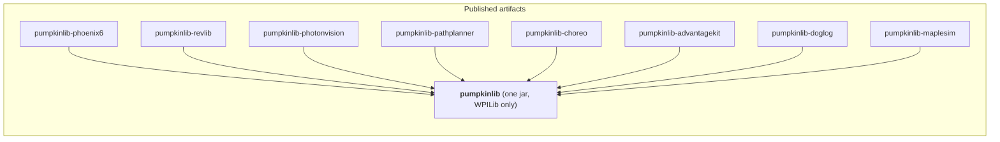
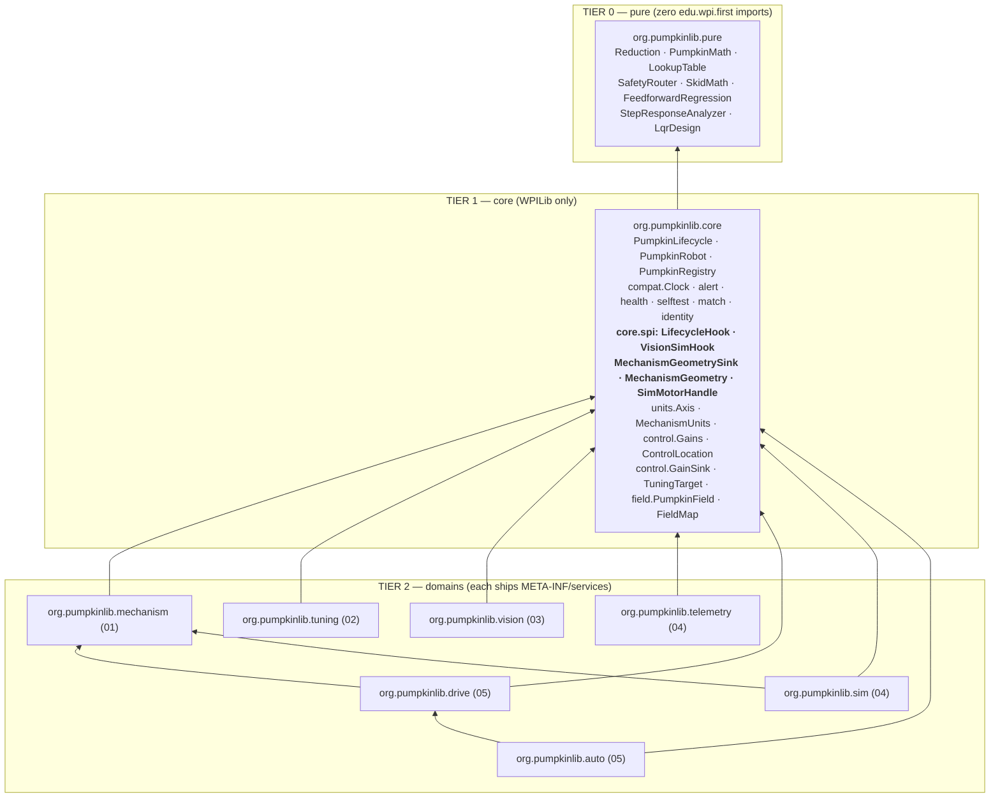

# PumpkinLib — Master Design

**Status:** Design stage, revision 2 (post adversarial review). **No implementation code exists yet.**
**Date:** 2026-08-07 (offseason; 2027 kickoff is 2027-01-09, 22 weeks out)
**Build line:** WPILib 2026.2.2, Java 17, GradleRIO 2026.2.1, Commands v2
**Shipping line:** WPILib 2027 (`org.wpilib.*`, Java 25, SystemCore), planned from day one
**Domain designs:** [`design/01-core-mechanisms.md`](design/01-core-mechanisms.md) · [`design/02-tuning.md`](design/02-tuning.md) · [`design/03-vision.md`](design/03-vision.md) · [`design/04-telemetry-replay-viz.md`](design/04-telemetry-replay-viz.md) · [`design/05-drivetrain-auto.md`](design/05-drivetrain-auto.md) · [`design/06-platform-compday.md`](design/06-platform-compday.md)
**Companion docs:** [`README.md`](README.md) · [`DECISIONS.md`](DECISIONS.md) · [`ROADMAP.md`](ROADMAP.md)

### Revision 2 changelog — what the adversarial review changed in this document

| # | Was | Now | § |
|---|---|---|---|
| 1 | "makes a small team's robot code look like an elite team's robot code" | closes the **software** gap only; §4.1 states the ceiling | §1, §4.1 |
| 2 | "ten competition-day health checks" (stated 4×) | **seven monitor types / eight registered health sources**, named, with `BuiltinMonitorCountTest` | §1, §9.6, §10.7 |
| 3 | Arm `ofTeeth(58,10).then(58,18).then(42,12)` annotated `34.126:1` (actual product 65.411) with `rotorPerSensor = 34.126` | annotation and `rotorPerSensor` both **65.411**, plus a Tier-1 `Validation` rule that makes the class of error unrepresentable | §5.1 D2b, §10A |
| 4 | `TunerConstants.kFrontLeftLocation` (does not exist); 3-arg `CtreSwerveBackend` | `PumpkinDrive.fromTunerX(...)` in the flagship; explicit form uses `kFrontLeftXPos`/`kFrontLeftYPos`/`kWheelRadius`/`kSpeedAt12Volts` and the 4-arg constructor | §10B, App. A |
| 5 | Core called telemetry and tuning directly (uncompilable cycle) | `org.pumpkinlib.core.spi` + `ServiceLoader`; **every dependency arrow points into core**; ArchUnit rule 9 | §5.6 D26, §6, §8 |
| 6 | D21: superstructure command "requires only the Superstructure" | union requirement declared on the returned command; mechanisms stay scheduler-registered | §5.4 D21 |
| 7 | "the gain is pushed on the next loop" | **100–150 ms**; `NetworkTableListenerPoller` queue drain, one JNI call per loop | §5.4 D11a, §11 |
| 8 | Quickstart pasted 8793's real gains as literals | `Gains.UNTUNED` everywhere; real hardware **refuses closed loop** until tuned | §5.1 D2c, §10A |
| 9 | Four parallel registration lists | one `PumpkinRegistry.addAll(...)` with `instanceof` routing and a boot summary | §5.6 D27, §10A |
| 10 | Eleven separately published core artifacts | **one `pumpkinlib` jar** + vendor adapters + `pumpkinlib-gradle`; package boundaries unchanged | §5.6 D28, §8 |
| 11 | "The First 30 Minutes" starting from an empty folder, Timed Skeleton template | "The First Session — plan two hours", `pumpkin init`, `WPILibNewCommands.json` in `requires[]` | §11 |
| 12 | No path to adopt one piece onto an existing robot | public `PumpkinLifecycle`, §11b, an adoption matrix, `IncrementalAdoptionTest` | §5.6 D29, §11b |
| 13 | Tuning wizard scheduled entirely into v0.2 | **Wizard Lite is in v0.1**; drive/vision/auto move to v0.2 | §12 |
| 14 | `SelfTest` and `HealthMonitor` in v0.2 | both in **v0.1 P0** — the highest match-record leverage in the library | §12 |
| 15 | R15 = "Maven Central mirroring" | stated support policy, `pumpkin doctor --bundle`, runtime kill switch, rip-out guide, second committer as a gate | §13 R15 |
| 16 | §10 flagship written against a library that exists in v0.3 | split into **§10A (v0.1-buildable)** and **§10B (full, version-annotated)** | §10 |
| 17 | `tuned.json` | `gains.json` (schema `pumpkinlib.gains/1`), everywhere | §11 |
| 18 | Decision 19 "zero custom structs" vs §5.5 "vision structs ship as designed" | reconciled: two fixed-size vision structs, pre-warmed at boot; `VisionFrame` is not one | §14 #19 |

---

## 1. What PumpkinLib Is, In One Paragraph

PumpkinLib is a Java library for FRC that gives a small team the **software substrate** elite teams build for themselves — pre-wiring the tools they already use into one coherent seam instead of reimplementing any of them. **It closes the software gap. It does not close the practice, manufacturing, or strategy gap; see §4.1.** A team declares its mechanisms as data — a gearbox, a drum radius, soft limits, current limits, named setpoints — and gets, with no further code: a Phoenix 6 or REVLib backend with the closed loop running where it belongs, physics simulation that runs before the robot is built, homing, gravity compensation, interlocked superstructure transitions, live gain tuning over NetworkTables with a guided on-robot wizard that tells a student which knob to turn next and why, deterministic AdvantageKit replay, 3D match replay in AdvantageScope, a one-button pit self-test, and seven built-in competition-day health monitors that name their own failures in English. Later versions add Limelight + PhotonVision + custom-coprocessor pose estimation with a named reason for every rejected frame, one actuation funnel for teleop and auto, and PathPlanner/Choreo autos that raise the elevator while driving. It is deliberately not a framework: every mechanism is a plain WPILib `Subsystem`, every abstraction hands back the raw `TalonFX` on page one of the docs, and §11b demonstrates — with a CI fixture, not a promise — adopting exactly one piece onto a robot project that already exists.

---

## 2. The Defensible Core

**Be honest first:** almost every individual capability in this document exists somewhere. AdvantageKit does replay. AdvantageScope does 3D. PathPlanner does paths. PhotonVision does vision and camera simulation. YAGSL does swerve-from-JSON. SysId does characterization. DogLog does ergonomic logging. 254, 6328, 3061 and 4738 have all published excellent mechanism abstractions. Nothing below is a research result.

**The product is the pre-wired whole, and that is worth building because the wiring is where small teams actually die.** The evidence is in the user's own repositories:

- `0000-XXXX-Robot-Template` contains a well-documented `LoggedTunableNumber` with **zero call sites**, because no IO class exposes `setGains`. The primitive existed; the contract that would consume it did not. (`design/02-tuning.md` §2.4)
- `8793-2026-Robot` has a genuinely sophisticated shoot-on-the-move solver and **14 `SmartDashboard.put*` calls with zero `getNumber`** — a competition team that cannot change a number at the field.
- `reefscape2025` (4738) built a full tunable stack and then **commented out 30+ declarations by hand** rather than ship it to a competition.
- Three of the user's repos have `deploy/pathplanner/settings.json` disagreeing with the Java constants (`9143-B`: `maxDriveSpeed 5.364` in JSON vs `5.96` in Java).
- `9143-2025-A-Updated/Constants.java` documents a CAN ID of **64 that crashed robot code on boot**, because Phoenix IDs stop at 62.

None of those is a missing algorithm. Every one is a missing seam.

### The 20% that delivers 80% of the value

| # | The defensible piece | Why it is defensible |
|---|---|---|
| **1** | **The goal-level hardware seam.** `MotorIO.setPositionGoal(outputRotations, rps, arbFfVolts)` — never `setVoltage`. Motion Magic, FOC, `SensorToMechanismRatio`, fused CANcoders, setpoint latching, and REVLib 2026's on-controller `FeedForwardConfig` all survive the abstraction. | Every prior attempt at vendor neutrality put the seam at voltage and threw away everything a Kraken is worth. The public critique of monolithic motor wrappers is answered *structurally*: `ControlLocation` is an explicit, logged, alert-checked field, and a downgrade announces itself in plain English. |
| **2** | **One `Reduction`, one `Axis`, one `MechanismUnits`.** The gearbox is applied exactly once, inside the vendor config. The geometry is applied exactly once, in `MechanismUnits`. Nothing in team Java ever multiplies by a ratio. | This single decision deletes 41 inline `/360.0` conversions, the `TURRET_ROTATOR_GEAR_RATIO = -20/200.0` sign-cancellation family, and the double-applied-ratio seeding bug — all live in the user's repos today. Changing one number updates gains scaling, soft limits, profile constraints, sim gearing, telemetry units, homing seeds and tolerances. |
| **3** | **One `Gains` type, volts-per-SI, converted once at a `GainSink`.** | The same steer motor's kP is ~7 on the RIO, ~100 in Phoenix, ~0.01 in REVLib. A 10,000× spread makes gains untransferable and makes teaching impossible. Canonicalizing is the load-bearing precondition for everything in the tuning domain. |
| **4** | **The guided tuning wizard.** Not a slider panel — a state machine that runs SysId motion on-robot, fits kS/kV/kA/kG with streaming least squares, derives kP/kD from LQR, asks the student to *predict* before it moves, and writes plain-language coaching. | This is the genuinely unoccupied niche, it is the user's explicit request, and **it is in v0.1** (§12). Every other FRC tuning system shows a student *where the knobs are*. The only FRC repo advertising an auto-tuner has a README and no `src` directory. |
| **5** | **Config-is-data, behavior-is-Java, with three tiers of failure and no dead robot.** Records + builders + `with*()` copies. Validation **collects** errors as values; `PumpkinRegistry` prints all of them and enters `SAFE_MODE`. Nothing ever throws from a static initializer. Plus `describe()` and a config snapshot in every log. | "Zero-mystery debugging" is only real if the failure names itself *and the robot still boots*. A CAN ID of 64 becomes a sentence, not an `ExceptionInInitializerError` at 11 p.m. |
| **6** | **Sim-first, with no second code path.** Declaring mass/MOI is the *only* thing a team writes to get physics. Phoenix and REV simulate through their own vendor sim state, so simulation exercises the real `SensorToMechanismRatio` path. | A unit-conversion mistake shows up in `simulateJava`, not on the field. The NEO path in the user's template has *no simulation at all*, so "switch one constant to NEO" ships untested code today. Vendor parity in sim is release gate **G1**. |
| **7** | **The pre-match self-test and the health monitors, in v0.1.** One button in the queue line: every mechanism moves, every sensor reports, every CAN device answers, every controller is in the right slot — PASS/FAIL per subsystem in Elastic. | Elite teams lose almost no matches to "the robot didn't move"; small teams lose several per event. A two-minute pit fix instead of an unwinnable match is the single largest *match-record* delta in this library, and nothing in the ecosystem packages it. |
| **8** | **Replay safety as an enforced property.** `Clock.now()` only, IO-layer discipline, no user threads, no raw NT reads — checked by ArchUnit today and a build-time lint in v0.3. | AdvantageKit's replay fails *silently* today; enforcement is left entirely to team discipline. |
| **9** | **One filter chain with a named reason for every rejected vision frame.** 19 `RejectReason` values, per-camera counters, a dominant-reason summary. *(v0.2.)* | Turns "vision is broken" into "camera 2 rejected 340 frames for `GYRO_DISAGREEMENT` in match 14." No FRC library we surveyed exposes a per-frame, per-camera, named rejection taxonomy. |
| **10** | **One actuation funnel + one alliance-flip answer.** *(v0.2.)* Every driver input, trajectory follower, align command and auto passes through `PumpkinDrive.driveRobotRelative`; pose origin, operator perspective, and field transform are three separate, separately-named concepts. | Discretization correctness and NaN safety apply to teleop and auto identically from the day the funnel ships; slip limiting and wheel-force feedforward join the same funnel in v0.3 with **no user code change** — which is the point of having the funnel first. The alliance trap is the highest-frequency competition-day failure and it is solved by naming, not by documentation. |
| **11** | **The whole thing installs as one vendordep with zero *vendor* `requires`, and boots into a working simulated robot in one sitting.** | Kickoff-week vendor lag is a hard constraint: AdvantageKit's 2026 swerve templates shipped weeks late waiting on vendors. `pumpkinlib` depends on WPILib only. A team installs on kickoff morning. |

Items 1–3, 5 and 7 are the irreducible spine. Without 1–3 and 5, items 4 and 6–10 cannot be built coherently — which is exactly why they exist in the ecosystem only as disconnected parts.

---

## 3. Vision & Design Principles

Numbered, in precedence order. When two conflict, the lower number wins.

1. **We integrate best-in-class tools. We never reimplement them.**
   PathPlanner, Choreo, PhotonVision, LimelightHelpers, AdvantageKit, AdvantageScope, Elastic, Phoenix 6, REVLib, WPILib odometry, WPILib `SysIdRoutine`, WPILib physics sims, maple-sim. PumpkinLib supplies the *thin coherent seam* that makes them work together with almost no config. §4 names the owner of every thing we do not build.
   *Rationale:* a small team's problem is never that PathPlanner is bad. It is that wiring PathPlanner to a superstructure to a pose estimator to a log correctly takes 2,000 lines they do not have time to write.

2. **Never hide WPILib. Every abstraction has a typed escape hatch on page one, and we publish what a student does *not* learn.**
   `elevator.io().as(TalonFXMotorIO.class).ifPresent(io -> io.talonFX().setControl(...))` appears in the *first* documented example, not an appendix. §10.8 and `docs/graduation.md` state the curriculum gap explicitly and give the hand-rolled plain-WPILib equivalent of every core concept. Release gate **G5** includes a **CSA test**: a mentor who has never used PumpkinLib diagnoses three seeded faults from the driver station and the log alone, in under 10 minutes.
   *Rationale:* the FRC community publicly and loudly punished a competing library for hiding control loops behind wrappers. A library a student cannot see through is a library a CSA cannot help with — and that claim has to be *falsifiable*, which it was not in revision 1.

3. **Zero-mystery debugging: when something fails, the failure names itself — and the robot still boots.**
   Every error message names the mechanism, the field, the value, the expected range, and the fix. Validation errors are **values**, collected and printed together, followed by `SAFE_MODE`; nothing throws from a static initializer. Every rejected vision frame carries a reason. Every downgraded control location announces itself. `describe()` prints the derived physical model at boot.
   *Rationale:* the acceptance test for a library at 11 p.m. before a competition is whether a tired student can tell *which* knob is misconfigured — with the robot powered on.

4. **Sim-first. Everything works with no robot present.**
   Physics, homing, superstructure routing, and the tuning wizard all run in `./gradlew simulateJava`. The tuning wizard *refuses to arm hardware* until the recipe has completed in simulation for the same config hash.
   *Rationale:* small teams get the robot late. The offseason build window and the first three weeks of build season are keyboard time, not robot time. This is the one practice deficit software can partially substitute for — see §4.1.

5. **No vendor lock-in, in either direction.**
   Phoenix 6, REVLib and generic/WPILib hardware are first-class. Limelight, PhotonVision and custom NT coprocessors are first-class. AdvantageKit, Epilogue, DogLog and raw NT4 are all logging backends. The `pumpkinlib` artifact depends on **WPILib only**; every vendor lives in a separate artifact behind a separate vendordep JSON.
   *Rationale:* the user's own stack spans Phoenix-6-only (8793) and AdvantageKit + REVLib (template, 9143). Neither can be assumed. And a hard vendor dependency means we cannot ship on kickoff day.

6. **Config is data; behavior is plain Java.**
   Immutable records, fluent builders, `with*()` copies, validation that returns `List<ConfigError>`. No JSON-driven behavior, no reflection magic, no annotation processor that a consumer's build is required to install.
   *Rationale:* YAGSL's own docs say configuring a module "requires a lot of patience and you will likely never get it working on the first try." Deploy JSON is invisible to code review and does not round-trip into replay. And a vendordep *cannot* add an `annotationProcessor` line to a consumer's `build.gradle` — which is why `@AutoLog` is banned library-wide.

7. **The location of every control loop is explicit, defaulted-with-provenance, logged, and alert-checked.**
   `ControlLocation` has four values. It defaults from the leader's `MotorSpec` so a rookie is not asked an expert question on line 5, and `describe()` prints the value **and whether it was `EXPLICIT` or `DEFAULTED`**. A backend that cannot honor the request downgrades *loudly*.
   *Rationale:* this is the specific mistake the community rejected — "papering over fundamental differences in capability with identical APIs, where a small change in config metadata can precipitate a massive change in mechanism behavior."

8. **We serve both house styles: command-based and state-based.**
   `Mechanism implements Subsystem` (the *interface*), never `SubsystemBase` (the class). Command-based teams call `registerWithScheduler()`; state-based teams call `periodic()` themselves. Commands are always *returned from factories*, never subclassed by users.
   *Rationale:* the user's repos contain both styles, and returning-not-subclassing is what makes the Commands v3 coroutine port an internal swap rather than a user rewrite.

9. **Incremental adoption is a structural property, not a promise.**
   `PumpkinLifecycle` is **public**. `PumpkinRobot` and `PumpkinLoggedRobot` are 20-line delegating shims over it, and the manual-wiring path is documented **first**. Four CI fixture projects (`tunables-only`, `one-mechanism-only`, `health-only`, `full`) compile on every PR; only the last may reference `PumpkinRobot`. §11b converts exactly one mechanism from 8793's real repo.
   *Rationale:* revision 1 claimed a team "can delete PumpkinLib from one subsystem mid-season" and never demonstrated it once, while making the only object that would allow partial adoption package-private. A promise with no fixture is marketing.

10. **The 2027 break is planned for from the first commit, not retrofitted.**
    All year-volatile WPILib API is confined to `org.pumpkinlib.core.compat` and `org.pumpkinlib.field`, fenced by an ArchUnit suite. Nothing removed in 2027 is used: no Relay, AnalogOutput, SPI, DMA, Counter, Ultrasonic, AnalogTrigger, interrupts, Servo, `MutableMeasure`, NT3, Shuffleboard, SmartDashboard, `robotInit()`. No Java preview features. Two release lines from one source tree.
    *Rationale:* WPILib 2027 renames every package, moves to Java 25 and SystemCore, and drops NT3. Any design that does not plan for this dies in January 2027.

11. **Every performance claim is measured in *milliseconds*, and observability is never the thing that gets deleted under pressure.**
    Tiered telemetry (CRITICAL/STANDARD/DEBUG), a per-cycle byte-budget governor, FMS-aware gating, a CI allocation test asserting zero bytes allocated in `periodic()` after warmup, **one health slice per loop, round-robin, cycle-counted** (never a 4 Hz burst, never a wall clock), and a per-domain time budget table (§12.6) gated at G2 on a real roboRIO 2.
    *Rationale:* 2026 teams reported 80–600 ms loops with stock AdvantageKit vision+swerve templates, and the documented team response was to *delete their telemetry entirely*. Team 135 measured full fault checking at ~10 ms/loop. Bytes are not the constraint; JNI, serialization and odometry replay are.

12. **Documentation correctness is a release blocker.**
    Every fenced Java snippet in every doc — **including its import block** — is extracted from a compiled, executed test. Every numeric claim in a lesson is asserted against the code that produces it. Every filename literal in this document must appear in at least one domain doc (CI-checked).
    *Rationale:* one AI-written `sin`/`cos` error destroyed a competing library's credibility in a single forum post. Revision 1 of this document shipped a 1.92× gear-ratio error in its own headline example.

13. **Degrade, never crash.**
    A missing optional domain is a no-op, not an exception. A missing vendor is a named `Alert`, not a `NoClassDefFoundError`. maple-sim absent means a kinematic sim world. PathPlanner absent means `TractionMode` degrades to `NONE` with an alert. And `PumpkinLib.disable("Elevator")` (readable from `src/main/deploy/pumpkin/disabled.txt`) drops one named component to neutral and unregisters it from every registry **without a code change**, so a stuck team can keep driving at an event.
    *Rationale:* bus factor and abandonment are the risks teams cite first about any community library. PumpkinLib must be rippable mid-season, per subsystem, and that only holds if the fallbacks are exercised in CI (`RipOutTest`).

---

## 4. Non-Goals

Explicit, with the tool that already does each thing. If it is on this list, we will not build it, and a pull request adding it will be closed with a link to this section.

| We do not build | Already done, well, by | What we do instead |
|---|---|---|
| A log file format | **WPILOG v1.0** | Write it |
| A log viewer, graphing tool, or 3D renderer | **AdvantageScope 26.0.2** (ships with the WPILib installer) | Generate its `config.json` from our `ArticulationSpec` and ship three layouts |
| A deterministic replay engine | **AdvantageKit 26.0.2** — the only one in FRC Java | Wrap it and add the determinism *guard* it lacks |
| An annotation-logging framework | **WPILib Epilogue** (in-tree, compile-time) | Offer it as a `LogBackend` |
| An ergonomic logging API | **DogLog 2026.5.0** | Adopt its fault semantics; offer it as a `LogBackend` |
| A driver dashboard | **Elastic 2026.1.2** | Vendor `ElasticLib`, generate four layouts, serve them on port 5800 |
| A live-debug UI | **Glass** | Nothing — it reads the same NT4 keys |
| A pit-display desktop app | Team 135's Squire proves the concept | Report self-test results into Elastic, which teams already have open |
| A pose estimator or Kalman filter | **WPILib `SwerveDrivePoseEstimator`**; CTRE's built-in | Feed it correctly, guard the buffer, log accepted *and* rejected |
| An AprilTag detector or any on-RIO CV | **PhotonVision 2026.3.4**, **Limelight OS** | Consume results only |
| A camera simulator or renderer | **PhotonVision `VisionSystemSim`** | Wrap it, add 2026 sensor presets, and re-encode its output into the Limelight wire format |
| A camera calibration tool | **PhotonVision's calibration UI**, **mrcal** | Ship a checklist and a health check that reads the resulting `config.json` |
| A field-tag calibration tool | **WPIcal** (ships with WPILib 2026) | `FieldLayouts.fromWpical(Path)` + a deploy convention + `TagResidualMonitor` |
| A Limelight NT wrapper | **`LimelightHelpers.java`** (LimelightLib-WPIJava 1.14) | Vendor it verbatim so teams stop copy-pasting 1,900 lines; use raw NT `readQueue()` on the hot path |
| A neural-network trainer | **Limelight's trainer**, **PhotonVision's Colab notebook** | Unify the *output* into one `DetectedObject` and say plainly that models are not portable |
| Trajectory generation | **Choreo 2026.0.3** (TrajoptLib/Sleipnir), **PathPlanner 2026.1.2** | One trigger vocabulary over both |
| Pathfinding | **PathPlanner AD\*/`LocalADStar`** over `navgrid.json` | A façade, `LocalADStarAK` for replay determinism, and warmup |
| A path-following controller | **`PPHolonomicDriveController`**, **`PPLTVController`**, WPILib `LTVUnicycleController` | Wire them once, with the correct overload for the drivetrain type |
| A slip/setpoint generator | **PathPlannerLib `SwerveSetpointGenerator`** (254-derived, maintained) | Insert it in the funnel so *teleop* gets it too |
| A swerve library | **CTRE Tuner-X `SwerveDrivetrain`**, **AdvantageKit templates**, **YAGSL**, WPILib kinematics | `DriveBackend` adapters, ~120 lines each |
| A high-frequency odometry thread | Phoenix 6's native thread; AdvantageKit's `PhoenixOdometryThread` | Select and verify the mode; warn loudly when degraded |
| Motion profiling math | WPILib `TrapezoidProfile`/`ExponentialProfile`, Phoenix **Motion Magic**, REV **MAXMotion** | Pick which one runs and *where*; never re-derive one |
| PID or feedforward math | WPILib controllers; Phoenix `Slot0Configs`; REVLib `FeedForwardConfig` | Compute the numbers that go in them |
| An LQR solver or a least-squares decomposition | WPILib `LinearQuadraticRegulator`, `Matrix.solveFullPivHouseholderQr` | Construct them; twelve lines each |
| The characterization *motion* | WPILib `SysIdRoutine` + `SysIdRoutineLog` | Generate the callbacks and a derived safe config, then run WPILib's own commands |
| The SysId analysis GUI | **WPILib SysId** | Fully supported as an escape hatch; we write a clean single-routine WPILOG so it works first try |
| Physics models | WPILib `ElevatorSim`/`SingleJointedArmSim`/`FlywheelSim`/`DCMotorSim`/`BatterySim` | Build them from `SimConfig` + `Axis` |
| Field physics, game pieces, projectiles | **maple-sim** (dyn4j) | An optional `ServiceLoader` adapter that is never load-bearing |
| A declarative whole-robot state machine | **WPILib 2027 Commands v3 ships one** | `Superstructure` is a strictly narrower *mechanism coordinator* with interlocks and collision avoidance |
| Command-group / sequencing utilities | Commands v3's `coroutine.await()` obsoletes most of them | Return commands from factories |
| A tunable-number *storage* system independent of WPILib | **WPILib 2027 is adding a first-party `Tunable` API** (PR #7773) | Design `TunableTransport` to *adopt* it, promptly, and say so publicly |
| A vendor configuration tool | **Phoenix Tuner X**, **REV Hardware Client** | Never touch firmware, device IDs, or CAN configuration |
| Swerve module bring-up (inverts, offsets) | **Tuner X Swerve Generator**, YAGSL | *Check* that bring-up was done and refuse to tune a wrong-signed mechanism |
| A relay (Åström–Hägglund) or Ziegler–Nichols autotuner | Nobody in FRC ships it, and it requires driving a geared arm to sustained oscillation | **Permanently rejected**, not deferred, on safety and pedagogy grounds |
| Automatic regeneration of `Constants.java` | — | Generate a paste-ready block and a committed `gains.json`; a program rewriting its own source fights the formatter and destroys reviewability |
| Backlash compensation in software | — | *Detect and report* backlash and tell the student to fix it mechanically |
| A scouting app, TBA or Statbotics client in robot code | **Lookout**, **Arcbotics**, **Pre-ScoutingApp** | An offline deploy-file schedule reader only |
| C++ or Python bindings | — | **Permanently out of scope.** ~90% of FRC is Java; a port doubles the 2027 migration cost for <10% reach |
| Anything on Shuffleboard, SmartDashboard, PathWeaver, RobotBuilder, or NT3 | — | All deleted in 2027. Raw NT4 typed topics only |
| **Monologue** support | Dead: last commit 2024-06-21, no 2025/2026/2027 vendordep | Migrating teams are pointed at Epilogue or DogLog |

### 4.1 What PumpkinLib cannot do for you

> **PumpkinLib removes software prerequisites. It removes none of the others.**
>
> It will not make an unreliable intake reliable, will not substitute for driver practice hours, will not choose a good strategy, will not scout, and will not improve your build quality or your CAD pipeline.
>
> Published analysis of the widening EPA gap attributes the elite advantage primarily to **funding, in-house manufacturing capability, CAD maturity, supplier knowledge, driver repetitions, and a chain of five to ten subsystems that must all work** — "if you screw up one you are done." Software is the marginal differentiator on top of those, not a substitute for them.
>
> If your robot is mechanically unreliable, fix that first — this library will only help you log the failure more precisely.
>
> The one practice deficit PumpkinLib can partially substitute for is **robot-hours**, via simulation: a mechanism that homes, profiles and holds correctly in `simulateJava` is a mechanism you did not burn a Saturday debugging. It cannot substitute for driver reps at all.
>
> Concretely, here is the honest ceiling. A small team that adopts all of PumpkinLib should expect: fewer matches lost to "the robot didn't move" (the self-test), fewer matches lost to a mis-scaled or unhomed mechanism (units + `describe()` + boot dump), a faster tuning loop (hours to minutes), and autos that do more than one thing at a time. It should **not** expect to out-cycle a team with a better intake, better drivers, and 40 more practice hours.

This section is referenced from the README's first screen, above any capability list.

---

## 5. Integration Decisions — conflicts reconciled

The six domain designs were written independently. Twenty-nine of them collide. Each is resolved below with a single owner. **These decisions are binding; no domain may re-litigate one in code.**

### 5.1 Duplicated types — one owner, one name

| # | Conflict | Decision | Rationale |
|---|---|---|---|
| **D1** | `Gains`: `org.pumpkinlib.config.Gains` (doc 01, 7 doubles) vs `org.pumpkinlib.control.Gains` (doc 02, rich record) | **One `org.pumpkinlib.control.Gains`, shipped in the `pumpkinlib` jar** so mechanisms depend on it without depending on the tuning package. Doc 01's version is deleted; `Gains.realOrSim(real, sim)` is kept as a static. | Two divergent gain types destroy the single-unit-system argument, which is load-bearing for the entire tuning domain. |
| **D1a** | *(new)* What is actually **in** `Gains`? Revision 1 said "gravity, profile, tolerance, iZone/iMax"; doc 01 revision 2 ships a 7-double record. | **`Gains` is exactly seven doubles: `(kP, kI, kD, kS, kV, kA, kG)`, all volts-per-SI.** Construction is `Gains.pid(kP,kI,kD).withKs(..).withKv(..).withKa(..).withKg(..)` — **named fields only, no multi-double constructor.** `GravityMode`, `MotionConstraints`, tolerance, neutral mode and manual-control parameters all live on **`ControlConfig`**, which is where a mechanism's *policy* belongs. Integral windup is `ControlConfig.integral(kI, iZone, iMaxVolts)` — deliberately awkward, no `withI()`. | A tuner writes gains; it does not write policy. Keeping `Gains` a flat tuple of seven measurable physical quantities is what lets `TunedValueStore`, `ValueExporter`, the NT schema and the wizard all treat it as one object. `reefscape2025/util/custom/GainConstants.java` has a **live positional-overload bug** where `(P,I,D,FF,minOut,maxOut)` silently binds to `(P,I,D,S,V,G)`; named-field-only construction makes that unrepresentable. |
| **D1b** | *(new)* `Gains.toleranceSi` vs `ControlConfig.tolerance` — duplicate state with no owner | **`ControlConfig` is the sole owner of tolerance.** `Gains` has no tolerance field. `ControlConfig.Builder.tolerance(Measure<?> position, double velocityUserUnits, double debounceSeconds)` accepts user units and converts through `MechanismUnits` at build time. | Revision 1's §10 example set both, which does not compile and would not have agreed if it did. |
| **D2** | `MotionConstraints` (doc 01, **user units** — deg/s) vs `Gains.ProfileConstraints` (doc 02, **SI**) | **One stored representation, always SI, on `ControlConfig`.** `MotionConstraints.of(180.0, 540.0)` still *accepts* deg/s and converts through `MechanismUnits` at build time; it survives as an authoring-time value type and is never stored. | Keeps doc 01's ergonomics (nobody types rad/s for an arm) with zero duplicate state. |
| **D2a** | *(new)* `GravityType` (doc 02) vs `GravityMode` (doc 01) vs "on `Gains`" (revision 1 D6) | **`org.pumpkinlib.control.GravityMode {NONE, CONSTANT, COSINE}` is canonical, derived from the `Axis`, overridable on `ControlConfig.gravity()`.** `Gains.GravityType` is deleted. There is no `withGravity(kG, mode)` — kG is `Gains.withKg(double)`; the *mode* is a property of the mechanism's geometry, not of its gains. | A team should never type a gravity mode for an elevator. Revision 1's §10 example called `.withGravity(0.32, GravityMode.CONSTANT)` against a `Gains` record that declared a different nested enum, and did not compile. |
| **D2b** | *(new, blocking)* The flagship arm annotated `ofTeeth(58,10).then(58,18).then(42,12)` as `34.126:1` while the product is **65.411:1**, and then set `FusedCancoder.rotorPerSensor = 34.126` | **The annotation and `rotorPerSensor` are both `65.411`.** And the class of error is made unrepresentable by a hard **Tier-1 `Validation`** rule: for `FeedbackSpec.FusedCancoder` and `FeedbackSpec.RemoteCancoder`, `rotorPerSensor × sensorPerOutput` **must** equal `reduction.rotorPerOutput()` within 1%, or `Validation` emits a `FATAL` `ConfigError` naming both numbers, both fields, and the identity. | Phoenix requires `RotorToSensorRatio × SensorToMechanismRatio == rotor-per-output`. Revision 1 mis-scaled the fused arm by 1.92× **in the example used to demonstrate "change the gear ratio in exactly one place,"** and nothing caught it. A validated identity is worth more than a corrected literal. **Cross-doc action:** `design/01` §5.5 and §9.1 still print `34.126` and must be updated (§16). |
| **D2c** | *(new, blocking)* Quickstarts pasted 8793's real, non-zero gains as literals and told a rookie to "edit four numbers" | **`Gains.UNTUNED` is a real sentinel (`kP = NaN`) and it is what every quickstart and README block uses.** Resolution: in **simulation**, `UNTUNED` resolves at mechanism construction to a physics-derived first guess from `PlantPrior` (kV/kA from `LinearSystemId.createElevatorSystem`, kG from mass·g·r / (G·kT), kP from `FeedbackDesigner`), the mechanism moves, and the boot dump prints *"these gains were derived from your declared mass, not measured — run the tuning wizard."* On **real hardware**, a mechanism constructed with `UNTUNED` **refuses closed-loop control**: `goTo()` raises a `kError` alert (*"Elevator has never been tuned. Run the tuning wizard, or set gains explicitly in RobotConfig."*) and holds neutral. Manual control and homing still work. | A rookie pasting another team's elevator gains onto their Kraken at `ON_MOTOR_PROFILED` and full authority is the single most likely way this library breaks a first mechanism. Tier-3 placeholder detection only fires on sentinels, and revision 1's block deliberately avoided them. Numeric literals now live in a separate, labelled *"a tuned elevator, for reference — these are 8793's numbers for 8793's hardware"* section. |
| **D3** | `MechanismUnits`: converter class (doc 01) vs enum (doc 02) | **CORE keeps `MechanismUnits` (the converter).** Doc 02's enum is renamed **`SiDomain {LINEAR_METERS, ROTATIONAL_RADIANS}`** and is *derived* — `MechanismUnits.siDomain()`. Teams never type it. | A converter and an enum cannot share a name in one library. |
| **D4** | Three `Axis` types | CORE keeps `org.pumpkinlib.units.Axis` (sealed geometry). Viz's is renamed **`org.pumpkinlib.viz.JointAxis`**. | Same reason. A drivetrain constants file may legitimately import both. |
| **D5** | `ControlLocation` (4 values) vs `LoopLocation` (2 values) | **`ControlLocation` is canonical.** `LoopLocation` is deleted; tuning calls `ControlLocation.runsOnMotor()`. It is **defaulted from the leader's `MotorSpec`**, not required, and `describe()` prints `EXPLICIT` or `DEFAULTED`. | Four values carry strictly more information, and `RIO_PROFILE_MOTOR_LOOP` genuinely differs from both of doc 02's. Requiring it made a rookie answer an expert question on line 5. |
| **D6** | *(superseded by D2a)* | See D2a. | |
| **D7** | `Reduction` vs `Gearing` vs `PlantPrior.gearingReduction` (a raw double) | **`Reduction` is canonical**, positive-only, self-describing, living in the HAL-free `org.pumpkinlib.pure` package. `Gearing` is deleted. `PlantPrior` takes a `Reduction`. **`TuningRegistry.register(target)` asserts `PlantPrior.reduction().rotorPerOutput() == config.reduction().rotorPerOutput()`** and refuses the registration with a named error if they disagree. | Positive-only with direction on an invert flag makes `-20/200.0` unrepresentable. The wizard sanity-bounds every fitted gain against the prior; if the prior disagrees with the mechanism's real reduction, the wizard confidently rejects correct fits. |
| **D8** | `TuningTarget` in `org.pumpkinlib.tuning` — inverts the mechanism→tuning dependency | **Moves to `org.pumpkinlib.control.TuningTarget`,** together with `MechanismArchetype`, `TravelLimits`, `PlantPrior`, `GainSink`, `Controllers`, `SafetyEnvelope` and `TuningSupervisor`. | A team with hand-rolled subsystems implements `TuningTarget` in ~30 lines without adopting either the mechanism layer *or* the wizard. This is the single most important incremental-adoption seam in the library and `docs/graduation.md` leads with it. |

### 5.2 Facades — five domains each proposed one

| # | Conflict | Decision |
|---|---|---|
| **D9** | **Logging.** Five competing facades | **Domain 04 owns telemetry outright.** `org.pumpkinlib.telemetry.PumpkinLog` is the single static facade every domain calls (`critical()/log()/debug()/processInputs()/timestamp()/isReplay()`). The pluggable backend SPI is **`LogBackend`** (Nt4, AdvantageKit, Epilogue, DogLog, NoOp) — which frees the name `TelemetrySink` to keep doc 04's meaning (the per-cycle push target handed to `TelemetrySource.sample`). `PumpkinInputs` / `PumpkinLogTable` are canonical for logged inputs; the AdvantageKit adapter — **not** the mechanism package — owns `LoggableInputs`. |
| **D10** | **Alerts.** Five competing facades | **Platform (06) owns alerts** at `org.pumpkinlib.core.alert`: `Alerts.error/warning/info(group, text, MatchImpact)` returning a `PumpkinAlert` handle, plus `AlertRegistry`, `Severity`, `MatchImpact`. Doc 04's `PumpkinFaults` is folded in — a sticky fault is `PumpkinAlert.sticky(true)`. Doc 04 keeps `PumpkinTracer`. **`MatchImpact {BLOCKS_MATCH, PIT_ONLY}` is required at every call site with no default and no single-argument overload**; the `/Pumpkin/Driver` mirror shows at most three `BLOCKS_MATCH` alerts and `Ready` rolls up blocking alerts only. `AlertBudgetTest` fails CI if the example robot can raise more than 3 blocking alerts simultaneously. |
| **D11** | **Tunables.** Five competing types | **Tuning owns the type and the NT plumbing.** Every domain calls `TuningRegistry.tunable(namespace, key, default, unit)`. Publication is `/Tuning/<namespace>/<key>` and nowhere else. `TuningRegistry` consults `FmsPolicy.tunablesLocked()` and push-registers every tunable with `ConfigRegistry`. **Registration is an explicit allowlist per mechanism — never reflection over field names.** Geometry, CAN IDs and sim parameters are deliberately *not* tunable. |
| **D11a** | *(new, blocking)* Revision 1 claimed a slider change reaches the controller "on the next loop," and specified per-tunable polling | **Both corrected.** (a) The honest number is **100–150 ms**: AdvantageScope and Elastic are NT *clients*, the robot is the server, and a client publisher's default update period is 100 ms unless it sets `PubSubOption.periodic` or explicitly flushes. Intermediate slider values are coalesced away. Every doc says this. (b) `TuningRegistry` holds **one `NetworkTableListenerPoller`** subscribed to the `/Tuning` prefix with `EventFlags.kValueAll`; `periodic()` calls `readQueue()` **once** and dispatches by topic name — one JNI call per loop regardless of tunable count, and no lost intermediate values. Revision 1's model was ~250 `DoubleSubscriber.get()` JNI calls per loop on the §10 robot. (c) `GainSink` publishes an **echo topic** `/Tuning/<ns>/<key>/applied` after a successful apply, so the round trip is visible and a rejected config is diagnosable. |
| **D12** | **Global entry point.** `org.pumpkinlib.Pumpkin` god-object | **Deleted.** `dt()` → `Clock.dt()`; `telemetry()` → `PumpkinLog` statics; `alerts()` → `Alerts` statics; `TUNING_MODE` → `TuningRegistry.isTuningEnabled()`; `registry()` → `org.pumpkinlib.core.PumpkinRegistry`. |
| **D13** | **`PumpkinRobot` vs `LoggedRobot`** | `org.pumpkinlib.core.PumpkinRobot extends TimedRobot`; the AdvantageKit adapter ships `PumpkinLoggedRobot extends LoggedRobot`. **Both are ~20-line delegating shims over the public `PumpkinLifecycle`** (D29). Core must not depend on AdvantageKit. |

### 5.3 The field, the drive seam, and simulation

| # | Conflict | Decision |
|---|---|---|
| **D14** | **`PumpkinField` means three different things** | **One `org.pumpkinlib.field.PumpkinField`, owned by Drive/Auto,** which absorbs the 2027 field-origin move and joins the ArchUnit-fenced compat tier. Doc 04's ghost contract is renamed **`org.pumpkinlib.viz.FieldGhosts`**. Doc 06's `core.compat.PumpkinField` is deleted. |
| **D15** | **Field constants.** `FieldMap` vs `FieldLayouts` | **`FieldMap` owns the *choice*** (`year()`, `lengthMeters()`, `widthMeters()`, `symmetry()`, `autoPeriodSeconds()`, `tagLayout()`); **`FieldLayouts` owns the *mechanics*** (deploy-override resolution, WPIcal ingestion, fingerprinting, delta logging). **The auto period is a `FieldMap` constant, never a hardcoded `15.0`,** and `PumpkinAutoRoutine.build()` *rejects* a `skipToAfter` argument outside `(0, FieldMap.autoPeriodSeconds())` — structurally enforced, not aspirational. |
| **D16** | **Drive-facing interfaces** | **Drive owns all four**, in `org.pumpkinlib.drive`. `PumpkinDrive` implements `PoseProvider`, `AlignableDrive` and `DriveTelemetry`, and accepts a `VisionConsumer`. **`PoseProvider.getGyroFieldHeading()`** (renamed from `getGyroRotation()`) returns the gyro yaw **plus the gyro→field offset**, which has exactly two named writers: `resetPose` and the disabled multi-tag seed. `DriveBackend.getRawGyro()` exposes the unreferenced yaw separately. |
| **D16a** | *(new, blocking)* Nobody owned the gyro→field offset, so MegaTag2 received a wrong orientation and produced plausible garbage | **Resolved in `design/03` §2.2.** A raw IMU yaw is referenced to wherever the gyro was zeroed at power-on. `robot_orientation_set` requires blue-origin heading. The offset is a first-class, logged, drive-owned quantity; the disabled multi-tag seed is the *only* path by which vision may write it, it is gated on `!isEnabled()`, and it **refuses gyro-fused sources** (seeding a gyro offset from a gyro-fused solve is circular). `VisionDiagnostics.GYRO_OFFSET_UNSEEDED` fires if a gyro-fused camera is configured and the offset was never seeded, and `Vision/GyroFieldHeadingDeg` is logged next to `Vision/FusedHeadingDeg` so "these two curves are identical" is a one-glance diagnosis. |
| **D17** | **`VisionObservation` exists twice** | **Both records deleted.** `VisionFrame` is the one vision value type. Vision pushes into the drive through `VisionConsumer.accept(Pose2d bluePose, double fpgaTimestampSeconds, Matrix<N3,N1> stdDevs)` — byte-identical to AdvantageKit's signature, so an AdvantageKit template port is import-only. |
| **D18** | **Physics plants built twice** | **CORE declares; Sim owns.** `PositionConfig` + `Axis` produce a `MechanismGeometry` value object **which lives in `org.pumpkinlib.core.spi`** (D26). `MotorIO` gains `default Optional<SimMotorHandle> simHandle() { return Optional.empty(); }`; `TalonFXMotorIO` (in the Phoenix adapter) implements it by constructing a `TalonFXSimHandle` — **the CTRE import stays inside the adapter, which is legal.** `PumpkinSim` consumes `MotorIO.simHandle()` and never names a vendor type. `Mechanism.simulationPeriodic()` is deleted outright, along with the `simulatedMotorVoltage()` / `updateSimulatedSensors()` methods that appeared at call sites but never in the `MotorIO` interface. |
| **D19** | **`PumpkinVisionSim` exists twice** | **Vision owns it** at `org.pumpkinlib.vision.sim.PumpkinVisionSim`. It is discovered through the **`VisionSimHook` SPI in core** (D26), not by `PumpkinSim` naming the vision package. |
| **D20** | **maple-sim referenced by three domains** | Exactly one adapter artifact, `ServiceLoader`-discovered. `PumpkinAutoTest` consumes `PumpkinSim.field(year)` and never maple-sim directly. A degraded kinematic (no-slip, no-collision) world is a first-class option, not a failure. |

### 5.4 Requirements, coordination, and health

| # | Conflict | Decision |
|---|---|---|
| **D21** | **`GoalBus` vs `Superstructure`.** Auto cannot work without a requirement-owning goal target. Revision 1 said, in consecutive sentences, that the superstructure "declares their union requirement exactly once" *and* that `request(g)` "returns a command requiring only the `Superstructure`." | **The returned command declares the union requirement.** `Superstructure.request(G goal)` returns `Commands.run(() -> m_planner.step(goal), requirementsArray())` where `requirementsArray()` is `{this, ELEVATOR, ARM, SHOOTER, ROLLER}` — every coordinated mechanism, every time. `ELEVATOR.goTo("L4")` therefore *correctly interrupts* the superstructure command and vice versa, which is the desired semantics and is exactly what WPILib requirements are for. **The coordinated mechanisms stay registered with the scheduler** so their `periodic()` still runs; requirement conflicts and periodic registration are independent in WPILib. The "do not self-register" clause and the "log a named warning" fallback are **deleted** — revision 1 turned an actuator-ownership violation into a log line, with two writers racing to set the same goal and the last registration order winning nondeterministically. `GoalBus.ofCommands(Map<G, Command>)` ships regardless as the on-ramp for hand-rolled superstructures. |
| **D22** | **Health checks vs transport** | 06 owns `HealthSource` / `HealthMonitor` / `RobotHealth` / `SelfTest` and the checks; 04 owns the transport, the schema, and the `/Pumpkin/Driver` mirror including the `Ready` rollup. |
| **D23** | **`MechanicalHealthCheck` — tuning or health?** | **Stays in Tuning.** It commands raw voltage and must go through `TuningSupervisor`. `TuningHealth` (the passive "is this still tuned?" check) is registered as a `HealthSource` and *is* consumed by 06. |
| **D24** | **`@AutoLog` / `@AutoLogOutput`** | **PumpkinLib uses neither, anywhere.** All logging is explicit `PumpkinLog` calls; `MotorInputs` and `VisionCameraIOInputs` hand-write `toLog`/`fromLog`. The `@AutoInputs` processor ships as an *opt-in convenience for team code* via the template, never as a library requirement. |
| **D25** | **`MechanismSpec`** reads like a mechanism config | Renamed **`org.pumpkinlib.viz.ArticulationSpec`**. |

### 5.5 Scheduling, ownership and packaging (new in revision 2)

| # | Conflict | Decision |
|---|---|---|
| **D26** | *(new, blocking)* **The runtime loop and the artifact graph contradicted each other.** `PumpkinRobot` (core) called `PumpkinLog.beforeUserPeriodic()` (telemetry) and `TuningRegistry.periodic()` (tuning), while the dependency graph had telemetry and tuning depending on core. As drawn it does not compile. The same cycle appeared for `PumpkinRegistry → PumpkinSim`, and for `PumpkinSim → PumpkinVisionSim` where the shared type had no home. | **Add one package to core: `org.pumpkinlib.core.spi`.** It contains, and only contains, the types that cross a layer boundary downward:<br/>`public interface LifecycleHook { default void beforeUserPeriodic() {} default void afterUserPeriodic() {} default void simulationTick(double dt) {} int priority(); }`<br/>`public interface VisionSimHook { void update(Pose2d groundTruth); }`<br/>`public interface MechanismGeometrySink { void declare(String name, MechanismGeometry g); }`<br/>plus the value types `MechanismGeometry` and `SimMotorHandle`.<br/>`PumpkinLifecycle` iterates `ServiceLoader.load(LifecycleHook.class)` sorted by `priority()`. The telemetry, tuning, sim and vision packages each ship a `META-INF/services` entry. **Every dependency arrow now points into core**, and ArchUnit rule 9 enforces it. |
| **D27** | *(new, blocking)* **Four parallel registration lists** over the same objects (`PumpkinRegistry.addAll`, `SelfTest.registerAll`, `TuningRegistry.registerAll`, `HealthMonitor.watch`), with different membership for non-obvious reasons — in the example that advertises "ONE list." | **Collapse to one call.** `PumpkinRegistry.addAll(Object... components)` inspects each argument once and routes it: `instanceof TelemetrySource` → telemetry; `instanceof HealthSource` → `HealthMonitor`; `instanceof SelfTestable` → `SelfTest`; `instanceof TuningTarget` → `TuningRegistry`; `instanceof Subsystem` → optional scheduler registration. `SelfTest.registerAll`, `TuningRegistry.registerAll` and `HealthMonitor.watch` are **removed from the public API** and replaced with opt-**out** filters on the mechanism config: `.excludeFrom(Registry.TUNING)`. The default is "everything, everywhere"; the exception is explicit and visible in `describe()`. `PumpkinRegistry` prints a one-line boot summary — `Registered 8 components: 8 telemetry, 6 health, 6 selftest, 3 tuning` — so a missing registration is a diff in the boot dump. |
| **D28** | *(new)* **Eleven separately published core artifacts** all shipped behind one `PumpkinLib.json` and therefore always installed together — zero consumer-visible benefit, eleven POMs and eleven chances for a botched publish on every release, several of them mid-season. | **Ship three code artifacts plus a build plugin for v0.1:** `pumpkinlib` (one jar, WPILib-only dependencies, containing everything the eleven contained), `pumpkinlib-phoenix6`, `pumpkinlib-revlib`, and `pumpkinlib-gradle` (the Gradle plugin, which revision 1 depended on in §7.4 and listed nowhere). Vendor adapters for PhotonVision, PathPlanner, Choreo, AdvantageKit, DogLog and maple-sim remain separate for the same reason — they carry a vendor dependency. **Keep the package and source-set boundaries exactly as designed and keep all nine ArchUnit rules enforcing them at the package level**, so the multi-artifact split remains available later at zero cost. Publish it in v0.3 only if a consumer actually asks to install a subset. Precedent, stated honestly: WPILib itself ships as one vendordep-visible unit and splits internally. Saves ~0.5 pw of build work and ~2 hours of release toil on every in-season patch. |
| **D29** | *(new, blocking)* **No path to adopt PumpkinLib incrementally.** Every example started from an empty folder; `PumpkinLifecycle` was package-private, so a team with an existing `Robot extends TimedRobot` (8793) or `LoggedRobot` (9143) could not get the platform layer without changing their base class. | **`PumpkinLifecycle` is public**, in the `pumpkinlib` jar, with an explicit surface: `public static PumpkinLifecycle create(LogConfig cfg)`, `void robotInit()`, `void beforeUserPeriodic()`, `void afterUserPeriodic()`, `void disabledInit()`, `void close()`. `PumpkinRobot` and `PumpkinLoggedRobot` become delegating shims. **The docs show the manual-wiring path first.** §11b converts one mechanism from 8793's real repo with `CommandSwerveDrivetrain` untouched, §11c is the adoption matrix, and CI job `IncrementalAdoptionTest` compiles four fixture projects — `tunables-only`, `one-mechanism-only`, `health-only`, `full` — each asserting no reference to `PumpkinRobot` except the last. |
| **D30** | *(new)* **`ControlMap` had no mode concept and no manual fallback,** while every automated action in the flagship binding aborts to nothing. | **Modal control ships in v0.1** (+0.2 pw — it is a `Trigger.and()` wrapper): `public ControlMap mode(String name, Consumer<ControlMap> bindings)`, `public Trigger inMode(String name)`, `public ControlMap modeSelector(Trigger next)`. Every binding registered inside a `mode` block is automatically ANDed with `inMode(name)`. **At least one mode must be named `MANUAL`**; `publish()` raises a persistent `Alert` if a `ControlMap` declares modes and none is `MANUAL`. The active mode name is published to `/Pumpkin/Driver/Mode`. Rationale, from the dossier: *"Automation without a manual mode loses matches. A single-button macro that depends on vision will fail when a tag is occluded by a defender, and if there is no fallback the robot is dead for the match."* |

### 5.6 Open questions closed by integration

| Question | Decision |
|---|---|
| Should `Setpoint` values be per-robot tunable and persisted? | **Yes.** Setpoints register under `/Tuning/<Mechanism>/Setpoints/<NAME>` and persist through `TunedValueStore`, keyed by `RobotId` so a practice-bot value can be promoted to the comp bot. |
| Should `Reduction` carry a `calibrationScale` for belt stretch? | **No. Rejected.** It is a place to hide a wrong ratio, and the failure it would mask is exactly the one `describe()` exists to expose. |
| Default follower-disagreement threshold? | **2% of total travel, enabled-only, overridable per mechanism.** |
| `MotorIO` vs `MotorPort` vs `MotorLink`? | **`MotorIO`.** 600+ AdvantageKit teams already know the vocabulary, even though PumpkinLib does not require AdvantageKit. |
| Is 2-axis collision avoidance enough for a 3-DOF arm? | **v0.2 ships 2-axis (elevator × arm); the third axis is an `Interlock`, not a router axis.** The router tests the **axis-aligned bounding box** of the two configurations — the true reachable set of two unsynchronized profiles — not the straight line between them. Validate against 9143-A's real CorAl geometry in October before the API freezes. |
| Does CORE ship a code generator? | **The CLI ships `pumpkin init` and `pumpkin doctor` in v0.1** (both specified — see §13 R15 for `doctor --bundle`). **`pumpkin gen mechanism` is v0.2** and emits PumpkinLib config records, not raw WPILib source. |
| Package root and Maven group? | **Packages `org.pumpkinlib.*`; Maven group `dev.pumpkinlib`** (DNS-verified on `pumpkinlib.dev`), falling back to `io.github.<org>` for the *group only* if the domain is unavailable. The package root never changes. |
| Can `PumpkinLogTable` round-trip a variable-length array of fixed-size structs? | **Yes for the mechanism**, but see §14 #19 — **`VisionFrame` is not `StructSerializable` and cannot be**, because `Optional<Pose3d>`, `int[] tagIds` and `List<TargetObservation>` have no fixed `getSize()`. Exactly two vision structs exist, both provably fixed-size (`VisionFrameHeader`, `TargetObservation`), both **registered and written once during `robotInit()`** so AdvantageKit's documented >100 ms first-log cost lands at boot and never at match start. |
| Should `VisionFilters.ignoreEarlyAuto(2.0)` default on? | **Default on, automatically disabled when the selected auto declares `resetOdom == false`.** |
| Does REVLib have a horizontal-offset analogue to Phoenix's `GravityArmPositionOffset`? | **No — verified.** REVLib has `kCos`, which relates encoder position to *absolute mechanism position* with no offset field. Therefore a new **Tier-1 `Validation` rule**: for `MotorSpec.SparkSpec` with `GravityMode.COSINE` and `axis.horizontalReference() != 0`, emit a `FATAL` `ConfigError` reading *"REVLib has no arm-position offset for kCos. Re-zero the SPARK absolute encoder so it reads 0 with the arm horizontal, or move this mechanism to `ControlLocation.RIO_FULL`."* This is the one place where D2a's single `GravityMode` genuinely does not map across both vendors, and the design must say so rather than claim it does. Note Phoenix's own ±0.25 rot clamp already pushes teams toward zero-at-horizontal, so the paths converge in practice. |
| REVLib `setSetpoint` arbitrary-feedforward overload? | **Exists — verified.** `SparkClosedLoopController.setSetpoint(double setpoint, ControlType, ClosedLoopSlot, double arbFeedforward, ArbFFUnits)`. |
| REVLib `SparkBase` fault query names? | **Verified:** `hasActiveFault()`, `hasStickyFault()`, `hasActiveWarning()`, `hasStickyWarning()`, plus `getFaults()`/`getWarnings()` returning `Faults`/`Warnings` objects. |
| Is `setReference` removed? | **Deprecated, not removed.** A migration warning is appropriate; a hard break is not. |
| `pumpkin-pure` vs a `pumpkin-solvers` source set | **One package, `org.pumpkinlib.pure`,** inside the single `pumpkinlib` jar (D28), with the zero-`edu.wpi.first`-import rule enforced by bytecode scan at the *package* level. |

**Still genuinely open** — carried into §12 and blocking specific code, not the architecture:

1. TalonFXS `ExternalFeedbackConfigs` field names *(defers `TalonFXSMotorIO` out of v0.1 entirely)*.
2. Whether `DutyCycleEncoder` survives the 2027 `Counter` removal.
3. `SparkSim.iterate` velocity units *(gated on a pinning test that must pass before the REV sim adapter ships)*.
4. The real `edu.wpi.first.*` → `org.wpilib.*` subpackage map *(only `math` → `org.wpilib.math` and `hal` → `org.wpilib.hardware.hal` are confirmed)*.
5. Whether `StructGenerator.genRecord` supports `Measure`-typed components *(mitigated: `MechanismConfigSnapshot` is flattened to primitives)*.
6. Phoenix `getClosedLoopOutput()` / `getClosedLoopFeedForward()` **units** — the signals exist and the overloads are verified, but the javadoc states no units. `design/02` OQ#12 carries a ten-minute bench procedure. Until it passes, the residual-volts path returns `Optional.empty()` for non-voltage requests rather than fabricating a number that feeds the kS/kG update rules.
7. Whether AdvantageKit ships for WPILib 2027 at all *(see R18)*.

---

## 6. Architecture Overview

Six domains, three tiers, **one direction of dependency: everything points into core.** Nothing above knows about a vendor; nothing below knows a mechanism exists.

Arrows read **"depends on."**



Inside the one jar, the package graph is unchanged from revision 1 **except that every arrow now points into core**, which is what makes it compilable:



`org.pumpkinlib.core` depends on **nothing above it**. `PumpkinLifecycle` reaches telemetry, tuning, sim and vision exclusively through `ServiceLoader.load(LifecycleHook.class)`.

### How the six domains actually fit together, at runtime

```
                     ┌──────────────────────────────────────────────────────────┐
 robotPeriodic() ──► │ PumpkinLifecycle.beforeUserPeriodic()                    │
                     │   for hook in ServiceLoader<LifecycleHook> by priority(): │
                     │     10  TelemetryHook     -> PumpkinLog.beforeUser()      │ 04
                     │     20  SignalRefreshHook -> ONE BaseStatusSignal         │ adapters
                     │            .refreshAll() per CAN bus, all devices         │
                     │     30  TuningHook        -> poller.readQueue()  x1       │ 02
                     │     40  SliceHook         -> ONE health slice this cycle  │ 06
                     │                                                          │
                     │ USER CODE / CommandScheduler.run()                       │
                     │   ├─ PumpkinDrive.periodic()                             │ 05
                     │   ├─ PumpkinVision.periodic() ────► VisionConsumer        │ 03
                     │   ├─ Mechanism.periodic() x N                            │ 01
                     │   └─ Superstructure command (UNION requirement, D21)      │ 01
                     │                                                          │
                     │ PumpkinLifecycle.afterUserPeriodic()                     │
                     │     50  PublishHook   -> PumpkinTelemetry.publishAll()    │ 04
                     │     60  VizHook       -> MechanismVisualizer · FieldGhosts │ 04
                     │     70  SimHook       -> PumpkinSim.tick(dt)              │ sim
                     │            └─ ServiceLoader<VisionSimHook>.update(pose)   │ 03
                     │     80  TelemetryHook -> PumpkinLog.afterUser()           │ 04
                     └──────────────────────────────────────────────────────────┘
```

Two things in that diagram are new in revision 2 and load-bearing:

- **Priority 20, the global signal-refresh phase.** Revision 1 had every `MotorIO.updateInputs` call `BaseStatusSignal.refreshAll` independently — ~10 separate refresh calls per loop and **no time-aligned sample set across devices**, which matters for the odometry/vision fusion the whole drive domain depends on. One hook per bus batches every subscribed signal before any `periodic()` runs.
- **Priority 40, one health slice.** Not 4 Hz, not 50 Hz. See §12.6.

**The seven load-bearing cross-domain contracts**, and nothing else crosses:

| Contract | Producer | Consumer | Shape |
|---|---|---|---|
| `MotorIO` | vendor adapters | mechanism (01) | goals in output-shaft rotations; `Optional<SimMotorHandle> simHandle()` |
| `TuningTarget` | every mechanism (01), or ~30 lines of team code | tuning (02) | raw volts in, SI state out, `Gains` in/out, `FeedbackSpec` declared |
| `TelemetrySource` | mechanism (01), drive (05), vision (03) | telemetry (04) | `describe()` once, `sample()` per cycle |
| `VisionConsumer` | vision (03) | drive (05) | `(bluePose, fpgaTimeSeconds, stdDevs)` — byte-identical to AdvantageKit |
| `GoalBus<G>` | superstructure (01) | auto (05) | async goal request; the returned command owns the **union** requirement |
| `HealthSource` / `SelfTestable` | every subsystem | platform (06) | faults with device, description, `Severity`, `MatchImpact` |
| `LifecycleHook` / `VisionSimHook` / `MechanismGeometrySink` | telemetry, tuning, sim, vision | core (`PumpkinLifecycle`) | `ServiceLoader`; the only downward edge, and it is an interface *in core* |

Seven interfaces. That is the entire coupling surface of the library.

---

## 7. Full Package Tree

One line of purpose each. All of this lives in the single `pumpkinlib` jar except lines marked `*`, which live in a vendor adapter artifact. `[v0.2]` / `[v0.3]` mark packages that do not exist in v0.1.

```
org.pumpkinlib.pure                   ── ZERO edu.wpi.first imports, verified by bytecode scan
├── math/                             clamp, deadband2d, expo, epsilonEquals, Interval, LookupTable, Rolling
├── units/                            Reduction — the ONE gearbox type; positive-only, self-describing
└── solvers/                          SafetyRouter, SkidMath, FeedforwardRegression, LqrDesign,
                                      StepResponseAnalyzer core, trajectory-trigger timing — all HAL-free

org.pumpkinlib.core                   ── WPILib ONLY, zero vendordeps
├── (root)                            PumpkinLifecycle (PUBLIC), PumpkinRobot (TimedRobot),
│                                     PumpkinRegistry (the ONE registration call),
│                                     PumpkinLib (version + disable(String)), PumpkinException, SafeMode
├── spi/                              LifecycleHook, VisionSimHook, MechanismGeometrySink,
│                                     MechanismGeometry, SimMotorHandle — THE only downward edge
├── compat/                           THE 2027 SEAM (ArchUnit-fenced): Clock, Platform, MathX, PoseX
├── identity/                         RobotId, RobotIdentity, Overlay<T> — per-robot config without copy-paste
├── match/                            MatchContext, MatchInfo, FmsPolicy, MatchPhase
│                                     THE ONLY package allowed to read DriverStation
├── alert/                            Alerts, PumpkinAlert, AlertRegistry, Severity, MatchImpact, AlertBridge
├── health/                           HealthSource, Fault, FaultCollector, HealthMonitor, RobotHealth, Checks,
│                                     SliceScheduler — the ONE round-robin
├── health/builtin/                   CanBusMonitor, BatteryMonitor, RailMonitor, BrownoutMonitor,
│                                     DeployMonitor, LoopTimeMonitor, DsMonitor — SEVEN types, on by default
├── selftest/                         SelfTestable, SelfTestRoutine, SelfTestStep, SelfTestResult, SelfTest, Expect
├── diag/                             PumpkinTracer — per-domain loop-time budgets (§12.6)
├── power/                            PowerMonitor, PowerChannel, PowerBudget, EnergyTracker           [v0.2]
├── pneumatics/                       Pneumatic, CompressorPolicy — deliberately NOT a Mechanism       [v0.2]
├── led/                              LedController, LedBackend, LedState, LedRegion                   [v0.2]
├── hid/                              ControlMap (+ modes, mandatory MANUAL), ControlBinding,
│                                     Rumble, RumblePattern, RumbleScheduler
├── config/                           DeployInfo, ConfigRegistry, ConfigSnapshot, PersistentStore, CanIdRegistry
├── dashboard/                        PumpkinDashboard, Notify — raw NT4 + the port-5800 layout server
└── util/                             EdgeDetector, Debouncer2, Cached<T>, Rate, PeriodicRunner

org.pumpkinlib.units                  Axis (sealed: LinearAxis | RotaryAxis), MechanismUnits (THE converter),
                                      SiDomain, Range — geometry, gravity reference, one unit conversion

org.pumpkinlib.control                THE canonical control vocabulary
                                      Gains (7 doubles, volts-per-SI), GainId, GravityMode,
                                      ControlLocation, ControlLocationSource, GainSink, Controllers,
                                      TuningTarget, MechanismArchetype, TravelLimits, PlantPrior,
                                      SafetyEnvelope, TuningSupervisor (the ONLY raw-voltage choke point)

org.pumpkinlib.field                  compat tier; the 2027 origin move lives HERE
                                      PumpkinField, FieldMap, AlliancePerspective, AllianceValue, FieldSymmetry

org.pumpkinlib.telemetry
├── (root)                            PumpkinLog (THE static facade), LogBackend, Backend, RobotMode, Tier,
│                                     Demotable, LogConfig, PumpkinInputs, PumpkinLogTable, AutoInputs,
│                                     TelemetrySource/Descriptor/Sink, PumpkinBudget
├── replay/                           PumpkinReplay (runtime tripwire), ReplayExempt, IoImplementation
└── logs/                             PumpkinLogSession, MatchManifest, PumpkinReplayVerify,
                                      CycleStats — desktop-side match analytics                        [v0.2]

org.pumpkinlib.viz                    ArticulationSpec (kinematic chain), JointAxis, MechanismVisualizer,
                                      LoggedMechanism2dHandle, FieldGhosts, AssetExporter              [v0.2]

org.pumpkinlib.hardware
├── (root)                            MotorIO (THE seam), MotorInputs, SignalSet, MotorCapabilities,
│                                     MotorIOFactory, AbsoluteEncoderIO, GyroIO, DigitalSensorIO
├── phoenix/ *                        TalonFXMotorIO, CancoderIO, Pigeon2GyroIO, CanRangeIO,
│                                     PhoenixUtil.applyVerified / applyFast — the ONLY Phoenix config path
├── rev/ *                            SparkMotorIO, SparkAbsoluteEncoderIO, RevUtil.applyVerified
├── generic/                          GenericMotorIO (any WPILib MotorController, forced RIO_FULL), DioSensorIO
└── sim/                              SimMotorIO, SimGyroIO, SimDigitalSensorIO — for teams with no vendor libs

org.pumpkinlib.config                 MotorSpec (sealed), MotorGroup, FeedbackSpec (sealed), SensorSpec,
                                      CurrentLimits, PositionLimits, ControlConfig, MotionConstraints,
                                      SimConfig, Setpoint, HardStop, Follower, Registry (opt-OUT enum),
                                      PositionConfig / VelocityConfig / SimpleConfig (+Builders, +with*()),
                                      Validation, ConfigError, MechanismConfigSnapshot

org.pumpkinlib.mechanism              Mechanism (implements Subsystem, TelemetrySource, HealthSource,
                                      SelfTestable, TuningTarget), PositionMechanism, VelocityMechanism,
                                      SimpleMechanism, MechanismMode, HomingStrategy (sealed), ManualControl,
                                      ContinuousUnwrap, GoalBus

org.pumpkinlib.superstructure         Superstructure (implements GoalBus), SuperState, AxisGoal (sealed),
                                      Interlock, SafetyModel, TransitionPlanner, SuperstructureReport

org.pumpkinlib.tuning
├── (root)                            TuningRegistry (ONE NetworkTableListenerPoller), TunableDouble,
│                                     TunableBoolean, TunableGains, TunableTransport
├── sysid/                            SysIdSweep, FeedforwardFit, SampleBuffer
├── wizard/                           TuningWizard, TuningRecipe (+ Mode: TEACHING | EXPRESS), TuningStep,
│                                     StepContext, StepResult, Recipes, Lessons, Coach, PredictStep
├── diagnostics/                      ResponseVerdict, ResponseClass, TuningHealth, MechanicalHealthCheck
├── persist/                          TunedValueStore (4-tier precedence), ValueExporter
└── ui/                               TunerPublisher (the NT schema), ElasticLayoutGenerator

org.pumpkinlib.vision                                                                                  [v0.2]
├── (root)                            PumpkinVision (builder), VisionFrame, VisionFrameHeader,
│                                     TargetObservation, PoseSource, CameraMount
├── io/                               VisionCameraIO, VisionCameraIOInputs, ReplayCameraIO
├── limelight/ *                      LimelightHelpers (vendored verbatim), LimelightCameraIO
├── photon/ *                         PhotonCameraIO, PhotonStrategy                                   [v0.3]
├── custom/                           CustomNTCameraIO, VisionWireSchema, NorthstarSchema, PumpkinV1Schema
├── filter/                           VisionFilter, VisionFilters (18), RejectReason (19), FilterResult
├── stddev/                           StdDevModel, StdDevModels — gyro-fused sigmaTheta forced to infinity
├── field/                            FieldLayouts, LayoutFingerprint, TagResidualMonitor
├── objects/                          DetectedObject, ObjectProjection, ObjectTracker                   [v0.3]
├── commands/                         VisionCommands (alignToTag), AlignGains, VisionFreshness,
│                                     MovingTargetSolver                                               [v0.3]
├── sim/ *                            PumpkinVisionSim, PumpkinCameraProps, SimulatedLimelight          [v0.3]
└── diag/                             VisionDiagnostics, Finding — 14 named checks with English remedies

org.pumpkinlib.drive                                                                                   [v0.2]
├── (root)                            PumpkinDrive (final; the ONE actuation funnel), PumpkinDriveConfig,
│                                     DriveGeometry, DriveLimits, WheelForces, ModuleOrder,
│                                     DiscretizationPolicy, TractionMode, OdometryMode,
│                                     DriveSelfCheck, OdometryTrust, GyroHealth,
│                                     PoseProvider, VisionConsumer, AlignableDrive, DriveTelemetry
├── backend/                          DriveBackend (SPI), CtreSwerveBackend *, AdvantageKitSwerveBackend *,
│                                     YagslBackend *, HandRolledSwerveBackend, DifferentialBackend [v0.3]
├── traction/                         TractionLayer *, SkidDetector, SkidReport                        [v0.3]
└── input/                            DriveInputStream, HeadingController — the driver-feel DSL

org.pumpkinlib.characterization       PumpkinCharacterization, DriveCharacterization,
                                      OdometryReport, CharacterizationSafety                           [v0.2]

org.pumpkinlib.auto                                                                                    [v0.2]
├── (root)                            PumpkinAuto, PumpkinTrajectory, PumpkinAutoRoutine, AutoStep,
│                                     PumpkinAutoMode, PumpkinAutoSelector, AutoQuestion, AutoResponses,
│                                     NamedCommandRegistry (rejects duplicate names)
├── source/                           TrajectoryHandle (SPI), PathPlannerSource *, ChoreoSource *
└── test/                             PumpkinAutoTest, AutoTestResult — headless, faster than real time [v0.3]

org.pumpkinlib.nav                    PumpkinDriveToPose [v0.2], PumpkinNav [v0.3], PumpkinConstraints

org.pumpkinlib.sim                    PumpkinSim, MechanismSim, SimMotors, SwerveSim, FieldSim,
                                      PumpkinFieldSim (ServiceLoader), HeadlessClock

org.pumpkinlib.test                   PumpkinTest — JUnit 5 extension owning HAL init, DS enable,
                                      vendor settle delays, and the periodic→scheduler→sim→stepTiming order
```

---

## 8. Module / Jar Split and Dependency Graph

**One core artifact with zero *vendor* `requires`; nine adapter artifacts behind their own JSONs; one Gradle plugin; one desktop CLI.**

The rule that drives this: *kickoff-week vendor lag is a hard constraint.* AdvantageKit's 2026 swerve templates shipped weeks late because they depended on vendors who had not published. The `pumpkinlib` artifact depends on WPILib only, so a team installs PumpkinLib on kickoff morning and adds adapters as they land. And `requires[]` is an install-failure multiplier — YAGSL's vendordep forces a REV-only team to install Phoenix 5.

### Published artifacts (`dev.pumpkinlib:<artifactId>:<version>`)

| Artifact | Depends on | Vendordep |
|---|---|---|
| **`pumpkinlib`** | WPILib only | `PumpkinLib.json` — `requires`: **`WPILibNewCommands.json` and nothing else** |
| `pumpkinlib-phoenix6` | pumpkinlib, **Phoenix 6 26.x** | `PumpkinLib-Phoenix6.json` |
| `pumpkinlib-revlib` | pumpkinlib, **REVLib 2026.0.x** | `PumpkinLib-REVLib.json` |
| `pumpkinlib-photonvision` | pumpkinlib, **photonlib 2026.3.4** | `PumpkinLib-PhotonVision.json` |
| `pumpkinlib-pathplanner` | pumpkinlib, **PathplannerLib 2026.1.2** | `PumpkinLib-PathPlanner.json` |
| `pumpkinlib-choreo` | pumpkinlib, **ChoreoLib 2026.0.3** | `PumpkinLib-Choreo.json` |
| `pumpkinlib-advantagekit` | pumpkinlib, **AdvantageKit 26.0.2** | `PumpkinLib-AdvantageKit.json` |
| `pumpkinlib-doglog` | pumpkinlib, **DogLog 2026.5.0** | `PumpkinLib-DogLog.json` |
| `pumpkinlib-maplesim` | pumpkinlib, **maple-sim 0.4.0-beta** | `PumpkinLib-MapleSim.json` |
| **`pumpkinlib-gradle`** | — | Gradle Plugin Portal id `dev.pumpkinlib.gradle`; provides `pumpkinCheckDeploy`, `pumpkinAssets`, `generate2027Sources` |
| `pumpkinlib-cli` | *desktop only, never deployed* | not a vendordep — `pumpkin init`, `pumpkin doctor`, `pumpkin stats`, `pumpkin pull-config` |

**Two notes stated in the README rather than discovered at runtime:**

1. **`WPILibNewCommands.json` is the one permitted `requires` entry.** Revision 1's absolute "zero `requires`" rule was wrong: `Mechanism implements Subsystem`, every `Command` factory, every `Trigger` and `SysIdRoutine` need it, and revision 1's own quickstart started from the *Timed Skeleton* template, which does not install it — producing a wall of unresolved symbols with nothing pointing at the cause. It ships **offline with the WPILib installer**, so kickoff-day install is unaffected. The rule is now **"zero *vendor* `requires`."**
2. **`SimulatedLimelight` lives in `pumpkinlib-photonvision`**, not in the Limelight path, because it needs `PhotonCameraSim`. A Limelight-only team that wants simulation installs the PhotonVision vendordep; one that does not, installs nothing extra.

**Why not eleven artifacts.** Revision 1 published eleven core jars behind a single vendordep, so no consumer could ever install a subset — zero consumer-visible benefit, against eleven POMs, eleven version bumps, eleven inter-artifact constraints and eleven chances for a botched publish on every release, several of which go out during build season. We keep the **package and source-set boundaries exactly as designed** and keep all twelve ArchUnit rules enforcing them at the *package* level, so the split remains available at zero cost. Publish it in v0.3 only if a consumer actually asks. Precedent, stated honestly: WPILib itself ships as one vendordep-visible unit and splits internally.

### Hard rules enforced by ArchUnit in CI

1. **No `com.ctre`, `com.revrobotics`, `org.photonvision`, `com.pathplanner`, `choreo`, `swervelib`, `org.littletonrobotics`, or `dev.doglog` import outside its adapter artifact.** Adapters are discovered by `ServiceLoader`, never by `Class.forName` on a string literal.
2. **No year-volatile WPILib API outside `org.pumpkinlib.core.compat` and `org.pumpkinlib.field`.**
3. **No `Timer.getFPGATimestamp()` and no `new Timer()` anywhere.** `Clock.now()` only. (Spelled `target(name("getFPGATimestamp"))` — ArchUnit has no `nameIs`.)
4. **No `SmartDashboard`, `Shuffleboard`, `ShuffleboardTab`, or NT3** in any signature or body.
5. **No 2027-removed HAL:** Relay, AnalogOutput, AnalogGyro, SPI, DMA, Counter, Ultrasonic, AnalogTrigger, interrupts, Servo, digital glitch filter, any `edu.wpi.first.units.measure.Mut*` type, `robotInit()`.
6. **No `TuningTarget.setVoltage` call outside `TuningSupervisor`.** This is the safety property that keeps a 14-year-old from commanding an arm directly.
7. **No user-extendable abstract class in a public API** except `Mechanism` and `PumpkinAutoMode` — commands are returned from factories, never subclassed, which is what makes the Commands v3 port an internal swap.
8. **`org.pumpkinlib.pure` imports nothing from `edu.wpi.first`.** Verified by bytecode scan, not by convention.
9. ***(new)*** **`org.pumpkinlib.core..` may not depend on `telemetry..`, `tuning..`, `sim..`, `vision..`, `drive..`, `auto..`, `mechanism..` or `superstructure..`.** This is D26 made mechanical.
10. ***(new)*** **Only `org.pumpkinlib.core.match..` may name `edu.wpi.first.wpilibj.DriverStation`.** Everything else goes through `MatchContext`. Revision 1 had `DsMonitor` and the LED state table reading it directly, which made "the single DriverStation reader" false as written.
11. ***(new)*** **No explicit `throw` statement** in `org.pumpkinlib.mechanism..` or `org.pumpkinlib.hardware..` outside constructors, static factories and `Validation`, plus a bytecode test asserting the `try/catch(Throwable)` wrapper in `Mechanism.periodic()`. *(A blanket "nothing reachable from `periodic()` may throw" rule was proposed and rejected as unenforceable — see DECISIONS.md.)*
12. ***(new)*** **Java 17, no preview features, on the 2026 line.** §10 promises the 2027 port is an import rewrite; a preview feature makes that false. Pattern-matching `switch` is preview in 17, so sealed-interface dispatch uses `instanceof` patterns (final since 16).

---

## 9. Domain Summaries

### 9.1 CORE — hardware, units, config, mechanisms, superstructure
**[`design/01-core-mechanisms.md`](design/01-core-mechanisms.md)** · **9–12 pw** as designed, **~6.0 pw** in the v0.1 slice

Puts the hardware seam at **goals, never at voltage**: `MotorIO.setPositionGoal(outputRotations, rps, arbFfVolts[, constraintOverride])` lets Motion Magic, FOC, on-motor gains, fused CANcoders and setpoint latching all survive, while REVLib 2026's on-controller `FeedForwardConfig` (kG/kCos) maps onto the identical `GravityMode` — **with the one documented exception in §5.6: REV has no `kCos` position offset, and a `COSINE` SPARK arm whose encoder zero is not horizontal is a Tier-1 config error with a named fix.** Where the loop runs is a `ControlLocation` that *defaults from the leader's `MotorSpec`* so a rookie is not asked an expert question on line 5, and `describe()` prints the value with `EXPLICIT`/`DEFAULTED` provenance; a downgrade announces itself in English. Units are a strict four-layer contract — USER ↔ SI ↔ OUTPUT ROTATIONS ↔ ROTOR — with `Reduction` applied once inside the vendor config and `Axis` geometry applied once in `MechanismUnits`, which deletes the 41 inline `/360.0` conversions, the negative-gear-ratio sign hacks, and the double-applied-ratio seeding bug found in the user's repos. **Gains stay SI; `MotionConstraints` stay user units; `RIO_FULL` runs entirely in SI** (revision 1's `RIO_FULL` path was 57.3× wrong for a rotary axis in exactly the way the tuning domain exists to prevent). **Nothing throws from a static initializer** — validation errors are collected as values, `PumpkinRegistry` prints them all at once and enters `SAFE_MODE`, and the robot boots. `PositionMechanism` / `VelocityMechanism` / `SimpleMechanism` implement the `Subsystem` *interface*. Gravity comp, profiling, dual soft+hard limits, four homing strategies (voltage clamped to 3.0 V, stator limit temporarily reduced to 1.5× the trigger threshold, abort on device reset / follower disagreement / opposite limit switch), continuous-turret unwrapping, SysId and physics simulation all come from the same config. A `hasResetOccurred()` re-arm plus a 10 Hz setpoint heartbeat means a mid-match Phoenix device reset no longer silently drops the mechanism. The `Superstructure` is an enum goal machine with orthogonal `AxisGoal`s, interlocks evaluated before planning, a router that tests the **axis-aligned bounding box** of two configurations — the true reachable set of two unsynchronized profiles, not the straight line between them — measured-state gates instead of timeouts, and a **default-output inversion** that makes "forgot to stop the roller" structurally impossible.

**Changed by integration:** `Gains` is 7 doubles; gravity mode, constraints, tolerance and manual parameters live on `ControlConfig` (D1a, D1b, D2, D2a); does not build physics plants and has no `simulationPeriodic()` (D18); `Pumpkin` god-object deleted (D12); `TuningTarget` implemented, not defined (D8); `GoalBus` implemented by `Superstructure`, and the returned command owns the **union** requirement (D21).

### 9.2 TUNING — tunables, on-robot SysId, the wizard, diagnostics, persistence
**[`design/02-tuning.md`](design/02-tuning.md)** · **11–14 pw** as designed, **4.0 pw** in the v0.1 slice (tunables 1.0 + Wizard Lite 3.0)

Owns everything between "the mechanism moves" and "the mechanism moves correctly." All gains are canonicalized as **volts-per-SI** and converted exactly once at a `GainSink` — the only code in the library permitted to touch `Slot0Configs` — killing the 10,000× kP spread between a SPARK MAX and a TalonFX. Tunables are plain NT4 doubles at `/Tuning/<Mechanism>/<gain>` with **one queue drain per loop**, FMS default-deny, a constant-time disabled path, and an `applied` echo topic. Gains are written with `applyFast` (0 s timeout) at 10 Hz, never with the blocking `applyVerified` — `getConfigurator().apply()` is a CAN transaction with a 50 ms default timeout and revision 1 called it five times per loop. On-robot system identification reuses WPILib's `SysIdRoutine` for the motion but replaces the laptop round trip with a streaming OLS fit (XtX is 3×3 or 4×4 regardless of sample count, solved with `Matrix.solveFullPivHouseholderQr`), with ramp rate, step voltage and timeout derived from measured travel rather than WPILib's unsafe defaults. kP/kD come from LQR on `LinearSystemId.identifyPositionSystem(kV, kA)` with two physically meaningful sliders and a panel that shows the resulting **ωn and ζ** — so the one gain a student most needs to understand is not handed over by an oracle. The kG bisection runs **ten** iterations inside a physics-bracketed interval seeded from `PlantPrior`, converging to ±0.0018 V in about five seconds, and it **holds at `kGbest`, never at zero**. Relay/Åström–Hägglund and Ziegler–Nichols are **permanently rejected** — both require driving a geared arm into sustained oscillation.

Safety is structural: a **12-condition** `TuningSupervisor` (revision 2 adds `OVERTEMP` at 80 °C stator, a >11.5 V battery precondition at `arm()`, and `CONFIG_REJECTED` when a `GainSink.apply()` returns false mid-refinement) is the sole voltage choke point; `arm()` **throws outside Test mode**, which is the actual safety argument rather than an FMS check; the enable is a held physical trigger on a dedicated controller port with an explicit, logged `acknowledgeSharedController()` escape hatch; a mechanical health check must pass first; and a sim-first promotion gate keyed on a config hash blocks hardware until the recipe has completed in simulation. **`PredictStep` asks the student to commit to an outcome before the mechanism moves, and the answer key is computed from ζ rather than authored** — the only formative assessment in the library, at 0.3 pw. `TuningRecipe.Mode.EXPRESS` drops the teaching for a returning student's fourth mechanism but **never drops an interlock** (pinned by a test asserting both modes share the same `PreflightStep` instance).

### 9.3 VISION — Limelight, PhotonVision, custom coprocessors, simulation
**[`design/03-vision.md`](design/03-vision.md)** · **12.2 pw** as designed · **v0.2**

One vendor-neutral seam over Limelight MegaTag1/MegaTag2, PhotonVision's 2026 explicit-strategy API, custom NT coprocessors, and simulation. `VisionFrame` is a strict superset of AdvantageKit's `PoseObservation`. Every IO **drains every frame** (`readQueue()` / `getAllUnreadResults()`), because a 120 fps LL4 on a 50 Hz loop otherwise discards 60% of its data — and `getLatestResults()` parses JSON on the RIO. The full Limelight botpose index map is pinned (11 header entries, 7-wide per-tag blocks, total latency at index 6), as is `ts = sampleMicros*1e-6 - value[6]*1e-3` and the mandatory `robot_orientation_set` write→`flush()`→read ordering with a runtime counter that raises `MEGATAG2_NO_ORIENTATION`.

**The gyro→field offset now has exactly two named writers** (D16a). Revision 1 declared `getGyroRotation() // RAW GYRO ONLY` and separately required the value written to `robot_orientation_set` to be blue-origin — two contradictory statements, and nobody owned the difference, so MegaTag2 received a wrong orientation and produced confidently wrong translation with nothing noticing.

The headline feature is a **pluggable filter chain where every rejection carries a named `RejectReason` plus a human-readable detail**, counted per camera — turning "vision is broken" into "camera 2 rejected 340 frames for `GYRO_DISAGREEMENT` in match 14." `PumpkinVision` structurally forces `sigmaTheta = POSITIVE_INFINITY` for every gyro-fused source so the MegaTag2 heading feedback loop cannot be created by accident. **`alignToTag` — the tag-relative terminal controller — ships with the vision package rather than a version later**, because fused-pose alignment is bounded below by the vision standard deviation (~4.5 cm at 3 m on two-tag MegaTag2) and a team that sets the 2 cm tolerance their mechanism actually needs would otherwise get a timeout alert on every alignment. `SimulatedLimelight` stands up a hidden `PhotonCameraSim`, reconstructs MegaTag1/MegaTag2 and re-encodes into the real Limelight NT wire format: **we are not aware of another Limelight wire-format simulator; treat it as unvalidated until R7's real-hardware comparison passes.**

### 9.4 TELEMETRY — logging, replay, 3D viz, dashboards, sim, test
**[`design/04-telemetry-replay-viz.md`](design/04-telemetry-replay-viz.md)** · **14–19 pw** as designed, **2.0 pw** in the v0.1 slice

Owns everything between "a number exists inside the robot" and "a human understands what the robot did." `PumpkinLog` presents one tiered API (CRITICAL/STANDARD/DEBUG) over four backends and states plainly that **full deterministic replay exists only on AdvantageKit**; `mode = REPLAY` is refused elsewhere with an actionable message. Ten explicit replay-safety rules are enforced by ArchUnit today, and by a javac annotation processor plus a runtime tripwire in v0.3. Every mechanism, vision source and drivetrain emits an identical documented key schema under `Pumpkin/**` with zero user code, using flat unit-tagged scalars plus WPILib's native geometry structs. A declared kinematic chain (`ArticulationSpec`) generates **both sides** of the AdvantageScope contract from one source — the per-cycle `Pose3d[]` and the `config.json` — with a build task that fails if they drift.

`Mechanism2d` generation is **AdvantageKit-backend only**: WPILib's `edu.wpi.first.wpilibj.smartdashboard.Mechanism2d` is 2027-removed and is referenced nowhere in this library, so there is no fallback to migrate; on other backends `LoggedMechanism2dHandle` returns `Optional.empty()` and raises one INFO alert while every other viz key still publishes.

The **byte-budget governor is orthogonal to tier**: `Demotable {NO, YES}` is a separate trailing parameter, the demotable set is closed at five keys, **nothing under `Pumpkin/Driver/` is ever demotable** (build-failing lint), and a governor generation change is published as `Pumpkin/Log/SchemaGeneration` alongside `Governor/Demoted`, `LastChangeSec` and `Reason` — so a trace gap is an *expected discontinuity a student can look up*, not a mystery. `PumpkinSim` makes simulation on by default with automatic battery sag and brownout, and **prints the peak simulated stall current at boot** so a `HomingStrategy.currentSpike()` threshold can be chosen for the simulated plant rather than guessed. `PumpkinTest` owns the undocumented HAL preamble and the unobvious periodic→scheduler→sim→`stepTiming` ordering, and gains `schemaGenerations()` plus a `doesNotTripTheByteBudgetGovernor()` assertion so a fat log call on a hot path fails in CI rather than showing up as trace gaps at an event.

### 9.5 DRIVETRAIN + AUTO — the funnel, alliance, paths, mechanism coordination
**[`design/05-drivetrain-auto.md`](design/05-drivetrain-auto.md)** · **12 pw** as designed · **v0.2**

A single vendor-neutral façade, `PumpkinDrive`, built around **exactly one actuation funnel** (`driveRobotRelative`) that every driver input, trajectory follower, align command and auto passes through. `PumpkinDrive` is a **final class, not a Subsystem**, because 8793's `CommandSwerveDrivetrain` already is one and registering a second subsystem for the same hardware would corrupt every requirement calculation; `requirement()` returns the backend's existing subsystem. `DiscretizationPolicy` makes exactly one party responsible for `ChassisSpeeds.discretize`, killing both "arcs sideways while rotating" and its double-discretization mirror. The alliance trap is solved by separating **pose origin** (always blue, never flips), **operator perspective** (the only thing bindable to a driver button), and **field geometry transform** — with every blue-origin parameter named `bluePose`/`blueTarget` and a `verifyAlliance()` routine that logs blue and red start poses for every auto. `PumpkinTrajectory` gives one trigger vocabulary implemented by **one PumpkinLib trigger engine** over a small `TrajectoryHandle` SPI, so `atTimeBeforeEnd(0.30)` means the same thing on PathPlanner and Choreo. Mechanism coordination is the `AutoStep` DSL: `.follow(traj).goal(L4_PREP).before(0.30, intake).successWhen(hasPiece).deadline(t+1.0).orElse(retrySweep)`, with `skipToAfter` taking **seconds remaining** and `build()` rejecting any value outside `(0, FieldMap.autoPeriodSeconds())`.

**Two honesty corrections.** (1) `PumpkinDriveConfig.competition()` sets `TractionMode.SETPOINT_GENERATOR` and `skidDetection = true`, and `TractionLayer`/`SkidDetector` are v0.3 — so v0.2 examples use **`PumpkinDriveConfig.v01Competition()`** (`TractionMode.NONE`, skid detection off, `NATIVE_250HZ` odometry) and `competition()` raises a persistent `Alert` naming the missing capability rather than silently downgrading. The domain's headline argument is therefore restated as: *discretization correctness and NaN safety apply to teleop and auto identically from the day the funnel ships; slip limiting and wheel-force feedforward join the same funnel in v0.3 with no user code change — which is the point of having the funnel first.* (2) **`OdometryReport.outAndBack` / `.squareTest` ship with the drive package, not a version later.** Odometry accuracy gates alignment and every score-on-the-move capability; shipping wheel-radius characterization with no instrument to tell a team whether it worked makes the gating rule fire unconditionally and therefore be ignored. When no report exists, `PumpkinDriveToPose` still runs and publishes `Pumpkin/Align/OdometryUnverified = true` plus the one-line command to run — **once per boot, not once per alignment.**

Five characterization routines exist, three of which deliberately drive hardware to its limit (`slipCurrent` is a stalled-rotor ramp against a wall; `wheelCof` accelerates the robot down 8 m of carpet and does not self-stop). `CharacterizationSafety.armed(drive, Routine)` gates all of them on tuning mode, FMS-not-attached, a per-boot operator acknowledgement whose prompt text names the required physical setup, motor connection and temperature, and an odometry-verdict precondition for the pose-dependent routines — with a live `Envelope` of abort conditions including a **displacement abort that proves the robot was actually restrained**, ascending-risk ordering, re-arming before each routine, a 90 s cool-down between stall ramps, universal driver-stick abort, stop-first-report-second on every end path, and a refusal to auto-write results.

### 9.6 PLATFORM + COMPETITION DAY — structure, distribution, 2027, health
**[`design/06-platform-compday.md`](design/06-platform-compday.md)** · **13.0 pw** as designed, **3.25 pw** in the v0.1 slice

A Gradle multi-project publishing pure-Java Maven artifacts under group `dev.pumpkinlib`, distributed as **one core vendordep** plus optional per-vendor JSONs. Maven hosting is a GitHub-Pages static repo mirrored to Maven Central — Central is the concrete, technical form of the succession plan, because artifacts stay resolvable if the org disappears.

The 2027 migration is handled by a four-part seam: an ArchUnit suite banning every 2027-removed API and confining volatile WPILib types to a six-class `compat` package; a reviewed, checked-in substitution map that generates the 2027 source tree at build time — **configuration-time load, longest-key-first `TreeMap` with a comparator that never returns 0 for unequal keys, `withReader` so the handle closes, import and package lines only so string literals cannot be corrupted, and a `doLast` verification pass** (revision 1's generator was O(lines × filesize) over an unordered map with an unclosed reader and whole-line substitution); dual-compile CI on every PR with both JDK 17 and JDK 25 toolchains; and deletion of the generator at 2027 kickoff.

Robot identity resolves via an on-robot persistent file first — the only mechanism guaranteed to survive on SystemCore — then roboRIO comments, then serial, with typed per-robot overlays and a **graded** `pumpkinCheckDeploy` gate: a dirty tree warns and deploys from the shop, and hard-fails only under `-PstrictDeploy` or when the robot has ever seen FMS and `allowDirtyDeploy` is not set. A SIM-identity fallback always hard-fails. The git-dirty *alert* is unconditional `WARNING`/`PIT_ONLY`; only the Elastic notification is gated on the FMS-attach edge.

Competition day is an open `HealthSource` SPI feeding a WPILib-Alert-backed registry with **seven built-in monitor types** — CAN bus utilization and error deltas, battery sag, rail faults, latched brownout, deploy/git-dirty, per-domain loop time, DS joystick slots — registering **eight health slices**, because `RailMonitor` registers three (5 V, 3.3 V, 6 V). `BuiltinMonitorCountTest` asserts `HealthMonitor.builtinTypeCount() == 7` and `builtinSliceCount() == 8` so the number and the prose cannot drift again. **`SliceScheduler` runs exactly one slice per loop, round-robin, cycle-counted** (`Clock.periodCycles`, never a wall clock) — a full sweep every 220 ms at the default eleven-slice registration, with a flat tail and deterministic replay, instead of a 10 ms spike every twelfth loop. `LoopTimeMonitor` is not a slice; it measures loops, so it runs every loop, at ~30 µs in its own budget. An 18-slice robot degrades to a 360 ms sweep, which is the correct thing to degrade. **`MatchContext` is the only class in the library permitted to read `DriverStation`** (ArchUnit rule 10) and it latches alliance on the DS-connect edge, feeding PathPlanner's flip supplier, match-aware WPILOG naming, tunable FMS lockout and telemetry tiering.

**Alert discipline.** `MatchImpact {BLOCKS_MATCH, PIT_ONLY}` is required at every `Alerts.*` call site — no default, no single-argument overload — so no alert site in the library dodges the question "does this mean do not take the field." The `/Pumpkin/Driver` mirror shows at most three `BLOCKS_MATCH` alerts, `Ready` rolls up blocking alerts only, and `AlertBudgetTest` fails CI if the example robot can raise more than three simultaneously. Without this, a half-built robot in week 3 raises ~60 alerts and students learn to ignore the color red.

---

## 10. The Example Robot

Revision 1 presented one flagship example and a 12× line-count claim, both written against a library that does not exist until v0.3, and neither said so. This section is now split:

- **§10A — buildable on v0.1.** Two Phoenix mechanisms, a superstructure with interlocks, modal controls, live tuning, the wizard, physics simulation, the self-test, and **the team's existing CTRE Tuner-X drivetrain left completely untouched.** This is what actually ships in December 2026.
- **§10B — the full vision.** Vision, the drive funnel, the auto DSL, 3D viz, drive-to-pose. Every line carries an inline `// v0.2` or `// v0.3` marker.

The line-count comparison in §10.7 is computed against **§10A only**.

### 10A.1 `RobotConfig.java` — the physical robot, as data

```java
package frc.robot;

import static edu.wpi.first.units.Units.*;

import org.pumpkinlib.config.*;
import org.pumpkinlib.control.Gains;
import org.pumpkinlib.mechanism.HomingStrategy;
import org.pumpkinlib.pure.units.Reduction;
import org.pumpkinlib.superstructure.SafetyModel;
import org.pumpkinlib.units.LinearAxis;
import org.pumpkinlib.units.Range;
import org.pumpkinlib.units.RotaryAxis;

/** Every number that describes this robot's mechanisms. Nothing else. */
public final class RobotConfig {
  private RobotConfig() {}

  // ---- Elevator: 2x Kraken, 12:1, 22-tooth #25 sprocket, 2-stage cascade, 55 in travel ----
  public static final PositionConfig ELEVATOR = PositionConfig.linear("Elevator")
      .motors(MotorGroup.leader(MotorSpec.talonFX(20, "rio").foc(true))
                        .follower(MotorSpec.talonFX(21, "rio"), Follower.OPPOSED))
      .reduction(Reduction.ofStages(3.0, 4.0))            // 12:1 -> 2.26 m/s free at the carriage
      .axis(LinearAxis.sprocket(Inches.of(0.25), 22, /* cascade stages */ 2))
      .feedback(new FeedbackSpec.RotorOnly())
      .softLimits(Inches.of(0.0), Inches.of(55.0))
      .currentLimits(CurrentLimits.of(Amps.of(70), Amps.of(40)))
      // ControlLocation is omitted on purpose: it DEFAULTS to ON_MOTOR_PROFILED because the
      // leader is a TalonFX, and describe() prints that, with provenance DEFAULTED.
      .gains(Gains.UNTUNED)                                // <-- run the wizard. See §10A.6.
      .constraints(MotionConstraints.of(/* m/s */ 1.6, /* m/s^2 */ 6.0))
      .tolerance(Inches.of(0.5), /* m/s */ 0.05, /* debounce s */ 0.06)
      .manualControl(/* deadband */ 0.10, /* scale */ 0.30)
      .homing(HomingStrategy.currentSpike()
          .direction(HomingStrategy.Direction.REVERSE).voltage(Volts.of(-1.5))
          .currentThreshold(Amps.of(30)).debounce(Seconds.of(0.15))
          .timeout(Seconds.of(4.0)).backoff(Inches.of(0.5)).seedTo(Inches.of(0.0)))
      .setpoint("STOW", Inches.of(0.0)).setpoint("L2", Inches.of(20.5))
      .setpoint("L3", Inches.of(37.5)).setpoint("L4", Inches.of(52.5))
      .sim(Pounds.of(24.0), /* start */ Inches.of(0.0))    // the ONLY sim code written
      .build();

  // ---- Arm: 1x Kraken, fused CANcoder on the joint, cosine gravity, 0 deg = horizontal ----
  public static final PositionConfig ARM = PositionConfig.rotary("Arm")
      .motors(MotorGroup.leader(MotorSpec.talonFX(22, "rio").inverted(true)))
      // (58:10) x (58:18) x (42:12) = 65.411:1, written as the tooth counts on the real gears.
      .reduction(Reduction.ofTeeth(58, 10).then(58, 18).then(42, 12))
      .axis(RotaryAxis.arm(/* the arm is horizontal at */ Degrees.of(0.0)))
      // rotorPerSensor * sensorPerOutput MUST equal reduction.rotorPerOutput(). Validation
      // checks this identity to 1% and names both numbers if it fails. (D2b)
      .feedback(new FeedbackSpec.FusedCancoder(
          /* id */ 23, /* bus */ "rio", /* magnetOffset */ Rotations.of(-0.1387),
          /* rotorPerSensor */ 65.411, /* sensorPerOutput */ 1.0))
      .softLimits(Degrees.of(-15.0), Degrees.of(105.0))
      .hardStop(HardStop.REVERSE, SensorSpec.motorLimit(SensorSpec.Limit.REVERSE))
      .currentLimits(CurrentLimits.of(Amps.of(60), Amps.of(35)))
      .gains(Gains.UNTUNED)
      .constraints(MotionConstraints.of(/* deg/s */ 180.0, /* deg/s^2 */ 540.0))
      .tolerance(Degrees.of(1.5), /* deg/s */ 5.0, /* debounce s */ 0.06)
      .manualControl(0.10, 0.20)
      .homing(HomingStrategy.absoluteSeed())               // fused: a documented no-op
      .setpoint("STOW", Degrees.of(95)).setpoint("INTAKE", Degrees.of(-10))
      .setpoint("SCORE", Degrees.of(35))
      .sim(SimConfig.arm(/* length */ Inches.of(21.0), /* mass */ Pounds.of(9.5),
                         /* start */ Degrees.of(95.0)))
      .build();

  // Typed setpoint handles. THIS is the documented default for superstructure goals:
  // AxisGoal.of(ELEVATOR_L4) is compiler-checked. AxisGoal.named("L4") is the escape hatch.
  public static final Setpoint ELEVATOR_STOW = ELEVATOR.setpoint("STOW");
  public static final Setpoint ELEVATOR_L4   = ELEVATOR.setpoint("L4");
  public static final Setpoint ARM_STOW      = ARM.setpoint("STOW");
  public static final Setpoint ARM_SCORE     = ARM.setpoint("SCORE");
  public static final Setpoint ARM_INTAKE    = ARM.setpoint("INTAKE");

  // ---- Interlocks. (The collision-avoidance ROUTER is v0.2; interlocks ship in v0.1.) ----
  public static final SafetyModel SAFETY = SafetyModel.over(ELEVATOR, ARM)
      .forbid("arm-through-chassis",
              Range.of(Inches.of(0), Inches.of(9)),
              Range.of(Degrees.of(-15), Degrees.of(40)),
              "the arm hits the chassis crossbar below 9 in")
      .build();
}
```

**`Gains.UNTUNED` is not a placeholder you are expected to leave in.** It is a sentinel with defined behaviour (D2c):

- **In simulation**, it resolves at construction to a physics-derived first guess from your declared mass and geometry, so the demo moves, and the boot dump prints *"Elevator gains were derived from your declared mass, not measured — run the tuning wizard."*
- **On real hardware**, `goTo()` refuses closed-loop control, raises a `kError` alert (*"Elevator has never been tuned. Run the tuning wizard, or set gains explicitly in RobotConfig."*) and holds neutral. Homing and manual control still work.

> **A tuned elevator, for reference — these are 8793's numbers for 8793's hardware.** Do not paste them onto your robot. They are here so you can see what a converged result looks like and check the units.
>
> ```java
> // volts-per-SI: kP V/m, kD V/(m/s), kV V/(m/s), kA V/(m/s^2), kS and kG volts.
> .gains(Gains.realOrSim(
>     /* real */ Gains.pid(80.0, 0.0, 2.0).withKs(0.22).withKv(5.00).withKa(0.06).withKg(0.15),
>     /* sim  */ Gains.pid(150.0, 0.0, 0.0).withKv(5.00).withKa(0.06).withKg(0.15)))
> ```
>
> `describe()` prints the derivation of every one of those: sprocket pitch radius 0.022310 m, travel per drum rotation 0.280293 m, free speed 5800 rpm ÷ 12 × 0.280293 = **2.26 m/s** (so the 1.6 m/s cruise is 71% of free and does not trip the library's own alert), `Slot0.kP = 80 V/m × 0.280293 m/rot = 22.42 V/rot`.

### 10A.2 `SuperState.java` — the state machine

```java
package frc.robot;

import java.util.Map;
import java.util.function.BooleanSupplier;
import org.pumpkinlib.mechanism.Mechanism;
import org.pumpkinlib.superstructure.AxisGoal;

import static frc.robot.RobotConfig.*;
import static frc.robot.RobotContainer.ARM;
import static frc.robot.RobotContainer.ELEVATOR;

public enum SuperState implements org.pumpkinlib.superstructure.SuperState {

  IDLE   (Map.of()),                                  // everything falls back to its declared default
  INTAKE (Map.of(ELEVATOR, AxisGoal.of(ELEVATOR_STOW),
                 ARM,      AxisGoal.of(ARM_INTAKE))),
  L4     (Map.of(ELEVATOR, AxisGoal.of(ELEVATOR_L4),
                 ARM,      AxisGoal.of(ARM_SCORE)));

  private final Map<Mechanism, AxisGoal> m_goals;
  private final Map<Mechanism, BooleanSupplier> m_early;

  SuperState(Map<Mechanism, AxisGoal> goals) { this(goals, Map.of()); }
  SuperState(Map<Mechanism, AxisGoal> goals, Map<Mechanism, BooleanSupplier> early) {
    m_goals = goals; m_early = early;
  }

  @Override public Map<Mechanism, AxisGoal> goals() { return m_goals; }
  @Override public Map<Mechanism, BooleanSupplier> earlyRelease() { return m_early; }
}
```

### 10A.3 `RobotContainer.java` — construction and bindings

```java
package frc.robot;

import edu.wpi.first.wpilibj2.command.button.CommandXboxController;

import org.pumpkinlib.core.PumpkinRegistry;
import org.pumpkinlib.core.hid.ControlMap;
import org.pumpkinlib.core.selftest.SelfTest;
import org.pumpkinlib.hardware.phoenix.TalonFXMotorIO;
import org.pumpkinlib.mechanism.PositionMechanism;
import org.pumpkinlib.superstructure.AxisGoal;
import org.pumpkinlib.superstructure.Superstructure;
import org.pumpkinlib.tuning.wizard.TuningWizard;

public class RobotContainer {

  // ---- 1. Mechanisms. A mechanism IS the subsystem; there is no base class to extend. ----
  public static final PositionMechanism ELEVATOR = new PositionMechanism(RobotConfig.ELEVATOR);
  public static final PositionMechanism ARM      = new PositionMechanism(RobotConfig.ARM);

  // ---- 2. The drivetrain you already have. PumpkinLib does not touch it in v0.1. ----
  private final CommandSwerveDrivetrain m_drive = TunerConstants.createDrivetrain();

  // ---- 3. Superstructure: interlocks + default-output inversion ----
  private final Superstructure<SuperState> m_super =
      Superstructure.builder(SuperState.class, SuperState.IDLE)
          .mechanisms(ELEVATOR, ARM)
          .safety(RobotConfig.SAFETY)
          .defaultFor(ELEVATOR, AxisGoal.of(RobotConfig.ELEVATOR_STOW))
          .defaultFor(ARM,      AxisGoal.of(RobotConfig.ARM_STOW))
          .interlock("no-score-until-homed",
                     from -> true, to -> to != SuperState.IDLE,
                     () -> ELEVATOR.isHomed() && ARM.isHomed(),
                     "the elevator has not homed yet; press Start to home")
          .build();

  private final CommandXboxController m_driver = new CommandXboxController(0);
  // The wizard gets its OWN port. It refuses to share port 0 without an explicit,
  // logged acknowledgeSharedController() call.
  private final TuningWizard m_tuner = TuningWizard.using(new CommandXboxController(2));

  public RobotContainer() {
    // ONE call. It routes each component by what it implements and prints a boot summary:
    //   Registered 3 components: 3 telemetry, 2 health, 2 selftest, 2 tuning
    PumpkinRegistry.addAll(ELEVATOR, ARM, m_super);

    configureBindings();

    // Escape hatch, on page 1: anything PumpkinLib does not model, do on the real device.
    ELEVATOR.io().as(TalonFXMotorIO.class)
        .ifPresent(io -> io.applyRaw(cfg -> cfg.Audio.BeepOnBoot = false));
  }

  private void configureBindings() {
    // Every automated action has a manual twin on the same physical button.
    // publish() raises a persistent Alert if a ControlMap declares modes and none is MANUAL.
    ControlMap.of("Driver", m_driver)
        .modeSelector(m_driver.back())                  // Back cycles AUTO <-> MANUAL
        .mode("AUTO", c -> c
            .onTrue   ("Score L4", x -> x.y(),         m_super.request(SuperState.L4))
            .whileTrue("Intake",   x -> x.leftBumper(), m_super.request(SuperState.INTAKE))
            .onTrue   ("Stow",     x -> x.x(),         m_super.request(SuperState.IDLE)))
        .mode("MANUAL", c -> c
            .onTrue   ("Elevator L4", x -> x.y(),      ELEVATOR.goTo(RobotConfig.ELEVATOR_L4))
            .onTrue   ("Arm score",   x -> x.b(),      ARM.goTo(RobotConfig.ARM_SCORE))
            .whileTrue("Elevator stick", x -> x.leftStick(),
                       ELEVATOR.manual(m_driver::getLeftY)))
        .onTrue   ("Home",      c -> c.start(),    ELEVATOR.homeCommand())
        .onTrue   ("Self test", c -> c.povDown(),  SelfTest.runAll())
        .publish();                                  // emits CONTROLS.md + /Pumpkin/Driver/Mode
  }
}
```

Three things to notice, because they are the answers to specific review findings:

- **One registration call**, not four. `PumpkinRegistry.addAll` routes by `instanceof` and prints what it routed. Adding a fifth mechanism and forgetting a list is no longer possible (D27).
- **`m_super.request(SuperState.L4)` and `ELEVATOR.goTo(...)` share requirements**, so binding both is safe: whichever the driver presses last interrupts the other. That is the point (D21).
- **`ControlMap` has modes and one of them must be `MANUAL`** (D30). A vision-dependent macro that fails with a defender on the tag returns the driver to something, not nothing.

### 10A.4 `Robot.java` — the shim, and what it is a shim over

```java
package frc.robot;

import org.pumpkinlib.core.PumpkinRobot;
import org.pumpkinlib.telemetry.Backend;

public class Robot extends PumpkinRobot {
  private final RobotContainer m_container;

  public Robot() {
    // PumpkinRobot is a 20-line delegating shim over the PUBLIC PumpkinLifecycle. It wires:
    // identity resolution, deploy metadata, alert registry, seven health monitors,
    // match context, the Elastic layout server on port 5800, PumpkinSim.tick(),
    // the tuning poller, and PumpkinRegistry fan-out. All of it. Nothing else.
    super(cfg -> {
      cfg.backend = Backend.NT4;              // or ADVANTAGEKIT, or AUTO
      cfg.wpilogFolder = "/U/logs";
      cfg.ctreSignalLogger = true;            // .hoot sidecar for CAN forensics
    });
    m_container = new RobotContainer();
  }
}
```

If you do not want to change your base class — which is the normal case on an existing robot — do not. See §11b:

```java
public class Robot extends TimedRobot {                 // yours, unchanged
  private final PumpkinLifecycle m_pumpkin = PumpkinLifecycle.create(LogConfig.nt4());

  @Override public void robotInit()     { m_pumpkin.robotInit(); /* ...yours... */ }
  @Override public void robotPeriodic() {
    m_pumpkin.beforeUserPeriodic();
    CommandScheduler.getInstance().run();
    m_pumpkin.afterUserPeriodic();
  }
  @Override public void disabledInit()  { m_pumpkin.disabledInit(); }
}
```

### 10A.5 What the team did not write

No `ElevatorIO`/`ElevatorIOTalonFX`/`ElevatorIOSim`, and the same ×2 for the arm (8 files). No `TalonFXConfiguration` blocks. No `StatusSignal` caching, no `refreshAll`, no `optimizeBusUtilization`. No unit conversions. No soft-limit derivation. No `simulationPeriodic()`, no `ElevatorSim`/`SingleJointedArmSim` construction. No `Logger.recordOutput` calls. No `Alert` declarations. No tunable plumbing. No `SysIdRoutine` wrapper. No `disabledInit()` stop list. No manual-control deadband code. No homing routine. No `atGoal` implementation. No Elastic layout. No `CONTROLS.md`.

And it runs, with physics, in `./gradlew simulateJava` before the robot exists — **including the current-spike homing routine, provided `HomingStrategy.currentSpike()`'s threshold is set for the simulated plant.** `PumpkinSim` prints the peak simulated stall current at boot so the value can be chosen rather than guessed. Validating that a sim-tuned threshold transfers to hardware is a **G1 gate item**, not an assumption.

### 10A.6 The tuning session

Hold RT on the wizard controller in Test mode. The wizard:

1. Refuses to arm unless the recipe has completed in simulation for this config hash, the battery is above 11.5 V, no motor is above 80 °C, the mechanical health check passed, and you are in Test mode.
2. Asks you to **predict** what happens when it raises kG, before it moves anything.
3. Runs a `BreakawayRampStep` to find kS, a `SysIdSweep` to fit kV/kA by streaming least squares, and a physics-bracketed 10-iteration `HoldBisectionStep` for kG (±0.0018 V, ~5 s).
4. Suggests kP/kD from LQR, and shows you the resulting ωn and ζ so the number is not an oracle's.
5. Writes `src/main/deploy/pumpkin/gains.json` (schema `pumpkinlib.gains/1`) and prints a paste-ready Java block.

`git diff src/main/deploy/pumpkin/gains.json` is the artifact. An afternoon of tuning becomes a reviewable diff.

### 10B. The full vision — every line version-annotated

The §10A robot, plus everything else. **Nothing in this subsection is buildable before v0.3.** It is here because it is the destination, and because a reader is entitled to know how far away it is.

```java
// ---- Drivetrain: adapt the CTRE Tuner-X project we already have ----------------- // v0.2
// The documented one-liner. It reads kFrontLeftXPos/kFrontLeftYPos (and the other three),
// kWheelRadius, and kSpeedAt12Volts off the generated TunerConstants, and passes the
// drivetrain itself as the Subsystem requirement (CommandSwerveDrivetrain already is one).
private final PumpkinDrive m_drive =
    PumpkinDrive.fromTunerX(TunerConstants.createDrivetrain(),
                            PumpkinDriveConfig.v01Competition());   // NOT competition(): see §9.5

// ---- Vision: one Limelight, one PhotonVision camera ---------------------------- // v0.2
private final PumpkinVision m_vision = PumpkinVision.builder()
    .layout(FieldLayouts.resolve(AprilTagFields.k2026RebuiltWelded))
    .poseProvider(m_drive)                        // getGyroFieldHeading(); offset owned by drive
    .camera(LimelightCameraIO.megaTag2("limelight-front", TF_LL).withImuMode(4))
    .camera(PhotonCameraIO.coprocMultiTag("front-right", TF_PV))    // v0.3
    .filter(VisionFilters.standard())
    .stdDevs(StdDevModels.pumpkinDefault())
    .consumer(m_drive)                            // PumpkinDrive implements VisionConsumer
    .build();

// ---- 3D visualization: component ids == mechanism names, so it binds itself ----- // v0.2
private static final ArticulationSpec SPEC = ArticulationSpec.named("Pumpkin")
    .prismatic("Elevator", "ROBOT", new Transform3d(0, 0, 0.10, Rotation3d.kZero),
               JointAxis.Z, Meters.of(0.0), Meters.of(1.40))
    .revolute("Arm", "Elevator", new Transform3d(0.15, 0, 0.05, Rotation3d.kZero),
              JointAxis.Y, Degrees.of(-15.0), Degrees.of(105.0))
    .camera("Limelight", TF_LL, 1280, 800, 82.0)
    .build();
private final MechanismVisualizer m_viz = MechanismVisualizer.of(SPEC).autoBind();

// ---- Drive-to-pose with a driver override -------------------------------------- // v0.2
// Suppliers are in DRIVER-PERSPECTIVE units (forward-positive, left-positive), so the
// CommandXboxController sign inversion happens HERE, once, visibly. The builder applies
// PumpkinMath.deadband2d(0.10) internally and rotates by AlliancePerspective.forward()
// when allianceRelative is true.
m_driver.leftTrigger().whileTrue(
    PumpkinDriveToPose.builder(m_drive)
        .target(() -> FieldPoses.nearestScoringPose(m_drive.getPose()))
        .tolerance(Meters.of(0.02), Degrees.of(1.5))
        .timeout(2.5)
        .driverNudge(() -> -m_driver.getLeftY(), () -> -m_driver.getLeftX(),
                     /* scale */ 0.25, /* allianceRelative */ true)
        .abortWhen(PumpkinMath.deadbanded(m_driver::getLeftY, 0.10, 0.5))  // the driver always wins
        .build().asCommand()
        .alongWith(m_super.request(SuperState.L4)));

// ---- Autonomous: raise the elevator while driving, score on arrival ------------ // v0.2
return m_auto.routine("3pc " + side)
    .startAt(toReef)
    .step("score preload", s -> s
        .follow(toReef)
        .goal(SuperState.L4)                                    // raises the elevator WHILE DRIVING
        .before(0.30, m_super.request(SuperState.SPINUP))
        .budget(toReef.totalTimeSeconds())
        .deadline(toReef.totalTimeSeconds() + 1.0)
        .alignAtEnd(FieldPoses.reefBranch(side), Meters.of(0.03))   // v0.3: vision handoff
        .then(m_super.request(SuperState.EJECT).withTimeout(0.5)))
    .step("get piece 2", s -> s
        .follow(toPiece2).goal(SuperState.INTAKE)
        .successWhen(ROLLER.holding())
        .deadline(toPiece2.totalTimeSeconds() + 1.0)
        .orElse(f -> f.follow(retry2).goal(SuperState.INTAKE)
                      .successWhen(ROLLER.holding()).deadline(2.5)))
    // skipToAfter takes SECONDS REMAINING, and build() rejects anything outside
    // (0, FieldMap.autoPeriodSeconds()). There is no hardcoded 15.0 anywhere. (D15)
    .skipToAfter(bail ? 3.0 : 0.5, "park")
    .step("park", s -> s.driveTo(() -> FieldPoses.kBluePark).deadline(2.0))
    .onEnd(m_super.request(SuperState.IDLE))
    .build();
```

The explicit (non-`fromTunerX`) drive construction, with the correct generated field names, is in **Appendix A**.

### 10.7 Line-count comparison — with the accounting shown

Measured against the user's actual repositories, **against §10A (v0.1) only.**

| Subsystem area | Hand-written today | Source | PumpkinLib v0.1 |
|---|---|---|---|
| 2 mechanisms × (IO iface + TalonFX IO + sim IO + subsystem) | **~700 lines / 8 files** | `0000-XXXX-Robot-Template` has 10 near-identical `*IOTalonFX` config+signal+sim blocks totalling ~900 lines, plus 5 verbatim copies of `enum ControlMode`/`setManual`/`holdCurrentX`/`isAtTarget` (~250) | **~70 lines / 1 file** (`RobotConfig.java`) |
| Superstructure + interlocks | **~220 lines / 1 file** | `9143-2025-A-Updated/Superstructure.java` is 449 lines total; the interlock + default-output half is roughly half of it | **~22 lines** (`SuperState.java`) + 6 lines of `SafetyModel` |
| Telemetry + dashboard glue | **~350 lines / 2 files** | `0000-XXXX/Dashboard.java` is 311 lines; per-mechanism sim/log glue ~40 lines × 2 | **0 lines** — the schema is automatic |
| Health, alerts, self-test, identity | **~0–150 lines** | Mostly absent from all three repos; 8793 has a hand-rolled `LEDSubsystem` health ladder | **1 line** (`PumpkinRegistry.addAll`) |
| Tuning plumbing + SysId | **~200 lines, then commented out** | `reefscape2025` has 30+ `LoggedTunableNumber` declarations commented out for competition; the template's has zero call sites | **1 line** (`TuningWizard.using(...)`) |
| Controls map + docs | **~60 lines** | Hand-maintained button comments in all three repos, out of date in two | **~18 lines** (`ControlMap` with modes) |
| Robot.java + logger wiring | **~90 lines** | `0000-XXXX/Robot.java` | **~14 lines** |
| **Total** | **≈ 1,620 lines across ≈ 14 files** | | **≈ 132 lines across 4 files** |

**Excluded from *both* columns**, because they are vendor-generated or game-specific and unchanged by PumpkinLib: `TunerConstants.java` (~250 lines, Tuner-X generated, still owned and maintained by the team), `FieldPoses.java`, `RobotIds.java`, PathPlanner `.path` files, `Main.java`.

**So: ~12× less code, ~3.5× fewer files, on the v0.1 scope.** The measurement command is in `docs/measuring.md` so a reader can reproduce it. The revision-1 figures — "~330 lines vs ~3,990" and "roughly 40× against 4738" — are **withdrawn**: the first was computed against a v0.3 library, and the second was never apples-to-apples, which §10.7 itself conceded, which makes quoting it a liability.

The number that matters more than the ratio: **the four files are all things a student can reason about.** There is no file in the PumpkinLib version whose job is "convert a number into a different number."

### 10.8 What students learn, and what they don't

Principle 2 promises transferable WPILib skills. That promise is only honest if we publish the other column.

| Learned by default | **Not** learned by default |
|---|---|
| Control-theory vocabulary: kS, kV, kA, kG, kP, kD, and what each physically *is* | How to write a PID loop from scratch (`PIDController`, `calculate()`, integral windup) |
| Feedforward before feedback, and why | How to write an IO layer and why AdvantageKit teams have one |
| Units discipline, and that gains have units | Vendor config APIs (`TalonFXConfiguration`, `SparkBaseConfig`, `Slot0Configs`) |
| Gear reductions, and reading a derivation | Manual unit conversion and the `SensorToMechanismRatio` arithmetic |
| Why a motion profile exists and what a constraint does | `SysIdRoutine` binding and the SysId desktop workflow |
| Reading a step response: overshoot, settling, steady-state error | WPILib command composition internals (`SequentialCommandGroup` et al.) |
| Log-driven debugging, and that a rejected frame has a reason | `AutoBuilder.configure` and its eight arguments |
| That a superstructure has interlocks, and why measured-state gates beat timeouts | Writing a `periodic()` and owning the loop yourself |

Three concrete things close the gap, all in v0.1:

1. **`docs/graduation.md`** — for each of the eight core PumpkinLib concepts, the plain-WPILib equivalent side by side with a working hand-rolled version. The pattern already exists exactly once, in `design/02` §14.4's 30-line `TuningTarget` adapter, and it is the strongest onboarding page in the whole design set; this generalises it.
2. **`MechanismConfigSnapshot.vendorConfigDump`** — a string containing the actual derived `TalonFXConfiguration` / `SparkBaseConfig` field values, published to `/Pumpkin/Config/<name>/VendorDump`. A Phoenix-literate mentor who has never seen PumpkinLib can read the robot's real configuration in their own vocabulary.
3. **The CSA test, as release gate G5.** A mentor who has never used PumpkinLib must diagnose three seeded faults — a wrong reduction, swapped soft limits, a disconnected CANcoder — from the driver station and the log alone, in under 10 minutes. Principle 2 was unfalsifiable in revision 1; this makes it pass/fail.

---

## 11. The First Session — plan two hours

Revision 1 called this "The First 30 Minutes." It was wrong by 3–5×, and it did not work: it started from the *Timed Skeleton* template (which does not install `WPILibNewCommands`, so every PumpkinLib type fails to resolve with nothing naming the cause), its config block did not compile against its own import list, it claimed the compiler enforces a constraint a fluent builder cannot enforce in Java, it budgeted 3 minutes for a cold GradleRIO build that takes 8–20 on a school laptop, and it did not use `pumpkin init`, which ships in v0.1.

Honest total for a first-timer with everything working: **100–170 minutes.** Plan two hours. Here is the session, in four blocks.

### Block 1 — 0:00 to 0:20. It builds and the sim runs.

| # | Step | What actually happens |
|---|---|---|
| 1 | `java -jar pumpkin-cli.jar init --team 8793 --example elevator --vendor phoenix6` | Creates the project, **both** vendordep JSONs, `Robot.java`, a **compiling** `RobotConfig.java`, `RobotContainer.java` and the binding. Your first act is *deleting* code, not writing it. |
| 2 | `./gradlew build` | First build downloads GradleRIO + WPILib + PumpkinLib. **8–20 minutes cold** on a school laptop; ~15 s warm. Get a coffee. This is not PumpkinLib's fault and it is not avoidable. |
| 3 | `./gradlew simulateJava` | Sim GUI opens. Console prints the boot dump. |

If you are not using the CLI, the manual path is: WPILib → *Create a new project* → **Template · Java · Command Robot** (not Timed Skeleton), then *Manage Vendor Libraries → Install new libraries (online)* → `https://pumpkinlib.dev/vendordep/2026/PumpkinLib.json`, then `PumpkinLib-Phoenix6.json`. `PumpkinLib.json` declares `WPILibNewCommands.json` in `requires[]`, which ships offline with the installer, so this works on kickoff morning before any vendor has published.

### Block 2 — 0:20 to 0:50. Read the boot dump and find the wrong number.

| # | Step | What actually happens |
|---|---|---|
| 4 | Edit `RobotConfig.ELEVATOR`: your two CAN IDs, your gear stages, your sprocket, your travel. | The builder is fluent, so IntelliSense walks you through it. **The compiler does not enforce completeness** — a fluent builder terminating in `.build()` cannot do that in Java. What happens instead: the boot dump prints a checklist of everything missing, and a missing `reduction` produces a named `ConfigError` at startup, printed with the fix, followed by `SAFE_MODE`. The robot still boots. |
| 5 | **Read the boot dump.** | It prints `describe()` for the elevator: the gearbox derivation `(3:1) x (4:1) = 12.000:1`, the sprocket pitch radius, travel per drum rotation (0.280 m = 11.035 in), positive direction, soft limits in both units, a free-speed estimate (2.26 m/s), the gravity model, and `ControlLocation.ON_MOTOR_PROFILED (DEFAULTED from TalonFX leader)`. Plus the checklist: `TUNE Elevator.control.gains — Gains.UNTUNED`. |
| 6 | **Check travel-per-rotation against your CAD.** | This is the single highest-value 30 seconds in the session. If it does not match, your sprocket or your cascade-stage count is wrong — and you know it now, at a desk, not on the practice field at 10 p.m. |
| 7 | Enable in Teleoperated, press **Start**. | The elevator homes: drives down at −1.5 V until `ElevatorSim` saturates at its travel limit, debounces 150 ms, backs off 0.5 in, seeds to 0. `/Pumpkin/Elevator/Homing/Succeeded` goes true. **The homing routine you did not write just ran, in physics, with no robot.** |
| 8 | Press **Y**. | The carriage rises to 52.5 in under Motion Magic — simulated through `TalonFXSimState`, so `SensorToMechanismRatio` is genuinely exercised — using gains derived from your declared mass, with the boot dump saying so. It stops. It holds against simulated gravity. |

### Block 3 — 0:50 to 1:20. AdvantageScope.

| # | Step | What actually happens |
|---|---|---|
| 9 | Open **AdvantageScope** (it ships with the WPILib installer) → *File → Connect to Simulator*. | If you have never used it, budget the full 30 minutes. This is a new tool, not a PumpkinLib feature. |
| 10 | Drag `/Pumpkin/Elevator/Goal`, `/Setpoint` and `/Measured` onto one line graph. | Three traces, unit-tagged, with no logging code written. **The gap between Setpoint and Measured *is* the tracking error, visually.** |
| 11 | Drag `/Pumpkin/Elevator/FeedforwardVolts` and `/FeedbackVolts` onto a second graph. | Feedforward and feedback are logged *separately*, on purpose. When you tune, you will watch feedback shrink toward zero. That is what "tuned" looks like. |

### Block 4 — 1:20 to 2:00. Elastic and live tuning.

| # | Step | What actually happens |
|---|---|---|
| 12 | Open **Elastic** → *File → Open Layout* → `http://localhost:5800/elastic-tuning-layout.json`. | The generated layout appears: goal/setpoint/measured plots, a gain panel, the alert list, and the `Ready` rollup. |
| 13 | Drag `kG` up until the carriage holds station instead of sagging. | **The gain reaches the controller within about 100–150 ms — NetworkTables batches client updates at 10 Hz by default,** and intermediate slider values are coalesced away. This is not "next loop," and any doc that says otherwise is wrong. Watch `/Tuning/Elevator/kG/applied` echo back so you can see the round trip and tell a rejected config from a slow one. |
| 14 | Press **Save** on the Elastic panel, then `git diff src/main/deploy/pumpkin/gains.json`. | One changed number, in a reviewable diff. |

**At the two-hour mark you have:** a physically simulated elevator with correct gearing, homing, gravity compensation, motion profiling, soft limits, live gain tuning over NetworkTables, a documented telemetry schema, a driver dashboard, a one-button self-test, and a boot-time report that would have caught a wrong sprocket. **Lines of code written or edited: about 40.**

**At two and a half hours**, if you keep going: bind `TuningWizard.using(...)` to a dedicated controller, enter **Test** mode, and hold RT. The wizard runs the ELEVATOR recipe in simulation — asks you to predict, ramps for kS, sweeps for kV/kA, bisects for kG in ten steps and five seconds, suggests kP/kD from LQR and shows you ωn and ζ — then writes `gains.json`. That file is the committed baseline for the real robot, and the wizard **refuses to arm hardware** until it has completed in sim for that config hash.

*(Coming after v0.1: the same recipe for ARM, TURRET, STEER and DRIVE_VELOCITY, plus `MechanicalHealthCheck` and step-response refinement.)*

---

## 11b. The First Session on a robot you already have

This is the case that matters for 8793 (18 files, an existing `CommandSwerveDrivetrain`) and 9143 (AdvantageKit + REVLib), and revision 1 had no answer for it at all. **You do not have to change your base class, adopt the drivetrain layer, or convert more than one mechanism.**

**Step 1 — install the vendordep.** Nothing changes. PumpkinLib is inert until you construct something.

**Step 2 — get the platform layer without `extends PumpkinRobot`.**

```java
public class Robot extends TimedRobot {                        // or LoggedRobot. Unchanged.
  private final PumpkinLifecycle m_pumpkin = PumpkinLifecycle.create(LogConfig.nt4());

  @Override public void robotInit()     { m_pumpkin.robotInit(); /* your existing init */ }
  @Override public void robotPeriodic() {
    m_pumpkin.beforeUserPeriodic();
    CommandScheduler.getInstance().run();
    m_pumpkin.afterUserPeriodic();
  }
  @Override public void disabledInit()  { m_pumpkin.disabledInit(); }
}
```

You now have alerts, the seven health monitors, `MatchContext`, identity resolution, deploy metadata, the self-test sequencer and the Elastic layout server. Your drivetrain, your vision, your autos and your other subsystems are untouched and unaware.

**Step 3 — convert exactly one mechanism.** Pick the one that hurts most. Delete `ElevatorIO.java`, `ElevatorIOTalonFX.java`, `ElevatorIOSim.java` and `Elevator.java`; write the `PositionConfig`; construct one `PositionMechanism`; add it to `PumpkinRegistry.addAll(...)`. Change every `m_elevator.setHeight(x)` call site to `ELEVATOR.goTo(...)`. **Your `CommandSwerveDrivetrain` is not mentioned anywhere in this diff.**

**Step 4 — or don't convert anything, and take the tuning system alone.** `TuningTarget` lives in core precisely so this works. About 30 lines against a subsystem you already wrote:

```java
public class Shooter extends SubsystemBase implements TuningTarget {
  // ...your existing fields and methods, unchanged...

  @Override public String tuningName()          { return "Shooter"; }
  @Override public MechanismArchetype archetype(){ return MechanismArchetype.FLYWHEEL; }
  @Override public SiDomain siDomain()          { return SiDomain.ROTATIONAL_RADIANS; }
  @Override public FeedbackSpec feedbackSpec()  { return new FeedbackSpec.RotorOnly(); }
  @Override public double measuredSi()          { return m_encoder.getVelocity() * 2 * Math.PI / 60.0; }
  @Override public double velocitySi()          { return measuredSi(); }
  @Override public Optional<Double> getFeedbackVolts() { return Optional.empty(); }
  @Override public void setVoltage(double v)    { m_leader.setVoltage(v); }   // TuningSupervisor only
  @Override public void stop()                  { m_leader.stopMotor(); }
  @Override public Gains gains()                { return m_gains; }
  @Override public GainSink gainSink()          { return g -> { m_gains = g; applyToSpark(g); return true; }; }
  @Override public TravelLimits travelLimits()  { return TravelLimits.unbounded(); }
  @Override public PlantPrior plantPrior()      { return PlantPrior.flywheel(Reduction.of(1.0), MOI); }
}
```

`docs/graduation.md` walks this in full, both directions.

## 11c. The adoption matrix

One row per piece. **Every row is compiled in CI** by `IncrementalAdoptionTest` against a fixture project.

| Piece | Minimum artifacts | Minimum team code | What you must **not** also do | How to remove it |
|---|---|---|---|---|
| **Tunables only** | `pumpkinlib` | `PumpkinLifecycle.create(...)` + `TuningRegistry.tunable(...)` per number | Do not also keep a hand-rolled `LoggedTunableNumber` on the same key | Delete the `tunable()` calls; the fields keep their default values |
| **The tuning wizard** | `pumpkinlib` | `implements TuningTarget` (~30 lines) + `TuningWizard.using(controller)` | Do not share the driver's controller port without `acknowledgeSharedController()` | Delete the wizard field; `gains.json` stays valid and readable |
| **One mechanism** | `pumpkinlib` + one vendor adapter | one `PositionConfig` + one `new PositionMechanism(...)` + one `PumpkinRegistry.add(...)` | Do not also register the old subsystem — two writers to the same motor | Restore the old subsystem; delete the config. `docs/removing-pumpkinlib.md` shows the plain-WPILib equivalent side by side |
| **Health + alerts + self-test** | `pumpkinlib` | `PumpkinLifecycle.create(...)`; optionally `implements HealthSource` | Do not keep a second `Alert` registry publishing to the same NT keys | Delete the `PumpkinLifecycle` field and the three delegating calls |
| **Telemetry schema** | `pumpkinlib` (+ `-advantagekit` for replay) | `implements TelemetrySource` or use a `Mechanism` | Do not also `Logger.recordOutput` under `Pumpkin/**` | Delete the interface; your own logging is unaffected |
| **Vision** *(v0.2)* | `pumpkinlib` + `-limelight`/`-photonvision` | `PumpkinVision.builder()...build()` + a `VisionConsumer` | Do not also call `addVisionMeasurement` yourself | Delete the builder; the estimator stops receiving updates |
| **Drive funnel** *(v0.2)* | `pumpkinlib` + `-phoenix6` | `PumpkinDrive.fromTunerX(...)` | Do not also call `drivetrain.setControl(...)` outside the funnel — `DriveSelfCheck` will tell you if you do | Use your backend directly; `requirement()` was always your subsystem |
| **Auto DSL** *(v0.2)* | `pumpkinlib` + `-pathplanner` | `PumpkinAuto.of(drive).withPathPlanner()` | Do not also register mechanism commands as raw `NamedCommands` | Fall back to `AutoBuilder.buildAutoChooser()` |
| **3D viz** *(v0.2)* | `pumpkinlib` | one `ArticulationSpec` + `.autoBind()` | Do not hand-maintain `config.json` alongside it | Delete the spec; keep the generated `config.json` |

**Everything, all at once** is the only row that requires `extends PumpkinRobot`, and even that is a convenience.

---

## 12. Implementation Roadmap

Full detail — dependencies, gates, per-package contents — is in [`ROADMAP.md`](ROADMAP.md). This section states the totals and the ordering principle.

### 12.1 Honest effort totals

| Domain | As designed (full scope) |
|---|---|
| 01 CORE | 9–12 pw |
| 02 Tuning | 11–14 pw |
| 03 Vision | 12.2 pw |
| 04 Telemetry / replay / viz / sim / test | 14–19 pw |
| 05 Drivetrain + Auto | 12 pw |
| 06 Platform + competition day | 13.0 pw |
| **Raw sum** | **71–82 pw** |
| Integration savings (§5): single alert facade −1.0, single tunable stack −1.5, single sim owner −0.5, single field owner −0.75, single telemetry facade −1.0, single vision-sim owner −0.5, no annotation processor on the required path −0.5, **single-jar release process (D28) −0.5** | **−6.25 pw** |
| Work the adversarial review **added**: `core.spi` + `ServiceLoader` wiring, public `PumpkinLifecycle` + 4 adoption fixtures, `pumpkin doctor --bundle`, the runtime kill switch, `docs/graduation.md` + `docs/removing-pumpkinlib.md` + `RipOutTest`, `CycleStats`, `ControlMap` modes, `CharacterizationSafety`, `PredictStep`, the CSA gate | **+3.5 pw** |
| **Net full scope** | **≈ 68–79 person-weeks** |

### 12.2 Is this achievable before 2027 kickoff? **No. Not close.**

Today is 2026-08-07. Kickoff is 2027-01-09: **22 calendar weeks.** The developer is an experienced FRC mentor running two FRC teams and an FTC team, in the offseason. A realistic sustained rate is **10–24 focused hours per week**, i.e. **0.25–0.6 person-weeks per calendar week**, i.e. **5.5–13 person-weeks of capacity** before kickoff.

**68–79 person-weeks against ≤13 weeks of capacity is a 5–6× overrun.** The full design across the six documents is roughly **eighteen months of one full-time engineer.** Saying otherwise would be the same failure mode the design warns about: the brief is maximalist ("a one-stop-shop for all things FRC") and the research is unanimous that small teams win by doing fewer things well.

**So the plan is not "build the design." The plan is: build the spine before kickoff, ordered by what wins matches, and let the 2027 season fund the rest.**

### 12.3 The ordering principle, and the line

Revision 1 ordered v0.1 by architectural dependency and put the tuning wizard — the user's verbatim request, the design's own #4 defensible item, and the only genuinely unoccupied niche — in v0.2, in a window whose own capacity model could not hold it. In the pessimistic case it shipped a tuning library that could not change a gain. That is corrected.

**v0.1 is ordered by leverage for a small team's match record**, which produces a different order than dependency alone:

| Order | Package | pw | Why here |
|---|---|---|---|
| 1 | **P0** Platform + alerts + `MatchContext` + **seven health monitors** + **`SelfTest` sequencer** | 3.25 | *"Elite teams lose almost no matches to 'the robot didn't move'; small teams lose several per event."* A scripted pit check run in the queue line converts an unwinnable match into a two-minute fix. Nothing in the ecosystem packages this. It is also the platform everything else registers into. |
| 2 | **P1** Units + config + validation + `describe()` + `SAFE_MODE` | 1.5 | The seam that makes every later claim true. 100% branch coverage, no HAL. |
| 3 | **P2** The hardware seam, **Phoenix 6 and REVLib** | 2.0 | Vendor parity in sim is gate G1. Cutting REV here is the C1 contingency, not the plan. |
| 4 | **P3** Mechanisms + superstructure interlocks | 2.0 | Homing, gravity, limits, manual capture-and-hold, `atGoal`, all four homing strategies. Router deferred. |
| 5 | **P4** Telemetry (NT4 + AdvantageKit) + `PumpkinSim` + `PumpkinTest` | 2.0 | Sim-first is principle 4; without this the wizard cannot be gated on simulation. |
| 6 | **P5** Tunables + `TunedValueStore` + Elastic layout | 1.0 | **Not cuttable.** A tuning library that cannot change a number is not a product. |
| 7 | **P6** **Wizard Lite** | 3.0 | `TuningSupervisor` + all 12 aborts, `SysIdSweep`, `FeedforwardRegression`, `HoldBisectionStep`, `BreakawayRampStep`, `LqrSuggestStep`, `PredictStep`, `Lessons`, `Coach`, and exactly **two** recipes: `ELEVATOR` and `FLYWHEEL`. Excluded from Lite: step-response refinement, `MechanicalHealthCheck`, the ARM three-angle check, and the TURRET/STEER/DRIVE_VELOCITY recipes. |
| 8 | **P7** Distribution, docs, `pumpkin init`, `pumpkin doctor --bundle`, `docs/graduation.md`, `docs/removing-pumpkinlib.md`, adoption fixtures, CI gates | 1.5 | Without this nobody can install it, adopt one piece, or file an actionable bug. |
| | **v0.1 TOTAL** | **16.25** | |

**16.25 pw against a 13.0 pw ceiling.** The response is a **pre-committed cut list**, applied in this order the moment a phase gate slips:

| Cut | Saves | Cost of cutting |
|---|---|---|
| **C1.** `SparkMotorIO` + `RevGainSink` — ship Phoenix-only first | −1.0 | 8793 is unaffected. 9143 and the template wait. Breaks the "switch one field to NEO" promise, which must then be **documented as not yet true**, never implied. Fires only if G1 fails. |
| **C2.** `HomingStrategy` variants 3 and 4 (`limitSwitch`, `absoluteSeed` edge cases) — ship `currentSpike` + `manualSeed` | −0.4 | Two of four homing paths wait. |
| **C3.** `FLYWHEEL` recipe — ship `ELEVATOR` only | −0.6 | The wizard teaches one archetype in v0.1 instead of two. Painful but survivable; the recipe framework is what matters. |
| **C4.** `TunedValueStore` 4-tier precedence → 2-tier (deploy file + defaults) | −0.4 | No practice-bot-to-comp-bot promotion until v0.2. |
| **C5.** AdvantageKit `LogBackend` — ship NT4 + WPILOG only | −0.6 | No deterministic replay in v0.1. This is a real loss and it is last on the list for that reason. |
| | **−3.0** | → **13.25 pw. Fits, barely.** |

**Do not cut** P0, P1, P2 (Phoenix half), P3, P5, the two-recipe floor of P6, or the docs-as-tests CI gate. Those are the spine.

**What is deliberately NOT in v0.1, and why that is defensible:** the drive funnel, vision, and the auto DSL. Every team already has a working drivetrain (Tuner X, an AdvantageKit template, or YAGSL), working vision (the AdvantageKit vision template, LimelightHelpers), and working autos (PathPlanner's own docs and GUI). The wizard has no substitute. Deferring the three domains that *have* ecosystem alternatives, in favour of the one that does not, is the correct trade — and it makes incremental adoption (§11b) the *normal* path rather than an escape hatch, which is the single strongest thing this reordering buys.

### 12.4 Beyond v0.1

| Version | Window | Contents | pw |
|---|---|---|---|
| **v0.2** | Jan–Apr 2027, **additive only**, no API breaks during the season | Whatever the cut list removed; the **drive funnel** (`PumpkinDrive`, `CtreSwerveBackend`, `PumpkinField`/`AlliancePerspective`, `verifyAlliance()`, `DriveSelfCheck`, `PumpkinCharacterization`, **`OdometryReport`**); **vision** (Limelight MT1/MT2, the 19-reason filter chain, `StdDevModels`, `FieldLayouts`, `alignToTag`); **PathPlanner auto** + the trigger engine + `AutoStep`; the remaining four wizard recipes + `MechanicalHealthCheck` + step-response refinement; `SafetyModel` router; `SelfTest` DSL builder; `CycleStats` (desktop-side match analytics, 0.8 pw, zero robot cost); `pumpkin gen mechanism`; 3D viz + `AssetExporter`; power/pneumatics/LED | **16** |
| **v0.3** | May–Aug 2027 offseason | `pumpkinlib-lint` replay-safety processor; `PumpkinReplayVerify`; `SimulatedLimelight`; `PhotonCameraIO`; `DetectedObject`/`ObjectTracker`; `MovingTargetSolver`; `TractionLayer`; `SkidDetector`; `PumpkinAutoTest` + `pumpkinAutoReport`; `AdvantageKitSwerveBackend`/`HandRolledSwerveBackend`/`YagslBackend`/`DifferentialBackend`; `PumpkinNav`; Epilogue + DogLog backends; maple-sim adapter; the multi-artifact split **if anyone asks** | **20** |
| **v0.4** | Oct 2027 – Jan 2028 | The 2027 line: reviewed `wpi-rename-2027.properties`, generated-source variant, dual-compile CI, Commands v3 adapter, `TalonFXSMotorIO`, SystemCore backends, `pumpkinV1` wire schema | **12** |

**v0.2's 16 pw against Jan–Apr 2027 capacity (0.25–0.6 pw/week × 16 weeks = 4–10 pw) does not fit either, and it will not.** The plan is that v0.2 ships continuously as additive releases in whatever order the 2027 season demands, and whatever does not land by April rolls into v0.3. Stating a 16 pw v0.2 as a commitment would repeat the exact error this revision exists to fix.

### 12.5 What ships if only 8 person-weeks materialize

If capacity lands at 10 h/week rather than 24, the honest v0.1 is **P0 + P1 + P2 (Phoenix) + P3 + P4 + P5 + a one-recipe P6**, about 11 pw with the full cut list fired — call it **8 pw if P4 drops to NT4-only and P6 drops to `SysIdSweep` + `HoldBisectionStep` + `Lessons` with no wizard state machine.**

That downside ship is: *config-driven mechanisms with correct units, both control-loop locations, homing, gravity, limits, superstructure interlocks, physics simulation, an automatic telemetry schema, seven health monitors, a one-button self-test, live tunables, and an on-robot kS/kV/kA/kG measurement that writes `gains.json`* — on Phoenix 6, with no vision, no drive layer and no auto DSL.

**That is a coherent product.** It deletes ~1,600 lines from 8793's repo, it catches the CAN-ID-64 class of bug at construction, it turns a Saturday of tuning into ten minutes, and it is the substrate everything else attaches to. Revision 1's downside ship excluded tuning entirely, which was not coherent.

It is *not* worth announcing on Chief Delphi — the community reaction to an incomplete maximalist library is the reputational risk in R4 — so it ships as a private artifact used by the user's own teams during the 2027 season and is announced with v0.2.

### 12.6 The loop-time budget

Revision 1 budgeted **bytes** (6,000 B/cycle, admitted to be a guess) and never budgeted **milliseconds**, which is the actual constraint: serialization, JNI, and `addVisionMeasurement`'s odometry replay. Estimated PumpkinLib overhead on a roboRIO 2 with the §10B robot is **8–12 ms before user code** unless it is budgeted. So it is budgeted, per domain, and `PumpkinTracer.budget(...)` publishes actual against target every loop.

| Domain | Budget | Notes |
|---|---|---|
| Mechanisms (all) | 1.5 ms | log keys precomputed in the constructor; no string concatenation in `periodic()` |
| Signal refresh (all buses) | 1.0 ms | one batched `refreshAll` per bus, at `LifecycleHook` priority 20 |
| Drive | 2.5 ms | includes discretization and module state logging |
| Vision | 2.0 ms | includes `addVisionMeasurement` odometry replay; a 20-frame burst is the worst case |
| Tuning | 0.5 ms | one `poller.readQueue()`, one JNI call, regardless of tunable count |
| Health | 0.3 ms | **one slice per loop**, round-robin, cycle-counted. `LoopTimeMonitor` ~30 µs on top |
| Logging / publish | 2.0 ms | tiered; the byte governor demotes five named keys under pressure |
| **PumpkinLib total** | **9.8 ms** | |
| **Left for user code** | **10.2 ms** | |

**Gate G2 is measured p95 loop time on a real roboRIO 2 with the example robot — not a byte count.** If it does not pass, the response is to cut telemetry tiers, not to ship and hope.

There is also a **CAN budget**. The §10B robot has 12 motors, a CANcoder, a Pigeon 2 and a CANrange; the design subscribes ~7 signals per motor at 50 Hz plus odometry signals at 250 Hz. CTRE's guidance is to stay under ~80% bus utilization. `describe()` prints a per-bus `CanBudget` line at boot, and a Tier-2 alert fires above 70%.

---

## 13. Risks & Mitigations

| # | Risk | Severity | Mitigation | Residual |
|---|---|---|---|---|
| **R1** | **Scope.** 68–79 pw of design against ≤13 pw of capacity before kickoff. | **Critical** | §12.3 caps v0.1 at 13.25 pw with a **pre-committed cut list** and five dated phase gates. Missing a gate triggers a cut, never an extension. §12.5 states plainly what ships at half capacity, and that downside ship is now a coherent product rather than a tuning library that cannot tune. | The temptation to build vision (it is the most interesting part) is real and must be resisted; it is v0.2 by decision. |
| **R2** | **The 2027 break.** WPILib renames every package, moves to Java 25 and SystemCore, drops NT3, ships Commands v3. | **Critical** | Volatile API confined to a 6-class `compat` package + `org.pumpkinlib.field`, ArchUnit-enforced. Nothing removed in 2027 is used. **Java 17, no preview features** (rule 12), so the port is mechanical. The generator loads at configuration time, uses a longest-key-first `TreeMap`, rewrites **import and package lines only**, closes its reader, and verifies in `doLast`. Dual-compile CI from the first 2027 alpha (October). | **The subpackage map is a guess.** Only `math` → `org.wpilib.math` and `hal` → `org.wpilib.hardware.hal` are confirmed. Every other row must be human-reviewed against the real beta. A package-rewrite build step nobody has run against a real alpha is unproven. |
| **R3** | **Unverified vendor APIs invalidate concrete code.** | **High** | Every one is marked `[UNVERIFIED]` inline in the domain docs and listed in §5.6. `TalonFXSMotorIO` and `CandiIO` are deferred out of v0.1 entirely. `SparkSim.iterate` units are **gated on a pinning test that must pass before the REV sim adapter ships.** `MechanismConfigSnapshot` is flattened to primitives to avoid finding out about `genRecord` the hard way. The Phoenix `getClosedLoopOutput()` units question returns `Optional.empty()` rather than fabricating a number. | The `kCos` question is **closed and the answer is bad**: REVLib has no arm-position offset, so a `COSINE` SPARK arm needs its absolute encoder re-zeroed at horizontal. That is now a Tier-1 `ConfigError` with a named fix rather than a claim that one `GravityMode` maps cleanly. |
| **R4** | **Community rejection of over-abstraction.** | **High** | Goal-level seam (not voltage); explicit `ControlLocation` with printed provenance; typed escape hatch in the *first* example; `describe()` at boot; `vendorConfigDump` in every log so a Phoenix-literate mentor reads the config in their own vocabulary; feedforward and feedback voltages logged *separately*; the 30-line hand-rolled `TuningTarget` adapter as the first docs example; **§10.8 publishes what students do not learn**; **G5's CSA test makes principle 2 falsifiable.** | Unproven against a hostile reviewer. A hostile Chief Delphi reader finds an inflated ratio in ten minutes, which is why §10.7's denominator now shows its accounting and the 40× figure is withdrawn. This needs active management on the forums, not just in code. |
| **R5** | **Loop overruns get attributed to the library whether or not it is the cause,** and the documented team response is to delete telemetry entirely. | **High** | §12.6's per-domain **millisecond** budget with `PumpkinTracer` publishing actual-vs-target; tiers + byte governor + FMS gating; **one health slice per loop** with a flat tail instead of a 10 ms spike every twelfth loop; a CI test asserting zero bytes allocated in `periodic()` after warmup; a per-bus CAN budget line at boot. | The default schema's real CPU cost **must be measured on a roboRIO 2 with a real robot before release** (gate G2), not asserted. |
| **R6** | **Vendor parity in simulation is a v0.1 release gate that is easy to under-deliver.** | **High** | G1 is defined as exactly this: the same `PositionConfig` on Phoenix and REV, same profile, same tolerance, in sim. If it does not pass, cut C1 (Phoenix-only) and *say so in the README* rather than shipping a lie. | If C1 fires, the "no vendor lock-in" claim is aspirational for one season, and the README says so on its first screen. |
| **R7** | **`SimulatedLimelight` is genuinely novel and genuinely unproven.** | **Medium** | **v0.3.** When it ships: a prominent "do not tune ambiguity thresholds in sim" warning, a round-trip test through the production decode path, and validation against a real LL4 on a practice field. The claim is worded as *"we are not aware of another Limelight wire-format simulator"* rather than *"the first in FRC,"* which is unprovable. | It will be optimistic relative to real hardware, permanently. |
| **R8** | **Timestamp correctness cannot be verified without hardware.** A 20 ms systematic error is invisible in sim and costs 8 cm at 4 m/s. | **Medium** | `LatencySecs` and `NetworkTransitEstimateSecs` logged per frame; an odometry-vs-vision disagreement statistic as a direct empirical check; `OdometryReport` ships **with** the drive layer so the instrument exists the day the capability does. | Needs one real match log before anyone trusts alignment at speed. |
| **R9** | **Config validation messages are a product surface.** A check at the wrong tier becomes the thing that stops the robot from starting at 11 p.m. | **Medium** | **The tier-1 mechanism changed:** errors are collected as `ConfigError` **values**, printed together by `PumpkinRegistry`, followed by `SAFE_MODE`. Nothing throws from a static initializer, so `ExceptionInInitializerError` in `<clinit>` — revision 1's actual behaviour — is unrepresentable. Snapshot tests assert every message verbatim. | Snapshot tests cover regression, not initial judgment about which tier a check belongs in. Review every FATAL with a second person before G4. |
| **R10** | **Replay determinism is silently breakable,** and a convenience library is the most likely thing to break it. | **Medium** | `Clock.now()` only, ArchUnit-enforced; IO-layer discipline; no user threads; no raw NT reads in library code; **health polling is cycle-counted, never wall-clocked**, which was a live replay hazard in revision 1. | **The lint that catches this in *team* code is v0.3.** Until then library discipline is enforced and team-code discipline is not. False-positive rate unknown until it runs on 8793's and 9143's repos. |
| **R11** | **`SafetyModel`'s rectangular router is deliberately simple**, and a team works around it by disabling the safety model — the worst possible outcome. | **Medium** | The router tests the **axis-aligned bounding box** of two configurations, not the straight line between them, so it does not silently under-approximate the reachable set of two unsynchronized profiles. `forbidUnless` gives a conditional escape; `corridor` expresses "carry it tucked"; the refusal message names the blocking zone and offers `escapeCommand()`. **`SuperstructureReport` states plainly that this is less capable than 254's A\*.** | **Validate against 9143-A's actual CorAl geometry in October, before the API freezes.** Router is v0.2 regardless. |
| **R12** | **PathPlanner and Choreo both deliberately froze in 2026** and queued breaking changes for 2027. | **Medium** | Vendor types appear in exactly five files. `PumpkinTrajectory` runs **PumpkinLib's own trigger engine** over a small `TrajectoryHandle` SPI. | We now own the correctness of `atTime`/`atPose`/`atEvent`. That needs its own unit tests, and the ChoreoLib `Trajectory.getEvents(String)` / `getTotalTime()` accessors the source-mapping table depends on are **not yet verified**. |
| **R13** | **maple-sim's only 2026 release is a January prerelease** with publicly noted succession risk. | **Low** | Optional `ServiceLoader` adapter, never a hard dependency. A degraded kinematic world is a **first-class option**, not a failure. | Auto validation loses game-piece physics. Acceptable. |
| **R14** | **Elastic's layout JSON schema is not a published public contract.** | **Low** | Layouts are checked in as files **and** regenerable. A schema break costs one regeneration. | A mid-season break still costs a team its dashboard for an evening. |
| **R15** | **Bus factor, abandonment, and — the one that actually kills adoption — week 4 of build season, a team hits a bug, and the author is at a regional with 8793.** | **High** *(was Medium)* | Four concrete deliverables, **all in v0.1**: **(1) A stated support policy in the README, above the install instructions:** *"Between Jan 9 and Apr 30, PumpkinLib accepts only additive fixes. Issues are triaged Sundays. There is no guaranteed response within 48 hours of an event. If PumpkinLib is blocking you at an event, use the rip-out procedure below."* **(2) `pumpkin doctor --bundle`** — writes one zip containing the boot `describe()` dump, `MechanismConfigSnapshot` for every mechanism, the full `AlertRegistry` state, the last WPILOG's header plus its final 30 s, the resolved version matrix (PumpkinLib / WPILib / vendor / GradleRIO / JDK), `RobotIdentity.source()`, and the git provenance — so a bug report is actionable with zero back-and-forth. **(3) A runtime kill switch:** `PumpkinLib.disable("Elevator")`, readable from `src/main/deploy/pumpkin/disabled.txt`, which drops the named component to neutral, unregisters it from every registry, and raises one INFO alert — so a team keeps driving without a code change at an event. **(4) `docs/removing-pumpkinlib.md`** with the plain-WPILib equivalent of `PositionMechanism` side by side, plus CI gate `RipOutTest` compiling a fixture where one mechanism is hand-rolled and three are PumpkinLib. Gate **G4** adds: *a second person has push access and has cut one release.* | One maintainer running three teams. This does not go away — but a stuck team can now unstick themselves in ten minutes without him. |
| **R16** | **WPILib 2027 ships a first-party `Tunable` API** (PR #7773) and `TunableDouble` becomes a duplicate abstraction. | **Low** | `TunableTransport` is a seam designed to *adopt* it, not compete. If it merges, we add a third transport and say so publicly, promptly. | Requires actually doing it, promptly. On the v0.2 gate. |
| **R17** | **Getting into the official WPILib vendor picker requires a PR maintainers merge on their schedule.** | **Low** | Open the PR during the 2027 beta so we are listed on kickoff day rather than three weeks later. | Not under our control. |
| **R18** | ***(new)*** **AdvantageKit may not ship for WPILib 2027.** Deterministic replay — item 8 of the defensible core and the entire `PumpkinLoggedRobot` path — depends on one third-party library surviving a platform migration that renames every package it imports. | **Medium** | The `LogBackend` SPI means AdvantageKit is one implementation, not the architecture. Fallback, stated in advance: **NT4 + WPILOG backends only, `mode = REPLAY` refused with an actionable message, and the README says so** rather than shipping a broken promise. `PumpkinReplayVerify` and the replay-safety lint are then dead weight and get cut. | Losing replay costs the single highest-leverage telemetry feature. There is no substitute in FRC Java. |
| **R19** | ***(new)*** **The wizard commands raw voltage to arms and elevators, unsupervised, driven by 14-year-olds** — and revision 1 had three independent interlock gaps. | **High** | Twelve abort conditions including `OVERTEMP` (80 °C stator) and `CONFIG_REJECTED`; a >11.5 V battery precondition at `arm()`; `arm()` **throws outside Test mode**; a held physical trigger on a dedicated controller port; a physics-bracketed bisection that narrows on **every** iteration including aborted probes; `kGbest` seeded to `gSign * kGprior` so a `recentre()` **holds** rather than releasing; a sim-first promotion gate keyed on the config hash; and a **required fault-injection test** (stuck mechanism, 10× runaway, frozen encoder) asserting each trips the correct `AbortReason` within 3 loops and that `stop()` was called. That test is a **G2 gate item** — a gate with no failing test is a gate nobody has checked. | This is the one place in the library where a design error injures someone. It gets a second reviewer on every PR, permanently. |

---

## 14. Design Decisions & Rejected Alternatives

| # | Decision | Rejected alternative | Why |
|---|---|---|---|
| 1 | **The hardware seam is a goal in mechanism units.** `setPositionGoal(outputRotations, rps, arbFf)` | `setVoltage(double)` + a RIO-side PID at 50 Hz | Destroys Motion Magic, FOC, `SensorToMechanismRatio`, `refreshAll` batching, setpoint latching, fused CANcoders, and REVLib 2026's on-controller gravity FF. Everything a Kraken is worth. The `rps` parameter is not optional: without it a field-locked turret is unimplementable. |
| 2 | **`ControlLocation` is explicit, logged, alert-checked — and *defaulted with printed provenance*.** | A unified control-execution API that hides where the loop runs; **or** requiring the field on every config | The first is the specific mistake the community rejected. The second asks a rookie an expert question on line 5 of their first config. Defaulting from the leader's `MotorSpec` and printing `DEFAULTED` gets both. |
| 3 | **Config is Java records + builders + `with*()` copies.** | Flat `public static final` constants | Cannot express two of the same mechanism, cannot be passed as a value, cannot be validated. The 9143 A/B sibling robots make this disqualifying. |
| 4 | | Deploy-directory JSON (YAGSL-style) | YAGSL's own docs say a module "requires a lot of patience and you will likely never get it working on the first try." Invisible to code review; does not round-trip into replay. |
| 5 | | Mutable config embedding the vendor config (254's `ServoMotorSubsystemConfig`) | Excellent for a single-vendor team, but it *is* a `TalonFXConfiguration`, so it cannot serve REV or generic hardware and has no home for validation. We keep its negative-space lesson: model only what is physical, shared, or derivable; everything else goes through `applyRaw()`. |
| 6 | | Our own annotation processor | A vendordep **cannot** add an `annotationProcessor` line to a consumer's `build.gradle`. Same reason `@AutoLog` is banned library-wide. |
| 7 | **Validation errors are values, collected, printed together, then `SAFE_MODE`.** | Throwing from a record's compact constructor | Every example declares configs as `public static final` fields. A throw there is `ExceptionInInitializerError` from `<clinit>`, robot code never starts, and the beautifully written message is a nested cause under JVM class-init frames. Revision 1 did exactly this, and separately claimed such errors are "never on the field." |
| 8 | **`Reduction` is positive-only; direction lives on an invert flag.** | Allowing a negative ratio | Makes `TURRET_ROTATOR_GEAR_RATIO = -20/200.0` and its seven downstream sign-cancellation sites *unrepresentable*. A tuner that fits a negative kV hands a student a physically meaningless number. |
| 9 | **`Gains` is seven doubles, volts-per-SI, converted once at a `GainSink`.** Policy lives on `ControlConfig`. | Vendor-native gains; **or** a rich `Gains` carrying gravity mode, constraints and tolerance | A 10,000× spread for one mechanism kills transferability and teaching. And a tuner writes *gains*; it does not write policy — mixing them means `TunedValueStore`, `ValueExporter`, the NT schema and the wizard all have to know about mechanism configuration. |
| 10 | **`Mechanism implements Subsystem` (the interface), never `SubsystemBase`.** | Extending `SubsystemBase`; or a `PumpkinSubsystem` base class | `SubsystemBase`'s constructor self-registers with the scheduler, which breaks state-based teams. The interface costs zero bytes when unregistered. It is also the Commands v3 seam — v3's core noun is literally "Mechanism." |
| 11 | **Commands v2 is the target; v3 is an adapter.** | Building on Commands v3 now | v2 survives into 2027. v3's missing-`yield()` footgun is uncheckable at compile time and disproportionately hurts the target audience. |
| 12 | **Measured-state gates for superstructure transitions. Never timeouts.** | Time-based waypoint advancement | Slower *and* unsafe when the mechanism is loaded or cold. A waypoint may carry a timeout, but a timeout only raises an alert and holds — it never advances. |
| 13 | **Default-output inversion:** every mechanism gets its declared default every loop; a state overrides only what it names. | Per-`case` reset of every actuator | The user's template's own comments prove the cost — "don't leave rollers running at whatever the previous state set" — and its `AIM` case silently forgets `intake.retract()`. Inversion makes the bug unrepresentable. |
| 14 | **The superstructure command declares the *union* requirement of every coordinated mechanism.** | Requiring only the `Superstructure` and logging a warning when a direct factory is also used | Two commands with no shared requirement both run, both write a goal to the same mechanism every loop, and the last writer wins by registration order. That is an actuator-ownership violation, not a log line. Requirements are the WPILib mechanism *for exactly this*. |
| 15 | **`PumpkinDrive` is a final class, not a `Subsystem`.** | Making it a `Subsystem`, or a base class | 8793's `CommandSwerveDrivetrain` already *is* one. A second registration for the same hardware corrupts every requirement calculation. `requirement()` returns the backend's existing subsystem. |
| 16 | **One actuation funnel; `DiscretizationPolicy` names exactly one responsible party.** | Letting each backend and each follower discretize | Kills both "arcs sideways while rotating" and its double-discretization mirror. And it is what makes slip limiting apply to *teleop* when it lands in v0.3, with no user code change. |
| 17 | **Pose origin, operator perspective and field transform are three separately named things.** | One "alliance" concept | Conflating them is the highest-frequency competition-day failure. Every blue-origin parameter is literally named `bluePose`/`blueTarget`. |
| 18 | **The gyro→field offset is a first-class, drive-owned quantity with exactly two writers.** | A `getGyroRotation()` documented "RAW GYRO ONLY" and a MegaTag2 contract requiring blue-origin heading | Those two statements are contradictory, nobody owned the difference, and the failure is silent: MegaTag2 fed a raw yaw produces a confidently wrong translation. Vision may seed the offset only while disabled, only from multi-tag, and never from a gyro-fused solve. |
| 19 | **Flat unit-tagged scalars + WPILib's native geometry structs for mechanism and drive telemetry. Exactly two custom structs exist, both in vision, both provably fixed-size, both pre-warmed at boot.** | A packed PumpkinLib struct per mechanism; **or** zero custom structs anywhere | AdvantageScope's unit-aware line graph works on scalars; Elastic's struct display is read-only and cannot bind arrays; AdvantageKit documents first-log-of-a-new-struct as a **>100 ms blocking hazard**. But `TargetObservation` genuinely *is* fixed-size (scalars, a `Rotation2d`, a `Transform3d`, and a fixed-length `double cornerTxRad[4]`, which WPILib's struct schema supports), and a per-tag topic explosion is worse than one struct array. So: two structs, `VisionFrameHeader` and `TargetObservation`, **registered and written once during `robotInit()`** so the first-log cost lands at boot rather than at match start, with `hasBest`/`hasAlt` flags and zeroed transforms so `pack()` cannot NPE on a null. **`VisionFrame` is not and cannot be `StructSerializable`** — `Optional<Pose3d>`, `int[] tagIds` and `List<TargetObservation>` have no fixed `getSize()`. Revision 1 declared that it was. |
| 20 | **`ArticulationSpec` generates both sides of the AdvantageScope contract.** | Hand-writing `config.json` and publishing `Pose3d[]` separately | Every failure mode here is silent — a reordered `components[]` renders a wrong robot with no error. One declaration, a build task that fails on drift, and `ComponentOrder` in the log so a mismatch is detectable from a log file months later. |
| 21 | **Vision drains every frame (`readQueue`), never just the newest.** | Reading the latest value each loop | A 120 fps LL4 on a 50 Hz loop discards 60% of its data. Also: `getLatestResults()` parses JSON on the RIO. |
| 22 | **`sigmaTheta = POSITIVE_INFINITY` is forced by `PumpkinVision` after the std-dev model runs.** | Trusting the model to set it | Feeding a gyro-fused rotation back into MegaTag2's `SetRobotOrientation` is a latent feedback loop that walks the pose away. Structurally closing it beats documenting it. |
| 23 | **Every rejected vision frame carries a named `RejectReason` and is counted per camera.** | A single boolean filter expression | Fifteen thresholds is more rope, mitigated by `standard()` being the documented default and by the diagnostics naming the *dominant* reason, which pushes a team toward "why is this one firing" rather than "loosen everything." |
| 24 | **No relay (Åström–Hägglund) or Ziegler–Nichols autotuner. Permanently rejected, not deferred.** | Shipping a classical autotuner | Both require driving the loop to sustained oscillation. On a geared arm that is unacceptable, and it teaches a student nothing they can transfer. |
| 25 | **kI is deliberately awkward: `ControlConfig.integral(kI, iZone, iMaxVolts)`, no `withI()`.** | A symmetric `withI(double)` | Non-zero kI with no windup clamp is how arms slam. And a student reaching for kI to fix steady-state error almost always needs kS or kG — which is exactly what the diagnostics say, by computing residual feedback voltage at steady state. |
| 26 | **The wizard refuses to arm hardware until the recipe completed in sim for the same config hash, and `arm()` throws outside Test mode.** | Trusting an operator checklist; or gating on FMS-not-attached | FMS-not-attached is true in the shop, in the pit, and at 11 p.m. with a student leaning over the arm. Test mode is a deliberate act. The sim-gate override exists, takes a string argument, is deliberately annoying, and is logged verbatim. |
| 27 | **Generate a paste-ready Java block + a committed `gains.json`. Never rewrite `Constants.java`.** | Automatic source regeneration | A robot program rewriting its own source fights the formatter and destroys reviewability. An afternoon of tuning should become a **reviewable git diff**. |
| 28 | **Detect and report backlash; never compensate for it in software.** | A directional backlash offset term | Compensating crosses the line into hiding a mechanical fault, which is the opposite of this library's purpose. |
| 29 | **One `pumpkinlib` jar; vendors are separate artifacts with separate vendordeps; `WPILibNewCommands` is the one permitted `requires`.** | Eleven core artifacts; **or** one fat vendordep with `requires[]` for every vendor; **or** literally zero `requires` | Eleven artifacts behind one vendordep gives no consumer the ability to install a subset while multiplying release toil by eleven, in-season. A vendor `requires[]` forces a REV-only team to install Phoenix 5. Zero `requires` breaks every `Command`, `Trigger` and `Subsystem` in the library with no diagnostic. |
| 30 | **Pure Java. Zero JNI. C++ permanently out of scope.** | Native code, or a C++ port | Going native means 4–5 platform triples and re-cutting binaries every time the platform set changes — **which it just did** (`linuxathena` → `linuxsystemcore`). ~90% of FRC is Java. |
| 31 | **GitHub Pages static Maven, mirrored to Maven Central.** | GitHub Packages; JitPack | GitHub Packages requires a token even for public reads. JitPack welds a personal account into every consumer's coordinates for a decade. **Central mirroring is the concrete, technical form of the succession plan.** |
| 32 | **One health slice per loop, round-robin, cycle-counted.** | 50 Hz fault polling; **or** 4 Hz polling | 50 Hz is ~10 ms/loop (135's measurement). 4 Hz does not make the work cheaper, it makes it **bursty** — a 10 ms spike every twelfth loop — and a wall-clock gate is nondeterministic under replay. One slice per loop is a flat tail, deterministic, and sweeps in 220 ms. |
| 33 | **Robot identity resolves from an on-robot persistent file first,** then comments, then serial. | `RobotController.getSerialNumber()` first | **Neither it nor `getComments()` is confirmed to exist on SystemCore.** The file is the only strategy guaranteed to survive. Re-order at the 2027 beta if both survive. |
| 34 | **`Superstructure` is a mechanism coordinator, not a general state-machine framework.** | Building a declarative whole-robot state machine | WPILib 2027 Commands v3 ships one. Building ours would be an immediate, publicly-called-out duplication. |
| 35 | **The code generator is v0.2 and emits PumpkinLib config records, not raw WPILib source.** | Shipping codegen in v0.1; or generating plain WPILib | Community research names codegen as the strongest single signal, but shipping both a runtime library *and* a generator doubles the surface. The config records are already generator-shaped: prove the runtime, then generate into it. |
| 36 | ***(new)*** **`Gains.UNTUNED` is a real sentinel with defined behaviour, and it is what quickstarts ship.** | Shipping another team's converged gains as pasteable literals with "edit four numbers" | A rookie running 8793's elevator gains on their Kraken at `ON_MOTOR_PROFILED` and full authority is the most likely way this library breaks a first mechanism, and tier-3 placeholder detection cannot catch a deliberate non-sentinel. Sim resolves it to a physics guess so the demo moves; hardware refuses closed loop. |
| 37 | ***(new)*** **One `PumpkinRegistry.addAll(Object...)` routing by `instanceof`, with opt-OUT filters.** | Four parallel `registerAll` lists | Adding a fifth mechanism and forgetting one list fails silently — no telemetry, or no self-test, or no tunables — which is precisely the bug class this library exists to delete. Default "everything, everywhere"; the exception is explicit and printed. |
| 38 | ***(new)*** **`ControlMap` has modes and one must be `MANUAL`.** | Modeless bindings, with `abortWhen` returning the driver to nothing | *"Automation without a manual mode loses matches."* 254 gates every binding through `ModalControls.modeSpecific()`; 1678 keeps a dedicated debug controller. A vision-dependent macro fails when a defender occludes the tag, and the fallback must be a button, not a rebuild. |
| 39 | ***(new)*** **`PumpkinLifecycle` is public and the manual-wiring path is documented first.** | Package-private, `extends PumpkinRobot` as the only path | Every one of the user's three FRC repos would have to change its base class to adopt anything. That is not incremental adoption, and calling it that while shipping no fixture was the largest single credibility gap in revision 1. |
| 40 | ***(new)*** **The blanket ArchUnit rule "no unchecked throw reachable from `periodic()`" is rejected; two enforceable rules replace it.** | The blanket rule | Transitive reachability means every array index, every division and every WPILib/vendor call can throw. The rule either flags the entire JDK or is vacuous. Rules 11 (no explicit `throw` in mechanism/hardware outside constructors, factories and `Validation`) and a bytecode assertion of the `try/catch(Throwable)` wrapper in `Mechanism.periodic()` are checkable; the invariant itself is asserted by a behavioural test. |

---

## 15. Summary

**What this is:** six independently-designed domains reconciled into one library with **seven cross-domain interfaces** — `MotorIO`, `TuningTarget`, `TelemetrySource`, `VisionConsumer`, `GoalBus`, `HealthSource`, and the `core.spi` lifecycle hooks — and 30 binding ownership decisions (§5) that remove every duplicated type, facade and concept, plus the dependency cycle that made revision 1's module graph uncompilable.

**What it is worth, honestly.** The v0.1 example in §10A is **~132 lines across 4 files**, against **~1,620 lines across ~14 files** of equivalent hand-written mechanism, superstructure, telemetry, health and tuning code in the user's own repositories — with `TunerConstants.java`, `FieldPoses.java`, `RobotIds.java`, the PathPlanner path files and `Main.java` excluded from **both** columns because they are vendor-generated or game-specific and PumpkinLib does not change them. That is **~12× less code at ~3.5× fewer files, on the scope that actually ships in December 2026.** The full §10B example — vision, the drive funnel, the auto DSL, 3D viz — requires v0.3, which lands *after* the 2027 season. Revision 1's "~330 lines vs ~3,990, roughly 12×, and 40× against 4738" is withdrawn: it was computed against a library that will not exist for eighteen months.

**What is honest about the competitive claim.** PumpkinLib closes the **software** gap: a small team gets a codebase whose units are right, whose failures name themselves, whose mechanisms are simulated before the robot exists, whose gains are measured rather than guessed, and which will not take the field with a controller in the wrong slot. It does **not** close the funding, manufacturing, CAD, driver-practice or strategy gap, and §4.1 says so before any capability list. A team that adopts all of it should expect fewer matches lost to "the robot didn't move" and a tuning loop measured in minutes. It should not expect to out-cycle a team with a better intake and 40 more practice hours.

**What is honest about the schedule.** The full design is **68–79 person-weeks**. Capacity before 2027 kickoff is **5.5–13 person-weeks**. It does not fit, by 5–6×. So v0.1 is capped at **13.25 pw** with a pre-committed cut list and five dated gates, **ordered by match-record leverage rather than by architectural interest**: the self-test and health monitors first, the tuning wizard in v0.1 rather than v0.2, and the drive/vision/auto layers deferred to v0.2 precisely because every team already has working alternatives for those three and none for the wizard. §12.5 states exactly what ships at half capacity and why it is still a coherent product.

**The one thing that must not slip:** **G1 on 2026-10-10** — *the same `PositionConfig` homes, profiles and holds in simulation on both Phoenix 6 and REVLib, landing within the same tolerance.* Everything else in this document is an elaboration of that seam working.

---

## 16. Outstanding cross-doc corrections

This master was revised after the six domain docs. Three corrections belong to domain docs that could not make them themselves, and are listed here so they are not lost. Each is a **release-blocking** item under principle 12.

| # | Doc | Section | Correction |
|---|---|---|---|
| 1 | `design/01-core-mechanisms.md` | §5.5, §9.1, and the `Reduction.describe()` javadoc at §4.3 | The arm still annotates `ofTeeth(58,10).then(58,18).then(42,12)` as **34.126:1** and sets `rotorPerSensor = 34.126`. The product is **65.411:1**. Update the annotation, `rotorPerSensor`, the `describe()` example string, and the kG/kV derivation paragraph (kG 0.56 → **0.29 V**, kV 0.65 → **1.25 V/(rad/s)** at 65.411:1, or replace with `Gains.UNTUNED` per D2c). Add the `rotorPerSensor × sensorPerOutput == reduction` Tier-1 rule to §5.6's `Validation` table. |
| 2 | `design/05-drivetrain-auto.md` | §3.7, §9, §10 | (a) Add the `PumpkinDriveConfig.v01Competition()` factory and re-point every example at it; make `competition()` raise a persistent `Alert` naming `TractionLayer`/`SkidDetector` as v0.3 rather than silently downgrading. (b) Change `PumpkinDriveToPose.Builder.driverNudge(DoubleSupplier, DoubleSupplier, double)` to `driverNudge(DoubleSupplier forward, DoubleSupplier strafe, double scale, boolean allianceRelative)`, document that suppliers are driver-perspective (forward-positive, left-positive), apply `PumpkinMath.deadband2d(0.10)` inside the builder, and rotate by `AlliancePerspective.forward()`. (c) §2653's example still uses `TunerConstants.kFrontLeftLocation`, which does not exist — replace with `kFrontLeftXPos`/`kFrontLeftYPos` and the four-argument `CtreSwerveBackend(dt, dt, geometry, limits)`. (d) Move `OdometryReport` into the same package release as `PumpkinDrive`. |
| 3 | `design/02-tuning.md` and `design/01`, `design/05` | 01 §3.9/§5.3/§6.2, 02 §5.2/§11.2, 05 §6.2 | Domain 06's `volatileApiIsConfined` and `onlyMatchReadsDriverStation` rules are red until these call sites use `Platform.isSimulation()/isReal()`, `MatchContext.isDisabled()/isFMSAttached()`, `Platform.persistentDir()/deployDir()` and `Clock.seconds()`. Domain 02 also owes `.expectAbsent()` in mechanism config, and `TuningRegistry.periodic()` must register as a `SliceScheduler` slice rather than owning its own rate gate. |

Two further items are **verification tasks**, not corrections: the ChoreoLib `Trajectory.getEvents(String)` / `getTotalTime()` accessors that `design/05` §6.1's source-mapping table depends on, and the Phoenix `getClosedLoopOutput()` unit question (`design/02` OQ#12, ten-minute bench procedure written).

---

## Appendix A — Explicit CTRE Tuner-X drive construction

`PumpkinDrive.fromTunerX(...)` is the documented path. The explicit form exists for teams whose generated file has been edited, and for readers who want to see what the one-liner does.

```java
// v0.2. TunerConstants is the file Tuner X generated; PumpkinLib does not modify it.
// The generated per-module fields are kFrontLeftXPos / kFrontLeftYPos (both `Distance`),
// and the drivetrain-level fields are kSpeedAt12Volts (`LinearVelocity`) and kWheelRadius.
// There is no kFrontLeftLocation field; module Translation2ds are built inside the
// generated SwerveDrivetrainConstants.
var dt = TunerConstants.createDrivetrain();   // CommandSwerveDrivetrain already implements Subsystem

private final PumpkinDrive m_drive = PumpkinDrive.of(
    new CtreSwerveBackend(
        dt,
        /* Subsystem requirement */ dt,       // NOT null, and NOT a second subsystem
        DriveGeometry.swerve(
            new Translation2d(TunerConstants.kFrontLeftXPos,  TunerConstants.kFrontLeftYPos),
            new Translation2d(TunerConstants.kFrontRightXPos, TunerConstants.kFrontRightYPos),
            new Translation2d(TunerConstants.kBackLeftXPos,   TunerConstants.kBackLeftYPos),
            new Translation2d(TunerConstants.kBackRightXPos,  TunerConstants.kBackRightYPos),
            TunerConstants.kWheelRadius),
        DriveLimits.of(TunerConstants.kSpeedAt12Volts,
                       MetersPerSecondPerSecond.of(8.0),
                       DegreesPerSecond.of(540),
                       DegreesPerSecondPerSecond.of(720))),
    PumpkinDriveConfig.v01Competition());
```

`DriveSelfCheck` cross-checks these against `deploy/pathplanner/settings.json` at boot and raises a named alert on disagreement — 8793 has **three disagreeing sources of truth** for drivetrain geometry today, and 9143-B's `kSpeedAt12Volts = 5.96` disagrees with its `maxDriveSpeed = 5.364`.
