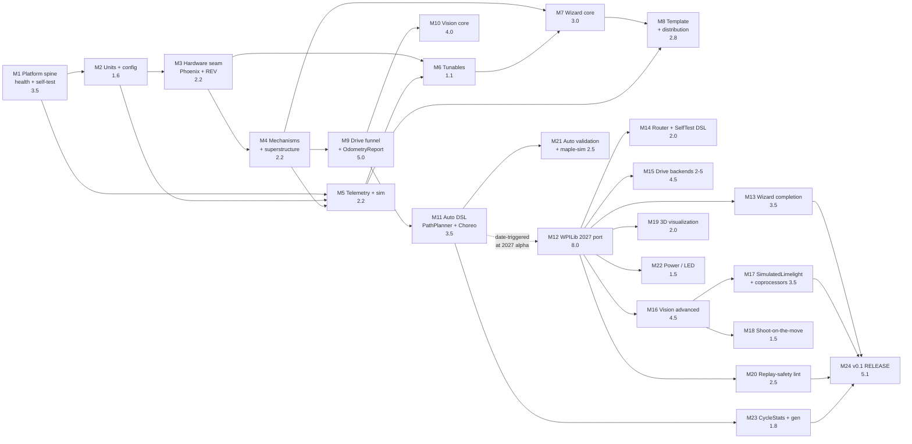

# PumpkinLib — Roadmap

**Status:** design stage, **revision 4** (post six-lens independent expert review). No code exists. This is a plan, not a report.
**Today:** 2026-08-08. The four binding maintainer decisions are dated 2026-08-07. **License:** BSD-3-Clause ([`LICENSE`](LICENSE)).

> **What revision 4 changed here, in one place.** No scope, staffing or decision changed. **§1.1** replaces the ±7% band with the ≥±25% band this plan's own R22(c) already conceded, states the rounding rule behind the "unrounded" subtotal, and names M3/M8/M24 as the three budgets most likely to be light. **§2** publishes the exact net-rate products (every published rounding favoured the maintainer; the +2-and-students headline moves 2027-11-10 → 2027-12-13 and stays pre-kickoff) and **§2.1** shows the 3.34 pw/wk → "6–8 engineers" conversion. **§3.1** makes the template's vendordep set a function of `--vendor` instead of pinning both motor adapters on every fork. **§4.2** is rewritten from unexecuted-to-do tense into a record of a completed edit, the R18 tiers are renumbered into execution order (contribute → fork → wait) to match every other document, and the AdvantageKit licence `[UNVERIFIED]` is **closed — BSD-3-Clause, verified 2026-08-08.** **§5** fixes M8's unsatisfiable gate (the differential variant is documented-absent until M15) and deletes M12's unsatisfiable completion rule, replacing it with the consequence. **§5.1** re-derives the solo column with M12's preemption actually applied and footnotes the `+1`/`+2` columns. **§7.2** and **§9** fix miscited ArchUnit rule numbers and a critical path that omitted M5 and M6.
**Full design:** [`DESIGN.md`](DESIGN.md) · **Why each choice:** [`DECISIONS.md`](DECISIONS.md)

> ## 0. The scope decision, and what it costs
>
> **Everything ships in v0.1. No domain is deferred.** Vision (Limelight + PhotonVision + custom coprocessors + object detection + `SimulatedLimelight`), the full drive funnel including differential, the AutoStep DSL on **both** PathPlanner and Choreo, `OdometryReport`, 3D visualization, **all six** wizard recipes, the collision-avoidance router, the replay-safety lint, shoot-on-the-move, maple-sim, and `CycleStats` are all v0.1 scope.
>
> **The cost is stated once, plainly, and never softened again in this document: v0.1 lands after the 2027 kickoff. At solo pace it lands after the 2028 kickoff and probably after the 2029 one. The central solo estimate is December 2029 — and with the annual WPILib carrying cost it is mid-2030.** The maintainer's own teams get no *released* PumpkinLib for the 2027 season, and most likely none for 2028 either.
>
> **The old v0.1 / v0.2 / v0.3 / v0.4 release split is deleted.** It survives only as internal build **order**. There is exactly one release: v0.1.
>
> Because scope is fixed, the only remaining levers are **capacity** (§2) and **depth within each domain** (§6). Domains cannot be cut. This document re-plans on those two levers, replaces dated gates with capability-defined milestones (§5), and states exactly how 8793 and 9143 get value from untagged internal milestones during the intervening seasons (§8).

---

## 1. The arithmetic, shown

| Line | pw |
|---|---|
| Raw sum across six domain documents (01 CORE 9–12, 02 Tuning 11–14, 03 Vision 12.2, 04 Telemetry/replay/viz/sim/test 14–19, 05 Drivetrain+Auto 12, 06 Platform 13.0) | **71 – 82** |
| Integration savings ([`DESIGN.md` §12.1](DESIGN.md#121-honest-effort-totals)): single alert facade −1.0, single tunable stack −1.5, single sim owner −0.5, single field owner −0.75, single telemetry facade −1.0, single vision-sim owner −0.5, no annotation processor on the required path −0.5, single-jar release process (D28) −0.5 | **−6.25** |
| Work the adversarial review added: `core.spi`, public `PumpkinLifecycle` + 4 adoption fixtures, `pumpkin doctor --bundle`, the runtime kill switch, `docs/graduation.md`, `docs/removing-pumpkinlib.md` + `RipOutTest`, `CycleStats`, `ControlMap` modes, `CharacterizationSafety`, `PredictStep`, the CSA gate | **+3.50** |
| **Subtotal (the "68–79 pw" figure quoted in `DESIGN.md` and `README.md`)** | **68.25 – 79.25** |
| **Decision 3** — AdvantageKit required. Deletes the `LogBackend` SPI, the NT4 / Epilogue / DogLog backend implementations, the `PumpkinInputs` / `LoggableInputs` split, the `mode = REPLAY` refusal path, the `PumpkinRobot` / `PumpkinLoggedRobot` split (D13/D29), and most of the D26 `ServiceLoader` lifecycle plumbing | **−1.25** |
| **Decision 2** — `PumpkinTemplate` as the primary front door. Template authoring, `.pumpkin/template.lock` manifest + hashing, `pumpkin update --library` / `--template`, `pumpkin doctor --template` drift classification, `docs/UPDATING.md`, and the per-release 3-OS template CI matrix and its fixtures | **+1.50** |
| **NET FULL SCOPE** | **68.5 – 79.5 pw** |
| **Midpoint used for all scheduling below** | **74.0 pw** |

### 1.1 Two things about that table that a reader is entitled to check

**(a) The raw sum is rounded to integers *before* the roll-up, and the word "unrounded" has been removed because it was wrong.** The six domain figures are 9–12, 11–14, 12.2, 14–19, 12 and 13.0. They sum to **71.2 – 82.2**, not 71 – 82. Carried through unrounded, the chain is `71.2 − 6.25 + 3.50 − 1.25 + 1.50 = ` **68.70 – 79.70, midpoint 74.20** — 0.2 pw above the published figure. **We publish the rounded chain (68.5 – 79.5, midpoint 74.0)** because 74.0 is the divisor behind every date in this document and in `DESIGN.md`, and re-deriving 24 milestones × 4 staffing columns to move them by 0.2 pw — **0.2 / 0.425 = 0.47 weeks ≈ 3 days at solo pace** — would buy a precision the estimate does not have. The 0.2 pw is stated here rather than hidden behind a word that claimed it was not there.

**(b) The band is at least ±25%, not ±7%.** Revision 3 said *"the ±7% band on the total (68.5 / 79.5) applies to each of them and to every date."* That contradicts this plan's own risk register: **R22(c)** (`DESIGN.md` §13) states that *"74.0 pw is a design-stage estimate with no implementation behind it, and a 25% error moves the solo date by roughly a year."* Both cannot be true, and R22 is the one with an argument behind it. **The honest band is ≥ ±25% on the pw, compounding with the rate band**, which at the solo central rate of 0.425 pw/wk means:

> 74.0 pw ± 25% = **55.5 – 92.5 pw**; ÷ 0.425 = **130.6 – 217.6 weeks** from 2026-08-07 = **2029-02 to 2030-10** for a central-rate solo build. That is the R22(c) sentence, arithmetically. The ±7% figure implied 68.8–79.4 pw and a date range of about ten months; the real range is closer to twenty.

**Three milestone budgets are the concrete reason the wider band is the right one**, and they are named rather than averaged away:

- **M3, 2.2 pw** buys *two complete production vendor backends* — `TalonFXMotorIO` with batched signals, pre-allocated latch-preserving requests, Motion Magic + Expo, reset re-arm and a sim handle; `SparkMotorIO` with the REVLib 2026 setpoint surface and `SparkMaxSim`/`SparkFlexSim`; both `GainSink`s; both `applyVerified`/`applyFast` paths — **plus** a vendor-parity gate in simulation. 88 hours for all of that is optimistic.
- **M8, 2.8 pw** buys the entire CLI (`init`, `update --library`, `update --template` with a three-way merge, `doctor --template` with a SHA-256 drift classifier, `doctor --bundle`), the Gradle plugin, a GitHub Pages Maven, three template variants with lock manifests, the graduation and removal docs, four adoption fixtures, docs-as-tests CI and the 9-job template matrix. **The three-way merge alone is a real piece of software.**
- **M24, 5.1 pw** includes extracting **366 fenced `java` blocks** (measured across the ten documents) into compiled, executed tests, on top of the CSA gate, the API freeze, 3-OS smoke tests, Central mirroring and the vendor-picker PR.

Each looks **1.5–3× light** against comparable single-maintainer FRC tooling efforts. They are **not** re-estimated upward here, because moving them would move every date in a document that has just finished arguing its dates are arithmetic — and an unimplemented re-estimate is no more grounded than the first one. What changes is the **stated band**: read every date in §5.1 as carrying ≥±25%, with M3, M8 and M24 the most likely places for it to be spent.

**Dates in this roadmap are arithmetic, not commitments.**

---

## 2. Capacity — the first lever

Rate is expressed in **person-weeks completed per calendar week (pw/wk)**. One pw = one focused 40-hour engineering week. The maintainer is an experienced FRC mentor running two FRC teams and an FTC team; 10–24 focused hours per week is **0.25–0.60 pw/wk** and that is the observed sustainable band, not a pessimistic one.

Additional people do **not** add their nominal rate. They add their rate minus a coordination tax that lands on the maintainer — design review, PR review, API arbitration, and the cost of writing down decisions that previously lived in one head. The tax is modelled at **15% for one extra committer, 25% for two, and 30% for two plus students**, and it is subtracted from the *combined* rate. Students additionally consume maintainer capacity for review and rework at roughly the rate they produce it, for the first several months.

| Configuration | Gross pw/wk | Net, **exact** (gross × (1 − tax)) | Net, **published** (rounded to 0.05) | Best case (68.5 pw @ high rate) | **Central (74.0 pw @ mid rate)** | Worst case (79.5 pw @ low rate) |
|---|---|---|---|---|---|---|
| **Solo** — maintainer only | 0.25 – 0.60 | 0.25 – 0.60 *(no tax)* | **0.25 – 0.60** | 114 wk → **2028-10-14** | 174 wk → **2029-12-08** | 318 wk → **2032-09-10** |
| **+1 committer** — a second mentor-grade contributor | 0.45 – 1.10 | 0.3825 – 0.935 | **0.40 – 0.95** | 72 wk → **2027-12-25** | 110 wk → **2028-09-12** | 199 wk → **2030-05-29** |
| **+2 committers** | 0.65 – 1.60 | 0.4875 – 1.20 | **0.50 – 1.20** | 57 wk → **2027-09-11** | 87 wk → **2028-04-07** | 159 wk → **2029-08-24** |
| **+ a student team of 3, mentor-reviewed** (no extra mentor) | 0.40 – 0.95 gross; maintainer loses 0.10 (low) / 0.20 (high) to review | 0.30 – 0.75 | **0.30 – 0.80** | 86 wk → **2028-03-28** | 135 wk → **2029-03-06** | 265 wk → **2031-09-05** |
| **+2 committers *and* a student team of 3** | 1.05 – 1.95 | 0.735 – 1.365 | **0.80 – 1.45** | 47 wk → **2027-07-04** | 66 wk → **2027-11-10** | 99 wk → **2028-07-03** |

**The published net rates are rounded to 0.05, and every rounding favours the maintainer.** `1.95 × 0.70 = 1.365` → published `1.45`. `0.45 × 0.85 = 0.3825` → published `0.40`. `0.95 − 0.20 = 0.75` → published `0.80`. That is a rule, not an accident, so it is written down: **net rates are rounded to the nearest 0.05, always in the direction that produces an earlier date; the published dates are therefore slightly optimistic.**

**What exact arithmetic does to the central column** (74.0 pw ÷ the exact mid-rate, measured from 2026-08-07):

| Configuration | Exact mid-rate | Weeks | **Exact central date** | Published | Shift |
|---|---|---|---|---|---|
| Solo | 0.425 | 174.1 | **2029-12-07** | 2029-12-08 | — *(no tax, so nothing to round)* |
| +1 committer | 0.659 | 112.3 | **2028-10-01** | 2028-09-12 | ~19 days later |
| +2 committers | 0.844 | 87.7 | **2028-04-12** | 2028-04-07 | ~5 days later |
| + student team of 3 | 0.525 | 141.0 | **2029-04-20** | 2029-03-06 | ~45 days later |
| **+2 and students** | **1.05** | **70.5** | **2027-12-13** | 2027-11-10 | ~33 days later |

**The headline conclusion survives exactly as written: 2027-12-13 is still before the 2028-01-08 kickoff, so "only the last row lands v0.1 before a kickoff" is still true.** The **published** rates are what §5.1's milestone dates are derived from, and they stay — re-deriving 96 dates to move them by 5 to 45 days would be false precision inside a ≥±25% band (§1.1b). But the products are printed here so the arithmetic reproduces, which is the whole basis on which this document asks to be believed.

**Read the student row carefully.** Its *worst* case (2031-09) is worse than solo's central case. Three students on a library like this — ArchUnit-enforced package rules, unit-correctness contracts, vendor SDK edge cases, safety-critical voltage code — are net-negative for the first three to six months, and the maintainer is the only reviewer. The row is honest, not encouraging. Students are a good bet for **docs-as-tests fixtures, adoption fixtures, the CI matrix, `CycleStats`, `ValueExporter`, `ElasticLayoutGenerator`, and the template variants** — bounded, verifiable, low-blast-radius work — and a bad bet for M3, M4, M7, M9, M10 or anything that commands a voltage.

### 2.1 The reverse table: what rate a given date demands

| Ship v0.1 by | Calendar weeks from today | Required net rate (74.0 pw) | Roughly |
|---|---|---|---|
| 2027-01-09 (2027 kickoff) | 22.1 | **3.34 pw/wk** | **6–8 full-time engineers**, and the conversion is shown below rather than asserted. Not available. Not discussable. |
| 2028-01-08 (2028 kickoff) | 74.1 | **1.00 pw/wk** | ~2 strong committers at full offseason intensity, or 2 committers + students. The only realistic staffing that hits a kickoff date. |
| 2029-01-06 (2029 kickoff) | 126.1 | **0.59 pw/wk** | Solo at the *very top* of the solo band, sustained for 2.4 years without a bad month. Unlikely. |
| 2030-01-05 (2030 kickoff) | 178.1 | **0.42 pw/wk** | Solo central. **This is the honest solo answer.** |
| 2031-01-04 (2031 kickoff) | 230.1 | **0.32 pw/wk** | Solo, low band, with the carrying cost of §7 included. |

**Why 3.34 pw/wk is "6–8 engineers" and not 3.34 of them.** One pw is defined at the top of §2 as *one focused 40-hour engineering week*, which is not what a full-time engineer delivers in a calendar week. Taking **0.6–0.7 focused pw per full-time engineer-week** (meetings, code review, onboarding, context switching, ops), 3.34 pw/wk needs **3.34 / 0.7 = 4.8** to **3.34 / 0.6 = 5.6 FTE** of raw output. Grossing that up for a **25–30% coordination tax** at that team size — the same tax §2's table charges at two and three people — gives **4.8 / 0.75 = 6.4** to **5.6 / 0.70 = 8.0 engineers.** Hence six to eight. The inflation runs *against* this document's interest, which is not a reason to leave it unshown, in a row labelled "not discussable."

**The one sentence that matters:** *at solo pace, full-scope v0.1 is a 2030 release.* Adding one mentor-grade committer moves it to 2028. Adding two moves it to spring 2028. Nothing available moves it to 2027.

---

## 3. Delivery shape — template first, library underneath (Decision 2)

Two artefacts ship, and the **template is the advertised front door.**

```
PumpkinTemplate  (GitHub template repo — what a team forks/clones)
   └── pins ──► dev.pumpkinlib:pumpkinlib:<version>  (+ adapters)  ◄── the substance
```

**Why both.** A template gets a team to a working robot project in one command, which is the onboarding experience the design promises and a vendordep URL does not deliver. A versioned library artifact is how an in-season fix reaches a team — a dependency bump, not a merge. A team on a forked template that had to *merge* an upstream fix during week 4 of build season would not do it; a team that runs one command and gets a new jar will.

### 3.1 Template contents

| Path | Contents |
|---|---|
| `build.gradle`, `settings.gradle`, `gradlew*`, `.wpilib/` | GradleRIO 2026.2.1, Java 17 toolchain, `dev.pumpkinlib.gradle` plugin applied, `pumpkinCheckDeploy` wired into `deploy` |
| `vendordeps/` | `WPILibNewCommands.json`, `AdvantageKit.json`, `PumpkinLib.json`, and **the adapter JSON(s) for the vendor(s) you selected** — **all pinned to one coherent version set.** The template *source* carries the full adapter set; **`pumpkin init --vendor <phoenix6\|revlib\|both>` deletes the sets you did not pick** (`design/06` §6.2), and `.pumpkin/template.lock`'s manifest is written *after* pruning, so a vendordep `init` removed can never be mis-classified `MISSING` by `pumpkin doctor --template`. Pinning both adapters unconditionally would install REVLib on a Phoenix-only team, which is the failure `DESIGN.md` §8 criticises in YAGSL — on our own advertised path. |
| `src/main/java/frc/robot/` | `Robot.java` (`extends PumpkinRobot`), `RobotContainer.java`, `Constants.java`, one worked `PositionConfig` elevator, one `SimpleConfig` intake, a `ControlMap` with a `MANUAL` mode, and a `Superstructure` with two interlocks |
| `src/main/deploy/pumpkin/` | `disabled.txt` (empty — the runtime kill switch, R15), `gains.json` (empty, schema-stamped `pumpkinlib.gains/1`), the generated Elastic layout |
| `.github/workflows/build.yml` | `./gradlew build`, `./gradlew simulateJava --headless` smoke, `pumpkinCheckDeploy` |
| `.pumpkin/template.lock` | Template version, library version, vendor version matrix, and a **SHA-256 manifest of every file the template owns**. This file is what makes drift detection possible. |
| `docs/UPDATING.md` | The two update procedures below, written out, in the fork, offline |

**Three template variants**, selected by `pumpkin init --template`: `swerve` (CTRE swerve + two mechanisms), `differential` (differential drive + two mechanisms), `mechanism-only` (no drivetrain — the incremental-adoption path from `DESIGN.md` §11b, made first-class).

> **The `differential` variant is phased M8 → M15, and the roadmap has to say so because two gates depend on it.** `DifferentialBackend` is M15. From M8 until M15 the variant exists as a **documented-absent** entry: `pumpkin init --template differential` **fails with a named message and the milestone it is waiting on**, rather than generating a project that builds and does not drive (`design/06` §6.3, `design/05`, `DESIGN.md` §8). It becomes a real, buildable variant at M15. **M8's gate tests the failure message; M15's gate tests the clean install.** See §5.

### 3.2 How a team takes a patch release from inside a fork

```
pumpkin update --library 2026.0.3
```

Rewrites the `version` field in **every** `vendordeps/PumpkinLib*.json` as one atomic set (mismatched adapter versions is the single most likely self-inflicted breakage), updates `.pumpkin/template.lock`, re-resolves, runs `pumpkinCheckDeploy`, and prints the changelog delta between the pinned and target versions. **It never touches a file under `src/`.** This is a 60-second operation and it is the only supported in-season upgrade path. It is also exactly what the support policy in R15 tells a stuck team to do first.

### 3.3 How template drift is managed

The fork diverges from the template the moment a team edits `RobotContainer.java` — which is on day one, by design. Drift is therefore normal and is **classified, not prevented**:

```
pumpkin doctor --template
```

compares the fork against the template at the pinned template version using the `.pumpkin/template.lock` manifest and classifies every template-owned file as `UNCHANGED`, `MODIFIED-BY-TEAM`, `MISSING`, or `ADDED`. Output is a table, not a diff dump.

```
pumpkin update --template 2026.0.3
```

three-way merges **only** files classified `UNCHANGED`. For every `MODIFIED-BY-TEAM` file it writes the upstream patch to `docs/template-drift/<file>.patch` and asks the team to apply it by hand, with a one-line explanation of what the change does. **Template updates are opt-in and never automatic**, and `pumpkin doctor --template` is a report, never a gate — a team must be able to ignore it forever and keep working. `pumpkin doctor --bundle` includes the drift table so a bug report says which template-owned files were modified without any back-and-forth.

### 3.4 The maintenance cost, stated

The template is not free and the cost recurs:

- **Every library release regenerates the template** and re-pins the version set. This cannot be skipped, because a template pinned to a version that no longer exists is worse than no template.
- **Every library release runs the template CI matrix before it is tagged**: 3 OS (Windows / macOS / Linux) × 3 variants (swerve / differential / mechanism-only). **Nine jobs, gating the release.** Before M15 the `differential` row asserts that `pumpkin init --template differential` fails with its documented-absent message; from M15 it is a build + headless-sim job like the other two. **The count is nine either way**, which is why the figure quoted in `DESIGN.md` §8, `DECISIONS.md` MD2 and the README does not move at M15. The matrix runs at the default `--vendor phoenix6`; the `revlib` and `both` selections are covered by `pumpkin init` unit tests and by M3's vendor-parity gate, not by the release matrix — a stated gap, not a hidden one.
- **Every vendor version bump** (Phoenix 6, REVLib, AdvantageKit, WPILib, GradleRIO) requires a template regeneration and a matrix run whether or not the library changed.
- Budgeted: **+1.5 pw one-time** (in the §1 arithmetic) plus **~0.1 pw per release** ongoing, forever. At the in-season cadence the support policy implies (a patch every two to three weeks between January and April), that is **~0.5 pw per season of pure template tax**, which is a real fraction of a solo season's capacity and is counted in the carrying cost in §7.

---

## 4. AdvantageKit is a required dependency (Decision 3)

`PumpkinLib.json` declares `requires: [ WPILibNewCommands.json, AdvantageKit.json ]`. AdvantageKit is not one backend among four; it is the logging and replay substrate.

### 4.1 What collapses

| Was | Becomes |
|---|---|
| `PumpkinRobot extends TimedRobot` (core) **+** `PumpkinLoggedRobot extends LoggedRobot` (separate artifact) — D13, revised by D29 | **One class: `PumpkinRobot extends LoggedRobot`.** The split is gone. `PumpkinLifecycle` stays public (D29 survives — manual wiring is still documented first) and `PumpkinRobot` remains a ~20-line delegating shim. |
| `LogBackend` SPI + `Nt4LogBackend` + `EpilogueLogBackend` + `DogLogLogBackend` + `AdvantageKitLogBackend` | **Deleted.** `PumpkinLog`'s tiered facade writes to `Logger` directly. The `pumpkinlib-advantagekit` and `pumpkinlib-doglog` artifacts do not exist. |
| `PumpkinInputs` / `PumpkinLogTable` mirroring AdvantageKit's types | **Deleted.** IO layers implement `LoggableInputs` directly. One less indirection between a `MotorInputs` field and the log. |
| `mode = REPLAY` refused with an actionable message when the backend cannot replay | **Deleted.** Replay always works. |
| D26 `ServiceLoader.load(LifecycleHook.class)` for every hook | **Drastically simplified.** D28 already put telemetry, tuning, sim and vision in **one jar**, so the compile cycle D26 existed to break is now broken by package structure alone. `PumpkinLifecycle.create()` builds an explicit priority-ordered hook list in code. `ServiceLoader` survives **only** for genuinely out-of-jar adapters (`phoenix6`, `revlib`, `photonvision`, `pathplanner`, `choreo`, `maplesim`), where it is load-bearing. `LifecycleHook`, `VisionSimHook`, `MechanismGeometrySink`, `MechanismGeometry` and `SimMotorHandle` all survive as interfaces; ArchUnit rule 9 is unchanged. |

**Deterministic replay is now a guaranteed property of the library, not a backend-dependent one.** This is the real win and it is large: `PumpkinReplayVerify` (M20), the replay-safety lint (M20), and the `Clock.now()`-only / cycle-counted-health discipline (R10) all stop being conditional. A sentence like "PumpkinLib code is replay-safe" becomes true unconditionally instead of true-if-you-chose-the-right-backend.

### 4.2 What it costs — stated, not buried

**1. The "zero vendor `requires`, installable on kickoff morning" property is LOST.**

**This is a record of a completed edit, not an open action item.** Before the 2026-08-07 sweep, `README.md` §Modules and `DESIGN.md` §2 row 11, §5 and §11 all stated the kickoff-morning install property as a real constraint, with a real supporting fact behind it: *AdvantageKit's 2026 swerve templates shipped weeks late waiting on vendors.* **That constraint has not gone away; we have chosen to sit on the wrong side of it.** Every claim that depended on the property **was removed or rewritten per the table below, applied 2026-08-07.** *(Revision 3 wrote this paragraph in the future tense — "must be removed or rewritten" — and cited a hard-coded `README.md` line 177 that today is the `LoggedRobot` adoption snippet. The claim it pointed at appears nowhere in the README any more. Present-tense to-do framing over already-completed work is how a reader loses the ability to tell what is left.)*

| Location | Old claim | Replacement — **applied 2026-08-07** |
|---|---|---|
| `README.md` §Modules | "Zero *vendor* `requires`. …install PumpkinLib on kickoff morning before any vendor has published" | "PumpkinLib requires AdvantageKit. You cannot install PumpkinLib until AdvantageKit has published for the season. We took this trade deliberately, to make deterministic replay a guarantee rather than an option." |
| `DESIGN.md` §2 defensible-core row 11 | "installs as one vendordep with zero *vendor* `requires`" | Row is **withdrawn from the defensible core.** It is no longer a differentiator; it is now a *disadvantage* relative to a WPILib-only library. |
| `DESIGN.md` §5 artifact table | `pumpkinlib` depends on "WPILib only" | `pumpkinlib` depends on **WPILib + AdvantageKit**. The `requires[]` install-failure-multiplier argument still applies to the *vendor* adapters and still holds there. |
| `DESIGN.md` §11 install path | "works on kickoff morning before any vendor has published" | "works as soon as AdvantageKit has published, which in 2026 was kickoff week — but is not guaranteed." |
| `design/02-tuning.md` §"No AdvantageKit dependency" | listed as an advantage over 6328's `LoggedTunableNumber` | **Withdrawn.** We now have the same dependency they do. The remaining advantages of `TunableDouble` (single poller, FMS default-deny, `/applied` echo, 4-tier persistence) stand on their own and do not need this one. |

**2. Risk R18 is ACCEPTED, not mitigated.** If AdvantageKit does not ship for WPILib 2027, PumpkinLib does not ship. The `LogBackend` escape hatch that used to make this a Medium risk no longer exists. The contingency, decided in advance:

> **Tier numbers mean execution order, and they now mean the same thing in every document.** **Tier 1 = contribute. Tier 2 = fork. Tier 3 = wait.** Revision 3 of this section numbered the fork "tier 1" and contribute "tier 2" while listing the fork first and then saying contribute happens first; `DECISIONS.md` MD3 used a third arrangement; `DESIGN.md` §13.1 used the scheme below and then contradicted itself in its own §5.6. In the January crisis this plan exists for, *"execute tier 1"* would have meant opposite things depending on which file was open. **The scheme below is canonical, matches execution order, and is applied identically in `DESIGN.md` §13.1 and §5.6 item 8, `DECISIONS.md` MD3 and `design/06` §4.8.** A grep for `tier 1` / `tier 2` across the ten documents joins the M24 consistency check.

- **Trigger, armed.** By the WPILib 2027 **beta** (~Dec 2027), if AdvantageKit has no public 2027 branch or has publicly stated it will not port, the contingency fires. Not at the alpha — that is too early to conclude anything — and not at kickoff, which is too late. **The trigger check includes re-reading AdvantageKit's `LICENSE` on the 2027 branch** (see tier 2).
- **Response, tier 1 — contribute.** Offer the port upstream *first*. A one-maintainer library forking another one-maintainer library over a platform migration is how ecosystems fragment, and the FRC Java ecosystem is small enough that this matters more than PumpkinLib's schedule does. This tier is numbered first because it is executed first.
- **Response, tier 2 — fork, narrowly, with a stated expiry.** Publish `dev.pumpkinlib:pumpkinlib-akit-compat`, a fork of the minimum AdvantageKit surface PumpkinLib actually uses (`LoggedRobot`, `Logger`, `LogTable`, `LoggableInputs`, the WPILOG reader/writer, the replay driver), ported to `org.wpilib.*`, published under our coordinates, with a **stated public intent to delete it the day upstream ships**, and with upstream credited prominently. Scope: **~2.5 pw**, budgeted as a contingency line and **not included in the 74.0 pw**.
  **The licence question is CLOSED and the answer is favourable.** *Verified 2026-08-08* against `LICENSE` at <https://github.com/Mechanical-Advantage/AdvantageKit> (raw: <https://raw.githubusercontent.com/Mechanical-Advantage/AdvantageKit/main/LICENSE>): **AdvantageKit is BSD-3-Clause**, `Copyright (c) 2021-2026 Littleton Robotics. All rights reserved.` Redistribution and use in source and binary forms, **with or without modification**, are permitted provided the copyright notice, the condition list and the disclaimer are retained. **So tier 2 exists and is legal, with attribution.** Two obligations follow, both cheap: the fork **reproduces the upstream copyright notice and disclaimer verbatim** in source and in the published jar; and the third clause is a **non-endorsement** clause naming Littleton Robotics and the marks *Mechanical Advantage* and *AdvantageKit*, so the fork may not use those names to endorse or promote itself — hence the artifact id `pumpkinlib-akit-compat`, with upstream credited in prose rather than in the coordinates. **Residual:** this verifies `main` in August 2026, not the 2027 branch in 2027; re-read it at the trigger. *(Revision 3 left this `[UNVERIFIED]` in five documents while building a three-tier contingency around the uncertainty. It was checkable in under a minute. That was a verification failure, and it is recorded as one.)*
- **Response, tier 3 — wait, and say so first.** If neither works: **PumpkinLib's 2027 line does not ship, and the README says so on its first screen before anyone adopts.** Not discovered in January by a team that already forked the template.

**3. Teams already on DogLog or plain Epilogue cannot adopt PumpkinLib without switching loggers.** This is a hard incompatibility, not a migration path, and it belongs in the adoption matrix as such:

| A team currently running | Can adopt PumpkinLib? |
|---|---|
| AdvantageKit | Yes. This is the intended case. |
| Nothing / `SmartDashboard` only | Yes — but they inherit AdvantageKit's IO-layer discipline and its opinions along with it. A rookie team that wanted a tuning wizard now also gets a logging framework. That is a real pedagogical cost and it is not optional. |
| **DogLog** | **No, not without switching.** DogLog is cheap to adopt and widely used precisely because it is cheap; asking a team to leave it for a tuning wizard is a large ask, and some will decline. |
| **Plain Epilogue** (WPILib first-party) | **No, not without switching.** This one will get worse over time, because Epilogue is the first-party path and is where WPILib is investing. |

The honest summary: **Decision 3 buys a guarantee and pays for it with reach.** The addressable population shrinks to AdvantageKit teams plus greenfield teams, and it shrinks further every year Epilogue improves.

### 4.3 `@AutoLog` / `@AutoLogOutput` — D24 stands

D24 (*PumpkinLib uses neither; all logging is explicit*) was made because **a vendordep cannot add an `annotationProcessor` line to a consumer's `build.gradle`**, and because `@AutoLog` generates `XxxInputsAutoLogged` **in the same package as the annotated type** — so a library-owned annotated inputs class generates into `org.pumpkinlib.*`, where a team cannot usefully extend or substitute it. Making AdvantageKit required changes neither fact. **The package-scope concern is not resolved, and D24 is kept for all library code.**

What Decision 2 *does* change: `PumpkinTemplate`'s `build.gradle` is ours to write, so the template ships the `annotationProcessor` line pre-wired **for team code**. A team that forks the template can annotate their own IO layers on day one. That is a template feature, not a library feature, and the distinction is the whole point of D24.

---

## 5. Build order — capability-defined milestones

There are no dated gates. A milestone is complete when its **gate condition is demonstrably true**, and it lands on whatever date the capacity in §2 puts it. Ordering rules, applied in this priority:

1. **What unblocks the most downstream work** (the dependency spine: M1 → M2 → M3 → M4).
2. **What 8793 and 9143 can use during the 2027 and 2028 seasons**, since no tagged release exists for either.
3. Everything else, cheapest-per-capability first.

**No public API is frozen before M24.** With no external users, breaking changes are free, and this is the single genuine benefit of shipping late. It should be exploited deliberately, not accidentally.

### M1 — Platform spine, lifecycle, competition day · **3.5 pw**

Gradle multi-project + `buildSrc` conventions; the single `pumpkinlib` artifact now depending on **WPILib + AdvantageKit**; **all twelve ArchUnit rules**; `compat.Clock` / `Platform`; **public `PumpkinLifecycle`** + `PumpkinRobot extends LoggedRobot` (one class); the surviving `core.spi` (`LifecycleHook`, `VisionSimHook`, `MechanismGeometrySink`, `MechanismGeometry`, `SimMotorHandle`) with the explicit in-jar hook list and `ServiceLoader` for adapters only; `PumpkinRegistry` with `instanceof` routing + boot summary; `Alerts` / `PumpkinAlert` / `AlertRegistry` / `Severity` / `MatchImpact` + `AlertBudgetTest`; `MatchContext` / `FmsPolicy` (the only `DriverStation` reader); `RobotIdentity` + overlays; `CanIdRegistry`; `SliceScheduler`; **all seven built-in health monitors** (eight slices) + `BuiltinMonitorCountTest`; **`SelfTest` sequencer** + NT publishing; `PumpkinTracer` budgets; `ControlMap` with modes and a mandatory `MANUAL`; `pumpkinlib-testkit`.
**Unblocks:** everything. Nothing else can start.
**Gate:** `SelfTest.runAll()` reports PASS/FAIL for every registered component in `simulateJava`; the twelve ArchUnit rules pass; a WPILOG written by a `simulateJava` run replays byte-identically through `Logger` in replay mode.
**8793 / 9143 mid-season:** **the largest single win in the whole plan, and it is first.** Both teams bolt alerts, the seven health monitors, `MatchContext`, `RobotIdentity`, `CanIdRegistry` and the one-button `SelfTest` onto their *existing* robot code — no drivetrain, vision or mechanism adoption required. A scripted pit check in the queue line converts unwinnable matches into two-minute fixes. This is `DESIGN.md` §11b's incremental-adoption path, used for real by its author, before anything else exists.

### M2 — Units, config, validation · **1.6 pw**

`Reduction`; `Axis` / `LinearAxis` / `RotaryAxis`; `MechanismUnits` + `SiDomain` + the four-layer unit contract; `Range`; `Gains` (7 doubles) + `GainId` + `GravityMode`; `ControlLocation` + `ControlLocationSource`; `Controllers`; `ControlConfig`, `MotionConstraints`, `CurrentLimits`, `PositionLimits`, `SimConfig`, `Setpoint`, `HardStop`, `Follower`, `Registry`; `PositionConfig` / `VelocityConfig` / `SimpleConfig` + builders + `with*()`; **three-tier `Validation` returning `List<ConfigError>`, never throwing**; `SAFE_MODE`; `describe()`; `MechanismConfigSnapshot` + `vendorConfigDump`.
**Unblocks:** M3, M4, M5, M6 — every later claim about correctness rests here.
**Gate:** 100% branch coverage with no HAL. A `PositionConfig` with a bad reduction produces the exact `ConfigError` text from `design/01` §5.6, **collected not thrown**, and the robot enters `SAFE_MODE` rather than failing `<clinit>`. The `RotorToSensorRatio × SensorToMechanismRatio` cross-check catches the 1.92× fused-arm error that revision 1 shipped in its headline example.
**8793 / 9143 mid-season:** `describe()` at boot and `vendorConfigDump` in the log, usable standalone. Both teams get a printed, reviewable statement of every gear ratio and limit on the robot — which is the artifact that would have caught the CAN-ID-64 bug and the swapped soft limits.

### M3 — The hardware seam, both vendors · **2.2 pw**

`MotorIO` (+ `simHandle()`), `MotorInputs`, `SignalSet`, `MotorCapabilities`, `MotorIOFactory`, `GyroIO`, `DigitalSensorIO`, `AbsoluteEncoderIO`, `FeedbackSpec`, `SensorSpec`; **`TalonFXMotorIO` complete** (derived config, batched signals via the priority-20 refresh hook, pre-allocated latch-preserving requests, FOC, Motion Magic + Expo with derived `Expo_kV`/`_kA`, `hasResetOccurred()` re-arm + 10 Hz heartbeat, `TalonFXSimHandle`); **`SparkMotorIO` complete** (REVLib 2026 `setSetpoint` with the verified arb-FF overload, `cruiseVelocity`, `FeedForwardConfig`, `SparkMaxSim` / `SparkFlexSim`); `PhoenixUtil.applyVerified` / `applyFast` and `RevUtil.applyVerified` as the only config paths; `Phoenix6GainSink` / `RevGainSink` as the only code that touches `Slot0` / `ClosedLoopConfig`.
**Unblocks:** M4, M6, M7, M9.
**Gate:** the vendor-parity gate. The same `PositionConfig` produces the same profile and lands within the same tolerance on Phoenix 6 and REVLib in `simulateJava`. The `SparkSim.iterate` units pinning test passes (R3).
**8793 / 9143 mid-season:** nothing directly usable — this is a seam, not a feature. It is here because M4 cannot exist without it.

### M4 — Mechanisms + superstructure · **2.2 pw**

`Mechanism` base (Subsystem + TelemetrySource + HealthSource + SelfTestable + TuningTarget, with the `try/catch(Throwable)` wrapper); `PositionMechanism` (all four control locations, `RIO_FULL` entirely in SI, gravity, dual soft+hard limits, manual capture-and-hold, precise `atGoal`, command factories, SysId callbacks); `VelocityMechanism`; `SimpleMechanism` with structural stop-on-end; **all four `HomingStrategy`s** with the full safety hardening; `ContinuousUnwrap`; `Superstructure` + `Interlock` + `AxisGoal` + default-output inversion + early release + **union requirement**; `GoalBus` + `ofCommands`.
**Unblocks:** M5, M7, M9, M13, M14 — the largest downstream fan-out after M1.
**Gate:** `ArmHoldsStationTest` passes at both +45° and −45° (a `GravityArmPositionOffset` sign error fails exactly one of the two). An elevator homes, profiles and holds in sim on both vendors.
**8793 / 9143 mid-season:** mechanism conversion. 9143-A and 9143-B are the sibling-robot case that motivated records + `with*()` in the first place and they become the live fixture. `0000-XXXX-Robot-Template/Superstructure.java`'s "don't leave rollers running" class of bug becomes structurally unrepresentable. Estimated ~1,600 lines deleted from 8793's repo.

### M5 — Telemetry, physics sim, test harness · **2.2 pw**

`PumpkinLog` tiered facade writing to `Logger` directly; `TelemetrySource` + the automatic mechanism schema; `Demotable` + `PumpkinBudget` byte governor + `SchemaGeneration`; `/Pumpkin/Driver` mirror + `Ready` rollup (3-alert cap); `PumpkinSim` (plant construction from `MechanismGeometry`, Phoenix + REV + SimDevice via `simHandle()`, battery sag, **peak stall current printed at boot**, `dumpDevices`); `PumpkinTest`.
**Unblocks:** M6, M7, M14, M19, M20, M22 — and it is the precondition for the wizard's sim-first promotion gate.
**Gate:** measured p95 loop time on a **real roboRIO 2** with the §10A robot inside the `DESIGN.md` §12.6 budget — measured, not asserted. Zero bytes allocated in `periodic()` after warmup. A simulated run replays deterministically from its WPILOG.
**8793 / 9143 mid-season:** students work on mechanism code with no robot present. During build season the robot is in pieces most evenings; this is the milestone that converts those evenings from wasted to productive, and its value is highest exactly when it is scarcest.

### M6 — Tunables + persistence + Elastic · **1.1 pw**

`TuningRegistry` with **one `NetworkTableListenerPoller`** and a single `readQueue()` per loop; `TunableDouble`, `TunableBoolean`, `TunableGains` with change-gated 10 Hz `applyFast` write-through and the `/applied` echo topic; the `/Tuning` schema; FMS default-deny with a constant-time disabled path; `TunedValueStore` 4-tier precedence + atomic writes; `ValueExporter` paste-ready Java; `ElasticLayoutGenerator`; `PlantPrior`-vs-`Reduction` cross-check at registration.
**Unblocks:** M7, M13.
**Gate:** a dashboard slider changes a gain on a running simulated mechanism **within 150 ms**, the `/applied` echo confirms it, the value survives a reboot at the correct precedence tier, and the tunable path is provably inert under FMS.
**8793 / 9143 mid-season:** live tuning during the 2027 build season, with values that persist and export to paste-ready Java. This is the difference between "we tuned it at the field and lost the numbers" and "we tuned it at the field and it is in the commit."

### M7 — Wizard core, ELEVATOR + FLYWHEEL · **3.0 pw**

`TuningSupervisor` + **all 12 abort conditions** + arm-time preconditions + the required fault-injection test; `SafetyEnvelope`; `TravelLimits`; `SysIdSweep` + `FeedforwardRegression` (streaming OLS); `BreakawayRampStep` (kS); `HoldBisectionStep` (kG, physics-bracketed, 10 iterations, holds at `kGbest`); `LqrSuggestStep` + the ωn/ζ panel; `PredictStep`; `Lessons` + `Coach` + `LessonsNumericClaimTest`; `TunerPublisher` NT schema; `TuningRecipe` + `Mode {TEACHING, EXPRESS}`; the sim-first promotion gate keyed on config hash; the `ELEVATOR` and `FLYWHEEL` recipes; the `gains.json` writer (schema `pumpkinlib.gains/1`).
**Unblocks:** M13. More importantly, this is the differentiator — the one capability with no ecosystem substitute.
**Gate:** `ELEVATOR` runs end to end in simulation (predict → kS ramp → kV/kA sweep → kG bisection → LQR suggestion → `gains.json`), every numeric claim in `Lessons` asserted by `LessonsNumericClaimTest`, and the wizard **refuses** to arm outside Test mode, below 11.5 V, above 80 °C, and without a matching sim config hash — each refusal proven by a test. The fault-injection test (stuck mechanism, 10× runaway, frozen encoder) trips the correct `AbortReason` within 3 loops and calls `stop()`.
**8793 / 9143 mid-season:** a Saturday of elevator and flywheel tuning becomes ten minutes, with the numbers written to a committed file. **At solo pace this lands 2027-04-24 — after the 2027 season ends. At +2 committers it lands 2026-12-15, before kickoff. That gap is the single strongest argument in this document for adding committers, and it should be read as such.**

### M8 — `PumpkinTemplate`, distribution, docs v1 · **2.8 pw**

Vendordep JSONs (`requires: WPILibNewCommands.json, AdvantageKit.json`); `pumpkinlib-gradle` (`pumpkinCheckDeploy` graded gate); GitHub Pages static Maven; **`PumpkinTemplate` with all three variant *entries*** (§3.1) — `swerve` and `mechanism-only` fully materialised, `differential` **documented-absent until M15** with a named failure message from `pumpkin init`; `.pumpkin/template.lock` + the hash manifest; **`pumpkin init`**, **`pumpkin update --library`**, **`pumpkin update --template`**, **`pumpkin doctor --template`**, **`pumpkin doctor --bundle`**; the runtime kill switch (`disabled.txt`); `docs/graduation.md`; `docs/removing-pumpkinlib.md` + `RipOutTest`; the four `IncrementalAdoptionTest` fixtures; the adoption matrix including the DogLog/Epilogue exclusion rows (§4.2); docs-as-tests CI (bodies **and** import blocks); the template CI matrix.
**Unblocks:** every subsequent milestone can now be delivered to a real robot project by one command instead of a manual wiring session. **This is the first internally distributable snapshot.**
**Gate:** a fresh clone of the **`swerve` and `mechanism-only`** variants builds and runs headless sim on Windows, macOS and Linux; **the `differential` variant is the documented-absent entry per `design/06` §6.3, and the gate is that `pumpkin init --template differential` fails with its named message and its milestone rather than generating a project that does not drive.** *(Revision 3's gate said "each of the three template variants builds and runs headless sim", which was **unsatisfiable**: `DifferentialBackend` is M15 — cum. 49.1 pw, solo Oct 2028 — while M8 is cum. 18.6 pw, solo Jun 2027. As written, M8 was blocked for roughly sixteen months, or the explicit rule in `design/06` §6.3, `design/05` and `DESIGN.md` §8 was violated. It becomes a build + sim job at M15; see M15's gate.)* `pumpkin update --library` moves a fork across two versions and `pumpkin doctor --template` correctly classifies a hand-modified `RobotContainer.java` as `MODIFIED-BY-TEAM`. `pumpkin init --vendor revlib` prunes `PumpkinLib-Phoenix6.json` and the resulting lock manifest does not list it. All four adoption fixtures compile. `RipOutTest` compiles.
**8793 / 9143 mid-season:** 9143-B forks the template as the real-world test of §3.3, while 9143-A stays on the pre-template wiring — which is exactly the A/B pair the drift tooling needs. From M8 onward both teams consume PumpkinLib as a **snapshot Maven artifact**, not a source dependency, which means the in-season upgrade path is being exercised for real, two seasons before any stranger relies on it.

---

> **M1–M8 = 18.6 pw.** This is the *internal* line: not a release, but the point at which PumpkinLib is a coherent, installable, self-supporting product for the two teams that own it. Solo: **2027-06-09**. +1: **2027-02-16**. +2: **2027-01-07**. Student team: **2027-04-01**.

---

### M9 — Drive funnel, CTRE backend, field and alliance · **5.0 pw**

`PumpkinDrive` (sanitize → discretize → backend → log); `CtreSwerveBackend` with wheel-force feedforwards and the FPGA↔Phoenix timestamp conversion; `PumpkinDriveConfig.v01Competition()`; `DriveGeometry` / `DriveLimits` / `ModuleOrder` / `DiscretizationPolicy`; `PumpkinField` / `AlliancePerspective` / `AllianceValue` / `FieldMap`; `verifyAlliance()`; `DriveSelfCheck` (cross-checks `settings.json` against `TunerConstants`); `DriveInputStream`; `PumpkinCharacterization` + `CharacterizationSafety`; **`OdometryReport.outAndBack` / `.squareTest`, shipped in the same milestone as the drive layer, never later** (R8).
**Unblocks:** M10, M11, M15, M18, M21.
**Gate:** `OdometryReport.squareTest` runs on 8793's real robot and produces a closure error; `DriveSelfCheck` catches a deliberately mismatched `TunerConstants` entry; `verifyAlliance()` catches a red-alliance sign error in sim.
**8793 / 9143 mid-season:** alliance handling and `OdometryReport` are usable *without adopting the drive funnel* — `OdometryReport` in particular is a measurement instrument that works against any drivetrain, and it is the empirical check that makes every later vision claim falsifiable.

### M10 — Vision core: Limelight · **4.0 pw**

`VisionFrame`, `VisionFrameHeader`, `TargetObservation` (both structs pre-warmed at boot); `VisionCameraIO` + `ReplayCameraIO`; `LimelightCameraIO` (MT1/MT2, verified botpose index map, latency math, mandatory orientation-write ordering, IMU mode 4); the **gyro→field offset contract** with its two named writers; the filter chain + all 19 `RejectReason`s + `standard()`; `StdDevModels` with the forced-infinite sigmaTheta rule; `PumpkinVision` builder + odometry-buffer guard + blue-origin assertion; `FieldLayouts.resolve` / `fingerprint`; `VisionDiagnostics`; **`alignToTag`**.
**Unblocks:** M16, M17, M18.
**Gate:** every one of the 19 reject reasons is reachable from a constructed frame in a test. `VisionDiagnostics` flags a 3D-mode calibration/streaming resolution mismatch. `alignToTag` holds 2 cm on a real tag with 8793's hardware.
**8793 / 9143 mid-season:** both teams run Limelights. This is the milestone that changes what they can do on a field — `alignToTag` plus the filter chain plus `VisionDiagnostics` is a scoring-accuracy change, not a code-quality change.

### M11 — Auto DSL: PathPlanner **and** Choreo · **3.5 pw**

`PumpkinAuto.withPathPlanner()` and `.withChoreo()`; `PumpkinTrajectory` + PumpkinLib's own trigger engine over the `TrajectoryHandle` SPI (R12: we own the correctness of `atTime` / `atPose` / `atEvent`, and it needs its own unit tests); `PumpkinAutoRoutine` / `AutoStep` (`.goal()` / `.before()` / `.successWhen()` / `.orElse()` / `.deadline()` / `.budget()` / `.skipToAfter()` in seconds-remaining); `PumpkinAutoSelector` + `AutoQuestion`; `NamedCommandRegistry`; `PumpkinDriveToPose` with the corrected `driverNudge` signature.
**Unblocks:** M21, M23.
**Gate:** the same `AutoStep` routine runs unmodified on a PathPlanner path and a Choreo trajectory. The trigger engine's `atTime` / `atPose` / `atEvent` have unit tests independent of both vendors. The **`[UNVERIFIED]`** ChoreoLib `Trajectory.getEvents(String)` / `getTotalTime()` accessors are confirmed against the real library or the source-mapping table is corrected.
**8793 / 9143 mid-season:** `.budget()` and `.skipToAfter()` are the two features that turn a fragile 15-second auto into one that degrades gracefully. Both teams have lost matches to an auto that hung on a missed pickup.

---

> **M1–M11 = 31.1 pw.** The **competition-complete internal build**: mechanisms, tuning, drive, vision, autos, health, self-test, telemetry, sim. Everything a match needs. Solo: **2028-01-01**. +1: **2027-06-26**. +2: **2027-04-20**. Student team: **2027-09-07**.
>
> At solo pace this is the state 8793 and 9143 enter the **2028** season in. At +2 it is the state they enter **2027** in.

---

### M12 — The WPILib 2027 port · **8.0 pw** · **the only date-triggered milestone**

Reviewed `wpi-rename-2027.properties`; the generated-source variant + dual-compile CI (configuration-time load, longest-key-first `TreeMap`, **import and package lines only**, `withReader`, `doLast` verification, JDK 17 **and** JDK 25 toolchains); Commands v3 adapter (an internal swap, because commands are returned from factories and never subclassed); `TalonFXSMotorIO` (unblocked once `ExternalFeedbackConfigs` field names are real); SystemCore backends (`RobotController.getSerialNumber()` and `getComments()` are **not confirmed to exist** — identity already resolves from a persistent file first for exactly this reason); template regeneration onto the 2027 line; **deletion of the 2026 line and the generator at the end of the milestone**.

**Scheduling rule — this is not an ordinary milestone, and revision 3's version of this rule was arithmetically unsatisfiable:**
- **It cannot start before the first WPILib 2027 alpha (~October 2027).** There is nothing to port against.
- **It must not start after the 2027 beta (~December 2027).** The alpha/beta window is when the whole community is porting and when questions get answered on Delphi within hours instead of never.
- **If the build has reached M11 before October 2027, continue into M13+ and insert M12 at the alpha.** If it has not, **M12 preempts whatever is in flight.**

> **What was deleted, and why.** Revision 3 also said M12 *"must complete inside the beta window."* It cannot, below ~1.0 pw/wk. **8.0 pw ÷ 0.425 pw/wk (solo central) = 18.8 calendar weeks.** The beta window — roughly December 2027 to the 2028-01-08 kickoff — is **5 to 8 weeks**. Completing inside it therefore requires **8.0 / 8 = 1.00** to **8.0 / 5 = 1.60 pw/wk**, which is the +2-committer band near its top, or +2-and-students. **Solo (0.425) cannot meet it. +1 (0.659) cannot meet it. Even +2 at its central 0.844 takes 9.4 weeks and just misses.** A rule that the central scenario cannot satisfy is not a rule, so the completion clause is gone and the **consequence** is stated in its place:
>
> **At solo pace, starting M12 at the October 2027 alpha, the port completes around mid-February 2028** — after the 2028 season has begun, with the community's porting window closed and the questions that were free in November now expensive. `DESIGN.md` §12.4 rule 2 carried the same unsatisfiable clause and is corrected identically.
>
> **And the preemption rule now actually shapes the solo column.** At solo pace M9 completes 2027-08-31 and M10 is still in flight when the alpha arrives, so M12 preempts **mid-M10**, not "after M11" as §5.1 previously showed. §5.1's solo column is re-derived below with the preemption applied. **M13 onward and the M24 date do not move**, because the total work is identical and only its ordering changes.

**Unblocks:** literally everything after it, because everything after it is written once, on the 2027 line, instead of twice.
**Gate:** every module compiles and every test passes on JDK 25 against the 2027 beta; the rename map has been human-reviewed row by row against the real beta (only `math` → `org.wpilib.math` and `hal` → `org.wpilib.hardware.hal` are confirmed today); **every template variant that is real at the time M12 runs builds on the 2027 line** — `swerve` and `mechanism-only` always, and `differential` **only if M15 has already landed** (which happens at +1 and +2, where M15 precedes the alpha, but not at solo pace, where M15 is Oct 2028); the generator and the 2026 source line are **deleted**, not retained.
**8793 / 9143 mid-season:** both teams port with the library, in the offseason, using the same generator — the migration is rehearsed on two real robot repos before any stranger runs it.

### M13 — Wizard completion · **3.5 pw**

`ARM`, `TURRET`, `STEER`, `DRIVE_VELOCITY` recipes; `StepResponseAnalyzer` + `ResponseVerdict` / `ResponseClass` refinement; `MechanicalHealthCheck` (backlash and slop detection); the ARM three-angle check; `TuningHealth` as a `HealthSource`; full `Coach` prose for all six recipes.
**Unblocks:** nothing structurally; completes the differentiator.
**Gate:** all six recipes run end to end in sim; the ARM three-angle check catches a deliberately wrong `GravityArmPositionOffset`; `MechanicalHealthCheck` flags a simulated 3° backlash before reporting any gain.
**8793 / 9143 mid-season:** arm and turret tuning, and the belt-tension check that tells a student to fix the mechanism before touching kP. **No FRC library we surveyed does the latter** — stated as a survey result, not as an absolute.

### M14 — Superstructure router + self-test DSL · **2.0 pw**

`SafetyModel` 2-axis router (bounding-box test, `forbidUnless`, `corridor`, `escapeCommand()`); `SuperstructureReport` + `characterizeTransitions()`; the `SelfTestRoutine` DSL builder + Elastic layout + pit-workflow docs.
**Gate:** validated against **9143-A's actual CorAl geometry** (R11) — a refusal message names the blocking zone and `escapeCommand()` resolves it. `SuperstructureReport` states plainly that this is less capable than 254's A*.
**8793 / 9143 mid-season:** 9143's CorAl geometry is the motivating case; this milestone exists because of it.

### M15 — Drive backends 2–5, traction, navigation · **4.5 pw**

`AdvantageKitSwerveBackend`, `HandRolledSwerveBackend`, `YagslBackend`, **`DifferentialBackend`**; `TractionLayer` (PathPlanner's `SwerveSetpointGenerator` inside the funnel, so **teleop** gets slip limiting); `SkidDetector` + `SkidReport`; `PumpkinNav` pathfinding façade + `LocalADStarAK` + warmup.
**Gate:** the same `PumpkinDriveConfig` drives all five backends in sim to the same tolerance; `DifferentialBackend` drives a real differential robot; `SkidDetector` fires on a simulated 0.4 g lateral step. **And the half of the M8 gate that was deferred here:** `pumpkin init --template differential` now **succeeds**, and a fresh clone of the differential variant builds and runs headless sim on Windows, macOS and Linux — the documented-absent message from M8 is deleted in the same commit that makes the variant real, and the release matrix's third row converts from a failure assertion to a build + sim job.
**8793 / 9143 mid-season:** `DifferentialBackend` is what makes the template's `differential` variant real, and it is the variant a rookie team is most likely to need.

### M16 — Vision, advanced sources · **4.5 pw**

`PhotonCameraIO` + `PhotonStrategy`; `CameraArbiter` (multi-camera weighted arbitration and cross-camera disagreement detection); `DetectedObject` / `ObjectProjection` / `ObjectTracker` (multi-frame association, velocity estimation).
**Gate:** a 4-camera configuration in sim produces a single fused estimate and flags an injected 30 cm disagreement on one camera; `ObjectTracker` maintains stable IDs across a 10-frame occlusion.

### M17 — `SimulatedLimelight` + custom coprocessors · **3.5 pw**

`SimulatedLimelight` (Limelight wire-format simulation via `PhotonCameraSim`, living in `pumpkinlib-photonvision`); the `pumpkinV1` wire schema + the `pumpkin_vision` Python package for team-built coprocessors.
**Gate (R7, non-negotiable):** a round-trip test through the **production decode path**, plus validation against a **real LL4 on a practice field**, plus a prominent "do not tune ambiguity thresholds in sim" warning. The claim is worded *"we are not aware of another Limelight wire-format simulator"*, never *"the first in FRC."*

### M18 — Shoot-on-the-move · **1.5 pw**

`MovingTargetSolver`.
**Gate:** convergence within 3 iterations across the full velocity envelope in sim; a documented failure mode when the solution does not exist, rather than a silently wrong angle.

### M19 — 3D visualization · **2.0 pw**

`ArticulationSpec` + `JointAxis` + `MechanismVisualizer` + `FieldGhosts`; `AssetExporter` + the `pumpkinAssets` Gradle task + the drift-detection build check; generated `LoggedMechanism2d`.
**Gate:** a mechanism's articulation renders in AdvantageScope from the log alone, and the drift check fails a build when a CAD asset and its `ArticulationSpec` disagree.

### M20 — Replay safety, enforced · **2.5 pw**

`pumpkinlib-lint` javac annotation processor (the build-time check on **team** code); `PumpkinReplayVerify`; the runtime tripwire.
**Note:** a vendordep cannot add an `annotationProcessor` line — but **`PumpkinTemplate` can**, which is why this is now deliverable at all (§4.3). A team not using the template gets the runtime tripwire only, and the docs must say so.
**Gate:** the processor runs clean on 8793's and 9143's real repos with a **measured, published false-positive rate**. A processor with an unknown false-positive rate is not shippable.

### M21 — Headless auto validation + maple-sim · **2.5 pw**

`PumpkinAutoTest` + `AutoTestResult` + `pumpkinAutoReport` (faster than real time, headless); the maple-sim `ServiceLoader` adapter.
**Gate:** a full auto routine validates in under 5 seconds of wall time in CI; a degraded kinematic world (no maple-sim) is a **first-class, documented option**, not a failure path (R13).

### M22 — Power, pneumatics, LED, haptics · **1.5 pw**

`PowerMonitor` + `PowerBudget` + `EnergyTracker`; `Pneumatic` + `CompressorPolicy`; `LedController` + both backends; `Rumble` + `RumbleScheduler`.

### M23 — Match analytics + code generation · **1.8 pw**

`CycleStats.fromLog(Path)` — desktop-side, in `pumpkinlib-cli`, **zero robot cost**: `cycleCount()`, `medianCycleSeconds()`, `p90CycleSeconds()`, `medianAlignSeconds()`, `alignTimeoutRate()`, `autoStepSuccessRate()`, `slowestTransition()`, `writeMarkdown(Path)`, plus `pumpkin stats logs/ --event <code>`; `pumpkin gen mechanism` (emits PumpkinLib config records, never raw WPILib source).
**Note:** `CycleStats` reads topics the library already publishes and needs no new robot-side schema. It is the only feedback loop in the entire design that converts a small team's scarce practice time into a measured number, and it is cheap. It is this late only because everything above it must exist for the topics to exist.

### M24 — v0.1 release hardening · **5.1 pw**

Full docs-as-tests coverage (every fenced snippet **and its import block** extracted from a compiled, executed test); every adoption-matrix row compiled in CI; the zero-allocation gate, vendor-parity gate, filename-literal consistency check; 3-OS install smoke test from the published vendordep URL; the 9-job template CI matrix wired as a release gate; Maven Central mirroring (the concrete technical form of the succession plan, D31); the WPILib vendor-picker PR; the support policy in the README above the install instructions; **the API freeze**; **the CSA test**; the tag.
**Gate (all must hold):**
- A mentor who has never used PumpkinLib diagnoses three seeded faults — wrong reduction, swapped soft limits, disconnected CANcoder — from the driver station and the log alone, in under 10 minutes.
- **A second person has push access and has cut one release.**
- Every FATAL-tier validation check has been reviewed by that second person.
- Validated on 8793's real robot: one full tuning session, one auto, one vision alignment, `gains.json` committed.
- All three template variants clean-install on three OSes from the published URL — **all three are real by M24, because `DifferentialBackend` lands at M15.** (This is the milestone at which the M8 → M15 phasing has fully closed and the "three variants" claim is unqualified.)

---

### 5.1 Milestone dates at each capacity level

Cumulative pw, then the calendar date at the **central** rate for each configuration from §2. Multiply the elapsed weeks by 0.71 for that configuration's best case and by 1.55 for its worst.

| M | pw | Cum | Solo (0.425) | +1 (0.675) | +2 (0.85) | +3 students (0.55) |
|---|---|---|---|---|---|---|
| M1 Platform spine | 3.5 | 3.5 | 2026-10-04 | 2026-09-12 | 2026-09-05 | 2026-09-21 |
| M2 Units + config | 1.6 | 5.1 | 2026-10-30 | 2026-09-29 | 2026-09-18 | 2026-10-11 |
| M3 Hardware seam | 2.2 | 7.3 | 2026-12-05 | 2026-10-22 | 2026-10-06 | 2026-11-08 |
| M4 Mechanisms | 2.2 | 9.5 | 2027-01-10 | 2026-11-14 | 2026-10-24 | 2026-12-06 |
| M5 Telemetry + sim | 2.2 | 11.7 | 2027-02-16 | 2026-12-06 | 2026-11-11 | 2027-01-03 |
| M6 Tunables | 1.1 | 12.8 | 2027-03-06 | 2026-12-18 | 2026-11-20 | 2027-01-17 |
| **M7 Wizard core** | 3.0 | 15.8 | **2027-04-24** | **2027-01-18** | **2026-12-15** | **2027-02-24** |
| **M8 Template + dist** | 2.8 | 18.6 | **2027-06-09** | **2027-02-16** | **2027-01-07** | **2027-04-01** |
| M9 Drive funnel | 5.0 | 23.6 | 2027-08-31 | 2027-04-09 | 2027-02-17 | 2027-06-03 |
| M10 Vision core | 4.0 | 27.6 | **2028-03-16** ‡ | 2027-05-20 | 2027-03-22 | 2027-07-24 |
| **M11 Auto DSL** | 3.5 | 31.1 | **2028-05-12** ‡ | **2027-06-26** | **2027-04-20** | **2027-09-07** |
| **M12 WPILib 2027 port** | 8.0 | 39.1 | **2028-02-10** ‡ | *(deferred to Oct 2027)* † | *(deferred to Oct 2027)* † | 2027-12-18 |
| M13 Wizard completion | 3.5 | 42.6 | 2028-07-09 | 2027-10-23 | 2027-07-24 | 2028-01-31 |
| M14 Router + SelfTest DSL | 2.0 | 44.6 | 2028-08-11 | 2027-11-13 | 2027-08-09 | 2028-02-26 |
| M15 Drive backends 2–5 | 4.5 | 49.1 | 2028-10-24 | 2027-12-29 | 2027-09-15 | 2028-04-23 |
| M16 Vision advanced | 4.5 | 53.6 | 2029-01-06 | 2028-02-14 | 2027-10-22 | 2028-06-19 |
| M17 SimulatedLimelight | 3.5 | 57.1 | 2029-03-04 | 2028-03-21 | 2027-11-20 | 2028-08-03 |
| M18 Shoot-on-the-move | 1.5 | 58.6 | 2029-03-29 | 2028-04-06 | 2027-12-03 | 2028-08-22 |
| M19 3D visualization | 2.0 | 60.6 | 2029-05-01 | 2028-04-26 | 2027-12-19 | 2028-09-16 |
| M20 Replay-safety lint | 2.5 | 63.1 | 2029-06-11 | 2028-05-22 | 2028-01-09 | 2028-10-18 |
| M21 Auto validation | 2.5 | 65.6 | 2029-07-22 | 2028-06-17 | 2028-01-29 | 2028-11-19 |
| M22 Power / LED / haptics | 1.5 | 67.1 | 2029-08-16 | 2028-07-03 | 2028-02-11 | 2028-12-08 |
| M23 CycleStats + gen | 1.8 | 68.9 | 2029-09-15 | 2028-07-22 | 2028-02-25 | 2028-12-31 |
| **M24 v0.1 RELEASE** | 5.1 | **74.0** | **2029-12-08** | **2028-09-12** | **2028-04-07** | **2029-03-06** |

**‡ The solo column, re-derived with M12's preemption actually applied.** Revision 3 printed the solo column as M10 → M11 → M12 strictly sequentially (2027-11-05 → 2028-01-01 → 2028-05-12) while §5's own rule says M12 preempts whatever is in flight at the alpha. Those two statements cannot both be true. Taking the arm date as **2027-10-01** and the solo central rate as **0.425 pw/wk**:

| Step | Arithmetic | Date |
|---|---|---|
| M9 complete (cum. 23.6 pw) | — | 2027-08-31 |
| M10 in progress when the alpha arms | 2027-08-31 → 2027-10-01 = 31 d = 4.43 wk × 0.425 = **1.88 pw of M10 done**, 2.12 pw left | 2027-10-01 |
| **M12 runs, preempting M10** | 8.0 ÷ 0.425 = 18.8 wk = 132 d | **2028-02-10** |
| **M10 resumes and completes** | 2.12 ÷ 0.425 = 5.0 wk = 35 d | **2028-03-16** |
| **M11** | 3.5 ÷ 0.425 = 8.2 wk = 58 d | **2028-05-12** |

Cumulative pw at that point is 23.6 + 1.88 + 8.0 + 2.12 + 3.5 = **39.1**, identical to the un-preempted ordering — which is why **M13 through M24 are unchanged and 2029-12-08 still stands.** Only the order moves. **The honest consequence is the one §5's M12 entry now states: at solo pace the port lands in February 2028, months after the 2027-line season starts, with the community porting window closed.**

**† The `+1` and `+2` columns cannot run M12 where the cumulative-pw arithmetic puts it either.** At +1 (0.675 pw/wk) cum. 39.1 pw falls on 2027-09-16 and at +2 (0.85) on 2027-06-01-ish — both **before the first 2027 alpha exists**, so there is nothing to port against. Both configurations therefore continue into M13, M14, M15… and insert M12 when the alpha lands, exactly as §5's rule says. **Consequence for the printed dates: the M13–M23 rows in the `+1` and `+2` columns are computed with M12's 8.0 pw already spent, so until M12 actually inserts, those milestones land earlier than shown — by 8.0 ÷ 0.675 = 11.9 weeks at +1 and 8.0 ÷ 0.85 = 9.4 weeks at +2.** Once the port is done the cumulative total is back on track and the printed dates are correct again. (Worked example at +2: with M12 deferred, M13 completes 2027-05-19 rather than the printed 2027-07-24 — 66 days earlier, which is exactly 9.4 weeks.) **The M24 date is unaffected in every column** — the work is the same, only its position moves.

**None of these dates are commitments.** They are 74.0 pw divided by a rate. The rate is the estimate; the pw is the estimate; both are wrong by some amount — **at least ±25% on the pw alone (§1.1b)** — and the error compounds.

---

## 6. Depth-vs-breadth levers

Domains can no longer be cut. What remains is **depth inside each domain**. These are the pre-committed reductions, each with its saving and its cost, in **fire order** — cheapest capability loss first. They are fired, not debated, and each one that fires updates the README's capability table in the same commit.

| # | Lever | Saves | Capability lost |
|---|---|---|---|
| **L1** | Drop `PumpkinNav`; document PathPlanner's own AD* pathfinding directly | −0.9 | A thin façade. Teams call PathPlanner's API instead of ours. **Almost nothing is lost — fire this first.** |
| **L2** | Drop `pumpkin gen mechanism` | −1.0 | Code generation. `pumpkin init` plus the docs cover the same ground more slowly. |
| **L3** | One template variant (`swerve`) instead of three | −0.5 | Differential and mechanism-only teams hand-assemble from docs. Hurts exactly the rookie teams the template exists for. |
| **L4** | Power/pneumatics/LED/haptics → `PowerMonitor` + `Rumble` only | −0.9 | `PowerBudget`, `EnergyTracker`, `CompressorPolicy`, `LedController`. All four have easy WPILib alternatives. |
| **L5** | Drop the maple-sim adapter; `PumpkinAutoTest` ships kinematic-only | −0.9 | Game-piece physics in auto validation. R13 already calls the kinematic world first-class. |
| **L6** | `CameraArbiter` → first-valid-wins instead of weighted arbitration | −0.6 | 4-camera teams lose cross-camera disagreement detection — a real diagnostic, but only for teams with 4 cameras. |
| **L7** | `SafetyModel` keeps bounding-box + `forbidUnless` + `escapeCommand()`; drop `corridor` and `characterizeTransitions()` | −0.6 | "Carry it tucked" must be expressed as an interlock instead. No transition characterization report. |
| **L8** | Object detection ships `DetectedObject` + `ObjectProjection`; drop `ObjectTracker` | −0.8 | No persistent object IDs, no game-piece velocity. Intake-on-the-move degrades to point-and-drive. |
| **L9** | `HomingStrategy`: ship `currentSpike` + `manualSeed`, drop `limitSwitch` + `absoluteSeed` | −0.4 | Two of four homing paths. Limit-switch homing is common; this hurts more than its price suggests. |
| **L10** | 3D viz ships `ArticulationSpec` + `MechanismVisualizer`; drop `AssetExporter`, `FieldGhosts`, the `pumpkinAssets` task | −1.1 | Teams hand-place CAD in AdvantageScope; no asset drift detection. |
| **L11** | Drive backends: ship CTRE + AdvantageKit-template + differential; drop hand-rolled + YAGSL | −1.2 | YAGSL teams have no adoption path. Hand-rolled teams write their own backend against a documented SPI, which still exists. |
| **L12** | Drop the custom-coprocessor path (`pumpkinV1` wire schema + `pumpkin_vision`) | −1.8 | Teams running homemade OpenCV/Pi pipelines get no first-class integration. |
| **L13** | `TractionLayer` / `SkidDetector` ship as detect-and-report only, no teleop slip limiting | −1.0 | The "teleop gets slip limiting" claim dies. Teams get a log topic instead of a behavior. **This claim must then be deleted everywhere it appears.** |
| **L14** | AutoStep DSL is PathPlanner-first; Choreo degrades to load-and-run without the trigger engine | −1.2 | `.atEvent()` on Choreo trajectories. Dodges the unverified ChoreoLib accessor risk (R12) rather than solving it. |
| **L15** | Wizard ships four recipes (ELEVATOR, FLYWHEEL, ARM, DRIVE_VELOCITY); drop TURRET + STEER | −1.1 | Two archetypes. The recipe *framework* survives and a team can author one. |
| **L16** | Drop `MechanicalHealthCheck` | −0.7 | The backlash/slop check. **No FRC library we surveyed does this**, and the community thread that motivated it is unanimous that it matters more than any gain. Expensive to lose. |
| **L17** | Replay-safety lint ships as runtime tripwire only, no javac processor | −1.4 | Build-time detection in team code. Violations surface at run time instead of compile time. |
| **L18** | `SimulatedLimelight` degrades from wire-format simulation to pose injection | −2.0 | Limelight-only teams cannot exercise the production decode path in sim. The R7 novelty disappears entirely. |
| **L19** | `Coach` / `Lessons` reduced from per-step teaching prose to per-step numeric summary | −0.8 | **The pedagogy — which is the differentiator.** Fire this absolutely last. A wizard that computes gains without teaching is SysId with a nicer UI. |
| | **Total relief available** | **−18.9** | ~25% of scope |

**Firing every lever takes 74.0 pw to 55.1 pw — and moves the solo central date from 2029-12-08 to 2029-02-02.** That is the honest headline of this section: **the full depth-lever list buys about ten months at solo pace and does not change the conclusion.** Depth is a real lever and it is a small one. Capacity is the large one.

**Never reduce, at any capacity:** M1's seven health monitors and `SelfTest` sequencer; M2's three-tier validation; vendor parity in M3; M4's gravity/limits/homing safety hardening; M7's twelve abort conditions and the fault-injection test; M24's CSA gate and second-committer requirement. Those are either the product or the reason nobody gets hurt.

---

## 7. What happens if this takes three years

It probably will. Plan for it explicitly.

### 7.1 Two WPILib major lines land inside the build window

| Season | What lands | Cost |
|---|---|---|
| **2026** (current) | 2026.2.2, Java 17, `edu.wpi.first.*`, Commands v2, roboRIO 2 | The development baseline through M11 |
| **2027** | `edu.wpi.first.*` → **`org.wpilib.*`**, **NT3 dropped**, **SystemCore**, **Java 25**, Commands v3 | **M12 — 8.0 pw, in the plan** |
| **2028** | Ordinary annual release: new game, field/AprilTag layout, deprecation removals, vendor bumps | **1.5–2.5 pw — NOT in the 74.0** |
| **2029** (solo only) | Ordinary annual release | **1.5–2.5 pw — NOT in the 74.0** |

### 7.2 The rules for developing against a moving target

1. **Develop on 2026.2.2 / Java 17 through M11. Do not chase alphas.** The `compat` package (6 classes) + `org.pumpkinlib.field` + **ArchUnit rules 2 and 12** confine every volatile WPILib API — rule 2 is the no-year-volatile-API-outside-`compat`/`field` rule and rule 12 is the no-preview-features rule (`DESIGN.md` §8). *(Revision 3 cited "rules 11 and 12" here and `DESIGN.md` §12.4 repeated it; rule 11 is the no-explicit-`throw` rule and has nothing to do with the 2027 seam. Rule-number literals join the M24 filename-literal consistency check so the next miscitation fails CI instead of surviving a revision.)* **No Java preview features, ever** — a preview feature makes "the port is an import rewrite" false.
2. **M12 is date-triggered, not order-triggered.** It **arms** at the first 2027 alpha (~Oct 2027) and **must not start** later than the beta (~Dec 2027). It **is not required to complete inside the beta window, because below ~1.0 pw/wk it cannot** — 8.0 pw at the solo central 0.425 pw/wk is 18.8 weeks against a 5–8 week window. See §5's M12 entry for the arithmetic, the preemption rule, and the honest consequence (solo: the port completes ~mid-February 2028).
3. **After M12 the project is single-line, not dual-line.** The `generate2027Sources` generator and the dual-compile CI exist **only** for the M12 transition window and are **deleted at the end of M12**. This reverses the old plan's assumption that a 2026 line must be maintained — and the reason it reverses is a genuine (if grim) benefit of shipping late: **there are no external users on the 2026 line to protect.** 8793 and 9143 move with the port. Maintaining two source lines for two more years would be a permanent 20–30% tax on every milestone after M12, paid to protect nobody.
4. **Annual maintenance is a carrying cost and it is not in the 74.0 pw.** Each ordinary WPILib line costs: dependency bumps across the vendor matrix, deprecation removals, a new `FieldLayouts` entry and AprilTag layout (~0.1 pw, easy to forget, gated by a CI check), a template regeneration, a 9-job template CI matrix run, CI image bumps, and one or two API fixes. Plus the in-season support and template tax from §3.4. **Budget 2–4 pw per calendar year from M8 onward.**
5. **The carrying cost lengthens the calendar. Show it.**

| Carrying cost | Effective solo rate | v0.1 central date |
|---|---|---|
| 0 pw/yr (the §2 table) | 0.425 | 2029-12-08 |
| 2 pw/yr | 0.387 | **2030-04-08** |
| 3 pw/yr | 0.367 | **2030-06-17** |
| 4 pw/yr | 0.348 | **2030-09-03** |

At +2 committers the same carrying cost moves the date only from 2028-04-07 to 2028-05-22 — a further reason the capacity lever dominates: **carrying cost is charged per calendar year, so a slower build pays it more times.**

6. **What NOT to do:** do not keep a 2026-compatible release line alive "just in case." Do not start the port on an alpha you have not confirmed is feature-stable. Do not skip 2027 and jump to 2028 — the alpha/beta window is the only period when porting questions get answered.

### 7.3 The annual relevance review — a decision point, not a risk

**At each kickoff (2028-01-08, 2029-01-06, 2030-01-05), before resuming work, re-ask three questions in writing:**

1. **Has the ecosystem filled the gap?** If WPILib's first-party `Tunable` API (PR #7773) merges, if YAMS ships a real tuning recipe, or if someone else ships an on-robot wizard, the #1 differentiator is gone. The honest response is to fire depth levers hard, refocus on whatever is still unoccupied, or stop.
2. **Is AdvantageKit still the right required dependency?** If Epilogue has closed the replay gap by 2029, Decision 3 has become a pure cost. Reversing it then would be cheaper than defending it.
3. **Do 8793 and 9143 still use it?** If the maintainer's own teams have stopped consuming the internal snapshots, that is the clearest possible signal and it should end the project rather than embarrass it later.

**Write the answers down each year.** A three-year solo project that never re-examines its premise is how a library ships in 2030 solving a 2026 problem. That is a new risk and it deserves a number:

> **R20 — Relevance decay.** *Severity: High.* v0.1 ships into an ecosystem three to four years downstream of the research that justified it. Mitigation: the annual review above, plus the fact that M1–M11 deliver real value to real teams long before the tag. Residual: **unmitigable.** The only true mitigation is shipping sooner, which requires capacity, which is §2.

> **R21 — Maintainer continuity across three-plus years.** *Severity: High.* Team rosters turn over, mentors move, and a volunteer's available hours are not stable across four seasons. R15's mitigations (support policy, `doctor --bundle`, kill switch, rip-out docs, second committer with push access) were sized for a one-season absence, not a multi-year one. Mitigation: **Maven Central mirroring and BSD-3-Clause licensing from day one** — both already decided — so the work is forkable and re-publishable by anyone. Residual: real. A three-year runway is long enough for the project to simply stop, and the plan should make that outcome survivable rather than pretend it is unlikely.

---

## 8. The own-team story — how 8793 and 9143 get value before v0.1

This is the mechanism that makes Decision 1 survivable. **Internal milestones are individually usable even though none of them is a tagged release.**

### 8.1 How consumption works before M8

8793 and 9143 consume PumpkinLib as a **Gradle composite build** (`includeBuild`) or, from M8 onward, as a **snapshot artifact** from the GitHub Pages Maven at `2026.0.0-SNAPSHOT-M<n>`. **No public vendordep URL exists and no artifact is announced.** The install path a stranger would use does not work yet, on purpose. This is deliberate:

- **No API stability obligation.** Breaking changes are free. This is worth several person-weeks over three years and it is the one real advantage of not shipping.
- **No support obligation to strangers.** The R15 in-season support policy does not apply, because there are no strangers.
- **No reputational exposure.** R4 (community rejection of an incomplete maximalist library) cannot fire against something that has not been announced. Nothing is posted to Chief Delphi before M24.

### 8.2 The milestone-by-milestone value line

**Every milestone M1–M11 has a "team-usable" definition, and a milestone is not complete until both 8793's and 9143's repos build and pass `simulateJava` against it.** That is a hard gate, not a nice-to-have: it is what keeps the design honest, and it is what makes the incremental-adoption story in `DESIGN.md` §11b true rather than aspirational.

| From | 8793 / 9143 get | At solo pace, in time for |
|---|---|---|
| **M1** | Alerts, seven health monitors, `MatchContext`, `RobotIdentity`, `CanIdRegistry`, one-button `SelfTest` — **bolted onto existing robot code**, no adoption of anything else | **2027 season.** Available Oct 2026, before kickoff. The highest match-record item in the library is also the first one built. |
| **M2** | `describe()` at boot, `vendorConfigDump` in every log | 2027 season |
| **M4** | Mechanism conversion; 9143-A/B as the sibling-robot fixture; ~1,600 lines deleted from 8793 | 2027 build season (Jan 2027) |
| **M5** | Physics sim + `PumpkinTest` — students work with the robot in pieces | 2027 build season (Feb 2027) |
| **M6** | Live tuning with persistence and paste-ready export | 2027 build season (Mar 2027) |
| **M7** | The wizard on elevators and flywheels | **End of the 2027 season (Apr 2027) — too late to help 2027 competition.** At +2 committers: Dec 2026, before kickoff. |
| **M8** | Snapshot artifact consumption; 9143-B forks the template while 9143-A stays hand-wired, exercising drift tooling for real | 2027 offseason |
| **M9–M11** | Drive funnel, `OdometryReport`, Limelight vision + `alignToTag`, the auto DSL on both trajectory vendors | **2028 season** |
| **M12** | Both team repos port to WPILib 2027 with the library, using the same generator a stranger will later use | 2027–28 offseason |
| **M13–M23** | The remaining depth, continuously | 2028–29 seasons |

### 8.3 The honest problem with dogfooding

The library competes with the teams for the same hours from the same person. **From M1 through M6 the dogfooding is net-positive on time** — each milestone deletes team code, catches a class of bug at construction, or removes a tuning Saturday, and the time returned exceeds the time spent integrating. **From M7 onward it goes net-negative if the wizard is not yet working**, because the teams are then carrying a half-finished dependency through a competition season.

The rule that follows: **if a milestone's integration cost to 8793 or 9143 exceeds its benefit during a season, the teams pin to the last good snapshot and skip it until the offseason.** The runtime kill switch (`disabled.txt`) and the rip-out procedure exist for exactly this, and their first real users are the maintainer's own teams. That is the correct order — a safety valve nobody has ever pulled is not a safety valve.

---

## 9. Dependency graph



**The critical path is M1 → M2 → M3 → M4 → M5 → M6 → M7 → M8**, and it is **18.6 pw** of the 74.0: 3.5 + 1.6 + 2.2 + 2.2 + 2.2 + 1.1 + 3.0 + 2.8 = 18.6. *(Revision 3 printed this path without M5 and M6 while still quoting 18.6 pw. Those six milestones sum to **15.3**. M5 and M6 are genuinely on the path — the graph above shows M4 → M5 → M6 → M7 — and 15.3 + 2.2 + 1.1 = 18.6. `DESIGN.md` §12.1a carried the same sentence and is corrected identically.)* Everything after M8 fans out and can be resequenced freely, which matters: at solo pace, the order of M13–M23 will be decided by what 8793 and 9143 need in a given season, not by this document.

---

## 10. Risks that moved

Full register in [`DESIGN.md` §13](DESIGN.md#13-risks--mitigations). These changed under Decisions 1–4:

| Risk | Was | Now |
|---|---|---|
| **R1 Scope** (Critical) | Mitigated: v0.1 capped at 13.25 pw with a pre-committed cut list and five dated gates | **Accepted, not mitigated.** Full scope, 74.0 pw, no domain cut. The cut list is replaced by §6's depth levers, which recover only 18.9 pw. The mitigation is now §2 (capacity) and the honesty of §5.1's dates. |
| **R2 The 2027 break** (Critical) | Dual-compile CI from the first 2027 alpha; a 2026 line maintained alongside | **Improved by shipping late.** No external users on the 2026 line means M12 is a one-way port, and the generator and dual-compile CI are deleted at the end of M12 instead of maintained for two years. The rename map is still a guess (only two rows confirmed) and that has not changed. |
| **R6 Vendor parity** (High) | G1 on a date; cut C1 (Phoenix-only) if it failed | **No longer cuttable.** Vendor parity is M3's gate condition and there is no Phoenix-only fallback, because there is no dated release to protect. The milestone simply does not complete until both vendors pass. |
| **R18 AdvantageKit and 2027** (was Medium) | Mitigated by the `LogBackend` SPI: AdvantageKit was one implementation, not the architecture | **Now High, and ACCEPTED.** The SPI is deleted. If AdvantageKit does not ship for 2027, PumpkinLib does not ship. Concrete three-tier contingency in §4.2, numbered in execution order: **tier 1 contribute → tier 2 fork `pumpkinlib-akit-compat` (~2.5 pw; legally clear — AdvantageKit is BSD-3-Clause, verified 2026-08-08, permitted with attribution and a non-endorsement constraint on naming) → tier 3 state publicly that we wait.** |
| **R4 Community rejection** (High) | Managed by shipping a small, coherent v0.1 and announcing at v0.2 | **Deferred, not reduced.** Nothing is announced before M24, so the risk cannot fire early — but v0.1 arrives as a very large first release from an unknown author, which is the *worst* shape for a hostile first read. §7.3's annual review is the only real counterweight. |
| **R16 WPILib first-party `Tunable`** (Low) | "On the v0.2 gate" | **Becomes a §7.3 annual review question.** Over a three-year window it is likely, not speculative. |
| **R20 Relevance decay** | — | **New, High.** §7.3. |
| **R21 Maintainer continuity** | — | **New, High.** §7.3. BSD-3-Clause + Maven Central are the mitigations, and both are already decided. |

---

## 11. License

**BSD-3-Clause**, matching WPILib, so a team can vendor a single file with no legal question and a fork can be published by anyone if the project stalls (R21). Text in [`LICENSE`](LICENSE); copyright line `Copyright (c) 2026 PumpkinLib contributors`. Every "License: TBD" reference in the docs is superseded by this section.

---

## 12. What "done" means for v0.1

One sentence, so it cannot be negotiated:

> **A team clones `PumpkinTemplate`, and within two hours has a physically simulated robot — swerve or differential — with correct gearing, homing, gravity compensation, motion profiling, soft limits, superstructure interlocks with collision avoidance, AprilTag vision with a 19-reason filter chain, an auto routine written in the AutoStep DSL against PathPlanner or Choreo, a documented telemetry schema that replays deterministically, seven health monitors, a one-button self-test, and a tuning wizard that measured its own gains and explained each one — having written about forty lines of code, on a laptop, with no robot present, on either Phoenix 6 or REVLib.**

Everything in this roadmap is an elaboration of that sentence being true. **The date it becomes true is a function of how many people are working on it, and the honest solo answer is 2030.**
